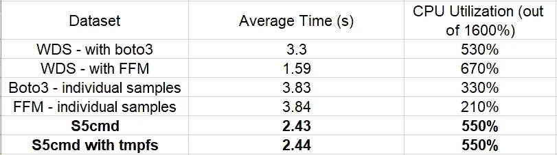

# 使用 S5cmd 从云存储进行培训

> 原文：<https://towardsdatascience.com/training-from-cloud-storage-with-s5cmd-5c8fb5c06056>

## 如何使用数百万个小的、单一的样本文件进行训练


鲁本·米什丘克在 [Unsplash](https://unsplash.com?utm_source=medium&utm_medium=referral) 上拍摄的照片

在典型的深度学习训练管道中，数据样本从存储位置迭代加载，并馈入机器学习模型。模型*从这些样本中学习*，并相应地更新其参数。因此，每个训练步骤的速度以及建模收敛的总时间直接受到从存储中加载数据样本的速度的影响。数据加载速度又会受到多种因素的影响，包括:

1.  **数据位置**:数据的位置及其与训练机器的距离会影响数据加载的延迟。
2.  **带宽**:存储位置和训练机器之间的通信信道的带宽将决定数据可以被拉取的最大速度。
3.  **样本大小**:每个数据样本的大小会影响需要传输的总字节数。
4.  **压缩**:注意，虽然压缩您的数据会减少样本数据的大小，但它也会在训练实例上添加一个解压缩步骤。
5.  **数据格式**:样本存储的格式会直接影响数据加载的开销。
6.  **文件大小**:组成数据集的文件大小会影响从数据存储中提取的数量。大小可以由分组到文件中的样本数量来控制。
7.  **软件堆栈**:从存储器中提取数据时，软件实用程序表现出不同的性能行为。除其他因素外，这些行为还取决于系统资源的利用效率。

**您选择存储数据的方式会对您的训练**工作量的运行时性能产生有意义的影响，因此应该进行相应的设计。

我们以前的几篇文章已经致力于存储训练数据的不同选项(例如这里的)和将它流式传输到训练会话中(例如这里的、这里的和这里的)。像以前一样，我们将假设我们的数据集如此之大，以至于将其全部下载到训练实例上是不切实际的，甚至是不可能的。

在我们之前的帖子中，我们遵循了将样本分组到大约 100 兆字节大小的文件中的传统智慧，作为优化从云存储中提取数据的一种方法。我们在这篇文章中的意图是评估消除这一限制的成本。具体来说，我们将探索在将数据保存在小的单个样本对象文件中而不是将它们组合在一起时可以实现的运行时性能。

虽然我们将进行的实验将使用 AWS 提供的云服务([亚马逊 S3](https://aws.amazon.com/s3/) 、[亚马逊 EC2](https://aws.amazon.com/ec2/) 和[亚马逊 SageMaker](https://aws.amazon.com/sagemaker/) )，并将使用 PyTorch(版本 1.12)进行编程，但我们将得出的结论也适用于其他云环境和其他培训框架。我们将演示几个将单个样本文件从亚马逊 S3 流式传输到培训会话的选项。我们提到的这种或那种方法不应被解释为认可。其他方法可能表现出更好的性能，我们提到的方法的性能可能会随着 API 的增强和优化而改变。此外，请记住，运行时性能可能会因项目细节而有很大差异，我们将分享的比较结果可能不会应用到您自己的项目中。简而言之——对我们写的所有东西都要有所保留，并确保在做出任何设计决定之前进行自己的全面评估。

特别感谢 [Nadav Shaag](https://www.linkedin.com/in/nadav-shaag-a77a8b104/?originalSubdomain=il) 对本帖的贡献。

# 动机——为什么要存储单独的训练样本？

您可能希望以单个样本的形式维护数据，而不是将它们分组到大文件中，原因有很多。

## 原始数据格式

让我们面对现实吧——采用一种能够满足所有数据消费者需求和愿望的文件格式确实令人头疼。单独存储数据样本使您能够以原始格式维护它们。以下是坚持原始格式的一些优势:

*   数据格式转换通常意味着数据丢失。例如，如果出于训练目的转换数据，您可以选择忽略每个样本的某些属性，只保留训练任务所需的属性，但随后会发现不同的任务需要其中一个被忽略的属性。通过以原始格式维护您的数据，您可以确保数据的完整性并保持最大的灵活性。
*   作为开发过程中的一个额外步骤，数据格式转换的过程会增加代码的复杂性和出错的可能性。此外，无论何时选择添加或更新数据样本，都需要重新运行格式转换步骤，然后才能使用新数据。去除格式转换步骤可以**简化你的开发流程**并减少延迟。
*   有时，您可能会发现自己需要维护多种重叠的数据格式，以满足多个数据消费者的需求。除了这种冗余带来的麻烦之外，它还会显著增加您的存储成本。以原始格式维护数据的单一副本可以**简化数据管理并降低成本**。

## 随机存取

当您的数据样本单独存储时，很容易随机访问它们中的任何一个。相比之下，当样本被分组到文件中时，随机访问其中的任何一个都是困难的。您选择的文件格式可能不支持这种随机访问，即使支持，也可能需要您仔细记录您的样本是如何分组的。此外，从大文件中提取单个记录会产生开销，可能会对运行时性能产生负面影响。在深度学习训练工作负载中，对数据进行随机访问的需求是常见的，尽管有一些方法可以解决在将样本分组到更大的文件中时缺乏这种需求的问题(参见此处的)，但这些方法并不完美。

## 减少数据重复

我们已经提到了以一种或多种格式维护数据的多个重叠副本所导致的数据重复。当每个训练样本(即输入到模型中的每个样本)由多个原始样本组成时，就会出现另一个潜在的重复源。例如，如果您正在处理一个计算机视觉模型，该模型正在被训练以根据视频中的帧序列进行预测(例如，光流或运动结构)，任何给定的帧(原始样本)都可能出现在序列中不同位置的多个*训练样本*(帧序列)中。如果你的序列长度是 *N* ，你可能会发现你的训练数据的大小是你的原始数据总大小的 *N* 倍。相比之下，如果您的数据存储为单个样本(帧)文件，您的存储成本将降低 *N* 倍。在这种情况下，组成 *N* 序列的各个帧将在训练期间被加载并分组在一起。

当然，将数据保存为单独的文件也有其缺点。根据单个样本的大小，存储中的文件数量可能会急剧增加。如果[管理不当](https://docs.aws.amazon.com/AmazonS3/latest/userguide/optimizing-performance.html)，这可能导致节流问题、运行列表查询的延迟(例如 *aws s3 ls* )等。如果您之前在每个文件中分组了 *N* 个样本，您将需要在培训期间下载 *N* 倍数量的文件。这增加的潜在开销可能会降低数据加载管道的速度，并在您的培训中引入瓶颈。在接下来的几节中，我们将探索从单样本文件进行训练的几种选择，并将它们的性能与推荐的将样本分组到大约 100 兆字节的文件中的方法进行比较。

# 方法

我们在这篇文章中探讨的选项包括将数据直接从云存储传输到训练循环中。其他选项超出了本文的范围，可能需要建立一个由一个或多个服务器组成的集群，专门管理对您的数据存储的访问(例如 [AIStore](https://github.com/NVIDIA/aistore) )，或者使用额外的专用数据检索服务来增强您的云架构(例如 [Amazon FSx](https://aws.amazon.com/fsx/) )。虽然这种选择可能导致更快的培训吞吐量，但是它们也需要更高的成本，并且需要更大的努力来设置、配置和维护。

## **Boto3**

将文件从亚马逊 S3 流式传输到您的训练循环中最直接的方法是使用 [Boto3](https://boto3.amazonaws.com/v1/documentation/api/latest/index.html) Python 库。下面的代码块演示了如何将文件数据的内容提取到本地内存的字节流中。假设样本是成对的图像和标签文件。

```
from torch.utils.data import Dataset
import boto3, io, re, os
class BotoSingleSampleDataset(Dataset):
    def __init__(self):
        super().__init__()
        self.base_path = <path to data in S3>
        self.client = boto3.client("s3") def __len__(self):
        return 100000

    def get_bytes_io(self, path):
        byte_io = io.BytesIO()
        _, bucket, key, _ = re.split("s3://(.*?)/(.*)$", path)
        self.client.download_fileobj(bucket, key, byte_io)
        byte_io.seek(0)
        return byte_io

    def __getitem__(self, index: int):
        image_path = f'{self.base_path}/{index}.image'
        label_path = f'{self.base_path}/{index}.label'
        image = self.get_bytes_io(image_path).read()
        label = self.get_bytes_io(label_path).read()
        return {"image": image, "label": label}def get_dataset_and_sampler():
    ds = BotoSingleSampleDataset()
    return ds, None
```

## **亚马逊 SageMaker 快速文件模式**

[**亚马逊 SageMaker**](https://aws.amazon.com/sagemaker/) 提供了一个基于 [FUSE](https://en.wikipedia.org/wiki/Filesystem_in_Userspace) 的解决方案，用于访问 S3 的文件，称为*快速文件模式* (FFM)。当您对 SageMaker 作业进行编程以使用快速文件输入模式时，S3 路径会挂载到预定义的本地文件路径上。在最近的一篇文章中，我们扩展了这个输入模式选项，演示了它的用法，并讨论了它的优缺点。下面的代码块演示了如何基于使用 Amazon SageMaker 快速文件模式访问的单个数据样本创建 PyTorch 数据集:

```
from torch.utils.data import Dataset
import os
class FFMSingleSampleDataset(Dataset):
    def __init__(self):
        super().__init__()
        self.base_path = os.environ['SM_CHANNEL_TRAINING']

    def __len__(self):
        return 100000

    def get_from_files(self, image_path, label_path):
        image_file = open(image_path, 'rb')
        label_file = open(label_path, 'rb')
        image = image_file.read()
        label = label_file.read()
        image_file.close()
        label_file.close()
        return {"image": image, "label": label}

    def __getitem__(self, index: int):
        index = index%10000
        image_path = os.path.join(self.base_path, f'{index}.image')
        label_path = os.path.join(self.base_path, f'{index}.label')
        return self.get_from_files(image_path, label_path)def get_dataset_and_sampler():
    ds = FFMSingleSampleDataset()
    return ds, None
```

## **S5cmd**

[S5cmd](https://github.com/peak/s5cmd) 是一个命令行工具，用于从亚马逊 S3 获取对象。用 [Go 编程语言](https://go.dev/)编写的 S5cmd 非常依赖多线程和多个 TCP 连接的使用来加速来自 S3 的数据传输。查看这个信息丰富的博客了解更多关于 s5cmd 如何工作及其性能优势的细节。

在下面的代码块中，我们定义了一个自定义 PyTorch 采样器，它运行一个后台进程，一次对 1000 个样本异步调用 s5cmd。

```
from torch.utils.data import Dataset
from torch.utils.data import SequentialSampler
import os, threading, shlex, time
from subprocess import Popen**samples_per_call = 1000** rank = 0 # in case of multi-gpu, get the local ranklocal_path = f'/tmp/{rank}' # local path to download files to
base_path = <path to files in S3>

class S5cmdSampler(SequentialSampler):
    def __init__(self, data_source, shuffle=False):
        super().__init__(data_source)
        self.shuffle = shuffle def load_sample_files(self, handle, indices):
        all_files = []
        for i in indices:
            all_files.append(f'{local_path}/{i}.image')
            all_files.append(f'{local_path}/{i}.label')
        cmd_txt = os.path.join(local_path, f'{handle}.txt')
        with open(cmd_txt, "w") as f:
            for fp in all_files:
                c = f'cp {fp} {fp.replace(base_path,local_path)}\n')
                f.write(c) # add command to list of commands
        s5cmd = f's5cmd --log error run {cmd_txt}'
        p = Popen(shlex.split(s5cmd))
        return p

    def __iter__(self):
        n = len(self.data_source)
        if self.shuffle:
            import torch
            r = torch.empty((), dtype=torch.int64).random_()               
            seed=int(r.item())
            generator = torch.Generator()
            generator.manual_seed(seed)
            slist = torch.randperm(n, generator=generator)
            slist = slist.tolist()
        else:
            slist = list(range(n))
        procs = [None, None]
        sublists = [None, None]
        proc_index = 0
        list_index = 0
        end_index = min(list_index + **samples_per_call**, n)
        sublists[proc_index] = slist[list_index:end_index]
        procs[proc_index] = self.load_sample_files(
                                 handle=proc_index, 
                                 indices=sublists[proc_index])
        while list_index < n:
            list_index = end_index
            if list_index < n:
                *# extract next batch* end_index = min(list_index + **samples_per_call**, n)
                sublists[1-proc_index] = slist[list_index:end_index]
                procs[1-proc_index] = self.load_sample_files(
                                handle=1-proc_index,
                                indices=sublists[1-proc_index])
            counter = 0
            while procs[proc_index].poll() is None:
                counter = counter + 1
                time.sleep(0.1)
                if counter == 10:
                    print('data starvation')
            sublist = sublists[proc_index]
            proc_index = 1 - proc_index
            yield from sublistdef release_files(file_list):
    def delete_files(files):
        for file in files:
            if os.path.exists(file):
                os.remove(file)
    threading.Thread(target=lambda: delete_files(file_list)).start()class S5cmdDataset(Dataset):
    def __init__(self):
        super().__init__() def __len__(self):
        return 100000 def get_from_files(self, image_path, label_path):
        image_file = open(image_path, 'rb')
        label_file = open(label_path, 'rb')
        image = image_file.read()
        label = label_file.read()
        image_file.close()
        label_file.close()
        return {"image": image, "label": label} def __getitem__(self, index: int):
        index = index % 10000
        image_path = os.path.join(local_path, f'{index}.image')
        label_path = os.path.join(local_path, f'{index}.label')
        ret = self.get_from_files(image_path,label_path)
        release_files([image_path, label_path])
        return retdef get_dataset_and_sampler():
    ds = S5cmdDataset()
    sampler = S5cmdSampler(ds)
    return ds, sampler
```

在上面的例子中，我们将每个 s5cmd 调用的样本数设置为 1000，并依赖于 s5cmd 的默认设置。很可能可以通过调整一些控制设置来进一步优化代码，特别是[*num workers*](https://github.com/peak/s5cmd#numworkers)*(控制并行 S3 命令的数量)和 [*并发*](https://github.com/peak/s5cmd#concurrency) 设置(控制如何分解单个文件的上传/下载)。*

*在我们分享的示例中，我们选择将文件下载到本地磁盘(/tmp)，然后从同一位置加载它们。可以想象，您可以通过将文件对象直接放入内存来减少读写磁盘的开销。一种方法是使用 [tmpfs](https://medium.com/p/5c8fb5c06056/edit) (例如/dev/shm)。*

*请注意，s5cmd 所采用的高度并行处理可以用其他方式实现(包括 Python)。然而，达到与 s5cmd 相同的性能水平可能并不那么简单。*

# *实验*

*在本节中，我们使用一个 [Amazon EC2 c5.4xlarge](https://aws.amazon.com/ec2/instance-types/c5/) 实例(有 16 个 vCPUs)对一个玩具示例进行了一些实验。*

*为了只关注数据流的性能，我们将测量空训练步骤情况下的吞吐量，如下面的代码块所示。*

```
*import torch, time
from statistics import mean, variancedataset, sampler = get_dataset_and_sampler()
dl = torch.utils.data.DataLoader(dataset, sampler=sampler, 
                                 batch_size=4, num_workers=16)
stats_lst = []
t0 = time.perf_counter()
for batch_idx, batch in enumerate(dl, start=1):
    if batch_idx % 100 == 0:
        t = time.perf_counter() - t0
        print(f'Iteration {batch_idx} Time {t}')
        stats_lst.append(t)
        t0 = time.perf_counter()
mean_calc = mean(stats_lst[1:])
var_calc = variance(stats_lst[1:])
print(f'mean {mean_calc} variance {var_calc}')*
```

*请记住，虽然这种比较测量可能会让我们很好地了解每种方法可以支持的最大吞吐量，但它可能无法很好地预测您选择的方法将如何影响实际的培训吞吐量:*

1.  *您选择的方法可能不会影响您的整体训练步骤时间。例如，如果您的培训步骤是计算密集型的，那么从 S3 提取一批样本需要 1 秒钟还是 10 秒钟可能没有区别。*
2.  *一个典型的培训步骤将包括许多额外的操作，这些操作可能会影响您的实际培训量。特别是，一些操作可能会争用从 S3 传输数据的相同资源。*

*作为比较的基准，我们将使用我们在[这篇文章](/training-in-pytorch-from-amazon-s3-6156d5342d1)中描述的相同的 WebDataset 示例。我们还使用相同的代码块来生成一个玩具图像数据集和相关的每像素标签。*

```
*import webdataset as wds
import numpy as np
from PIL import Image
import ioout_tar = 'wds.tar'
sink = wds.TarWriter(out_tar)
im_width = 1024
im_height = 1024
num_classes = 256
for i in range(100):
    image = Image.fromarray(np.random.randint(0, high=256,
                  size=(im_height,im_width,3), dtype=np.uint8))
    label = Image.fromarray(np.random.randint(0, high=num_classes,
                  size=(im_height,im_width), dtype=np.uint8))
    image_bytes = io.BytesIO()
    label_bytes = io.BytesIO()
    image.save(image_bytes, format='PNG')
    label.save(label_bytes, format='PNG')
    sample = {"__key__": str(i),
              f'image': image_bytes.getvalue(),
              f'label': label_bytes.getvalue()}
    sink.write(sample)*
```

## *结果*

*这些结果旨在让您对可能看到的比较结果有所了解。请记住，根据许多项目细节，包括样本大小、批量大小等，结果会有很大差异。该表包括平均报告的步骤时间以及平均 CPU 利用率。CPU 利用率给出了在真实(非空)训练循环的情况下选择的方法将引入 CPU 资源争用的可能性的一些指示。*

**

*比较速度和 CPU 利用率(按作者)*

*毫不奇怪，基于单个样本数据集的解决方案无法与基于 WebDataset (WDS)的最佳结果(超过 FFM)相媲美。根据您的模型的细节，这可能意味着较低的训练吞吐量。与此同时，s5cmd 的价值非常明显，相比其他单个样品选项，其通量性能提高了约 58%。使用 tmpfs 代替本地磁盘并没有带来任何额外的好处。使用 s5cmd 可以节省大约 58%的培训成本。另一方面，在真实的训练循环中，CPU 利用率增加 2.6 倍(与 FFM 相比)可能会减少整体节省。*

# *摘要*

*虽然单独存储数据样本比将数据样本分组到文件中有很多优点，但是您的训练吞吐量可能会因此而下降。它是否下降，以及下降的程度，可能取决于您用于将单个样本流式传输到您的训练实例的**方法**。如本文所示，s5cmd 是一个强大的命令行实用程序，用于从 S3 提取数据，相对于评估的其他方法，它可以产生显著更高的吞吐量。*

*如需更正、评论或问题，请随时联系我们。*