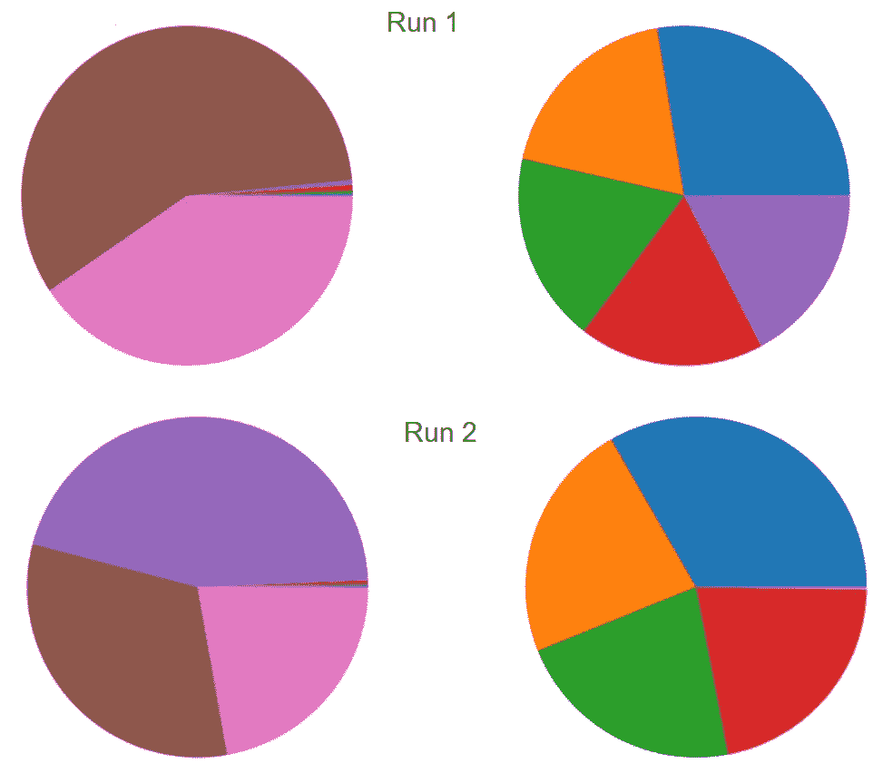

# 训练隐马尔可夫模型

> 原文：<https://towardsdatascience.com/training-hidden-markov-models-831c1bdec27d>

## Baum-Welch 和向前向后算法

在我的[上一篇文章](/hidden-markov-models-an-overview-98926404da0e)中，我介绍了隐马尔可夫模型(HMMs)——对有噪声的序列数据建模的最强大(但未被充分重视)的工具之一。如果你有一个 HMM 来描述你的过程，维特比算法可以把一个嘈杂的观察流变成一个对每个时间步发生的事情的高度可信的猜测。

然而，这是假设您已经有了一个所有参数都已经调好的 HMM。有时候情况就是这样——我记得我在谷歌的时候，我们有一个非常奇特的模型来模拟英语的词序——但更多时候你只有原始数据，你必须自己拟合一个 HMM。这篇文章将讨论这种情况。

TLDR 是这样的:如果你*真的*没有标记数据，也不知道任何事情，你可以使用 Baum-Welch 算法来拟合 HMM。但是由于技术原因，Baum-Welch 算法并不总是给出正确的答案。另一方面，如果你*确实*有一些知识和一点点时间，那么有无数种方法可以破解培训过程。

# 训练的两个部分:马尔可夫链和观察值

回想一下上一篇文章，HMM 有两个部分:

*   描述您在不同状态之间转换(或停留在同一状态)的可能性的底层马尔可夫链。通常这种潜在的状态是你真正感兴趣的东西。如果在 HMM 中有 k 个状态，那么马尔可夫链由 1)k*k 矩阵和 2)k 长度向量组成，k * k 矩阵表示你从 S1 状态转移到 S2 状态的可能性，k 长度向量表示你从每个状态开始的可能性。
*   一个允许您计算 Pr[O|S]的概率模型-如果我们假设基础状态为 S，则看到观察值 O 的概率。与具有固定格式的马尔可夫链不同，Pr[O|S]的模型可以是任意复杂的。但是在许多 hmm 中，Pr[O|S]非常简单:每个状态 S 是一个不同的装载骰子，Pr[O|S]是它在每一边着陆的概率。

在很大程度上，这两个运动部分可以独立考虑。你甚至可能有外部知识告诉你其中一个是什么，而不是另一个。例如，假设您正在尝试制作一份音频记录的抄本；状态是英语单词，观察是声音的模糊。您可以使用现有的英语文本语料库来训练您的马尔可夫模型，然后只在训练 HMM 时调整 Pr[O|S]的参数。

如果你有大量的标记数据——你有一系列的观察结果和一个潜在状态的知识——训练 HMM 实际上分解成两个独立的问题。首先，您使用标签来训练马尔可夫链。然后，根据观察值所处的状态对它们进行划分，并为每个状态 S 训练 P[O|S]。如果我们的数据有可靠的状态标签，那么训练 HMM 就很简单。

但实际上，我们通常只有一系列的观察结果，而没有系统处于何种状态的可靠知识。直觉是这样的:我们*猜测*州标签是什么，并使用这些猜测训练一个 HMM。这将是一个相当可怜的嗯，但它可能会有*一些*位真正的模式，即使只是运气不好。然后，我们使用训练好的 HMM 在这些状态下做出更好的猜测，并根据这些更好的猜测重新训练 HMM。这个过程一直持续到训练好的 HMM 稳定下来。这种来回——在使用 HMM 猜测状态标签和使用这些标签拟合新的 HMM 之间——是 Baum-Welch 算法的本质。

# 鲍姆-韦尔奇算法:细则

我给你的关于 Baum-Welch (BW)算法的直觉需要澄清两点。

首先，我们通常从猜测 HMM 的参数开始，而不是从数据中的潜在状态开始。这让我们可以确保 HMM 中存在模式，并且后续的迭代可以确定哪些模式是真实的。如果你愿意，你可以从猜测状态开始，但是这样会收敛得更快。此外，通常您会对 HMM 参数有很好的猜测，您可以使用这些参数进行明智的初步猜测。

第二点比较微妙。一旦我们有了一个 HMM，我们所说的“猜测状态”是什么意思呢？在上一篇文章中，我们谈到了维特比算法，该算法采用一系列观察值，并为我们提供一个最佳状态序列。但问题是，其中一些状态可能会被可靠地猜测出来，而其他状态可能会非常模糊——维特比算法无法区分高置信度和低置信度的猜测。

为了解决第二个问题，我们放弃了维特比算法和它的假置信度。相反，我们使用其不太为人所知的表亲向前向后算法，它给我们提供了概率猜测，可以用来衡量信心。

# 向前向后算法

让我们谈一分钟技术问题。维特比算法不只是“解码观察”。它解决了一个非常具体的数学问题:给定 o o …个观察值序列，它会找到最大化这些状态和观察值的组合概率的单个状态序列 s …:

Pr[s…]* Pr[o o…| s…]

它针对整个状态序列进行优化，而不是针对任何一个特定的状态。但是让我们说，我们只对一个特定的州感兴趣，s⁵.可能是状态的单个最佳序列——由维特比算法找到的序列——具有 s⁵=0，但是有许多稍微差一些的序列，对于这些序列，s⁵=1.在这种情况下，稍微差一点的序列相加，孤立的 s⁵的最佳猜测是 1。

向前-向后算法为每个时间步长寻找最佳猜测状态。一般来说，这些状态将不同于维特比状态，尽管实际上它们通常非常接近(例如:在我现在处理的数据中，它们有 5%的时间不一致，我很惊讶它会那么高)。

为了我们的目的，前向-后向算法的价值不在于它与维特比算法的不同之处。事实是，它严格计算每个时间步在每个状态的概率。*这个*就是我们用于鲍姆-韦尔奇算法的！我们并不在一系列我们确定知道的状态上训练我们的 HMM:我们训练我们的 HMM，使得它平均起来是所有这些概率猜测的最佳拟合。

这里就不给出 Baum-Welch 算法的伪代码了。相反，我将注意到这是 EM 算法的一个特例，当存在未知的“隐藏变量”(在这种情况下，哪个状态在哪个时间戳)时，EM 算法用于拟合模型，这些未知的“隐藏变量”可以通过概率进行猜测。Baum-Welch 算法的致命弱点与困扰 EM 算法的问题是一样的:解决方案只是局部最优的。

# 大恶魔:局部最优

我提到 Baum-Welch 算法的第一步是猜测 HMM 的参数。这意味着随机初始化参数(对于 hmm 来说，dirichlet 分布是一种流行的选择，但这超出了我们的范围)。但问题是，不同的随机起点可以汇聚到不同的最终 hmm 上——不管起点如何，都没有唯一的最佳答案。

您可能收敛到的各种 hmm 被称为“局部最优”。取一个局部最优 X——你可以把它想象成高维向量空间中的一个点，其中维度是 hmm 的不同参数。X 比在它的一定距离内的任何其他 HMM 都好，并且如果您的初始猜测足够接近 X，那么 Baum-Welch 算法将收敛于 X。但是很容易存在比 X 好但远离它的另一个 X′。

我最近在自己的工作中遇到了一个有趣的例子。我正在模拟一个人在每个时间点使用 7 个桌面应用程序中的哪一个，并试图用一个双态 HMM 来拟合它。我的希望是找到一种“自然”的行为模式，让他们在几个应用之间快速切换。相反，我安装了两次 HMM，每次都做了一个饼状图，显示用户在每个州的每个应用上花费的时间。以下是两次运行的结果:

Baum-Welch 算法中不同的初始条件，即使是对相同的数据进行训练，由于存在许多局部最优值，也会产生非常不同的最终输出。

你可以看到，一次紫色应用程序与棕色和粉色应用程序合并在一个州，而另一次它与橙色/蓝色/红色/绿色应用程序合并在一起。额外的运行产生了其他结果。我一直发现某个应用程序几乎只在一个州内使用。但是有 7 个应用程序要在两个州之间分配，每种分配方式都有自己的局部最优方案。

没有通用的方法来避免这个问题——拟合 HMM 是所谓的“非凸”问题，并且通常会遭遇局部最优。但是，有几种方法可以减轻这种影响:

*   你可以简化你的 HMM。局部最优值的数量会随着 HMM 中参数的数量呈指数增长。如果减小参数大小，就可以减少陷入局部最优的次数。这可能意味着使用 2 态 HMM 而不是 3 态 HMM。如果你的观察值是多项式，这可能意味着减少可能的观察值。
*   利用商业直觉得到一个与你预期的最终结果相似的初始 HMM。不同的局部最优解之间通常有很大的质量差异，就像我遇到的例子一样，所以从总体上看，你最终收敛的 HMM 很可能类似于你开始时的那个。不过，一定要确保你的猜测是部分随机的——可能有几个与你的商业直觉一致的局部最优值，如果是这样，你就想知道它。

注意，局部最优与过拟合是不同的问题(这当然也适用！).在我遇到的例子中，无论我有多少训练数据，各州之间的每个应用程序分发都将是其自己的局部最优。

# 离别赠言

我不想撒谎:使用一个经过训练的 HMM 比一开始就去拟合它要简单得多。另一方面，至少如果你像我一样，这也是乐趣的一部分！在对客户数据应用 hmm 时，我们在 [Zeitworks](http://www.zeitworks.com) 经常遇到这种情况。我们需要一个足够简单的模型来减轻局部最优，但又足够复杂来描述我们正在研究的过程。开箱即用的工具通常不能处理像部分已知的基本事实这样的边缘情况，我们经常发现自己在修补核心算法。

另一方面，这种复杂性与你可能考虑的其他技术相比相形见绌，比如递归神经网络。此外，hmm 更容易理解业务，更容易调试，如果训练数据有限，它们通常表现得更好。它们不能解决所有问题(没有什么能)，但它们是武器库中不可替代的工具。