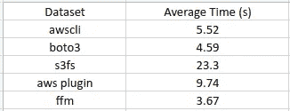
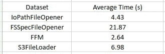

# 来自亚马逊 S3 的 PyTorch 培训

> 原文：<https://towardsdatascience.com/training-in-pytorch-from-amazon-s3-6156d5342d1>

## 如何最大化数据吞吐量并节省资金


照片由 [Guillaume Jaillet](https://unsplash.com/@i_am_g?utm_source=medium&utm_medium=referral) 在 [Unsplash](https://unsplash.com?utm_source=medium&utm_medium=referral)

在以前的帖子中(例如这里的[和这里的](https://julsimon.medium.com/deep-dive-on-tensorflow-training-with-amazon-sagemaker-and-amazon-s3-12038828075c)和[我们讨论了从](/amazon-sagemaker-fast-file-mode-d12829479c39)[亚马逊 S3](https://aws.amazon.com/s3/) 到 TensorFlow 培训课程的不同数据流选项。在本帖中，我们重温了 S3 的培训主题，这次重点是 PyTorch 培训。

正如在我们以前的帖子中，我们处理的场景是我们的数据集如此之大，以至于它:

1.  不能全部下载到培训实例上，或者
2.  下载它会给我们的训练带来很大的延迟。

应对这一挑战有不同的方法。一种方法(不在本文讨论范围之内)是建立某种形式的持久存储系统，该系统镜像 S3 数据，并且一旦我们的训练实例启动，该系统就随时可用和可访问。用亚马逊 FSx 来实现这一点的一种方法是。虽然这种方法有其优点(如本文[所述](https://julsimon.medium.com/deep-dive-on-tensorflow-training-with-amazon-sagemaker-and-amazon-s3-12038828075c)，但它可能需要大量额外的维护和成本。我们在这篇文章中采用的方法是将数据直接从 S3 流入我们的训练循环。

## 来自亚马逊 S3 的数据流

虽然将亚马逊 S3 的数据直接传输到训练循环听起来很简单，但如果设计不好，它可能会成为你训练管道的瓶颈。在这种不希望出现的情况下，当系统等待来自 S3 的数据到达时，系统的计算资源将处于空闲状态。我们的目标是最大限度地利用系统资源，进而提高训练速度。有许多因素控制来自 S3 的流数据可能影响训练步骤时间的程度，包括以下因素:

1.  实例类型的网络输入带宽的大小。这是您选择的训练[实例类型](https://aws.amazon.com/ec2/instance-types/?trk=c0203969-28e0-4300-9ee8-097ca8620008&sc_channel=ps&sc_campaign=acquisition&sc_medium=ACQ-P|PS-GO|Brand|Desktop|SU|Compute|EC2|IL|EN|Text&s_kwcid=AL!4422!3!536392682311!b!!g!!%2Baws%20%2Bec2%20%2Binstance&ef_id=Cj0KCQjwl7qSBhD-ARIsACvV1X29d4J4sf0GvyZQBZA4oMisxrGRKI32oDr4U3R-q-3_jMnrmnTaTA0aAo-tEALw_wcB:G:s&s_kwcid=AL!4422!3!536392682311!b!!g!!%2Baws%20%2Bec2%20%2Binstance)的属性。
2.  训练步骤所需的数据总量(以字节为单位)。您应该通过只对训练所需的数据进行流式处理并考虑不同的压缩技术来努力减小每个数据样本的大小。(但是，您也应该考虑解压缩所需的额外计算。)
3.  选择存储数据的文件格式。例如，与需要下载整个文件以便能够打开和解析它们的格式相比，使用诸如 [WebDataset](https://github.com/webdataset/webdataset) 或 [TFRecord](https://www.tensorflow.org/tutorials/load_data/tfrecord) 格式的顺序文件格式可能会更好。
4.  存储数据的单个文件的大小也会影响数据流的性能。例如，将每个数据样本存储在一个单兆字节大小的单独文件中会增加 S3 的事务开销。我们努力将我们的数据存储在多个文件中，每个文件有几百兆字节的大小，每个文件包含多个数据样本的序列。应该注意的是，以这种方式存储你的数据会带来其他挑战，我们已经在之前的[文章](https://medium.com/@julsimon/making-amazon-sagemaker-and-tensorflow-work-for-you-893365184233)中解决了这些挑战。
5.  用于执行数据流的工具，将在本文中讨论。

在这篇文章中，我们将探索一些从 S3 训练的方法。请不要把我们提到或没有提到这种或那种方法解释为赞同或拒绝。我们认为熟悉多种方法非常重要。每一种都有自己的优点和缺点，最佳选择可能取决于项目的细节。

随着机器学习领域的不断发展，许多支持框架和库也在不断发展。请记住，我们提到的一些 API 和工具在你阅读这篇文章的时候可能已经过时了。我们强烈建议您掌握最新的可用工具，因为这些工具可能包括大量的增强和优化。

虽然我们的重点将是使用 PyTorch(版本 1.10 和 1.11)和来自亚马逊 S3 的培训，但我们所说的许多内容也同样适用于其他培训框架和其他对象存储服务。

特别感谢[伊扎克·李维](https://www.linkedin.com/in/yitzhak-levi-49a217201/)帮助他创建了这个帖子。

# 测量吞吐量

在接下来的部分中，我们将回顾从 S3 流式传输数据的不同方法。我们将通过计算*训练吞吐量*来比较这两种方法，训练吞吐量是通过每秒输入训练循环的数据样本数量来衡量的。为了只关注数据流的性能，我们将测量空训练步骤情况下的吞吐量，如下面的代码块所示。

```
import torch, time
from statistics import mean, variancedataset=get_dataset()
dl=torch.utils.data.DataLoader(dataset, batch_size=4, num_workers=4)stats_lst = []
t0 = time.perf_counter()
for batch_idx, batch in enumerate(dl, start=1):
    if batch_idx % 100 == 0:
        t = time.perf_counter() - t0
        print(f'Iteration {batch_idx} Time {t}')
        stats_lst.append(t)
        t0 = time.perf_counter()mean_calc = mean(stats_lst[1:])
var_calc = variance(stats_lst[1:])print(f'mean {mean_calc} variance {var_calc}')
```

重要的是要记住，虽然这种比较测量可能会让我们很好地了解每种方法可以支持的最大吞吐量，但它可能无法很好地预测您选择的方法将如何影响实际的培训吞吐量，原因有两个:

1.  您选择的方法可能不会影响您的整体训练步骤时间。例如，如果您的培训步骤是计算密集型的，那么从 S3 提取一个文件需要 1 秒钟还是 10 秒钟可能没有区别。
2.  典型的训练步骤将包括许多可能影响实际训练量的附加操作。特别是，一些操作可能会争用从 S3 传输数据的相同资源。

我们经常使用的另一种测量数据流对整体训练速度的影响的技术是，测量在缓存的数据样本上运行而不是在流数据样本上运行时步长时间如何变化，如下所示。

```
import torch, time
from statistics import mean, variancedataset=get_dataset()
dl=torch.utils.data.DataLoader(dataset, batch_size=4, num_workers=4)**batch = next(iter(dl))** t0 = time.perf_counter()
for batch_idx in range(1,1000):
 **train_step(batch)**    if batch_idx % 100 == 0:
        t = time.perf_counter() - t0
        print(f'Iteration {batch_idx} Time {t}')
        t0 = time.perf_counter()
```

## 玩具示例— WebDataset

出于演示的目的，我们将使用一个由随机图像和图像分割组成的合成数据集，这些图像和图像分割以 [WebDataset](https://github.com/webdataset/webdataset) 文件格式存储，这是一种基于 tar 文件的格式，专门设计用于大型数据集的训练。具体来说，我们使用以下代码块生成了多个 400 兆字节的 tar 文件:

```
import webdataset as wds
import numpy as np
from PIL import Image
import ioout_tar = 'wds.tar'
sink = wds.TarWriter(out_tar)
im_width = 1024
im_height = 1024
num_classes = 256for i in range(100):
    image = Image.fromarray(np.random.randint(0, high=256,
                  size=(im_height,im_width,3), dtype=np.uint8))
    label = Image.fromarray(np.random.randint(0, high=num_classes,
                  size=(im_height,im_width), dtype=np.uint8))
    image_bytes = io.BytesIO()
    label_bytes = io.BytesIO()
    image.save(image_bytes, format='PNG')
    label.save(label_bytes, format='PNG')
    sample = {"__key__": str(i),
              f'image': image_bytes.getvalue(),
              f'label': label_bytes.getvalue()}
    sink.write(sample)
```

# 来自亚马逊 S3 的流媒体

在这一节中，我们将回顾一些工具和技术，从亚马逊 S3 流数据。这项审查绝非详尽无遗；还有许多其他工具我们没有在这里介绍。我们将使用上面显示的 WebDataset 示例演示一些选项。我们将解决方案大致分为两种类型，一种是我们将数据从 S3 系统中明确提取到训练环境中的解决方案，另一种是向应用程序公开文件系统风格的接口的解决方案。

## 文件对象下载

亚马逊 S3 的许多培训解决方案都涉及到将数据明确下载到本地培训环境中。

使用 AWS CLI 下载对象:
从 S3 获取文件的最简单方法之一是使用 [AWS 命令行界面](https://aws.amazon.com/cli/)工具。以下命令将下载存储在 S3 的目标文件:

```
aws s3 cp s3://<path in s3>/wds0.tar -
```

用本地路径替换连字符将导致文件保存到本地磁盘。有关该工具使用的更多详细信息，请参见此处的。

WebDataset 库支持从使用 AWS S3 cp 命令提取的文件中通过管道传输字节流。我们在下面的代码块中演示了如何以这种方式创建 PyTorch 数据集:

```
import io, webdataset
def get_dataset():
    urls = [f's3://<path in s3>/{i}.tar' for i in range(num_files)]
    # add awscli command to urls
    urls = [f'pipe:aws s3 cp {url} -' for url in urls]
    dataset = (
           webdataset.WebDataset(urls, shardshuffle=True)
            .shuffle(10)
    )
    return dataset
```

**用 Boto3 下载对象:** [Boto3](https://boto3.amazonaws.com/v1/documentation/api/latest/index.html) 是一个 Python 库，可以从 S3 下载对象文件。下面的函数演示了如何将文件数据的内容提取到本地内存的字节流中。

```
import boto3, io, webdataset, re
client = boto3.client("s3")def get_bytes_io(path):
    byte_io = io.BytesIO()
    _, bucket, key, _ = re.split("s3://(.*?)/(.*)$", path)
    client.download_fileobj(bucket, key, byte_io)
    byte_io.seek(0)
    return byte_io
```

尽管 WebDataset 不包含对这种用法的本机支持，但我们可以通过覆盖 webdataset 中的 [url_opener](https://github.com/webdataset/webdataset/blob/05a1ea1116781ffe3c3bc257061f2f3e51dfeb0b/webdataset/tariterators.py#L63) 函数来轻松添加它。

```
import webdataset
from webdataset.handlers import reraise_exceptiondef url_opener(data, handler=reraise_exception, **kw):
    for sample in data:
        url = sample["url"]
        try:
            stream = get_bytes_io(url)
            sample.update(stream=stream)
            yield sample
        except Exception as exn:
            exn.args = exn.args + (url,)
            if handler(exn):
                continue
            else:
                break**webdataset.tariterators.url_opener = url_opener**def get_dataset():
    urls = [f's3://<path in s3>/{i}.tar' for i in range(num_files)]                                     
    dataset = (
           webdataset.WebDataset(urls, shardshuffle=True)
            .shuffle(10)
    )
    return dataset
```

**SageMaker 管道模式** :
[**亚马逊 SageMaker**](https://aws.amazon.com/sagemaker/) 是 AWS 提供的一项托管服务，用于大规模执行基于云的机器学习。它提供的众多实用工具包括专用 API，用于与存储在亚马逊 S3 的训练数据进行交互。 [SageMaker 文档](https://docs.aws.amazon.com/sagemaker/latest/APIReference/API_AlgorithmSpecification.html)详述了支持的不同数据输入模式。在[之前的一篇文章](https://medium.com/@julsimon/making-amazon-sagemaker-and-tensorflow-work-for-you-893365184233)中，我们扩展了 SageMaker 管道模式的一些属性。管道模式是另一种将数据从 S3 显式提取和流式传输到本地培训环境的方式。使用管道模式时，通过专用的 Linux FIFO 管道获取训练数据。

```
with open(fifo_path, ‘rb’, buffering=0) as fifo:
    # read and parse data stream to yield samples
```

管道模式的一个缺点是它需要解析传入的数据流。这意味着它的使用仅限于支持这种解析方式的文件格式。在[之前的一篇文章](https://julsimon.medium.com/deep-dive-on-tensorflow-training-with-amazon-sagemaker-and-amazon-s3-12038828075c)中，我们演示了以这种方式构建训练输入管道。

## S3 接入解决方案

虽然应用程序通常被编程为与文件系统一起工作，但亚马逊 S3 是一个对象存储，而不是文件系统。许多解决方案旨在通过向亚马逊 S3 公开类似接口的文件系统来弥合这一差距。

**S3Fs**:
S3Fs 是几个基于 [FUSE](https://en.wikipedia.org/wiki/Filesystem_in_Userspace) 的 Python 解决方案之一，用于将 S3 桶挂载为文件系统。虽然 WebDataset 不包含对使用 S3Fs 的本机支持，但我们可以覆盖 webdataset.tariterators 中的 [url_opener](https://github.com/webdataset/webdataset/blob/05a1ea1116781ffe3c3bc257061f2f3e51dfeb0b/webdataset/tariterators.py#L63) 函数来使用它。注意，要将 S3Fs 与 PyTorch 一起使用，我们需要将多处理启动方法设置为*“spawn”*。

```
***torch.multiprocessing.set_start_method('spawn')***import s3fs, webdataset
from webdataset.handlers import reraise_exceptionfs = s3fs.S3FileSystem()def url_opener(data, handler=reraise_exception, **kw):
    for sample in data:
        url = sample["url"]
        try:
            stream = fs.open(url.replace("s3://", ""), mode='rb')
            sample.update(stream=stream)
            yield sample
        except Exception as exn:
            exn.args = exn.args + (url,)
            if handler(exn):
                continue
            else:
                breakwebdataset.tariterators.url_opener = url_openerdef get_dataset():
    urls = [f's3://<path in s3>/{i}.tar' for i in range(num_files)]                                     
    dataset = (
           webdataset.WebDataset(urls, shardshuffle=True)
            .shuffle(10)
    )
    return dataset
```

查看[这篇很酷的帖子](https://joshua-robinson.medium.com/object-storage-via-fuse-filesystems-ea2cc8094e2c)了解更多基于 FUSE 的提取 S3 数据的方法，包括 s3f 的替代方法，如 [goofys](https://github.com/kahing/goofys) 和 [rclone](https://rclone.org/commands/rclone_mount/) 。

<https://joshua-robinson.medium.com/object-storage-via-fuse-filesystems-ea2cc8094e2c>  

**亚马逊 S3 PyTorch 插件** :
去年 [AWS 宣布](https://aws.amazon.com/blogs/machine-learning/announcing-the-amazon-s3-plugin-for-pytorch/)发布一个专用库，用于将数据从 S3 拉入 PyTorch 培训环境。这个插件的细节，包括使用说明，可以在这个 [github 项目](https://github.com/aws/amazon-s3-plugin-for-pytorch)中找到。应该注意的是，作者最近宣布弃用这个库，并计划在 [TorchData](https://pytorch.org/data/beta/index.html) 库中用 S3 IO 支持来取代它。(下面将详细介绍。)下面的代码块演示了使用 S3 PyTorch 插件，用我们的 toy WebDataset 文件创建一个可迭代的 PyTorch 数据集。

```
from awsio.python.lib.io.s3.s3dataset import S3IterableDatasetclass S3_Dataset(torch.utils.data.IterableDataset):
    def __init__(self, urls):
        self._s3_iter_dataset = S3IterableDataset(urls, True) def data_generator(self):
        try:
            while True:
                image_fname, image_fobj = next(self._s3_iter)
                label_fname, label_fobj = next(self._s3_iter)
                yield {
                    'image': image_fobj,
                    'label': label_fobj
                } except StopIteration:
            return def __iter__(self):
        self._s3_iter = iter(self._s3_iter_dataset)
        return self.data_generator()def get_dataset():
    urls = [f's3://<path in s3>/{i}.tar' for i in range(num_files)]                                     
    dataset = S3_Dataset(urls)
    return dataset
```

**SageMaker 快速文件模式** :
[**亚马逊 SageMaker**](https://aws.amazon.com/sagemaker/) 提供了一个额外的基于 FUSE 的解决方案，用于在 S3 访问文件调用*快速文件模式* (FFM)。当您对 SageMaker 作业进行编程以使用快速文件输入模式时，S3 路径会挂载到预定义的本地文件路径上。在最近的一篇文章中，我们扩展了这个输入模式选项，演示了它的用法，并讨论了它的优缺点。采用我们的 WebDataset 来使用 FFM 非常简单:

```
import os, webdataset
def get_dataset():
    ffm = os.environ['SM_CHANNEL_TRAINING']
    urls = [os.path.join(ffm, f'{i}.tar') for i in range(num_files)]
    dataset = (
           webdataset.WebDataset(urls, shardshuffle=True)
            .shuffle(10)
    )
    return dataset
```

请注意，在撰写本文时，FFM 性能可能取决于文件数量以及预定义 S3 路径中的分区数量。

## 结果

下表包括我们在 [EC2 c5.xlarge](https://aws.amazon.com/ec2/instance-types/c5/) 实例上的不同数据集上运行空训练循环时得到的平均步进时间。这些结果是作为您可能获得的比较性能结果类型的示例提供的。我们警告不要从这些结果中得出任何关于您自己项目的结论，因为性能很可能高度依赖于训练模型和数据的细节。



每 100 步的平均时间(按作者)

# 使用 TorchData 管道进行流式传输

TorchData 是一个令人兴奋的新 PyTorch 库，用于创建 PyTorch 数据集。它目前作为 beta 产品发布，需要 PyTorch 版(或更高版本)。官方发布预计在未来几个月。 [TorchData gihub 项目页面](https://github.com/pytorch/data)包括关于库设计及其 API 文档和示例的信息。TorchData 包含许多用于创建数据管道的构建块模块，包括用于加载以 WebDataset 格式存储的数据集的模块和用于从 S3 提取数据的模块。

在下面的部分中，我们将展示 TorchData 库支持的一些解决方案。请记住，在正式发布库之前，有些 API 可能会进行修改。

**使用 IoPathFileOpener**:
[IoPathFileOpener](https://pytorch.org/data/main/generated/torchdata.datapipes.iter.IoPathFileOpener.html)支持直接从云存储中加载文件。它依赖于 [iopath](https://pypi.org/project/iopath/) I/O 抽象库。下面的代码块演示了它的用法:

```
from torchdata.datapipes.iter import IoPathFileOpener, IterableWrapperdef get_dataset():
    urls = [f's3://<path in s3>/{i}.tar' for i in range(num_files)]
    urls = IterableWrapper(urls).shuffle().cycle()
 **tars = IoPathFileOpener(urls, mode="rb").load_from_tar()**    samples = tars.groupby(lambda x:     
                               os.path.basename(x[0]).split(".")[0],
                           group_size=2, guaranteed_group_size=2)
    dataset = samples.map(lambda x: 
                  {'image': x[0][1].read(),
                   'label': x[0][1].read()})
    dataset = dataset.shuffle(buffer_size=10)return dataset
```

**使用 FSSpecFileOpener**:
[FSSpecFileOpener](https://pytorch.org/data/0.3.0/generated/torchdata.datapipes.iter.FSSpecFileOpener.html#torchdata.datapipes.iter.FSSpecFileOpener)支持类似的功能，这次基于 [S3Fs](https://s3fs.readthedocs.io/en/latest/) 库。下面的代码块演示了它的用法:

```
from torchdata.datapipes.iter import FSSpecFileOpener, IterableWrapperdef get_dataset():
    urls = [f's3://<path in s3>/{i}.tar' for i in range(num_files)]
    urls = IterableWrapper(urls).shuffle().cycle()
 **tars = FSSpecFileOpener(urls, mode="rb").load_from_tar()**    samples = tars.groupby(lambda x:     
                               os.path.basename(x[0]).split(".")[0],
                           group_size=2, guaranteed_group_size=2)
    dataset = samples.map(lambda x: 
                  {'image': x[0][1].read(),
                   'label': x[0][1].read()})
    dataset = dataset.shuffle(buffer_size=10)
return dataset
```

**使用 SageMaker FFM** :
在使用 Amazon SageMaker 进行培训时，我们也可以通过使用 FFM 并指向本地文件挂载来使用标准的 [FileOpener](https://pytorch.org/data/0.3.0/generated/torchdata.datapipes.iter.FileOpener.html#torchdata.datapipes.iter.FileOpener) 类。

```
import os
from torchdata.datapipes.iter import FileOpener, IterableWrapperdef get_dataset():
    ffm = os.environ['SM_CHANNEL_TRAINING']
    urls = [os.path.join(ffm, f'{i}.tar') for i in range(num_files)]       
    **tars = FileOpener(urls, mode="rb").load_from_tar()
**    samples = tars.groupby(lambda x:     
                               os.path.basename(x[0]).split(".")[0],
                           group_size=2, guaranteed_group_size=2)
    dataset = samples.map(lambda x: 
                  {'image': x[0][1].read(),
                   'label': x[0][1].read()})
    dataset = dataset.shuffle(buffer_size=10)
return dataset
```

**使用 S3FileLoader** :
这是亚马逊 S3 PyTorch 插件的翻版， [S3FileLoader](https://github.com/pytorch/data/tree/main/torchdata/datapipes/iter/load#readme) 是 AWS 专门创建的用于从 S3 加载数据的数据管道。在撰写本文时，它还没有包含在默认的 torchdata 包中，需要一些安装步骤，如这里的[所述](https://github.com/pytorch/data/tree/main/torchdata/datapipes/iter/load#readme)。

```
from torchdata.datapipes.iter import S3FileLoader, IterableWrapperdef get_dataset():
    urls = [f's3://<path in s3>/{i}.tar' for i in range(num_files)]
    urls = IterableWrapper(urls).shuffle().cycle()
 **tars = S3FileLoader(urls).load_from_tar()**    samples = tars.groupby(lambda x:     
                               os.path.basename(x[0]).split(".")[0],
                           group_size=2, guaranteed_group_size=2)
    dataset = samples.map(lambda x: 
                  {'image': x[0][1].read(),
                   'label': x[0][1].read()})
    dataset = dataset.shuffle(buffer_size=10)
return dataset
```

## 结果

同样，当在使用新的 TorchData 库创建的不同数据集上和在 [EC2 c5.xlarge](https://aws.amazon.com/ec2/instance-types/c5/) 实例上运行相同的空训练循环时，我们共享平均步骤时间。



每 100 步的平均时间(按作者)

虽然我们仍然对从这些结果中得出任何有意义的结论持谨慎态度，但似乎新的 TorchData 不仅在功能上，而且在从 S3 传输的速度上提供了升级。

# 摘要

在这篇文章中，我们回顾了从亚马逊 S3 到训练环境的数据流的几种选择。这份清单并不全面；还有许多额外的工具和技术。

我们认为让自己熟悉几种技术是至关重要的，因为你可能会发现你的首选要么与你的项目不相关，要么它的性能不令人满意。

如果有任何意见、更正或问题，请随时联系我。