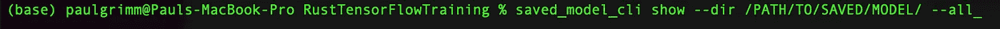
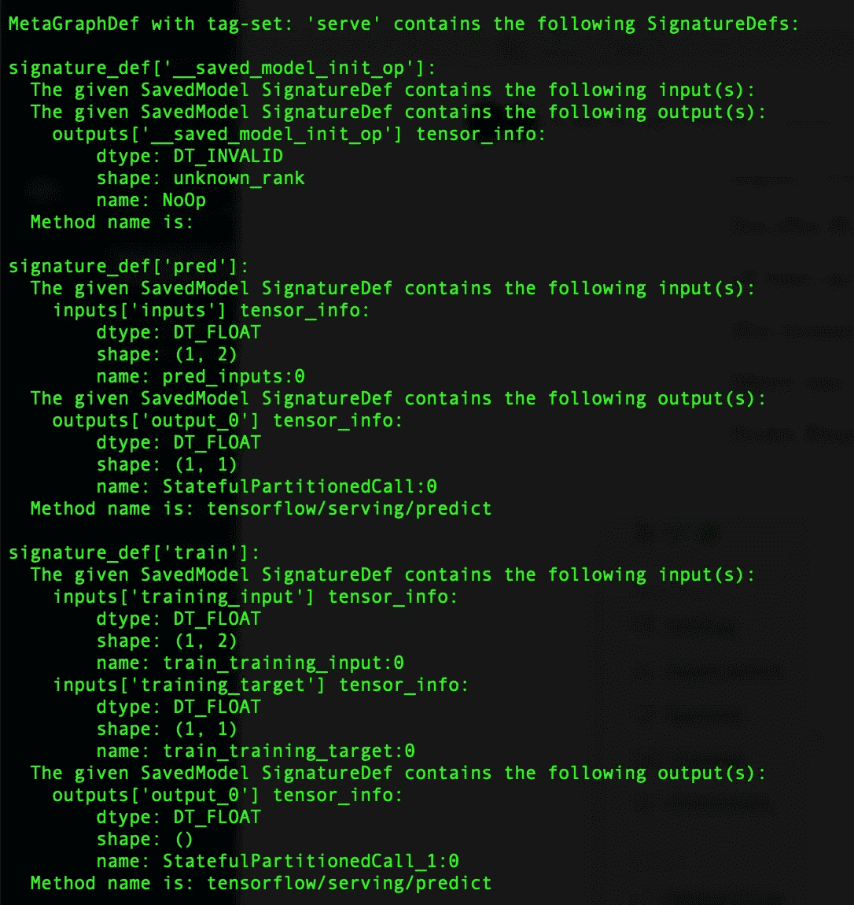
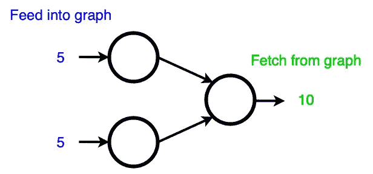

# 使用 Rust 张量流绑定训练 Keras 模型

> 原文：<https://towardsdatascience.com/training-keras-models-using-the-rust-tensorflow-bindings-941791249a7>

## 如何创建 Keras 模型并在 Rust 中用于训练和预测

(图片来自 Pixabay)

Rust 变得越来越受欢迎。它的安全执行和超快的运行时间，加上强大的社区支持，使它成为 c 等语言的一个有吸引力的替代语言。几乎没有开销，它就可以在微设备上运行 Rust，并且在边缘计算的环境中，当在边缘部署神经网络时，可能是一个不错的选择。

虽然有很多例子可以将预训练的 TensorFlow 模型与 Rust 绑定或 TensorFlow-C API 一起使用，但很少或根本没有关于如何在 Rust 中直接训练模型的例子。因此，在这个简短的教程中，我将概述这样做的方法。

在这个演示中，我们将创建一个非常简单的模型，它只接收一个具有两个元素和一个目标值的张量。这个想法只是为了让模型学会将这两个值相加。

模型架构(图片由作者提供)

理解 TensorFlow 内部将模型存储为图形很重要，就像上图中的图形一样。图形的这种表示将被绑定使用，因此它将与使用 Python 的模型完全不同。

## 创建自定义的 Keras 模型

作为第一步，我们需要创建一个从`keras.Model`类继承的类。在这个类中，我们将指定三种方法。所需的`__init__()`方法、`call()`函数(将用于预测)和`train()`函数(将用于训练)。

注意，我们将`@tf.function`装饰器添加到了`call`和`train`函数中。这是为了将它们存储为图形。默认情况下，Python 中的 TensorFlow 以急切执行方式运行，用于绑定，但是我们需要图形。

这个新创建的`custom_model`类的任何实例都将能够使用所有已知的 Keras 函数，比如`fit()`、`predict()`或`compile()`。我们现在将创建一个`custom_model`的实例并编译它。

在保存模型以在 Rust 中使用它之前，我们必须分配我们创建的自定义函数。否则，我们以后在图形上操作时将无法访问它们。因此我们必须得到具体的函数。TensorFlow 中的具体函数是一种独特的图形函数表示，其中输入和输出都有精确的定义。为了创建这样一个具体的函数，我们指定输入和输出(形状和数据类型)，以便为每个函数创建一个图。因为 Python 支持多态性(几种数据类型)，所以对于不同形状或数据类型的每个可能的输入，都会有一个新的图形。这被称为跟踪。为了防止跟踪，我们创建了具体的函数，因此定义了输入和输出特征，并且可以保存一个唯一的图形表示，它只接受特定的输入，并且总是返回相同的指定输出。然后，这些具体的函数可以与图形一起保存，并通过绑定进行访问。

这里我们指定函数的具体输入为`TensorSpecs`。这为函数的输入和输出分配了具体的形状和数据类型，并创建了一个符合这些规范的图形表示。我们给输入节点一个名称，以便我们能够从 Rust 环境中访问它们。注意，训练输入由两个凸部的元组组成，一个用于输入，一个用于目标，这将用于训练步骤。

接下来，我们使用 keras `save()`方法保存模型。在这里，我们指定签名，为每个签名分配一个唯一的名称，以便从 Rust 访问它们。

通过这种方式，函数与模型一起保存，并且可以使用我们传递给`save()`方法的字典中的相关名称进行访问。

## 使用绑定访问模型并对其进行训练

运行 Python 代码后，模型将被保存，然后可以在 Rust 中作为图形加载。绑定的工作方式是我们将变量输入到图中，运行它并从输出节点获取变量(这里的函数也是有输出节点的图)。然而，我们不知道函数的输出节点名，因为它们是由 Keras 指定的。请记住，我们在创建具体函数时给了输入名称。因此，我们已经知道了输入节点的名称。不幸的是，据我所知，没有办法命名输出节点。他们将自动获得指定的名称，但是这些名称在架构被定义之后将保持不变。所以我们只需要检索一次名字。获取输出名称的一种方法是在终端中使用`saved_model_cli`命令。

该命令的(部分)输出如下所示:

(图片由作者提供)

对于我们的信号`pred`和`train`，您可以找到输出节点的名称。在这种情况下，两者都被命名为`output_0`。现在我们有了在 Rust 中使用该模型所需的所有信息。

我们将创建两个张量，一个作为训练输入，一个作为训练目标，并且只运行一个训练步骤。为此我们创建了两个张量。

接下来，我们从保存模型的路径将模型作为图形加载。

这是作为一个包加载的，我们将在其上创建一个会话。

现在，我们从图中加载训练计算的签名。

这样做之后，我们可以使用我们用于输入的名称和我们用`saved_model_cli`命令检索的用于输出的名称从签名中获得输入和输出。从这些我们分别创建输入和输出操作。

这些操作表示图形中的节点，该图形表示产生输出的计算。

设置好这些东西后，我们就可以开始计算了。正如我之前所说的，我们将把图形的输入输入到它的输入节点，并从输出节点获取输出。方法是使用一个`SessionRunArgs`对象。

通过指定输入张量使用的运算来添加输入张量。换句话说，在哪个节点喂养它们。之后，发出一个获取请求，我们使用另一个操作来指定哪个节点将返回结果。

为预测操作提供和获取张量(图片由作者提供)

现在我们可以运行会话了。这将在图上执行计算。

结果现在将存储在`SessionRunArgs`对象中。剩下的就是找回它。

在这种情况下，我们让训练函数返回损失。我们可以在那里返回任何值，甚至不返回任何值。因为可能输出多个值，所以我们必须对结果进行索引。这里我们取索引 0 处的值，只是因为只存在一个值。

这就结束了一个训练步骤。当然，这是一个非常简单的演示，但我的目标是展示一种训练张量流模型的方法，所以我应该尽可能保持简单。

为了完整起见，下面是用我们的模型进行预测的代码。如您所见，这与培训非常相似。

所有代码都可以在[https://github.com/Grimmp/RustTensorFlowTraining](https://github.com/Grimmp/RustTensorFlowTraining)找到

我希望这篇教程有助于理解如何在 Rust 中训练 TensorFlow 模型。