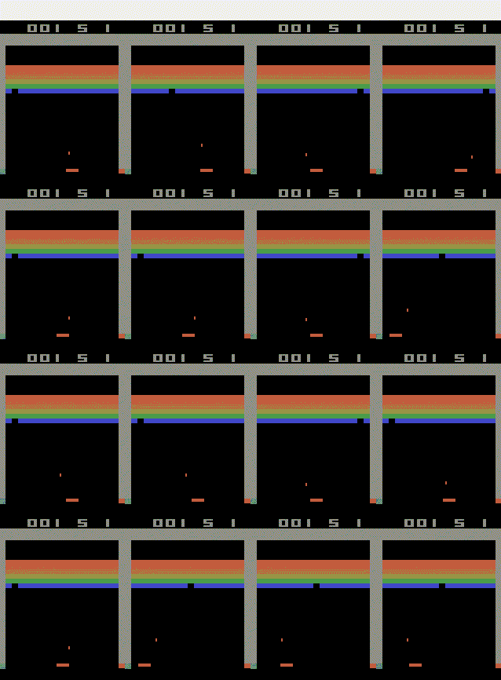
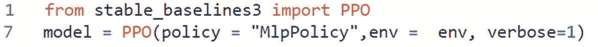
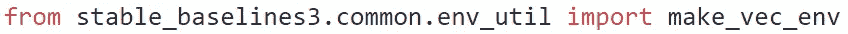
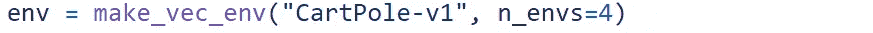
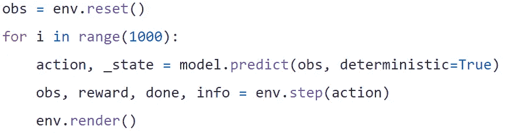
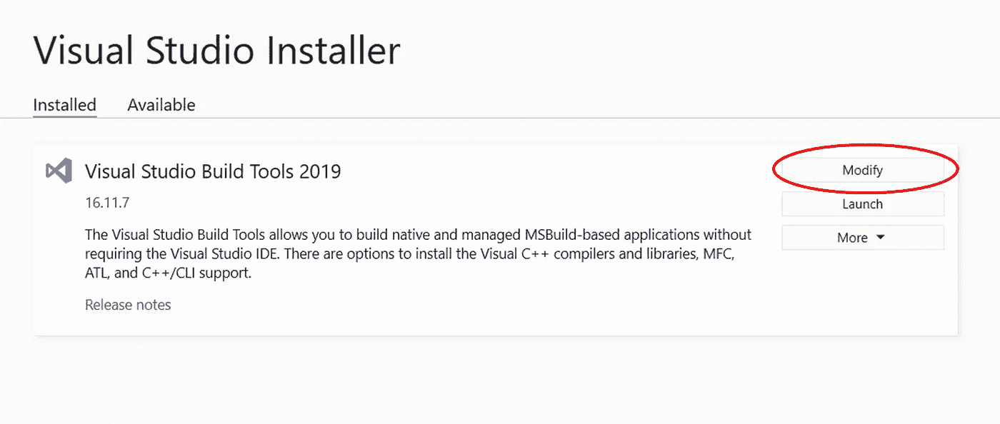
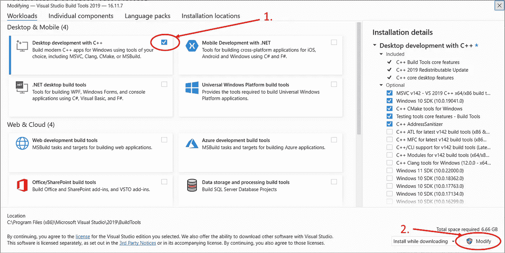
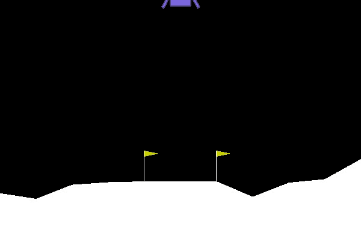
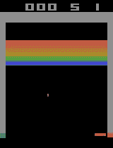
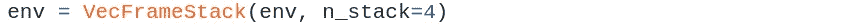

# 在稳定基线 3 中培训 RL 代理很容易

> 原文：<https://towardsdatascience.com/training-rl-agents-in-stable-baselines3-is-easy-9d01be04c9db>



(作者 GIF)

# 动机

大约 2 年以来，强化学习成了我的一个爱好。我特别喜欢在游戏上训练代理人。这些年来，我面临的一个大问题是缺乏一个可靠的 python 强化学习库，我不得不自己编写最先进的算法，或者在 github 上找到一个好的资源。对我来说，在我发现稳定基线 3 库的那一天，一切都变了。

# 你能期待什么

我将带你了解 stable-baselines3 和 openai gym 的整个安装过程。然后，我将向您展示如何在横拉杆环境中训练一个代理，并在屏幕上显示一些经过训练的代理的运行情况。我还想让你知道保存和加载模型。稳定基线 3 还支持同时在多个环境中进行培训。最后，我将向您展示如何在更复杂的 LunarLander-v2 环境中训练一个近似策略优化(PPO)代理，以及如何在 atari 突破环境中训练一个 A2C 代理。

# 装置

**稳定基线 3** 库提供了最重要的强化学习算法。它可以使用 python 包管理器“pip”来安装。

```
pip install stable-baselines3
```

我将使用 openai gym 环境演示这些算法。安装它来跟随。

```
pip install gym
```

# 用 cartpole 环境测试算法

## 培训 PPO 代理人

稳定基线库包含许多不同的强化学习算法。在下面的代码中，我将展示如何使用近似策略优化算法训练一个可以击败 openai cartpole 环境的代理。

(作者代码)

你可以很容易地将我使用的算法与[稳定基线 3 库](https://stable-baselines3.readthedocs.io/en/master/modules/base.html#)提供的任何其他强化学习算法进行交换。你只需要改变第 1 行和第 7 行，用你选择的算法替换 PPO。



将策略设置为“ **MlpPolicy** ”意味着我们将给出一个**状态向量**作为模型的输入。这里只有两个其他的政策选择。如果您提供**图像**作为输入，请使用“ **CnnPolicy** ”。还有用于处理多输入的“多输入策略”。由于 cartpole 环境不能输出图像，稍后我将展示一个“CnnPolicy”在其他体育馆环境中的用例。

## 保存和加载模型

要保存模型，请使用下面的代码行。


您可以将保存的模型加载回 python 中


下面的代码展示了为 cartpole 环境训练、保存和加载 PPO 模型的整个过程。请确保仅在训练模型后保存它。

(作者代码)

## 多种环境下的平行培训

您还可以非常容易地同时在多个环境中训练一个代理(即使是在 cpu 上训练)。这加快了代理的培训过程。

我们可以使用 stablebaselines3 库的 make_vec_env 函数创建并行环境。



我们以同样的方式使用它，我们使用了 openai 健身房功能来创建一个新的环境。但是我们告诉函数我们想要创建多少个并行环境。



因为您只训练了一个代理，所以您可以像以前一样保存模型。

但是与前一个案例的一个重要区别是，当我们测试我们训练有素的代理时，对终端状态的处理。如果 epsiode 在其中一个环境中结束，它会自动重置。在测试之前，代理看起来像这样:


现在，它变短了:



以下代码同时在 4 个环境中训练 PPO 代理:

(作者代码)

# 使用其他健身房环境

为了运行大多数其他健身房环境，您必须安装 python 的 Box2D 库。这在 mac 和 linux 上非常容易，但在 windows 上却非常困难。

## 安装 Box2D

Box2D 是 2D 物理学的开源物理引擎，许多体育馆环境用它来处理物体的碰撞。

***Linux/OSX***

据我所知，在 linux 和 mac 电脑上直接安装 Box2D 没有任何问题。

```
pip install box2d-py
```

***视窗***

在 windows 上，Box2D 环境的安装过程经常会出现问题。然而，我们可以使用 swig 单独安装它。这解决了问题。使用 anaconda 安装 swig 非常简单

```
conda install swig
```

如果不使用 anaconda，可以在这里下载 swig [。](http://www.swig.org/Doc1.3/Windows.html)

还需要 Microsoft Visual C++ 14.0 或更高版本。如果没有安装，Box2d 安装会失败。因此，请到这里下载最新的 microsoft C++构建工具。

[](https://visualstudio.microsoft.com/visual-cpp-build-tools/) [## Microsoft C++构建工具- Visual Studio

### Microsoft C++构建工具通过可脚本化的独立安装程序提供 MSVC 工具集，无需 Visual Studio…

visualstudio.microsoft.com](https://visualstudio.microsoft.com/visual-cpp-build-tools/) 

您可以在这里安装构建工具。



(图片由作者提供)

安装完“buildtools”后，打开 visual studio 安装程序(它可能在安装“buildtools”后已经打开)。



(图片由作者提供)

然后可以使用 pip 为 python 安装 Box2D。

```
pip install box2d-py
```

## 击败 LunarLander-v2

我现在将向您展示如何使用 stable_baselines3 库击败 lunarLander-v2 环境。代理人的任务是将着陆舱降落在两个黄色球门柱之间。



(作者 GIF)

这是一个比 cartpole 环境更复杂的任务。以向量的形式给代理以下信息。

*   (连续):距离目标位置 X 距离
*   (连续):距目标位置的 Y 距离
*   (连续):X 速度
*   (连续):Y 速度
*   (连续):船的角度
*   (连续):船的角速度
*   (二进制):左腿接地
*   (二进制):右腿接地

所以我们也必须使用 **MlpPolicy** 。

我选择 PPO 算法来训练代理，因为我发现它在 LunarLander 环境中学习速度非常快。代理人花了 200 万步训练才达到平均分数 **233** 。这场比赛的平均分数为 200 分就被认为失败了。

(作者代码)

## 雅达利突破像素

现在是时候让我们的代理仅使用屏幕上的像素来解决“雅达利突破”了。



(作者 GIF)

gym 的标准安装中不包含 breakout 环境，因此您必须安装一个 gym 版本，其中包含 atari 集合。

```
pip install gym[atari]
```

仅给定一张图片，代理人无法判断球的速度和方向。使用 VecFrameStack 包装器，我们同时给代理一些帧作为输入，这样他就可以学习球的移动。



也要意识到一个事实，那就是你现在必须知道使用“ **CnnPolicy** ”。我用 **A2C** 算法为**500 万时间步长**训练代理，并使用 **16 个并行环境**。

(作者代码)


(作者 GIF)

正如你所看到的，代理人已经学会了在砖块上打洞并在墙后投篮的技巧。然而，它很难射击最后几块砖，因此无法完成游戏。这很可能是因为代理没有在砖块较少的情况下接受过足够的培训。通过增加培训持续时间，代理应该能够战胜环境。

# 结论

我想花一点时间介绍一下关于稳定基线 3 库的最重要的信息。当您的环境向代理提供一个带有信息的向量时，则使用 **MlpPolicy** 。如果它给出完整的图像，则使用 **CnnPolicy** 。您可以并行使用多个环境来加速训练。但是他们都训练同样的**一个特工**。有了几千个时间步长的数据，cartpole 环境很容易被击败。LunarLander-v2 环境更加复杂，需要 200 万个时间步才能超越 PPO。雅达利突破将通过像素来解决，这使得它变得更加困难。有了 500 万个时间步长，我几乎可以击败使用 A2C 的环境。

# 想联系支持我？

LinkedIn
[https://www.linkedin.com/in/vincent-m%C3%BCller-6b3542214/](https://www.linkedin.com/in/vincent-m%C3%BCller-6b3542214/)
脸书
[https://www.facebook.com/profile.php?id=100072095823739](https://www.facebook.com/profile.php?id=100072095823739)
Twitter
[https://twitter.com/Vincent02770108](https://twitter.com/Vincent02770108)
中型
[https://medium.com/@Vincent.Mueller](https://medium.com/@Vincent.Mueller)
成为中型会员并支持我(你的部分会员费直接归我)

[](https://medium.com/@Vincent.Mueller/membership) [## 通过我的推荐链接加入媒体-文森特·米勒

### 作为一个媒体会员，你的会员费的一部分会给你阅读的作家，你可以完全接触到每一个故事…

medium.com](https://medium.com/@Vincent.Mueller/membership) 

# 相关故事

[](/deep-q-learning-is-no-rocket-science-e34912f1864) [## 深度 Q 学习不是火箭科学

### 用 pytorch 解释和编码的深度 Q 和双 Q 学习

towardsdatascience.com](/deep-q-learning-is-no-rocket-science-e34912f1864) [](/snake-with-policy-gradients-deep-reinforcement-learning-5e6e921db054) [## 具有策略梯度的 Snake 深度强化学习

### 策略梯度深度强化学习在蛇游戏中的应用

towardsdatascience.com](/snake-with-policy-gradients-deep-reinforcement-learning-5e6e921db054) [](/backpropagation-in-neural-networks-6561e1268da8) [## 神经网络中的反向传播

### 从零开始的神经网络，包括数学和 python 代码

towardsdatascience.com](/backpropagation-in-neural-networks-6561e1268da8) 

# 其他故事

[](/how-you-can-use-gpt-j-9c4299dd8526) [## 如何使用 GPT J

### GPT J 解释了 3 种简单的方法，你可以如何访问它

towardsdatascience.com](/how-you-can-use-gpt-j-9c4299dd8526) [](/eigenvalues-and-eigenvectors-378e851bf372) [## 主成分分析中的特征值和特征向量

### 关于我们的数据，他们告诉了我们什么？

towardsdatascience.com](/eigenvalues-and-eigenvectors-378e851bf372) [](/support-vector-machines-illustrated-b48a32c56388) [## 支持向量机，图解

### 支持向量机背后的直觉和数学

towardsdatascience.com](/support-vector-machines-illustrated-b48a32c56388)