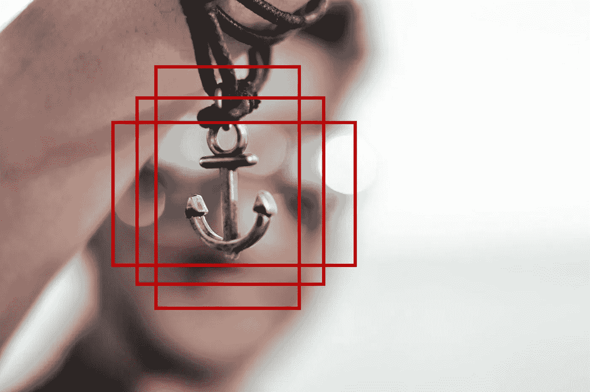
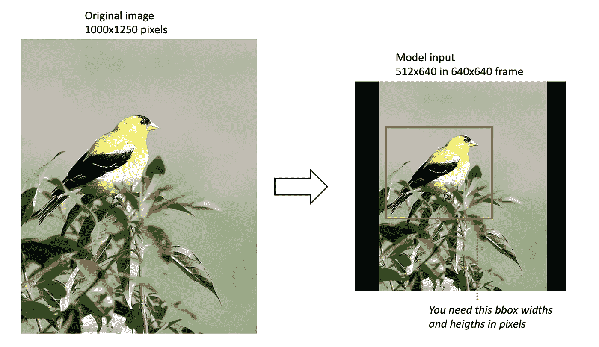
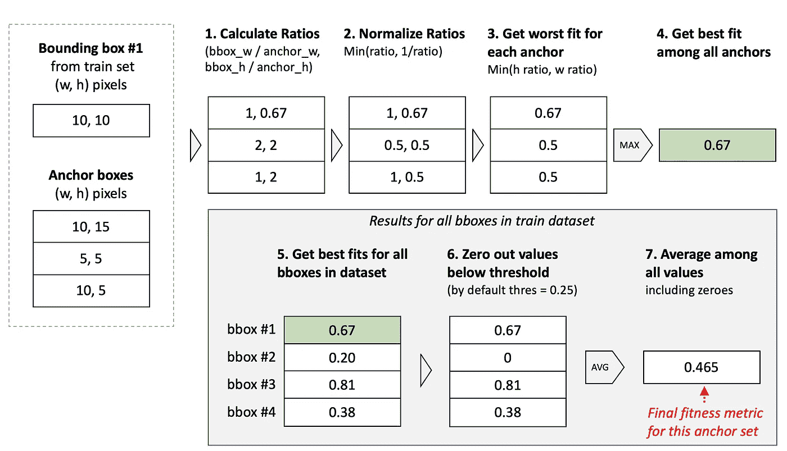
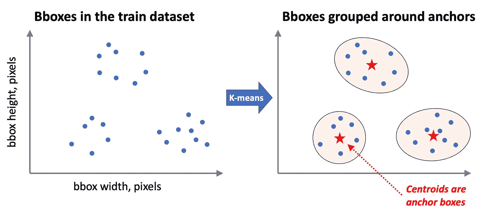
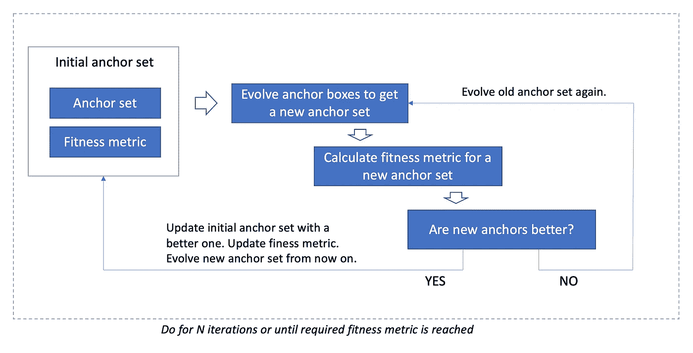

# 训练 YOLO？像这样选择定位框

> 原文：<https://towardsdatascience.com/training-yolo-select-anchor-boxes-like-this-3226cb8d7f0b>

## *回顾 YOLOv5 和 YOLOv7 中的自动锚点选择算法*

[原图](https://www.pexels.com/ru-ru/photo/1379354/)作者修改

一些卷积神经网络，包括后来版本的 YOLO，依赖于锚点。因此，在开始训练你的网络之前，你需要决定你将使用什么锚，并根据你所拥有的数据做出这个决定。锚集就像是你传递给模型的一个常量，就像是一个先验，它包含了数据集中对象大小的性质。

根据 [MathWorks](https://www.mathworks.com/help/vision/ug/anchor-boxes-for-object-detection.html#:~:text=What%20Is%20an%20Anchor%20Box,sizes%20in%20your%20training%20datasets.) :

> 锚定框是一组具有一定高度和宽度的预定义边界框。这些框被定义为捕获您想要检测的特定对象类的比例和纵横比，并且通常基于您的训练数据集中的对象大小来选择。”

选择好的锚点很重要，因为 YOLO 不是直接预测边界框，而是预测锚点框的位移。自然，神经网络比大位移更好(更准确)地预测小位移。因此，你选择的锚盒越好，神经网络做的“工作”就越少，模型产生的准确度就越高。

自动锚定算法是在 [YOLOv5 库](https://github.com/ultralytics/yolov5)中引入的，后来被复制粘贴到 [YOLOv7 库](https://github.com/WongKinYiu/yolov7)中，没有做任何修改。该算法的思想如下:

在训练之前，脚本检查提供的锚点与数据的匹配程度，如果不匹配，脚本将重新计算它们；并且用新的、更合适的锚来训练模型。听起来是一个非常有用的特性，不是吗？

的确如此。这篇文章致力于自动锚定算法:它是如何工作的，它背后的直觉是什么。如果你有兴趣—继续阅读:)

在回顾了[自动锚定代码](https://github.com/ultralytics/yolov5/blob/master/utils/autoanchor.py)之后，我相信最好将其解释为一个 4 步算法:

第一步。从步骤 2 的训练数据中获取边界框尺寸。选择一个指标来定义锚定适应性
步骤 3。进行聚类以获得锚的初始猜测
步骤 4。进化主播，提高主播体能

# 第一步。从训练数据中获取边界框大小

您需要的是所有列车图像中所有边界框(标签)的高度和宽度。注意，对于已经调整大小的图像(调整到模型输入大小)，高度和宽度应该以像素计算。

默认情况下，YOLOv5 和 YOLOv7 的模型输入大小为 640x640，这意味着图像较大一侧的大小调整为 640，纵横比保持不变，较短一侧填充。见下面的可视化。

*边界框的高度和宽度应根据模型输入尺寸重新计算。原图来自* [*COCO 数据集*](https://cocodataset.org/#home) *，可视化由作者创作。*

# 第二步。选择一个指标来定义锚点适合度

接下来，我们需要一个度量来比较锚盒集，并了解哪一个更适合数据。

理想情况下，**度量应该与损耗函数**(特别是盒损耗)相关联:度量越好，损耗越低。并且如果使用该度量选择锚盒，则模型已经以较低的损失开始训练。完美！

这个指标将用于进化算法中，这意味着你可以使用任何指标，而不用考虑一些优化算法可能强加的约束。

YOLO 自动锚定算法中使用的度量是棘手的，也许你不需要知道那么多细节，但对于那些感兴趣的人，解释如下:

*   有一个阈值定义为超参数(称为 *anchor_t* ，默认为 4；有时用作 *1/anchor_t* ，为 0.25)。这个阈值意味着，如果锚定框比边界框标签大或小不超过 4 倍，我们就认为它是一个好的锚定框。
*   我们希望每个边界框标签尽可能靠近至少一个定位框。我们希望它接近阈值(不超过 4 倍大或小)。
*   平均而言，达到了良好的适应度，这意味着一些边界框(可能是离群值)可能仍然远离锚点。
*   对于每个边界框，我们选择最好的锚点，但是我们从最差的拟合边开始计算它的拟合度(希望这样有意义)。

如果您还想了解指标是如何计算的，我真的建议您仔细阅读下面的计算。

*如何在 YOLOv5 和 YOLOv7 中计算适应性指标。本例中有 3 个锚点，在 YOLOs 中默认为 9 个锚点。图片作者。*

# 第三步。进行聚类以获得锚的初始猜测

在 [YOLOv2](https://arxiv.org/abs/1612.08242v1) 中，仅使用 k-means 聚类算法计算锚盒。k-means 的典型距离度量是欧几里德距离，然而，对于该距离，较大的框比小的度量产生更多的误差，因此作者利用 1-IoU(并集上的交集)作为距离度量。顺便说一下，IoU 与 YOLO 损失函数的关系比欧氏距离更密切。

只做 k-means 聚类已经是一个很好的方法，它会给你比手工挑选锚盒更好的结果。然而，后来 YOLO 版本的作者决定走得更远:

*   K-means(具有简单的欧几里德距离)用于获得锚盒的初始猜测。
*   使用进化算法(在步骤 4 中有更多描述)来寻找相对于先前在步骤 2 中选择的度量的最佳锚集。

如何选择集群的数量？默认情况下，YOLOv5 和 YOLOv7 使用 9 个锚框，因此簇的数量应为 9。

***初学者注意事项*** 。K-means 算法在来自训练集的所有包围盒标签上运行。用于聚类的特征-以像素为单位的宽度和高度。最终聚类中心是锚盒。

*K-means 聚类算法用于找到锚盒的初始猜测。本例中有 3 个锚点，在 YOLOs 中默认为 9 个锚点。图片作者。*

# 第四步。进化主播，提高主播体能

进化算法的灵感来源于自然，简单而美丽。我们从 k-means 中取出锚集，稍微随机改变一些锚盒的高度和宽度(变异)，然后计算适合度。如果新的变异锚集更好，则对新的锚集执行下一次变异，否则，使用旧的锚。如果你更喜欢视觉消费信息，下面是这种进化算法的工作原理。

在 YOLOv5 和 YOLOv7 中，evolution 运行 1000 次迭代(默认情况下),可能会大量更改初始锚集。

*进化算法在 YOLOv5 和 YOLOv7 中的自动锚定。图片作者。*

# 最后一句话

现在你知道 YOLO 自动锚是如何工作的了，所有的细节。我计划在未来回顾 YOLO 的其他地方，所以如果你感兴趣——订阅并保持更新。

同时，我鼓励你看看我的其他一些帖子:

</learn-to-reproduce-papers-beginners-guide-2b4bff8fcca0>  </explainable-defect-detection-using-convolutional-neural-networks-case-study-284e57337b59>  </word2vec-with-pytorch-implementing-original-paper-2cd7040120b0> 