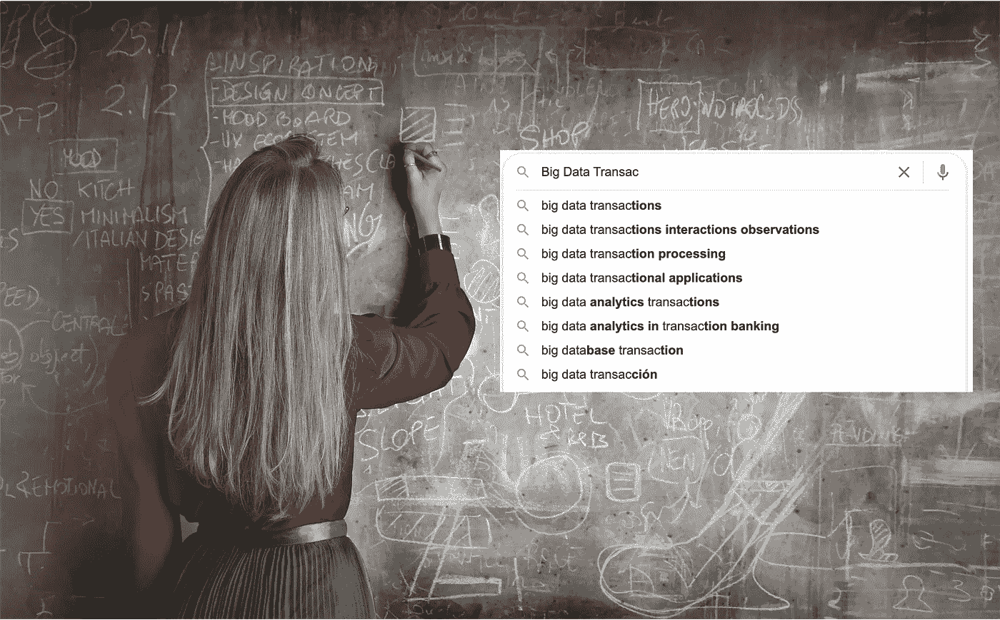
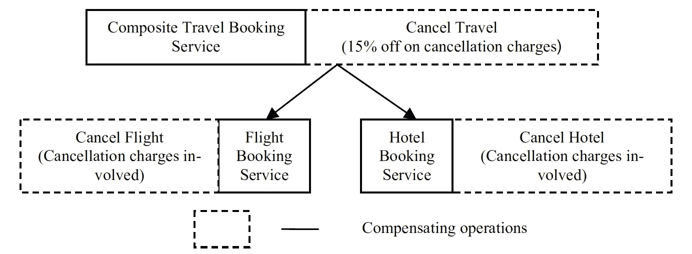
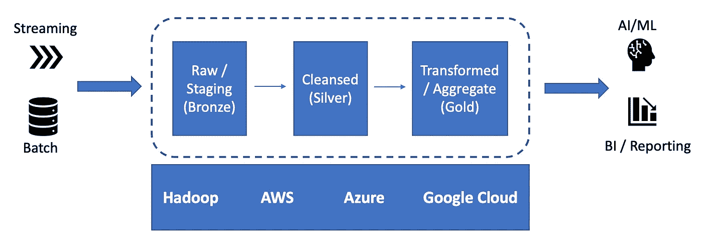
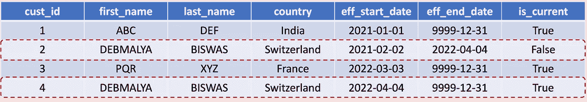

# 大数据世界中的交易

> 原文：<https://towardsdatascience.com/transactions-in-a-data-world-609ebe9384b2>

## 为什么酸支持对模型预测再现性至关重要？

图:大数据交易(基于来自 [Pexels](https://www.pexels.com/photo/woman-in-red-long-sleeve-writing-on-chalk-board-3769714/?utm_content=attributionCopyText&utm_medium=referral&utm_source=pexels) 的 [Andrea Piacquadio](https://www.pexels.com/@olly?utm_content=attributionCopyText&utm_medium=referral&utm_source=pexels) 的图片)

**摘要**。带有 ACID 保证的事务曾经是数据库管理系统的支柱。然而，随着流媒体和 NoSQL 的出现，交易被认为过于严格，难以在大数据平台上实施。最终的一致性成为了这类平台的标准，其中一些分布式节点之间可能是不一致的——返回不同的值；所有节点在稍后的时间点收敛到相同的值。

*然而，大数据平台/框架现在已经成熟，我们看到了提供 ACID 支持的平台的复兴，例如三角洲湖、胡迪和冰山。在本文中，我们为大数据世界中的事务提供了案例，为如何在这种场景中实现事务提供了必要的背景。我们展示了一个具体的应用，说明了 ACID 事务如何在实现数据历史化方面发挥关键作用。*

# 处理

事务可被视为由操作 Begin 和 Commit/Abort 封装的一组操作，具有以下属性(ACID):

*   **原子性**:要么所有操作都执行，要么都不执行。在失败(中止)的情况下，属于该事务的任何操作的效果都被取消(回滚)。
*   **一致性**:每个事务将系统从一种一致状态转移到另一种一致状态。
*   **隔离**:为了提高性能，通常会同时执行几个事务。隔离要求这种并发执行的效果等同于串行执行的效果。这是通过确保事务的中间结果在成功完成(提交)之前不会被外部化来实现的。
*   **持久性**:一旦事务提交，其效果是持久的，即它们不应被任何系统或软件崩溃所破坏。

例如，让我们考虑一下传统的银行交易 *t_b* ，它涉及到从一个账户 *A* 向另一个账户 *B* 转账。该交易由两个操作组成——第一个操作从账户 *A* 中取钱，第二个操作将钱存入账户 *B* 。不用说，事务的任何部分执行都会导致不一致的状态。原子性属性确保提取和存放操作要么都成功，要么都失败。隔离属性确保对两个帐户 *A* 和 *B* 的更改对其他事务不可见，直到 *t_b* 提交。原子性和隔离性共同保证了系统的一致性(账号 *A* 和 *B* )。

负责实现事务的软件通常被称为事务管理器(TM)。我们可以将 TM 的功能分为以下几个部分:

*   并发控制管理器(CCM):CCM 确保隔离属性。并发控制机制允许以受控的方式在并发事务之间共享资源。
*   恢复管理器(RM):RM 负责在出现故障或软件/硬件崩溃时提供原子性和持久性属性。
*   日志管理器(LM):LM 负责将执行细节写入稳定存储。虽然日志在恢复中起着重要的作用，但它也用于分析和提高系统性能和效率。

> 虽然事务已被接受为提供容错和可靠性的标准手段，但当我们试图在分布式环境中应用它们时，新的挑战出现了。

## 分布式事务— 2PC

分布式事务由在通过通信网络连接的不同地点执行的操作组成。分布式事务起源于一个站点(也称为主/根站点),逐渐涉及其他站点，在这些站点中，属于事务的操作被转发以供执行。集中式和分布式系统中事务处理的主要区别如下:

*   决策制定:提交/中止事务的决策不限于单个 TM。相反，需要根据所有相关地点的 TMs 的决定做出集体决定。
*   多点故障:对于集中式系统，系统要么工作，要么不工作。然而，在分布式系统中，我们可能会遇到部分故障，即一些相关站点发生故障，而其他站点仍在工作。

因此，我们需要一种协议来确保在所有涉及的站点一致地执行相同的决策(提交/中止),而不管部分故障。两阶段提交(2PC)协议可能是针对上述问题的最广泛接受的解决方案。主站点的 TM 充当协调者，而所有其他相关站点的 TM 承担参与者的角色。顾名思义，2PC 协议包括两个阶段。在*第一*阶段，协调器 TM 向所有参与者 TM 发送准备消息。每个参与者 TM 根据它是否想要提交/中止来投票赞成/反对。如果协调器 TM 从其所有参与者 TM 接收到“是”，那么它通过向所有参与者 TM 发送提交消息来开始协议的第二阶段*。然而，如果它从至少一个参与者 TM 接收到“否”,则它通过向所有参与者 TM 发送中止消息来启动第二阶段。最后，协调器 TM 等待来自参与者 TMs 的确认，以完成第二阶段。*

## 补偿—传奇

虽然上述协议对于紧密耦合的分布式应用程序工作良好，但是它对于长时间运行和松散耦合的应用程序的适用性是有限的。为了确保 ACID 属性(在集中式场景中)，需要持有锁，直到事务提交。

> 从性能角度来看，这并不是一个理想的情况，尤其是对于长时间运行的事务——必须持有锁，直到所有涉及的(协调者和参与者)站点都准备好提交。

对上述限制的一个优雅的解决方案是嵌套事务的概念[1]。嵌套事务允许相关站点的 TMs 通过以受控方式外部化中间结果，在事务本地完成后立即释放它们的锁。基本上，全局事务(提交给根 TM)被分成许多可以并发执行的子事务。虽然保证了全局事务的 ACID 属性，但是子事务并没有完全隔离，因为它们的结果向它们的父事务公开。甚至不能保证子事务的持久性，因为如果其父事务中止，可能需要取消它的效果(在提交后)。

虽然嵌套事务的概念在某种程度上解决了性能问题，但它仍然需要相关的 TMs 的某些保证。然而，考虑到松散耦合的分布式系统的自治性和异构性需求，这样的保证可能并不总是可行的。Sagas [2]或开放嵌套事务[3]通过允许子事务产生的中间结果不受任何限制地公开来缓解这个问题。

> Sagas 依靠补偿事务的概念[4]来确保失败时的原子性。基本上，对于每个事务 t，指定了能够在语义上消除事务 t 的影响的补偿事务 t_c。

在失败的情况下，通过以与它们各自事务的原始执行顺序相反的顺序执行补偿事务来保证原子性。补偿交易的典型例子是“取消预订”或“撤销”,分别能够撤销“预订票”或“存款”交易的效果。在这里，记住补偿并不总是可能的，尤其是对于现实生活中的交易。

> 总的来说，不同级别的补偿可能会有不同的成本。

例如，让我们考虑经典的旅行预订场景(图 1)。如果酒店或航班预订需要补偿，那么可以通过分别在酒店或航班预订站点调用补偿(取消)操作，或者通过在复合旅行预订站点调用补偿操作(取消旅行)来实现。现在，如果我们假设用户是复合旅游预订网站的高级会员，并因此在所有取消费用上获得 15%的折扣，那么(从用户的角度来看)在复合旅游预订网站调用取消旅游操作是有益的。

图 1:补偿事务场景(作者图片)

# 大数据环境中的交易

在本节中，我们将介绍一些提供 ACID 支持的关键数据平台/框架。然后，我们展示了一个具体的应用程序，它支持 upsert / merge 操作，这对于实现数据历史化至关重要。

[**Delta Lake**](https://github.com/delta-io/delta) 是一个开源框架，为 Apache Spark 和大数据工作负载带来了 ACID 事务。人们可以下载开源的 Delta Lake，在 HDFS 内部使用。该框架允许从任何支持 Apache Spark 数据源的存储系统读取数据，并写入 Delta Lake，Delta Lake 以 Parquet 格式存储数据。有关技术细节，请参考[5]。

> ACID 事务提供了 Delta Lake 的关键“时间旅行”功能，允许探索特定时间点的数据，支持访问和回滚到对审计和模型预测再现性至关重要的数据的早期版本。

这里可以利用的替代数据平台/框架包括 Apache [胡迪](https://hudi.apache.org/)和 Apache [冰山](https://iceberg.apache.org/)。**胡迪**遵循传统的基于“事务日志”的方法，使用带有时间戳的数据文件和日志文件来跟踪数据文件中记录的变化。 **Iceberg** 使用以下元数据层次结构提供 ACID 支持:

*   表“元数据文件”
*   对应于表快照的“清单列表”
*   定义数据文件组的“清单”,这些数据文件可以是多个快照的一部分

表写入会创建一个新的快照，它可以与并发查询并行运行(返回最后一个快照值)。并发写入遵循乐观并发控制协议，提交的第一个事务成功；导致所有其他冲突并发事务的重启。

我们展示了 ACID 事务如何在数据历史化中发挥关键作用。

## 数据历史化

历史化是跟踪数据随时间变化的过程。它适用于数据平台的所有层(图 2):摄取到“原始”(青铜)中的源数据，到“精炼”(银)中的净化数据，到“精选”(金)中的转换数据。

图 2:分层数据架构(图片由作者提供)

主要有两种数据历史化方法:

*   渐变维度类型 2 ( **SCD2** ):每次一个或多个列值发生变化时，变化历史都会为标识符添加一条新记录。例如，关于分别在 AWS 和 Oracle 云平台上实现 SCD2 的详细信息，请参考[6，7]。
*   **快照历史**每当来自源系统的数据交付到达时，添加一个新的标识符记录，无论它是否包含更改。
    原始的&暂存层)，易于实现和对晚到达数据的鲁棒性。

**混合方法:**

*原始/暂存层的快照历史* **:** 实现一个永久暂存区，作为源数据交付的永久存档。这允许在对源数据进行显式建模之前对其进行加载和历史记录，并作为一种预防管理层/聚合数据存储中的建模错误的措施。

*利用 SCD2 管理层/聚合数据存储:*

对于**策划层来说，SCD2** 仍然是最流行的历史化技术。创建新记录时，前一个记录需要过期。这包括**多个**操作(参见下面的示例表进行说明):

*   在当前数据集中查找记录，将现有记录的 eff_end_data 设置为新记录的 eff_start_date，并将现有记录的 is_current 标志设置为“false”
*   插入新记录。

> Delta Lake /胡迪/ Iceberg 对 ACID 事务的支持使得以可靠和可伸缩的方式执行这种 **Upsert** (合并)操作成为可能。

# 参考

1.  T.E.B .莫斯。*嵌套事务:一种可靠的分布式计算方法*。麻省理工学院计算机科学实验室博士论文，1981 年。
2.  H.加西亚.莫利纳和 k .塞勒姆。*传奇*。在斯通布雷克，医学博士。数据库系统阅读，旧金山，加州，1987，290-300。
3.  G.维库姆，执事，沙德，谢克。*联邦数据库系统中的开放式嵌套事务*。IEEE 数据工程通报，16(2):4–7，1993 年 6 月。
4.  D.比斯瓦斯。*Web 服务组合世界中的补偿*。在:语义 Web 服务和 Web 过程组合。SWSWPC 2004。计算机科学讲义，第 3387 卷。[https://doi.org/10.1007/978-3-540-30581-1_7](https://doi.org/10.1007/978-3-540-30581-1_7)
5.  米（meter 的缩写））阿姆布鲁斯特等人。艾尔*。Delta lake:云对象存储上的高性能 ACID 表存储。*过程。VLDB 捐赠。13，12(2020 年 8 月)，3411–3424。[https://doi.org/10.14778/3415478.3415560](https://doi.org/10.14778/3415478.3415560)
6.  D.格林施泰因。*在亚马逊 EMR 上用阿帕奇 Spark 和阿帕奇胡迪构建缓变维度类型 2(SCD 2)*，2021，[https://AWS . Amazon . com/blogs/big-data/Build-缓变维度类型 2-SCD 2-with-Apache-Spark-and-Apache-胡迪-on-amazon-emr/](https://aws.amazon.com/blogs/big-data/build-slowly-changing-dimensions-type-2-scd2-with-apache-spark-and-apache-hudi-on-amazon-emr/)
7.  A.杜武里。*Oracle 云基础设施(OCI)数据集成中的缓变维度(SCD)类型 2 实施*，2020，[https://blogs . Oracle . com/Data Integration/post/slow-Changing-Dimensions-SCD-Type-2-Implementation-in-Oracle-Cloud-infra structure-OCI-Data-Integration](https://blogs.oracle.com/dataintegration/post/slowly-changing-dimensions-scd-type-2-implementation-in-oracle-cloud-infrastructure-oci-data-integration)