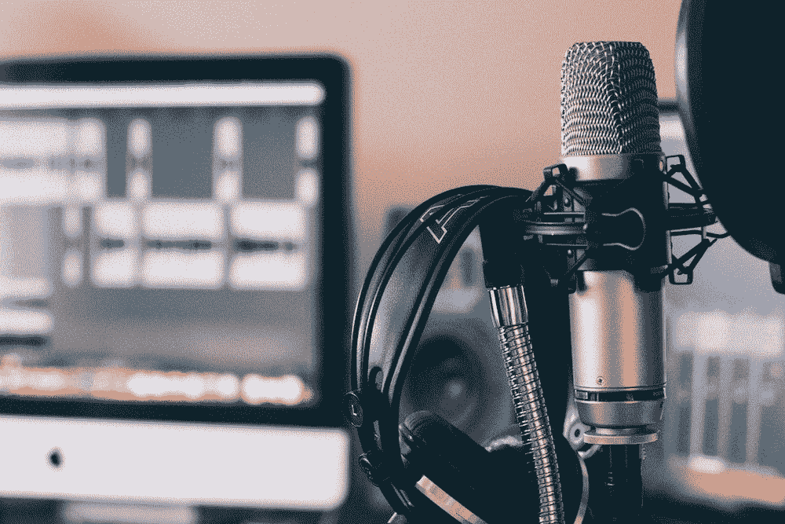
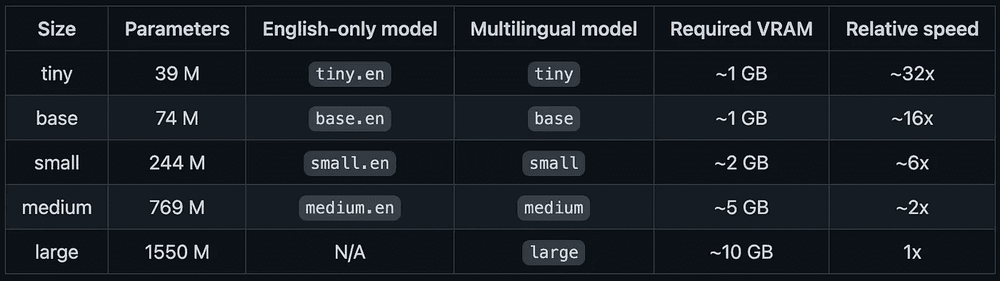

# 用 OpenAI 的耳语转录音频文件

> 原文：<https://towardsdatascience.com/transcribe-audio-files-with-openais-whisper-e973ae348aa7>

## 用 OpenAI 的耳语转录音频文件



威尔·弗朗西斯在 [Unsplash](https://unsplash.com/photos/ZDNyhmgkZlQ) 上拍摄的照片。

penAI 最近开源了一个名为 Whisper 的神经网络。它允许你离线转录(大)音频文件，如 mp3。OpenAI 声称 Whisper 在英语语音识别中接近人类水平的鲁棒性和准确性。

由于已经有现有的(开源)模型或包，如 [Vosk](/transcribe-large-audio-files-offline-with-vosk-a77ee8f7aa28) 或 [NVIDIA NeMo](https://catalog.ngc.nvidia.com/orgs/nvidia/models/nemospeechmodels) ，我想知道 Whisper 能够转录音频文件的能力如何。

本文向您展示了如何使用 Whisper，并将其性能与另一个离线开源语音识别工具包 Vosk 进行了比较。

# TL；博士；医生

*   Whisper 是 OpenAI 的一个开源、多语言、通用的语音识别模型。
*   转录一个(mp3)音频文件只需要三行代码。
*   与 Vosk(另一个开源工具包)的快速比较表明，Whisper 转录播客摘录的音频稍好一些。主要区别在于 Whisper 提供了标点符号。这使得转录更容易理解。
*   如果您仅对代码感兴趣，向下滚动至“耳语”或点击此处的(要点)。

# 先决条件

在我们开始转录和比较这两个模型之前，我们必须确保满足一些先决条件。

## 安装 ffmpeg

为了能够**读取音频文件**，我们必须先安装一个名为`ffmpeg`的命令行工具。根据您的操作系统，您有以下选择:

```
# **Ubuntu or Debian**
sudo apt update && sudo apt install ffmpeg

# **MacOS** using *Homebrew* (https://brew.sh/)
brew install ffmpeg

# **Windows** using *Chocolatey* (https://chocolatey.org/)
choco install ffmpeg

# **Windows** using *Scoop* (https://scoop.sh/)
scoop install ffmpeg
```

## 安装耳语

使用以下 pip 安装命令下载 Whisper。

```
pip install git+https://github.com/openai/whisper.git
```

## 安装 Vosk(可选)

因为这篇文章比较了 Whisper 和 Vosk，所以我也将向您展示如何安装和配置 Vosk。**如果你只对使用 Whisper 感兴趣，可以跳过这一部分。**以下命令安装 Vosk:

```
pip install vosk
```

## 安装 pydub(可选)

要使用 Vosk，我们首先必须用**一个通道**(单声道)和**16000hz 采样率**将`.wav`文件中的音频文件**转换。Whisper **也做这种转换，**但是我们不需要额外编码。下面的命令安装`pydump`:**

```
pip install pydump
```

## 对于 Mac 用户:安装证书

Whisper 将加载特定的语言模型来转录音频。如果您是 Mac 用户，稍后您可能会收到以下消息:

```
URLError: <urlopen error [SSL: CERTIFICATE_VERIFY_FAILED] certificate verify failed: unable to get local issuer certificate (_ssl.c:1123)>
```

要解决此问题，请进入 python 应用程序的文件夹(通常是 Applications> Python 3.x)并运行“Install Certificates.command”文件。更多信息可在[这里](https://stackoverflow.com/questions/68275857/urllib-error-urlerror-urlopen-error-ssl-certificate-verify-failed-certifica)找到。

# 音频文件

为了比较这两种方法，我将使用我在关于 [Vosk](/transcribe-large-audio-files-offline-with-vosk-a77ee8f7aa28) 的文章中使用的相同音频源:随机播客片段。

“Opto Sessions -非凡投资者访谈”播客中的音频文件。spotify 上的第 69 集。

> 请注意:这是一个随机的选择，我与创作者没有任何联系，也没有因为命名他们而获得报酬。如果您在此处看到错误(例如，502 坏网关)，请重新加载页面。

由于 68 分钟播客会议的转录结果会很长，我决定**切掉 60 秒**(否则，这篇文章包含的转录文本会比解释更多)。这里的挑战是，前 30 秒主要是引子的一部分，包含来自不同音频源的引用。

> 如果你只是想看看如何用耳语转录音频文件，你不必应用下面的代码。可以直接用 Whisper 读取. mp3 文件。

# 抄本

有了我们准备好的音频文件，我们可以使用 Whisper 和 Vosk 开始转录它。

## 低语

在我们转录相应的音频文件之前，我们必须先下载一个预先训练好的模型。目前，提供五种型号尺寸(表 1)。



表 1。Whisper 不同型号的概述(Whisper 的 [GitHub 页面](https://github.com/openai/whisper))。

作者在他们的 [GitHub 页面](https://github.com/openai/whisper)上提到，对于纯英文应用程序来说，`.en`模型往往表现更好，尤其是对于`tiny.en`和`base.en`模型，而对于`small.en`和`medium.en`模型来说，差异会变得不那么显著。

> [Whisper 的 GitHub 页面](https://github.com/openai/whisper#available-models-and-languages)包含了更多关于他们模型性能的信息。

下面的代码显示了如何下载语言模型并运行转录:

只用 3 行代码，我们就能转录一个音频文件。转录花了 65 秒，可以在下面看到。

> 我使用的是 2015 年年中的旧 Macbook Pro(2.2 GHz 四核英特尔酷睿 i7 和 16GB 内存)。

```
Right, that's the number one technical indicator. You do best by investing for the warm return. If you can't explain what the business is doing, then that is a huge red flag. Some technological change is going to put you out of business. It really is a genuinely extraordinary situation. Hi everyone, I'm Ed Goffam and welcome to OptoSessions where we interview the top traders and investors from around the world uncovering the secrets to success. On today's show, I'm delighted to introduce Beth Kindig, a technology analyst with over a decade of experience in the private markets. She's now the co founder of I.O. Fund, which specialises in helping individuals gain a competitive advantage when investing in tech growth stocks. How does Beth do this? She's gained hands on experience over the years. Here's fast eye Organul..
```

转录的结果是非常好的和全面的。如上所述，播客的介绍包含来自不同来源的质量不同的音频片段(例如，引用)。然而，Whisper 可以很好地转录音频，还可以处理标点符号(例如，逗号、句号和问号)。

## 沃斯克

和 Whisper 类似，我们也要为 Vosk 下载一个预先训练好的模型。所有可用型号的列表可在[这里](https://alphacephei.com/vosk/models)找到。我决定用最大的一个(1.8GB): `vosk-model-en-us-0.22`

下面的代码显示了如何使用 Vosk:

尽管 Whisper 也有类似的方法(滑动 30 秒窗口)，但我们必须在这里做更多的手工编码。

首先，我们加载我们的音频文件(`line 5`)和我们的模型(`lines 10-11`)。然后我们读取前 4000 帧(`line 17`)并把它们交给我们加载的模型(`line 20`)。该模型返回(以 JSON 格式)结果，该结果作为 dict 存储在 *result_dict* 中。然后，我们只提取文本值，并将其附加到我们的转录列表中(`line 24`)。

如果没有更多的帧需要读取(`line 18`)，循环就停止，我们通过调用 *FinalResult()* 方法(`line 27`)来捕捉最终结果。此方法还会刷新整个管道。

35 秒后，创建了以下结果:

```
the price is the number one technical indicator you do best by investing for the longer term if you can't explain what the business is doing then that is a huge red flag some technological changes puts you out of business it really is a genuine be extraordinary situation hi everyone i am a gotham and welcome to opto sessions where we interview top traders and investors from around the world uncovering the secrets to success on today's show i'm delighted to introduce beth can dig a technology analyst with over a decade of experience in the private markets she's now the co-founder of iowa fund which specializes in helping individuals gain a competitive advantage when investing in tech growth stocks how does beth do this well she's gained hands-on experience over the years whilst i
```

为了更好地与 Whiper 的输出进行比较，我再次将它粘贴到这里:

```
Right, that's the number one technical indicator. You do best by investing for the warm return. If you can't explain what the business is doing, then that is a huge red flag. Some technological change is going to put you out of business. It really is a genuinely extraordinary situation. Hi everyone, I'm Ed Goffam and welcome to OptoSessions where we interview the top traders and investors from around the world uncovering the secrets to success. On today's show, I'm delighted to introduce Beth Kindig, a technology analyst with over a decade of experience in the private markets. She's now the co founder of I.O. Fund, which specialises in helping individuals gain a competitive advantage when investing in tech growth stocks. How does Beth do this? She's gained hands on experience over the years. Here's fast eye Organul..
```

我们可以看到，沃斯克在正确抄写大部分单词方面做得很好。但是，它最大的弱点是不使用标点符号。这使得很难阅读转录。

# 结论

让 Whisper 开源对整个机器学习社区非常有益。与 Vosk 等现有开源解决方案相比，Whisper 只需要几行代码，支持标点符号，并能更好地转录单词。因此，当离线转录(大)音频文件时，我更喜欢 Whisker 而不是 Vosk。

如果你对 Whisper 项目、架构以及他们不同模型的性能和相关论文更感兴趣，你应该访问他们的 [GitHub 页面](https://github.com/openai/whisper)。

# 来源

**耳语 GitHub 页面**:【https://github.com/openai/whisper】T4

**沃斯克车型**:[https://alphacephei.com/vosk/models](https://alphacephei.com/vosk/models)

**我之前的文章:** *用 Vosk 离线转录大音频文件*:[https://towardsdatascience . com/register-large-audio-files-offline-with-Vosk-a 77 ee 8 f 7 aa 28](/transcribe-large-audio-files-offline-with-vosk-a77ee8f7aa28)