# 灰度图像的迁移学习:如何微调黑白数据集的预训练模型

> 原文：<https://towardsdatascience.com/transfer-learning-on-greyscale-images-how-to-fine-tune-pretrained-models-on-black-and-white-9a5150755c7a>

## 您需要了解的一切，以理解为什么通道数量很重要以及如何解决这个问题

随着深度学习领域的不断成熟，在这一点上，人们普遍认为迁移学习是计算机视觉快速取得良好结果的关键，尤其是在处理小数据集时。虽然从预训练模型开始会产生的差异部分取决于新数据集与原始训练数据的相似程度，但可以认为从预训练模型开始几乎总是有利的。

尽管越来越多的预训练模型可用于图像分类任务，但在撰写本文时，其中大多数都是在某个版本的 [ImageNet 数据集](https://www.image-net.org/)上训练的；其中包含彩色图像。虽然这通常是我们正在寻找的，但在某些领域，如制造业和医学成像，经常会遇到黑白图像数据集。

由于彩色图像和黑白图像之间的差异对我们人类来说是微不足道的，所以您可能会认为微调预训练模型应该开箱即用，但这很少发生。因此，尤其是如果您在图像处理方面的背景知识有限，可能很难知道在这些情况下采取什么样的最佳方法，

在本文中，我们将尝试通过探索 RGB 和灰度图像之间的差异，以及这些格式如何影响卷积神经网络模型完成的处理操作，来消除黑白图像微调时需要考虑的所有因素，然后再演示如何将灰度图像用于预训练模型。最后，我们将检查在一些开源数据集上探索的不同方法的性能，并将其与灰度图像上的从头训练进行比较。

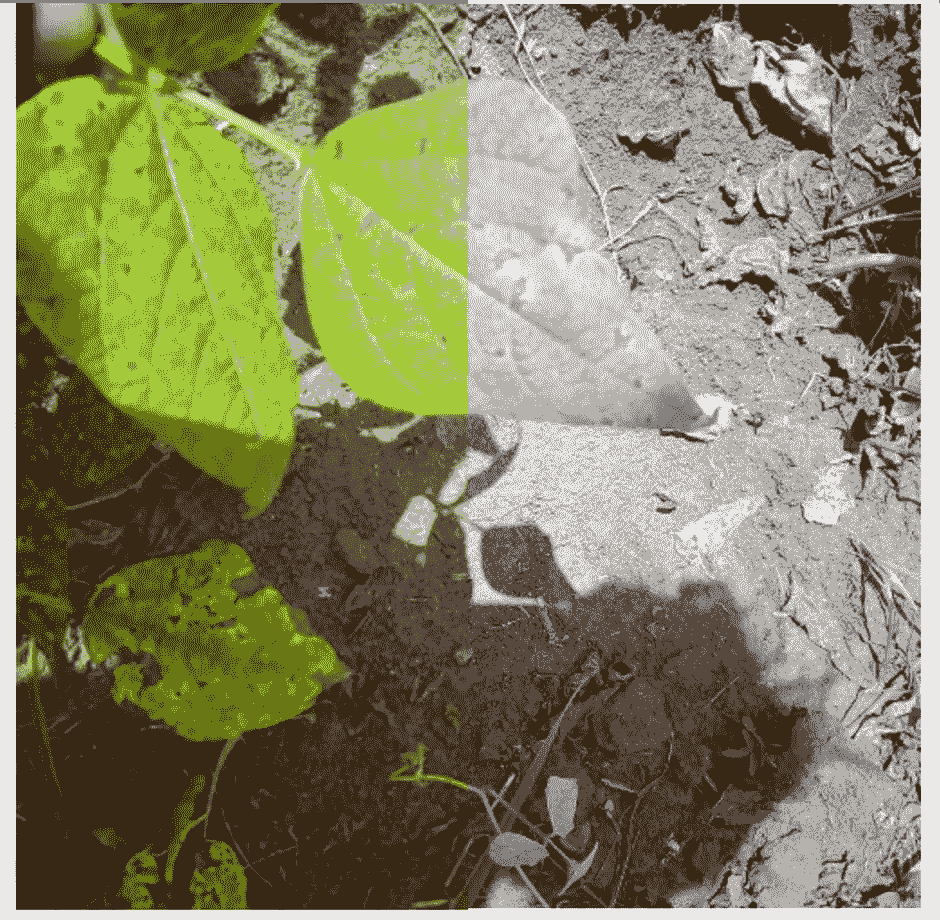

图片取自公开的[豆类数据集](https://github.com/AI-Lab-Makerere/ibean/)

# RGB 和灰度图像有什么区别？

虽然彩色和灰度图像可能与我们非常相似，因为计算机只将图像视为一组数字，但这可能会对图像的解释产生巨大的影响！因此，为了充分理解为什么灰度图像可能对预训练网络构成挑战，我们必须首先检查计算机如何解释彩色和灰度图像的差异。

作为一个例子，让我们使用来自[豆子数据集](https://github.com/AI-Lab-Makerere/ibean/)的图像。


## RGB 图像

通常，当我们在深度学习中处理彩色图像时，这些图像是以 RGB 格式表示的。在高层次上，RGB 是加色模型，其中每种颜色由红、绿和蓝值的组合来表示；这些通常存储为单独的“通道”，因此 RGB 图像通常被称为 3 通道图像。

我们可以检查图像的模式——一个定义图像中像素类型和深度的字符串，如这里的[所描述的](https://pillow.readthedocs.io/en/latest/handbook/concepts.html#modes)——以及检查可用的通道，使用 PIL 如下所示。

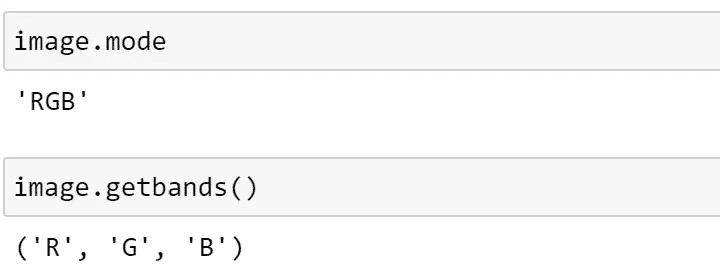

这证实了 PIL 已经认识到这是一个 RGB 图像。因此，对于每个像素，存储在这些通道中的值(称为强度)构成了整体颜色的一个组成部分。

这些组件可以用不同的方式表示:

*   最常见的是，组件值存储为 0 到 255 范围内的无符号整数；单个 8 位字节可以提供的范围。
*   在浮点表示法中，值可以用 0 到 1 来表示，其间可以有任何小数值。
*   每个颜色分量值也可以写成从 0%到 100%的百分比。

将我们的图像转换为 NumPy 数组，我们可以看到，默认情况下，图像被表示为一个无符号整数数组:

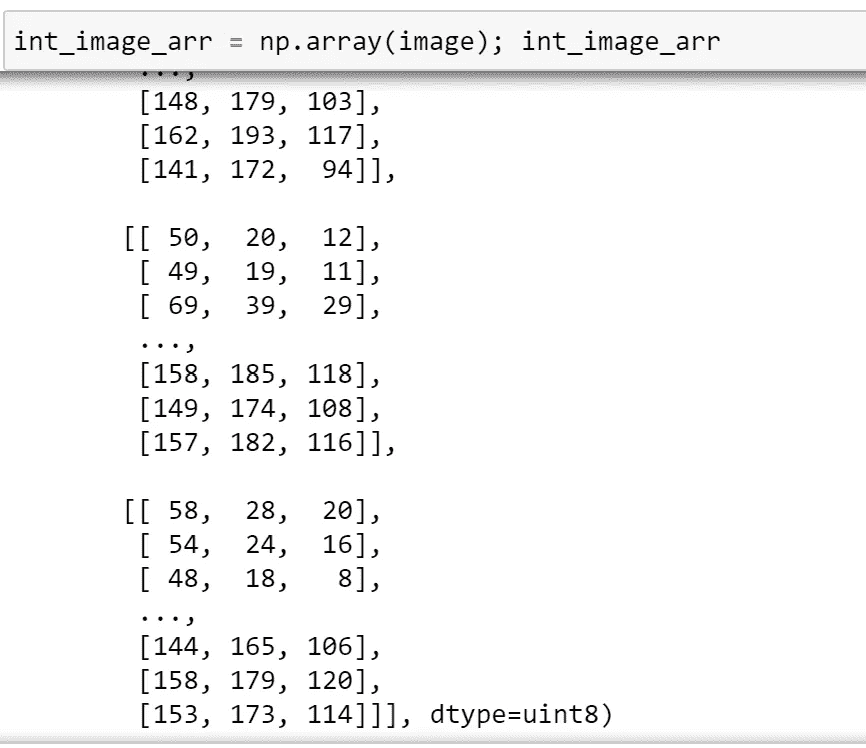

检查阵列的形状，我们可以看到图像有 3 个通道，这符合我们的预期:

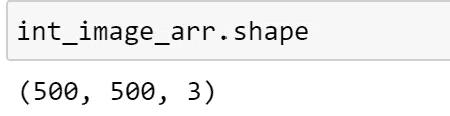

为了将我们的图像数组转换成浮点表示，我们可以在创建时显式指定数组的`dtype`。让我们看看当我们转换和绘制我们的图像时会发生什么。

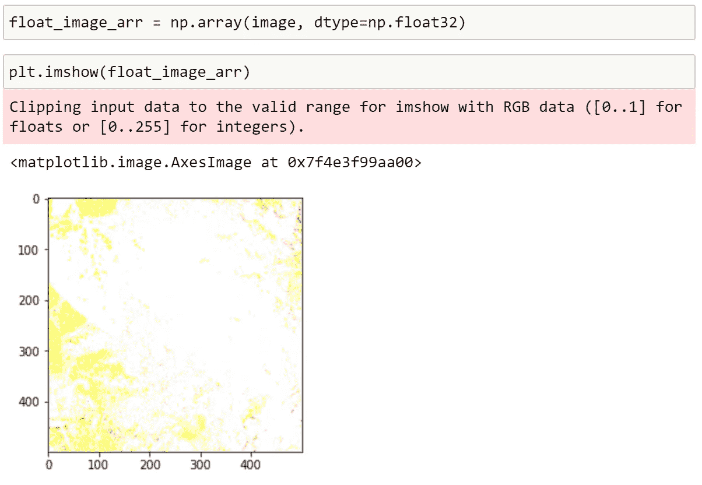

哦不！

从可以通过检查数据来确认的警告消息中，我们可以看到图像不能正确显示的原因，因为输入数据不在浮点表示的正确范围内。为了纠正这一点，让我们将数组中的每个元素除以 255；这应该确保每个元素都在范围[0，1]内。

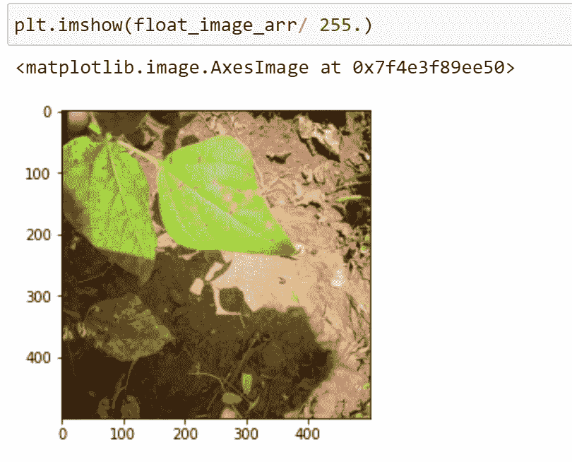

绘制我们的标准化数组，我们可以看到图像现在显示正确！

**了解成分强度**

通过调整每种成分的强度，我们可以使用 RGB 模型来表现各种颜色。

当每个分量的 0%强度被组合时，没有光产生，所以这产生了黑色(最暗的颜色)。

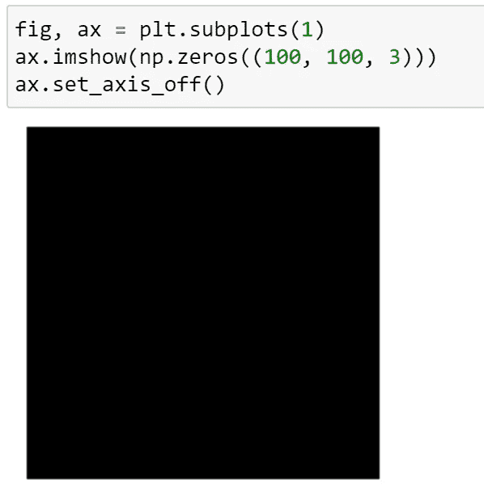

当所有成分的强度都相同时，结果是灰色的阴影，根据强度的大小而变暗或变亮。

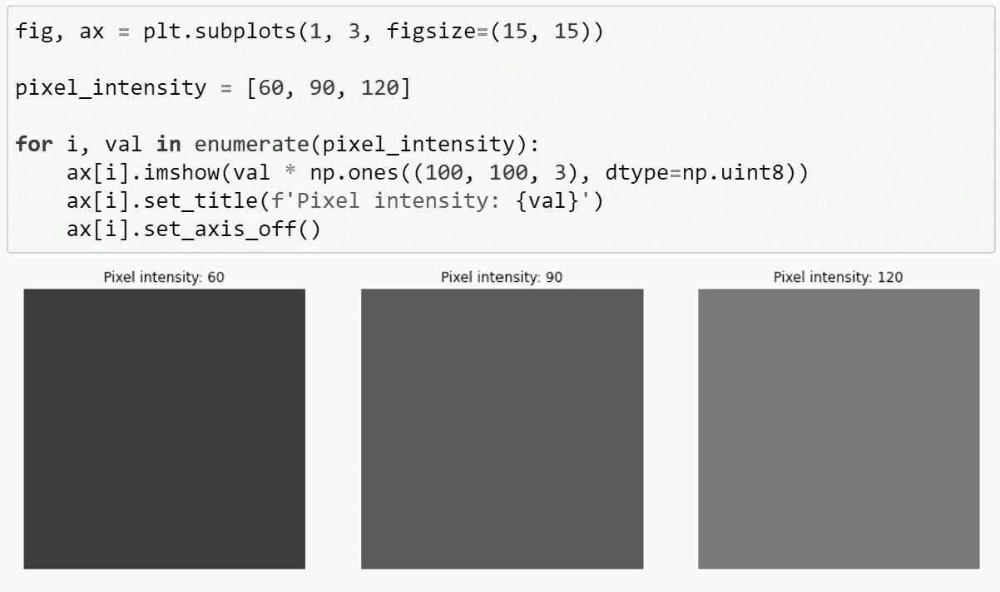

当其中一种成分的强度比其他成分强时，最终的颜色更接近具有最强成分的原色(红色、绿色或蓝色):

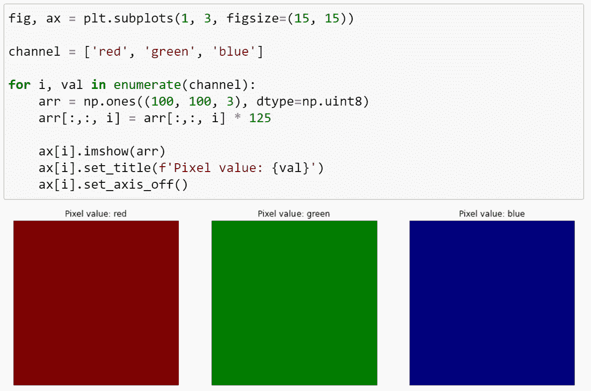

当每个成分的 100%强度被组合时，这产生白色(最浅的可能颜色)。


虽然这有望提供 RGB 图像的概述，但关于 RGB 颜色模型的更多细节可以在[这里](https://en.wikipedia.org/wiki/RGB_color_model)找到。

## 灰度图像

现在，我们已经研究了如何使用 RGB 颜色模型来表示彩色图像，让我们研究一下灰度图像与此有何不同。

灰度图像是一种简单的图像，其中仅有的颜色是不同的灰色阴影。虽然我们在日常对话中经常将这样的图像称为“黑白”，但真正的“黑白图像”将只由这两种不同的颜色组成，这种情况很少发生；使“灰度”成为更准确的术语。

由于灰度图像没有颜色信息表示，每个像素需要存储的信息更少，并且不需要加色模型！对于灰度图像，我们需要的唯一信息是代表每个像素强度的单一值；该值越高，灰色越浅。因此，灰度图像通常由一个通道组成，其中每个像素强度只是一个从 0 到 255 的单一数字。

为了进一步探索这一点，我们可以使用 PIL 将我们的图像转换成灰度，如下所示。

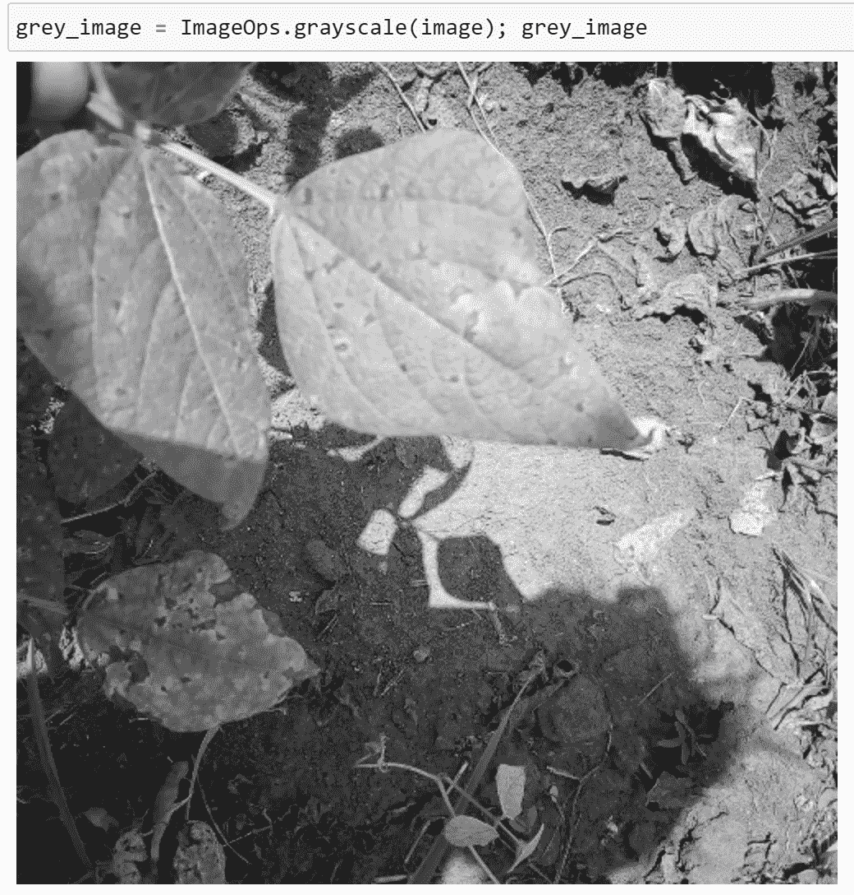

像以前一样，我们可以使用 PIL 检查模式和图像通道。

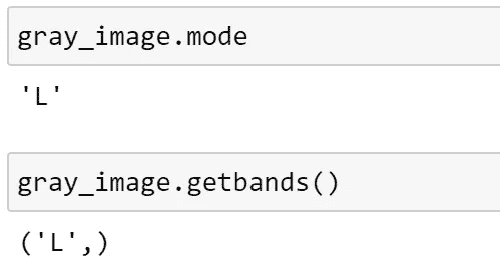

从 [PIL 的文档](https://pillow.readthedocs.io/en/latest/handbook/concepts.html#modes)中，我们可以看到`L`指的是单通道、灰度图像。同样，我们可以通过将该图像转换为数组并检查形状来确认这一点。

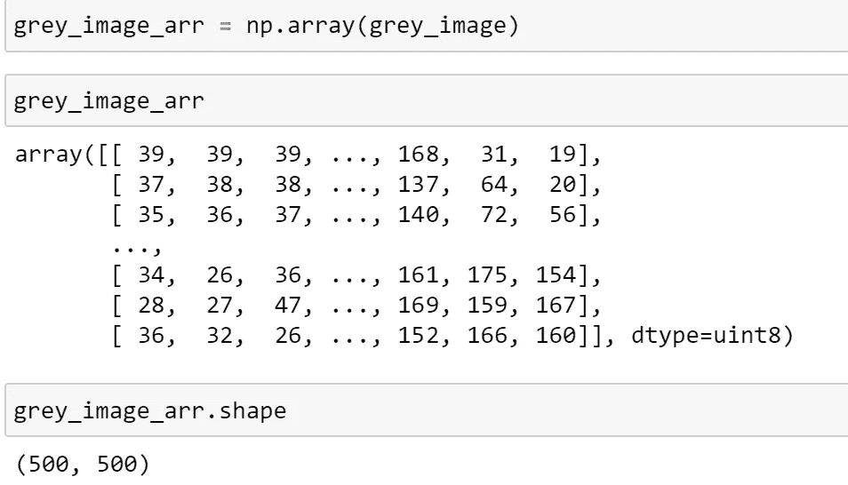

注意，因为我们只有一个通道，所以默认情况下通道维度被完全删除；这可能会给一些深度学习框架带来问题。我们可以使用 NumPy 的`expand_dims`函数显式添加通道轴。

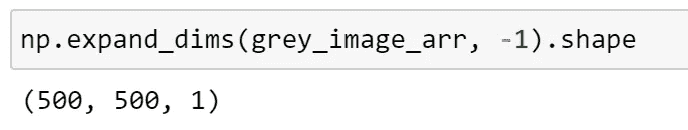

在 PyTorch 中，我们可以使用`unsqueeze`方法完成同样的事情，如下所示:

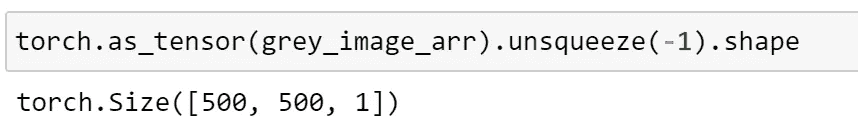

# 为什么这会影响预训练模型？

在观察了 RGB 和灰度图像之间的差异后，我们可能开始理解这些表示法是如何给模型带来问题的；尤其是如果该模型已经在图像数据集上进行了预训练，而该数据集的格式与我们当前训练的格式不同。

目前，大多数可用的预训练模型都是在 ImageNet 数据集的版本上训练的，该数据集包含 RGB 格式的彩色图像。因此，如果我们对灰度图像进行微调，我们提供给预训练模型的输入与之前遇到的任何输入都有很大不同！

在撰写本文时，卷积神经网络(CNN)是视觉任务最常用的预训练模型，我们将把重点限制在理解 CNN 如何受图像中通道数量的影响；其他架构超出了本文的范围！这里，我们假设熟悉 CNN，以及卷积是如何工作的——因为有[优秀的资源](https://github.com/fastai/fastbook/blob/master/13_convolutions.ipynb)详细介绍了这些主题——并关注改变输入通道的数量将如何影响这一过程。

就我们的目的而言，要记住的关键信息是，CNN 的核心构建模块是卷积层，我们可以将其视为应用一组滤波器(也称为内核)的过程，其中滤波器只是一个小矩阵，通常为 3×3，作为图像上的滑动窗口；在对结果求和之前执行逐元素乘法。在这里可以找到一个很好的工具来理解这是如何工作的[。](https://deeplizard.com/resource/pavq7noze2)

## 通道数量如何影响过滤器？

在深度学习之前的计算机视觉中，过滤器是出于某些目的而手工创建的，例如边缘检测、模糊化等。例如，让我们考虑一个用于检测水平线的手工制作的 3×3 滤波器:

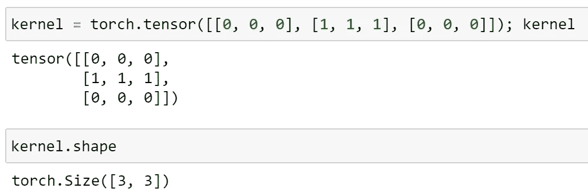

虽然在滑动窗口操作期间在整个图像上使用相同的滤波器“权重”,但是这些权重并不在通道之间共享；这意味着滤波器必须始终具有与输入相同数量的通道。因此，我们想要应用于 3 通道 RGB 图像的任何滤镜也必须有 3 个通道！过滤器拥有的通道数量有时被称为“深度”。

考虑到我们上面定义的水平线过滤器，为了将其应用于 3 通道图像，我们需要增加该过滤器的深度，使其为 3x3x3。由于我们希望每个通道具有相同的行为，在这种情况下，我们可以简单地沿通道轴复制 3×3 滤波器。

我们可以这样做，如下所示:

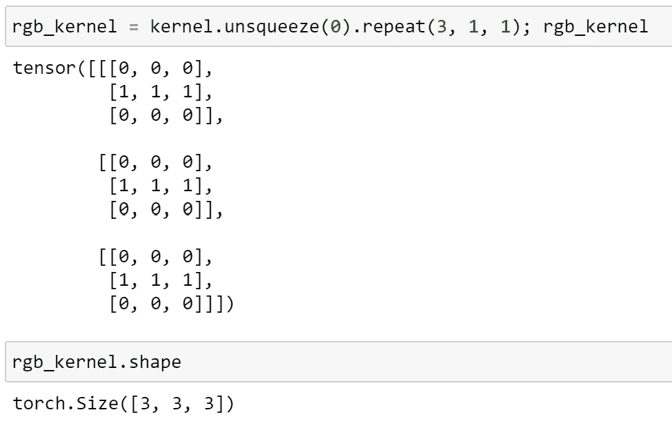

现在，过滤器的深度与通道的数量兼容，我们能够将此过滤器应用于 3 通道图像！

为此，对于每个通道，我们将图像的滑动窗口部分的元素乘以相应滤波器的元素；这将产生 3×3 矩阵，该矩阵表示对应于每个通道的当前滤波器位置的特征。这些矩阵然后可以被求和以获得我们的输出特征图的相应部分。

这个过程如下图所示:

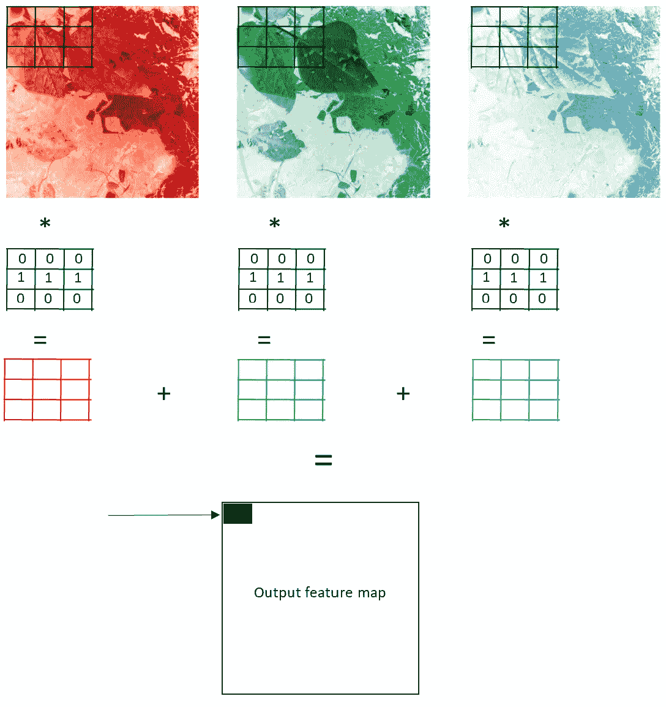

注意，特征图左上角的像素对应于内核中心像素的位置。由于我们无法计算图像每个边缘上最外层像素的完整卷积，这些像素将不会包含在特征图中。

我们可以重复这个过程，在图像上移动过滤器的位置，以获得完整的输出特征图。注意，不管输入图像的通道数是多少，当每个通道的特征被加在一起时，特征图将总是具有深度 1。

## 卷积神经网络

既然我们已经探讨了如何将手动定义的滤波器应用于 3 通道图像，此时，您可能想知道:CNN 是如何做到这一点的？

CNN 背后的一个关键思想是，这些过滤器可以随机初始化，而不是让专家手动定义过滤器，我们相信优化过程可以确保这些过滤器在训练期间学会检测有意义的特征；CNN 学习的过滤器类型的可视化[在这里](https://cs.nyu.edu/~fergus/papers/zeilerECCV2014.pdf)探讨。因此，除了这些过滤器是学习的而不是定义的，整体过程在很大程度上是相同的！

在 CNN 中，每个卷积层包含与将要学习的滤波器相对应的参数；初始化的随机过滤器的数量是我们可以指定的超参数。正如我们在上面的例子中看到的，每个滤波器都会产生一个单通道特征图，因此卷积层初始化的滤波器数量将决定输出通道的数量。

例如，假设我们有一个单通道图像，我们想创建一个学习单个 3×3 滤波器的卷积层。我们可以如下所示指定这一点:

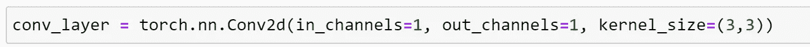

这里，我们希望滤波器的尺寸与我们之前定义的单通道水平线滤波器相同。让我们通过检查该层的“权重”属性来确认这一点:

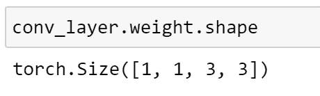

回想一下 PyTorch 默认情况下首先存储通道数，并注意到出于计算目的添加了一个批次维度，我们可以看到该层已经初始化了一个 3x3 过滤器，正如我们所预期的那样！

现在，让我们创建另一个卷积层，这一次指定我们有 3 个输入通道，以便能够处理 RGB 图像，并检查权重。

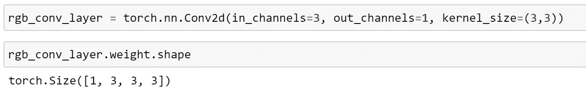

类似于当我们扩展我们手动定义的过滤器时，初始化的过滤器现在具有与输入通道的数量相同的深度；这给出了 3x3x3 的尺寸。

然而，当我们扩展手动定义的过滤器时，我们只是复制了相同的权重。这里，关键的区别是每个通道的 3×3 权重将是不同的；使得网络能够检测每个信道的不同特征。因此，每个内核根据输入图像的每个通道学习特定的特征！

我们可以通过直接检查重量来确认这一点，如下所示:

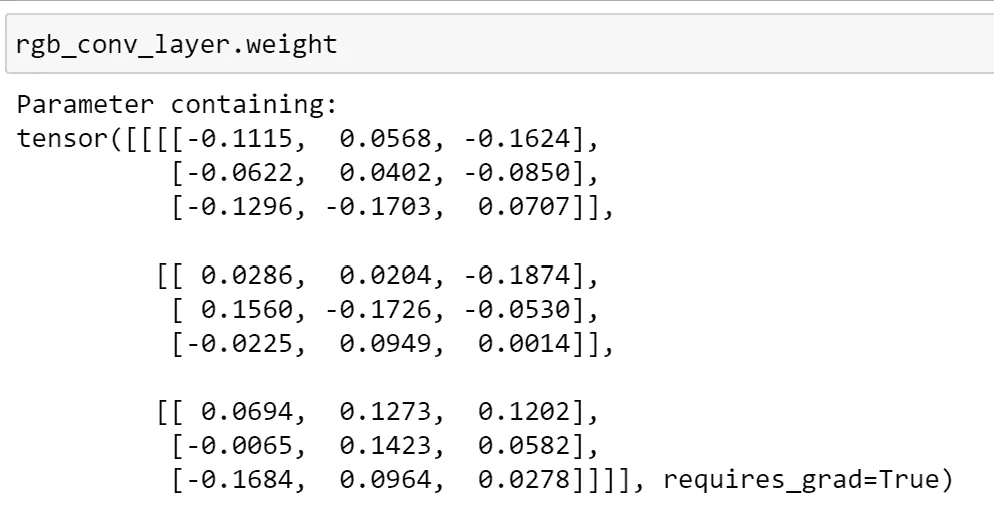

由此，我们可以看到，将应用于每个通道的 3×3 滤波器的权重是不同的。

虽然在创建新的卷积层时，基于我们的输入来调整初始化的滤波器维度是容易的，但是当我们开始考虑预训练的架构时，这变得更加困难。

作为一个例子，让我们检查一个来自 [PyTorch 图像模型(timm)库](https://github.com/rwightman/pytorch-image-models)的 [Resnet-RS50 模型](https://arxiv.org/pdf/2103.07579v1.pdf)的第一个卷积层，它已经在 ImageNet 上进行了预训练；如果你对 PyTorch 图像模型不熟悉，想了解更多，我[以前在这里](/getting-started-with-pytorch-image-models-timm-a-practitioners-guide-4e77b4bf9055?source=friends_link&sk=3c4f742ff07279e68652bc254ed0c6e5)探索过这个库的一些特性。

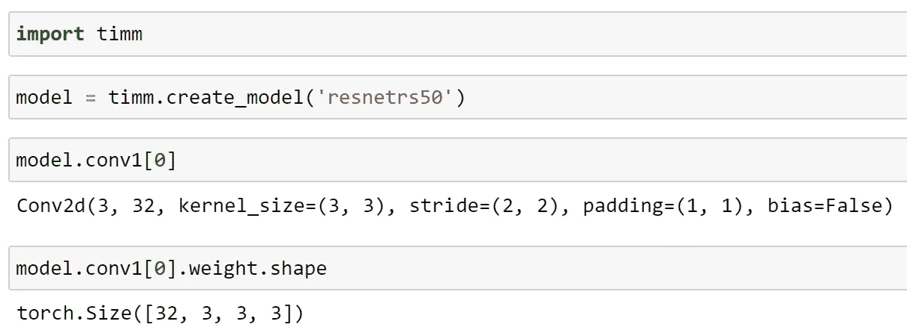

由于该模型是在 RGB 图像上训练的，我们可以看到每个滤波器都需要一个 3 通道输入。因此，如果我们试图用一个单一的通道在灰度图像上使用这个模型，这是行不通的，因为我们丢失了重要的信息；过滤器将试图检测不存在的频道中的特征！

此外，在我们之前的例子中，我们考虑了学习单个滤波器的卷积层；这在实践中很少发生。通常，我们希望每个卷积层有多个滤波器，这样每个滤波器都能够专门识别输入的不同特征。根据任务的不同，有些人可能学会检测水平边缘，有些人可能学会检测垂直边缘，等等。这些特征可以由后面的层进一步组合，使模型能够学习越来越复杂的特征表示。在这里，我们可以看到 ResNet-RS50 模型的卷积层有 32 个输出通道，这意味着它已经学习了 32 个不同的滤波器，每个滤波器都需要一个 3 通道输入！

# 如何在预训练模型中使用灰度图像

既然我们理解了为什么通道数量减少的灰度图像与在 RGB 图像上训练的预训练模型不兼容，那么让我们探索一些可以克服这一点的方法吧！

根据我的经验，有两种常用的主要方法:

*   向每个灰度图像添加附加通道
*   修改预训练网络的第一卷积层

在这里，我们将探索这两种方法。

## 向灰度图像添加附加通道

可以说，使用灰度图像和预训练模型的最简单的方法是根本避免修改模型；相反，复制现有的通道，使每个图像有 3 个通道。使用我们之前看到的相同的灰度图像，让我们来探索如何做到这一点。

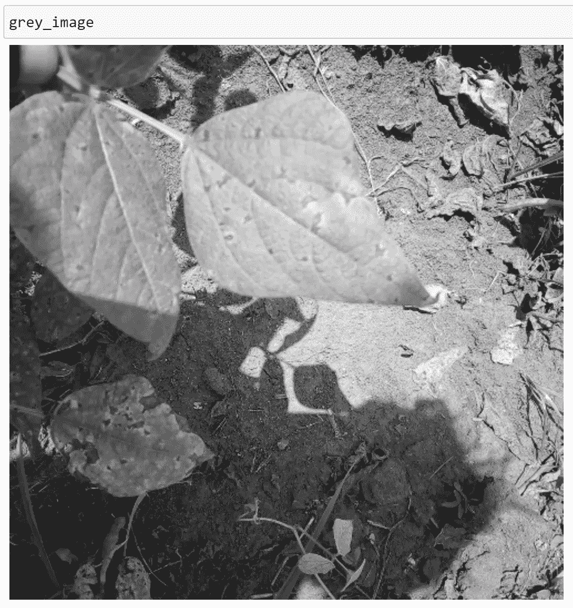

**使用 NumPy**

首先，我们需要将图像转换成一个 NumPy 数组:

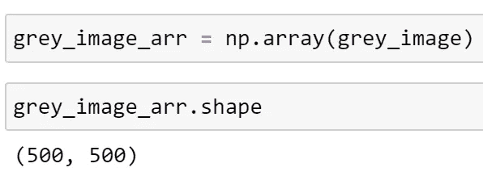

正如我们之前观察到的，因为我们的图像只有一个通道，所以通道轴还没有创建。同样，我们可以使用`expand_dims`函数来添加这个。

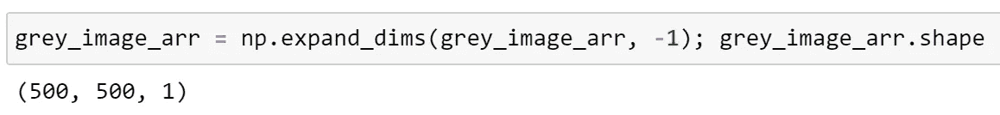

现在我们已经为渠道维度创建了一个额外的轴，我们需要做的就是在这个轴上重复我们的数据；为此我们可以使用`repeat`方法，如下所示。

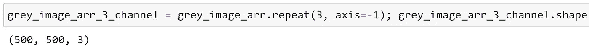

为了方便起见，让我们将这些步骤总结成一个函数，以便在需要时可以轻松地重复这个过程:

```
def expand_greyscale_image_channels(grey_pil_image):
    grey_image_arr = np.array(grey_image)
    grey_image_arr = np.expand_dims(grey_image_arr, -1)
    grey_image_arr_3_channel = grey_image_arr.repeat(3, axis=-1)
    return grey_image_arr_3_channel
```

将这个函数应用到我们的图像，并绘制输出，我们可以看到结果图像显示正确，虽然现在它有 3 个通道。

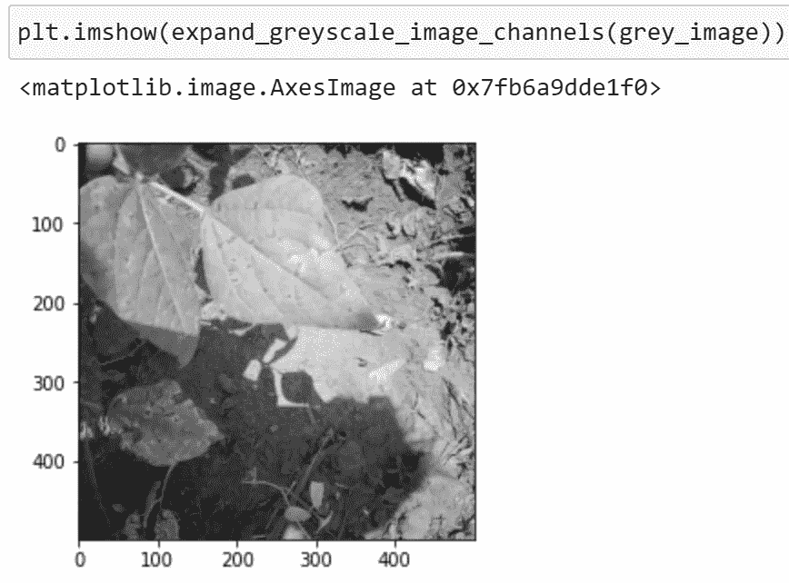

**使用 PyTorch**

如果我们做的是深度学习，那么探索如何直接使用 PyTorch 进行这种转换可能会更有用，而不是使用 NumPy 作为中介。虽然我们可以在 PyTorch 张量上执行与上述类似的一系列步骤，但作为训练过程的一部分，我们可能希望在我们的图像上执行额外的变换，如 TorchVision 中定义的数据扩充操作。因为我们希望 3 通道转换发生在我们的增强管道的开始，并且一些后续的转换可能期望 PIL 图像，所以直接操纵张量可能不是这里的最佳方法。

令人欣慰的是，虽然有些违反直觉，但我们可以使用 TorchVision 中现有的灰度转换来完成这一转换！虽然这种变换需要 torch 张量或 PIL 图像，但我们希望这是我们管道中的第一步，所以我们在这里使用 PIL 图像。

默认情况下，这种转换将 RGB 图像转换为单通道灰度图像，但是我们可以通过使用`num_output_channels`参数来修改这种行为，如下所示。

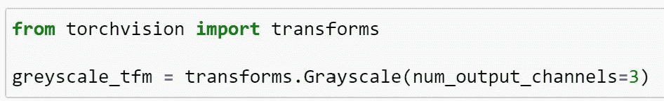

现在，让我们看看如果我们把这个变换应用到灰度图像上会发生什么。

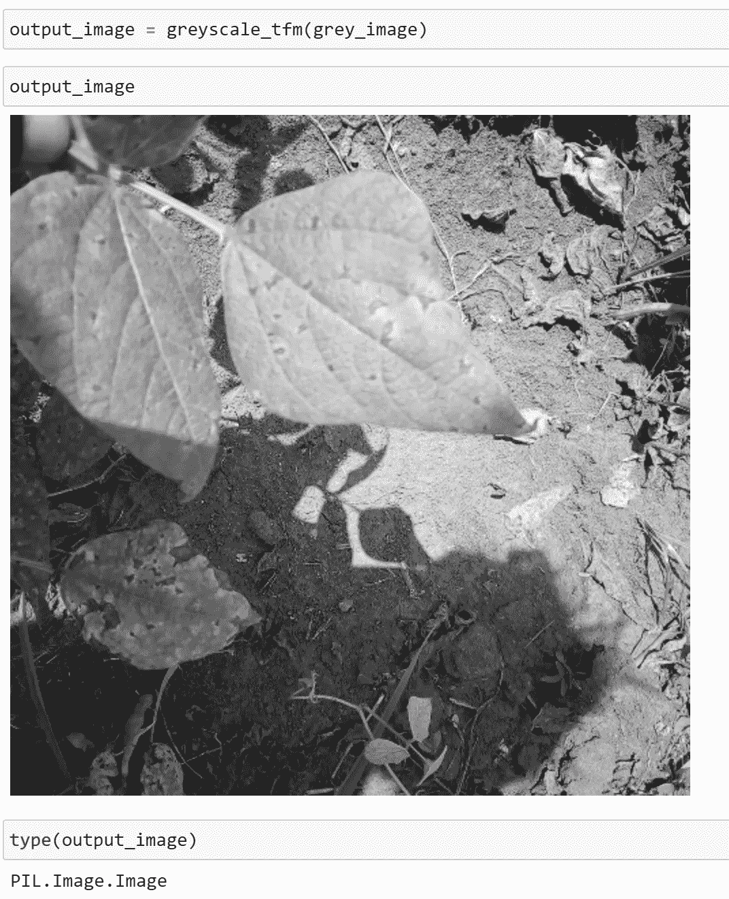

乍一看，虽然一切都变了，但看起来并不像。但是，我们可以通过检查 PIL 图像的通道和模式来确认转换已经按预期工作。

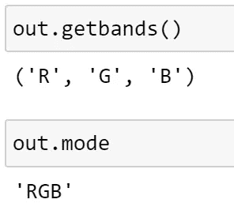

由于添加了额外的通道，我们可以看到 PIL 现在将该图像称为 RGB 图像；这正是我们想要的！

因此，通过这种方法，使用灰度图像的训练脚本所需的唯一修改是将该变换预先添加到增强管道中，如下所示。

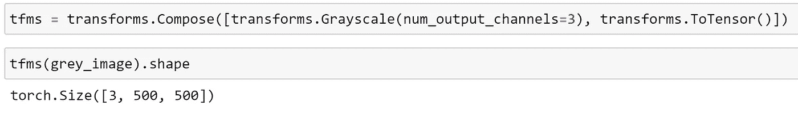

## 修改预训练网络的第一卷积层

虽然如上所述，将单个通道图像扩展到 3 个通道是方便的，但是这样做的潜在缺点是需要额外的资源来存储和处理额外的通道；在这种情况下没有提供任何新的信息！

一种不同的方法是修改模型以适应不同的输入，在大多数情况下，这需要修改第一卷积层。虽然我们可以用一个新的层来替换整个层，但这将意味着丢弃模型的一些学习到的权重，除非我们冻结后续层并孤立地训练新层，这需要额外的努力，否则来自这些新的、随机初始化的权重的输出可能会负面地扰乱一些后面的层。

或者，回想卷积层中的每个滤波器都有单独的通道，我们可以沿通道轴将这些通道相加。下面我们来探讨一下如何做到这一点。我们将再次使用 PyTorch 图像模型中的 Resnet-RS50 模型。

首先，让我们创建我们的预训练模型:

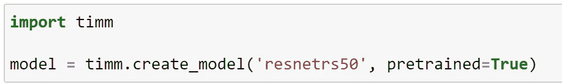

正如我们所料，根据我们之前对滤镜和通道的探索，如果我们试图在开箱即用的单通道图像上使用此模型，我们会观察到以下错误。

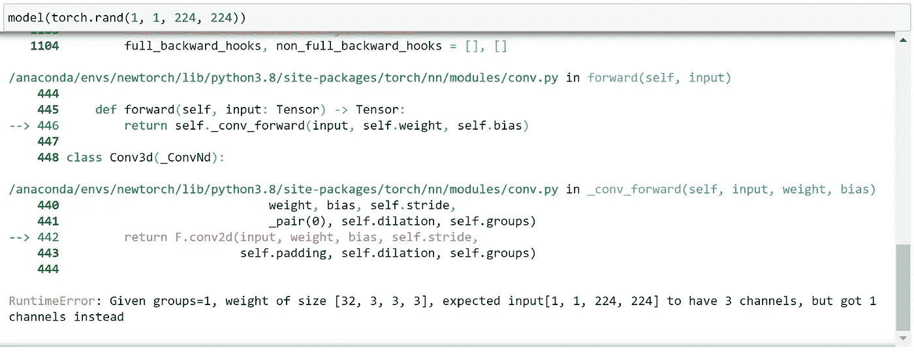

让我们通过调整第一个卷积层的权重来解决这个问题。对于该模型，我们可以如下所示进行访问，但这将因所用模型而异！

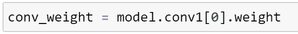

首先，让我们更新这个层的`in_channels`属性来反映我们的变化。这实际上不会修改权重，但是会更新打印模型时看到的概述，并确保我们能够正确地保存和加载模型。

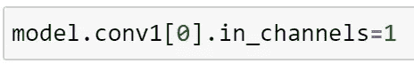

现在，让我们执行实际重量更新。我们可以使用`sum`方法做到这一点，确保将`keepdim`参数设置为`True`以保留维度。唯一需要注意的是，由于一个新的张量作为`sum`操作的结果被创建，我们必须将这个新的张量包装在`nn.Parameter`中；以便新的权重将被自动添加到模型的参数中。

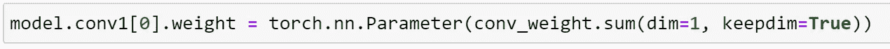

现在，使用单通道图像的模型，我们可以看到正确的形状已经返回！

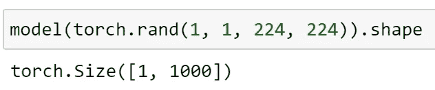

**使用 timm**

虽然我们可以在任何 PyTorch 模型上手动执行上述步骤，但 timm 已经包含了为我们执行这些步骤的功能！要以这种方式修改 timm 模型，我们可以在创建模型时使用`in_chans`参数，如下所示。

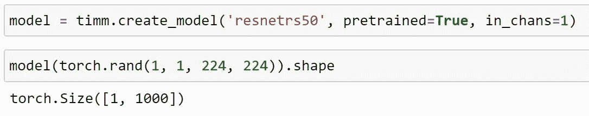

# 比较开源数据集上的性能

现在我们已经研究了两种方法，我们可以使用灰度图像与预训练的模型，你可能想知道使用哪一个；或者简单地在灰度图像上从头开始训练模型是否更好！

然而，由于可以使用的模型、优化器、调度器和训练策略的几乎无限的组合，以及数据集中的差异，为此确定通用规则是极其困难的；“最佳”方法可能会因您正在调查的特定任务而异！

尽管如此，为了大致了解这些方法的执行情况，我决定在三个开源数据集上训练我最喜欢的模型-优化器-调度器组合之一，以查看不同方法之间的比较。虽然改变培训政策可能会影响不同方法的表现，但为了简单起见，培训过程保持相对一致；基于我发现行之有效的实践。

## 实验设置

对于所有实验运行，以下保持一致:

*   **型号** : ResNet-RS50
*   **优化器** : AdamW
*   **LR 调度器**:余弦衰减
*   **数据扩充**:图像尺寸调整为 224，训练时使用了水平翻转
*   **初始 LR** : 0.001
*   **最大段数** : 60

所有训练都是使用单个 NVIDIA V100 GPU 进行的，批量大小为 32。为了处理训练循环，我使用了 [PyTorch 加速库](https://github.com/Chris-hughes10/pytorch-accelerated)。

使用的数据集有:

*   [**豆子**](https://github.com/AI-Lab-Makerere/ibean/) :豆子是用智能手机相机在田间拍摄的豆子图像数据集。它包括 3 个类别，2 个疾病类别和健康类别。
*   [**石头剪子布**](http://laurencemoroney.com/rock-paper-scissors-dataset) **(RPS)** :双手玩石头剪子布游戏的画面。
*   [**牛津宠物**](https://www.robots.ox.ac.uk/~vgg/data/pets/):37 类宠物数据集，每类大约有 200 张图片。

对于每个数据集，我探索了以下处理灰度图像的方法:

*   **RGB** :使用 RGB 图像作为基线，对模型进行微调。
*   **带有 3 个通道的灰度图像**:灰度图像被转换为 3 个通道的格式。
*   **灰度 w/ 1 通道**:模型的第一层被转换成接受单通道图像。

在与每种方法相关的地方，我使用了以下培训策略:

*   **Finetune** :使用预训练模型，首先训练模型的最后一层，然后解冻和训练整个模型。解冻后，学习率降低 10 倍。
*   **微调整个模型**:训练整个预训练模型，不冻结任何层。
*   **从零开始**:从零开始训练模型

下面提供了用于运行该实验的培训脚本，使用的包版本有:

*   PyTorch: 1.10.0
*   py torch-加速:0.1.22
*   timm: 0.5.4
*   火炬度量:0.7.1
*   熊猫

## 结果

这些运行的结果如下表所示。

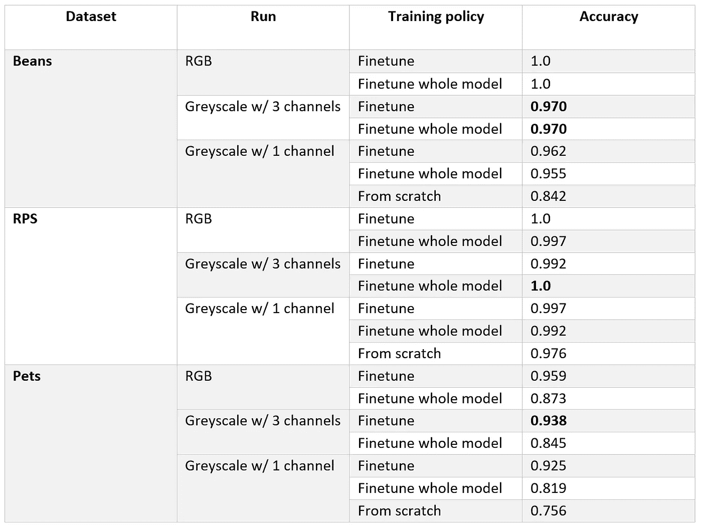

从这些实验中，我的主要观察结果是:

*   使用预先训练的模型，并使其适应灰度图像，似乎比从头开始训练更容易获得好的结果。
*   对这些数据集的最佳方法似乎是修改图像中的通道数，而不是修改模型。

# 结论

希望这已经提供了一个合理的全面概述如何微调灰度图像上的预训练模型，以及理解为什么需要额外的考虑。

*克里斯·休斯上了* [*领英*](http://www.linkedin.com/in/chris-hughes1/) *。*

# 参考

*   [ImageNet(image-net.org)](https://www.image-net.org/)
*   [RGB 颜色模型—维基百科](https://en.wikipedia.org/wiki/RGB_color_model)
*   [概念—枕头(PIL 叉)9.1.0.dev0 文档](https://pillow.readthedocs.io/en/latest/handbook/concepts.html#modes)
*   [fastbook/13 _ convolutions . ipynb at master fastai/fastbook(github.com)](https://github.com/fastai/fastbook/blob/master/13_convolutions.ipynb)
*   [深蜥蜴——卷积演示](https://deeplizard.com/resource/pavq7noze2)
*   [nyu.edu LNCS 8689——可视化和理解卷积网络](https://cs.nyu.edu/~fergus/papers/zeilerECCV2014.pdf)
*   [重访 ResNets:改进培训和扩展战略(arxiv.org)](https://arxiv.org/pdf/2103.07579v1.pdf)
*   [rwightman/py torch-image-models:py torch 图像模型、脚本、预训练权重 ResNet、ResNeXT、EfficientNet、EfficientNetV2、NFNet、Vision Transformer、MixNet、MobileNet-V3/V2、RegNet、DPN、CSPNet 等(github.com)](https://github.com/rwightman/pytorch-image-models)
*   【PyTorch 图像模型(timm)入门:实践者指南|克里斯·休斯| 2022 年 2 月|迈向数据科学
*   [Chris-Hughes 10/pytorch-accelerated:一个轻量级库，旨在通过提供一个最小但可扩展的训练循环来加速 py torch 模型的训练过程，该训练循环足够灵活，可以处理大多数用例，并且能够利用不同的硬件选项，而无需更改代码。文件:https://pytorch-accelerated.readthedocs.io/en/latest/(github.com)](https://github.com/Chris-hughes10/pytorch-accelerated)

## **使用的数据集**

*   bean 数据集，[AI-Lab-Makerere/ibean:AIR Lab 的 ibean 项目的数据报告。](https://github.com/AI-Lab-Makerere/ibean/)(github.com)。麻省理工学院许可，无限制使用。
*   石头、剪子、布数据集，劳伦斯·莫罗尼[机器学习数据集——劳伦斯·莫罗尼——人工智能家伙。](https://laurencemoroney.com/datasets.html) CC By 2.0 许可证，可自由共享并适用于所有用途，包括商业或非商业用途
*   牛津 Pets 数据集，[牛津大学视觉几何组](https://www.robots.ox.ac.uk/~vgg/data/pets/)。[知识共享署名-共享 4.0 国际许可](https://creativecommons.org/licenses/by-sa/4.0/)，包括商业和研究目的。