# 一维信号的迁移学习

> 原文：<https://towardsdatascience.com/transfer-learning-with-a-one-dimensional-signal-76a0d543e9aa>

## 加上数据洞察力


图片作者。

## 目录

> ——[简介](#dfab)
> ——[信号统计](#16cd)
> ——[获取双谱图像](#59b9)
> ——[载荷图像](#cdef)
> ——[创建模型](#9f93)
> ——[训练并评估](#74bc)
> ——[损耗和精度度量](#7e17)
> ——[数据洞察](#dc27)
> ——[结论](#7814)

# 介绍

迁移学习重用为旧任务建立的模型作为新任务的起点。模型参数被冻结—对旧任务的训练已经完成。VGG16 就是这样一个训练有素的模型。这是一个卷积神经网络(CNN)对图像进行分类。它赢得了 2014 年 ImageNet 挑战赛。

我们稍微修改 VGG16，使其成为新图像的有效分类器。模型重用大大降低了培训时间和成本。这就是迁移学习的神奇之处。

我们的数据集是从一维信号产生的图像。一维信号是一条侧向弯曲的线。信号幅度随时间上下移动。

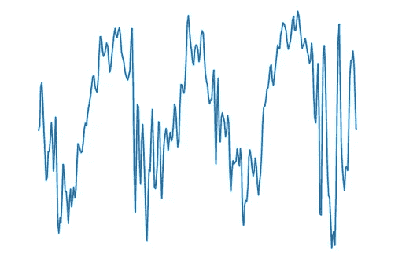

信号幅度随时间的变化。信号是一维，时间是二维。

图像是从振动信号中提取的[双谱](https://medium.com/@mackiej/fourier-and-bispectral-analysis-of-signals-c7a71021b1c8)图像。每个都是从 4，095 (2 -1)个数据点段构建的。

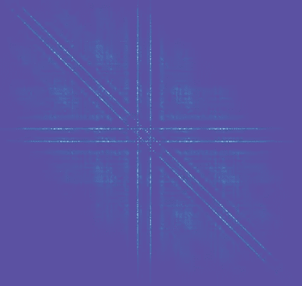

显示泵气蚀的双谱图像。

振动信号是以 16，000 Hz 采样的泵加速计数据。工程师记录了三种取样条件。通过透明的泵壳[ [1](#b35f) ]观察每种情况。

**三个信号:**

1.  **无气蚀** (nc) —泵正常运行
2.  **低汽蚀**【LC】**—小气泡云**
3.  ****产生气蚀**(直流)——大团气泡**

****

**以 16000Hz 采样的泵加速计信号。从上到下，条件为无气蚀、低气蚀和发展气蚀。**

## **信号统计**

**每个加速度计信号有 800，001 个数据点(16，000 Hz 时为 50 秒)。每个的平均振幅为零。**

**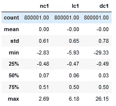**

**熊猫统计无/低/发展空化信号。**

**这三个条件的配对图显示它们之间几乎没有相关性。在这个样本中，发展的空化(dc1)状态看起来是高斯型的。我们稍后再讨论这个问题的重要性。**

**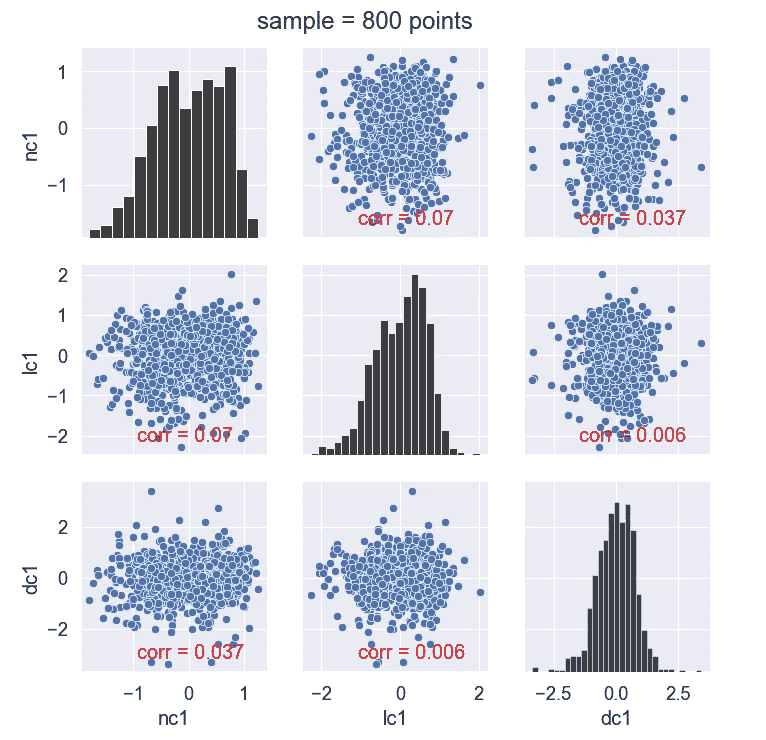**

**图片作者。( [GitHub 要诀](https://gist.github.com/jkmackie/2a5e455fd8072ccc81daeeee1eb6f18a))**

## **获取双谱图像**

**图像和信号保存在这个 [GitHub repo](https://github.com/jkmackie/transfer_learning_VGG16) 中。要自己创建图像，请遵循以下方法:**

1.  **使用`joblib.load(‘signals.joblib’)`加载每个信号的熊猫数据帧:nc1 和 dc1。将信号分割成不重叠的 4，095 个点段。使用这种技术，一个 800，000 点的信号有 195 个图像。**
2.  **作者的双谱代码(下面的双谱 2D)从信号段`y` [ [2](#01cb) ]创建双谱图像。在第 104 行实例化 Bispectrum2D。使用`freqsample=16,000`和`window_name=’hanning’`。Hanning 是用于未知信号的常用窗口。要绘制图像，请使用`bs2D.plot_bispec_magnitude()`。**
3.  **保存每个图像。我强烈建议在每个文件名中保存索引。这使得将来分离测试图像变得容易。`plt.savefig(f’./images/{feature_name}_hanning_{start_idx}-{end_idx}.png’)`**
4.  **[将](https://gist.github.com/jkmackie/70ada8c662e3dd7a2b0da05ca3d05c1f)图像格式化为 224x224 像素。这是 VGG16 所需的尺寸。**
5.  **使用 VGG16 **预处理 _ 输入**库:**

**`from tensorflow.keras.applications.vgg16 import preprocess_input`**

**它将图像从 RGB 转换到 BGR。此外，“每个颜色通道相对于 ImageNet 数据集以零为中心，没有缩放。”**

> ****双谱 2D Python 数据类:****

**从 1D 信号产生 2D 双谱图像。作者的 Python 数据类。( [GitHub](https://gist.github.com/jkmackie/388344f86e29c4841077f74a95bad6df) )**

*****关于双谱的旁注 2D:*** *计算是一个独立的实现——不需要 Python 类继承接触点，也不需要术语翻译。作者将两个 Python 类重构为一个 dataclass。双谱 2D 自动从采样频率产生频率范围。***

## **加载图像**

**每个图像类都有一个文件夹。“训练”文件夹已标记了用于训练模型的图像。有效用于培训期间的模型调整和度量。测试(又名维持)是看不见的图像，以验证模型的普遍性。我们将进行以下二进制分类场景:无空化与直接空化[ [3](#e63b) ]。**

**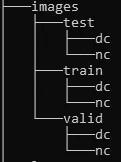**

**文件夹结构:nc =无气蚀；dc =直接空化。由于担心数据泄漏，作者选择将有效文件夹与列车文件夹分开。Tensorflow API 可以动态地将训练分成训练和验证数据。**

**从 [GitHub repo](https://github.com/jkmackie/transfer_learning_VGG16) 下载图像数据集。参见用 Python 编写的迁移学习 Jupyter 笔记本。**

**我们如何为图像建模？TensorFlow 2 是图像模型的软件工具。**

**在张量流中创建图像数据集。详情如下。有 210 幅训练图像和 60 幅验证图像。每个中的图像都是互斥的。此外，验证图像在时间上在训练图像之后(信号是时间序列)。**

> **用于模型拟合的图像数据集:**

**加载 VGG16。获取并可视化数据。**

**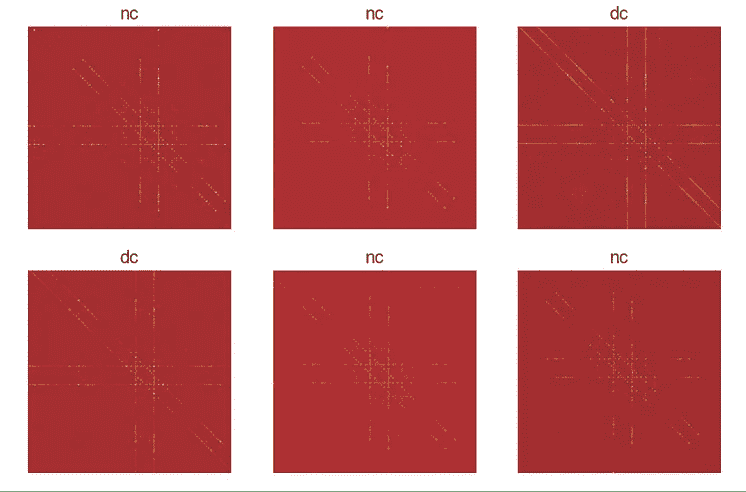**

**从 RGB 到 BGR 的 VGG16 特定预处理后的双谱图像。**

## **创建模型**

**让我们回顾一下数据集结构。它将如何与 VGG16 配合使用？**

**我们一批选择 32 张图片。这些图像是 224 X 224 的。3 表示红色、绿色和蓝色(RGB)通道。**

```
1 train class names: ['dc', 'nc']
2 val class names: ['dc', 'nc']
3 images, xpixels, ypixels, color_channels: (32, 224, 224, 3)
4 labels: (32,)
```

**在下面的第 3 行，我们初始化 VGG16。它有将近 1500 万个参数。它们被设置为不可训练，因此被冻结。此外，最后几个分类层被排除:include_top = False。**

```
Model: "vgg16"
_________________________________________________________________
 Layer (type)                Output Shape              Param #   
=================================================================
 input_5 (InputLayer)        [(None, 224, 224, 3)]     0         

 block1_conv1 (Conv2D)       (None, 224, 224, 64)      1792      

 block1_conv2 (Conv2D)       (None, 224, 224, 64)      36928     

 block1_pool (MaxPooling2D)  (None, 112, 112, 64)      0         

 block2_conv1 (Conv2D)       (None, 112, 112, 128)     73856     

 block2_conv2 (Conv2D)       (None, 112, 112, 128)     147584    

 block2_pool (MaxPooling2D)  (None, 56, 56, 128)       0         

 block3_conv1 (Conv2D)       (None, 56, 56, 256)       295168    

 block3_conv2 (Conv2D)       (None, 56, 56, 256)       590080    

 block3_conv3 (Conv2D)       (None, 56, 56, 256)       590080    

 block3_pool (MaxPooling2D)  (None, 28, 28, 256)       0         

 block4_conv1 (Conv2D)       (None, 28, 28, 512)       1180160   

 block4_conv2 (Conv2D)       (None, 28, 28, 512)       2359808   

 block4_conv3 (Conv2D)       (None, 28, 28, 512)       2359808   

 block4_pool (MaxPooling2D)  (None, 14, 14, 512)       0         

 block5_conv1 (Conv2D)       (None, 14, 14, 512)       2359808   

 block5_conv2 (Conv2D)       (None, 14, 14, 512)       2359808   

 block5_conv3 (Conv2D)       (None, 14, 14, 512)       2359808   

 block5_pool (MaxPooling2D)  (None, 7, 7, 512)         0         

=================================================================
Total params: 14,714,688
Trainable params: 0
Non-trainable params: 14,714,688
_________________________________________________________________
```

**VGG16 就是我们的`base_model`。现在插入最后几个分类层(下面的第 4–7 行和第 12–15 行)。一如既往，选择神经网络层的大小更多的是艺术而不是科学。这可能需要反复试验。好消息是起点是一个令人敬畏的`base_model`。**

> **带有分类层的模型层:**

```
Model: "sequential"
_________________________________________________________________
 Layer (type)                Output Shape              Param #   
=================================================================
 vgg16 (Functional)          (None, 7, 7, 512)         14714688  

 flatten (Flatten)           (None, 25088)             0         

 dense (Dense)               (None, 10)                250890    

 dropout (Dropout)           (None, 10)                0         

 dense_1 (Dense)             (None, 1)                 11        

=================================================================
Total params: 14,965,589
Trainable params: 250,901
Non-trainable params: 14,714,688
_________________________________________________________________
```

**注意，我们在模型中添加了 25 万个**可训练参数**。因为所有的 VGG16 参数都被冻结，所以之前为零。**

## **培训和评估**

**我们建立了模型。现在设置培训流程。编译模型(下面的第 2 行)。使用自定义回调记录指标(第 8–30 行)。模型被拟合(第 33 行)。**

**下面的代码加载 test_ds —测试数据集。**

**评估测试(也称为保持)数据。**

**测试图像评估 100%准确(*通常——结果是随机的*)。只使用了三个时期的训练。这就是迁移学习的神奇之处。**

## **损失和准确性指标**

**在左下图的第一个时期之后，训练损失下降到接近零。注意在一个时期后，训练损失比确认损失高得多。是否存在与原始时序信号相关的数据泄漏？**

**每个文件夹都是独立的(是不是**而不是**使用 TensorFlow API 来拆分验证图像)。此外，训练、验证和测试数据是时间分离的。所以训练数据在时间线上先于验证数据。并且验证数据在测试数据之前。**

**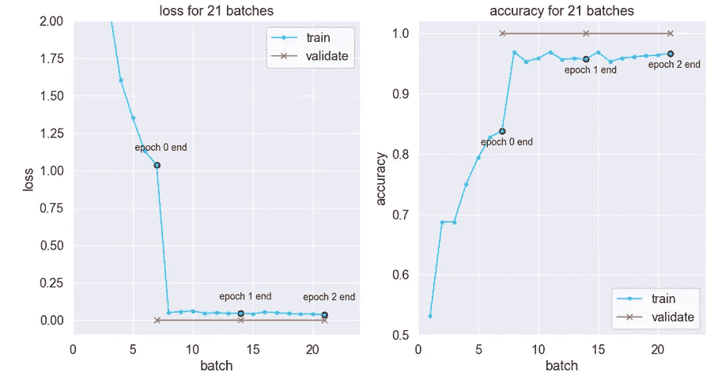**

**作者的模型损失和准确性。压差设置为 0.3。**

**根据 Keras 开发人员的说法，辍学可能导致培训损失高于“测试”(验证)损失。完整的解释是[这里](https://keras.io/getting_started/faq/#why-is-my-training-loss-much-higher-than-my-testing-loss)。下面，培训和验证之间的差距通过消除辍学而缩小。**

**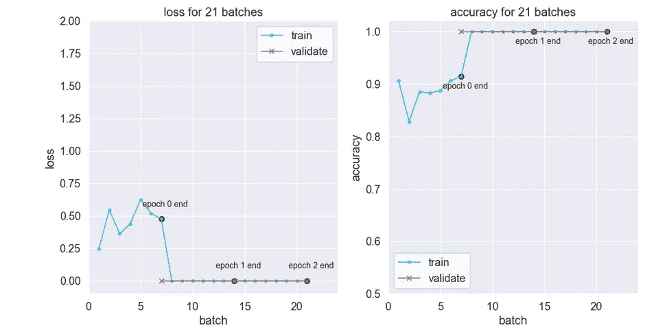**

**鞋底脱落已移除。**

**尽管有非典型的度量曲线，但模型是一般化的。事实上，不管有没有辍学，测试预测都是 100%准确的。**

**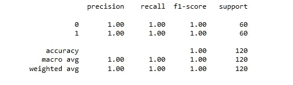**

**测试数据度量(`[sklearn.metrics](https://scikit-learn.org/stable/modules/generated/sklearn.metrics.classification_report.html)` [)。分类 _ 报告](https://scikit-learn.org/stable/modules/generated/sklearn.metrics.classification_report.html)**

**这个任务需要这么大的 CNN 模型吗？大概不会吧！CNN 似乎过度参数化了。的确，谷歌大脑研究称，一个简单的带`**num_weights = 2 * *n*_samples + *d*_dimensions**`的两层神经网络可以表示任何函数[ [4](#3645) ]。**

## **数据洞察**

**我们建立了一个有效的二元分类模型，有近 1500 万个参数。工作做得好吗？我们是否正确地探索和理解了信号数据？**

**是时候重新查看**信号统计**部分的 800 点随机样本直方图了。回想一下产生的空化信号看上去是高斯型的。**

**我们用更多的数据点做直方图吧。下面的 **nc** 信号看起来是 8000 点和 80000 点样本的双峰。相比之下， **dc** 信号是单峰高斯曲线。**

**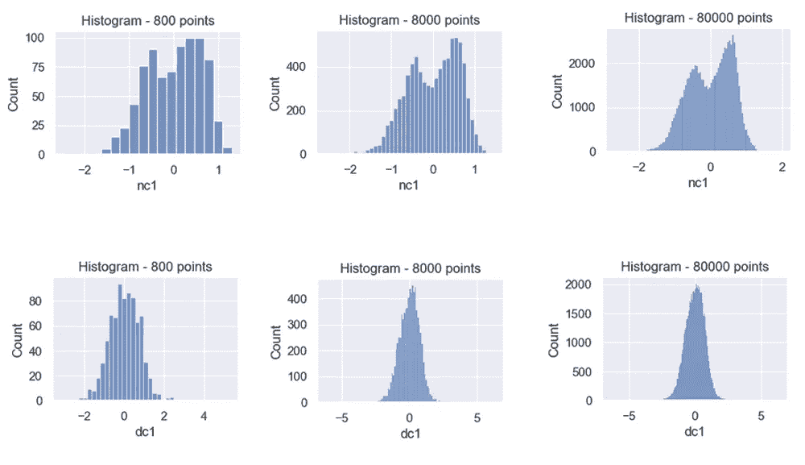**

**信号直方图。顶行—无气穴现象。底排—形成气穴。**

**可能二进制分类就是驼峰计数，不需要深度学习！两个峰值表示没有气蚀，一个峰值表示气蚀。**

**为了计算峰值，我们需要(1)平滑信号和(2)计算局部最大值。通过[核密度估计](https://scikit-learn.org/stable/modules/generated/sklearn.neighbors.KernelDensity.html)，波动信号转换为平滑曲线。SciPy 有一个`find_peaks`函数来计算信号的局部最大值。**

```
from scipy.signal import find_peaks
peaks_num = len(find_peaks(y_kde, height=0.2)[0])
```

**通过将信号分段来计算峰值。同样，我们预计无气穴现象有两个峰值，而发展气穴现象有一个峰值。**

**首先测试 800 个点段峰值。也就是说，每个信号有 1000 个独立段`(800*1,000=800,000)`。结果是几百个错误。糟糕的结果。**

**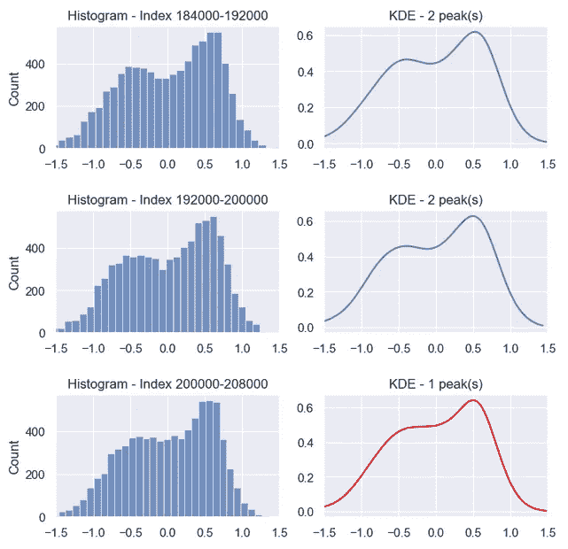**

**峰值计数无气蚀的 KDE。指数显示了 8000 点的区间。100 个片段中的单个错误在上面以红色显示。**

**直方图显示了**8000 点**段的更清晰的峰值。事实证明，增加数据点可以提高准确性。除一个区段外，所有区段都有正确的峰数，准确率为 99.5%。这是一大进步。所有需要的是一个更大的样本和曲线平滑[ [5](#9d57) ]。**

```
**8,000 point segments:**
* no cavitation - 100 segments
* developed cavitation - 100 segments
* total segments - 200 segmentsaccuracy = 99.5% **=** (200 segments - 1 error) / 200 segments * 100
```

# **结论**

**本项目使用了两种情况下加速度计信号的图像:*无空化*和*产生空化*。我们使用一个拥有近 1500 万个参数的卷积神经网络对图像进行分类。其中，25 万只受过抓痒训练，大约 1400 万只被冷冻。**

**CNN 对于二元分类是有效的。但是，有一个更简单的选择。没有图像和没有大模型是必需的。数峰就行了。**

****后记****

**对于寻找更多双谱分析的读者，我写了[信号的傅立叶和双谱分析](https://medium.com/@mackiej/fourier-and-bispectral-analysis-of-signals-c7a71021b1c8)。**

**除非另有说明，所有图片均由作者提供。祝你愉快！😎**

```
**REFERENCES**[1] Ali Hajnayeb, "[Cavitation Analysis in Centrifugal Pumps Based on Vibration Bispectrum and Transfer Learning](https://www.researchgate.net/journal/Shock-and-Vibration-1875-9203/publication/356754152_Cavitation_Analysis_in_Centrifugal_Pumps_Based_on_Vibration_Bispectrum_and_Transfer_Learning/links/61aa54b8aade5b1bf5ffe596/Cavitation-Analysis-in-Centrifugal-Pumps-Based-on-Vibration-Bispectrum-and-Transfer-Learning.pdf)", 2021\. Hajnayeb Accelerometer Dataset:  [nc](https://www.researchgate.net/publication/308415702_No_Cavitation1), [lc](https://www.researchgate.net/publication/308415892_Limited_Cavitation1), [dc](https://www.researchgate.net/publication/308415784_Developed_Cavitation1)[2] Matteo Bachetti, et al., stingray v1.0 code, [https://docs.stingray.science](https://docs.stingray.science/), 2022.[3] Multi-class classification is successful with bispectrum images as per [1].  The neuron count in the final layer increases--one per class.  The author chose binary classification to highlight a classification alternative.[4] Chiyuan Zhang, et al., [Understanding Deep Learning Requires Rethinking Generalization](https://arxiv.org/pdf/1611.03530.pdf), 2017.[5] Test overlapping time segments to get more confident peak counting works.  Increase the number of segments per signal from 100 to 800\. Slide the segment window in 1,000 point steps rather 8,000 point steps. The result is two errors total (for both nc and dc).  See nc1 indices 199000-207000 and 200000-208000\.  1598 correct out of 1600 is 99.875% accuracy, i.e.  (1600-2)/1600*100\.  This is better accuracy than the fewer segments per signal scenario. [GO TO TABLE OF CONTENTS](#f386)
```