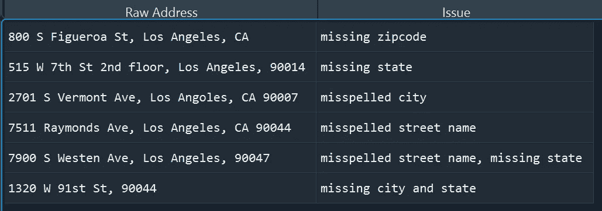
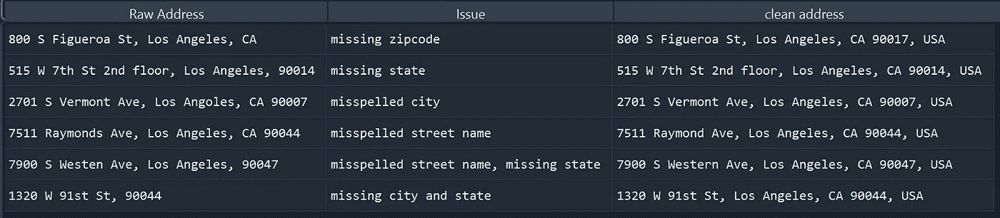
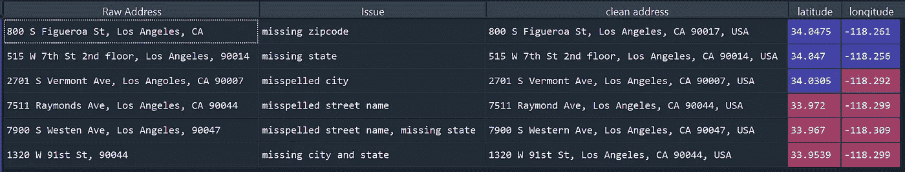

# 使用 Geopy 和 Python 轻松清理杂乱的地址数据

> 原文：<https://towardsdatascience.com/transform-messy-address-into-clean-data-effortlessly-using-geopy-and-python-d3f726461225>

# 使用 Geopy 和 Python 轻松清理杂乱的地址数据

## 处理缺少邮政编码、缺少州、拼错街道名称、拼错城市名称的地址


作者图片

# 背景

你以前在你的数据科学项目中处理过杂乱的地址数据吗？如果是这样，您可能会注意到可能有许多种转录错误，例如，缺少邮政编码、缺少州、拼错的街道名称、拼错的城市名称以及数据中不同种类的缩写。如果您需要清理和标准化这些原始地址数据，这很快就会变成一场噩梦。

在这篇文章中，我想分享一种替代方法来清理杂乱的地址数据，这种方法可以省去您的麻烦，让您有更多的时间和精力来开发令人敬畏的机器学习模型。

# 原始地址数据的常见问题

首先，让我们创建一个样本数据集。在这个数据集中，我们有带有常见转录错误的原始地址，例如，**缺少邮政编码，缺少州，拼错街道名称，拼错城市名称，或者一个地址数据点**中的多个错误。

```
import pandas as pdmessy_address = pd.read_excel("messy address.xlsx")
```



作者创建的图像

# 地质公园

清理原始地址数据的目标是获得标准化格式的地址信息，其中包含完整的地理信息，例如街道名称、街道名称、城市、州和邮政编码。

为了实现这一点，我们将使用`[geopy](https://geopy.readthedocs.io/en/stable/)`，这是一个 Python 库，允许用户访问几个**流行的地理编码 web 服务**，如谷歌地图、必应地图、MapQuest、百度等等。

这个想法很简单。当您在上述地理编码 web 服务之一中手动搜索地址时，您可能并不总是输入完整的地址信息。很可能你会在打字中出现拼写错误，这与原始地址数据中的抄写错误非常相似。通常，这些地理编码 web 服务足够智能，能够理解您的意思，并从其服务器以干净的格式返回匹配的地址。

使用`[geopy](https://geopy.readthedocs.io/en/stable/)`，我们可以通过无缝地将原始地址传递给这些地理编码 web 服务来输出干净的地址数据。

# 安装库

```
pip install geopy
```

# 初始地理编码服务 API

正如我上面提到的，有许多地理编码 API 可用。可以使用免费 API，比如， **OpenStreetMap** 或者付费 API，比如， **Google Maps。这完全取决于你将如何部署你的程序。你会得到你所付出的。如果只是为了你自己喜欢的项目，一个免费的 API 可能会很好。如果您将部署用于商业目的，您应该考虑付费 API，因为您可以扩展每日 API 配额限制。**

```
# **OpenStreetMap Free API**
from geopy.geocoders import Nominatim
geolocator = Nominatim(user_agent="[Y](mailto:aaron_clover@hotmail.com)our Email")# **Google Maps Paid API**
from geopy.geocoders import GoogleV3
geolocator = GoogleV3(api_key='Your Google Maps API Key')
```

为了使用谷歌地图 API，我们需要一个谷歌地图 API。但是不用担心。你可以按照这个 [**快速教程**](https://yoast.com/help/generate-set-google-maps-api-key/) 为**免费**生成自己的谷歌地图 API 密匙。

您自己的 Google API 键看起来类似于“aizaybdj 88 HN 7 ltgkhhk 5 wh fav 8 a 5 ozl x2e _ k”。你可以复制并保存这个 API 密匙到你电脑的某个地方。

初始化地理编码服务 API 后，编码就很简单了。您可能想要创建自己的函数来从 API 中提取干净的地址。

如果你想批量处理原始地址，你可以使用 Pandas 库的 lambda 函数。

```
def extract_clean_address(address):
    try:
        location = geolocator.geocode(address)
        return location.address
    except:
        return ''messy_address['clean address'] = messy_address.apply(lambda x: extract_clean_address(x['Raw Address']) , axis =1  )
```

正如您从下面看到的，从 Google Maps API 返回的干净地址看起来比原始地址更干净、更完整。



作者创建的图像

# 从原始地址中提取经度和纬度

使用`[geopy](https://geopy.readthedocs.io/en/stable/)`可以对原始地址做更多的事情。例如，您可以从地理编码 web APIs 中提取经度和纬度。

```
def extract_lat_long(address):
    try:
        location = geolocator.geocode(address)
        return [location.latitude, location.longitude]
    except:
        return ''messy_address['lat_long'] = messy_address.apply(lambda x: extract_lat_long(x['Raw Address']) , axis =1)
messy_address['latitude'] = messy_address.apply(lambda x: x['lat_long'][0] if x['lat_long'] != '' else '', axis =1)
messy_address['longitude'] = messy_address.apply(lambda x: x['lat_long'][1] if x['lat_long'] != '' else '', axis =1)
messy_address.drop(columns = ['lat_long'], inplace = True)
```



作者创建的图像

# 最后一个音符

除了提取干净的地址和地理坐标，我们还可以使用`[geopy](https://geopy.readthedocs.io/en/stable/)` 来计算两个地址点之间的地理距离和行驶时间。但是请记住，其中一些地理编码 web 服务是付费服务。您可能会有一些免费的日常请求，但是在使用它们之前，您应该检查它们的政策和价格。

# 感谢您的阅读！！！

如果你喜欢这篇文章，并且想**请我喝杯咖啡，**请[点击这里](https://ko-fi.com/aaronzhu)。

您可以注册一个 [**会员**](https://aaron-zhu.medium.com/membership) 来解锁我的文章的全部访问权限，并且可以无限制地访问介质上的所有内容。如果你想在我发表新文章时收到电子邮件通知，请订阅 。