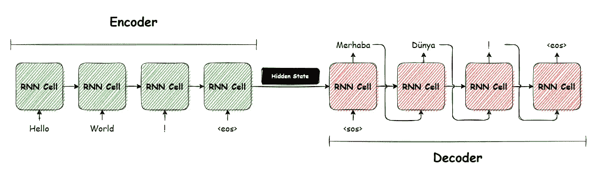
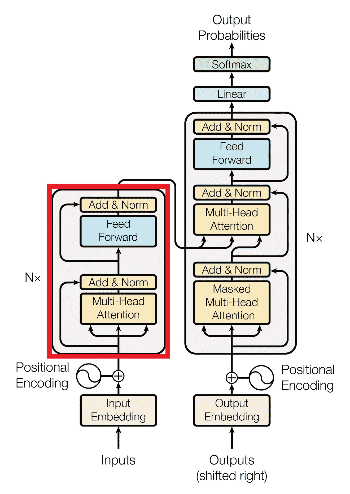
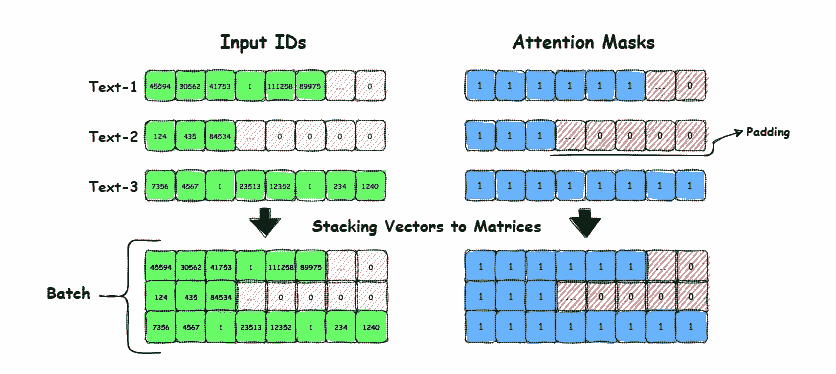
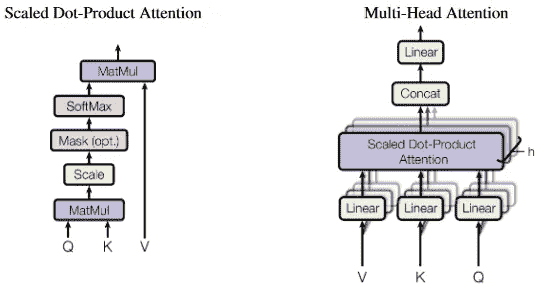
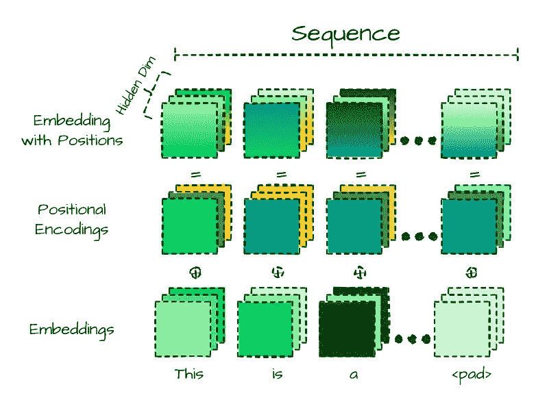
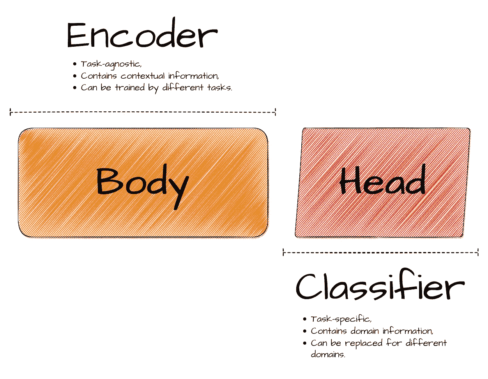
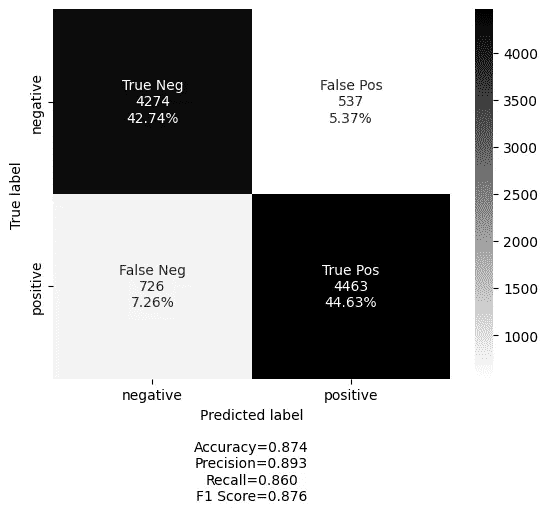

# 转变您的 NLP 游戏

> 原文：<https://towardsdatascience.com/transform-your-nlp-game-17f5bd0d87ea>

## 通过从头开始构建自己的编码器来学习和提高 NLP 技能


思考一篇文章的变形人。由 DALL E 2 生成。

由于 ChatGPT 这样的技术，目前围绕人工智能(AI)有很多炒作。作为许多最近流行的人工智能应用程序的基础构件的变形金刚，是这场炒作的中心。这就是我写这篇关于他们的文章的原因。变形金刚是深度学习模型，擅长各种自然语言处理任务，是许多行业专业人士的首选。


当被问及它最重要的部分是什么时，ChatGPT 的回答。

## 目录

*   [要知道的重要东西](#2eb6)
    - [编解码框架](#c5ef)-
    -[注意机制](#0cb5)-
    -[迁移学习](#5438)
*   [创建自己的 Transformer 编码器](#00d4)
    - [记号化器](#1860)-
    -[注意和多头注意](#a593)-
    -[Transformer 层](#2060)
    - [位置编码](#7cdd)-
    -[编码器块](#5f02)
    - [实用功能和分类头](#b5ba)
*   [动作中的变压器](#6c73)
    - [测试结果](#6380)
*   [结论](#5a44)
*   [参考文献](#98b6)

Vaswani 等人在 2017 年的论文“注意力是你所需要的全部”中介绍了 Transformer 架构。[1]该论文一直是近期一些最具影响力的自然语言处理模型背后的驱动力，包括预训练的生成式 Transformer (GPT)和 Transformers 的双向编码器表示(BERT)。这些模型已经改变了自然语言处理领域，并且已经在各种应用中被广泛采用。研究人员仍在努力改进这些强大的工具，因为他们继续推动可能的边界。

在本文中，我们将研究如何从零开始实现转换器，从基本的构建块开始，逐步发展到更复杂的架构。通过构建我们自己的转换器，我们可以更深入地了解这些模型是如何工作的，并将它们应用于不同的任务和数据集。在这个过程中，我们还将了解使变形金刚如此有效的关键概念和技术。无论你是初学者还是有经验的从业者，这篇文章都将提供关于变形金刚世界的有价值的见解。

要全面理解变压器的概念，必须理解以下三个关键组件:

*   编码器-解码器框架
*   注意机制
*   迁移学习

首先，让我们来看看编码器-解码器框架以及为变形金刚的出现铺平道路的架构发展。

## 编码器-解码器框架



简单的编码器-解码器网络翻译给定的英语序列到土耳其语。图片作者。

在我们深入研究编码器-解码器框架之前，让我们看看一种特殊的神经网络。以下引用自古德费勒、本吉奥和库维尔的《深度学习》一书，很好地总结了这一点:

> 递归神经网络或 RNNs 是用于处理顺序数据(如自然语言或时间序列数据)的神经网络家族。在每个时间步，RNN 接收输入，在自然语言处理的情况下，输入可以是单个单词或字符。RNN 处理输入并更新隐藏状态向量，该向量捕获到该点为止的输入序列的信息。然后，隐藏状态被用于产生一个输出，该输出可用于手头的各种任务。

RNN 的一个关键特征是它的反馈环，这允许它保留来自先前时间步长的信息，并使用它在当前时间步长做出决策。这使 RNN 能够“记住”过去的输入和上下文，这对于语言翻译或语言生成等任务至关重要，在这些任务中，理解单词或短语的含义和上下文取决于之前出现的单词和短语。

序列到序列架构非常适合输入和输出序列长度可变的情况。这些架构通过用编码器处理输入序列来工作，编码器将其转换成称为隐藏状态的固定长度表示。该隐藏状态然后被传递到解码器，该解码器基于编码表示生成输出序列。

rnn 编码器-解码器相对简单，但这种方法有一个主要问题。随着输入序列变长，隐藏状态必须保留越来越多的关于过去输入的信息，以便准确预测下一个输出。但是，如果 RNN 的容量不足以表示此信息，隐藏状态可能会变得“瓶颈”，这会导致 RNN 难以准确预测下一个输出。

长短期记忆(LSTM)和门控递归单元(GRU)网络被开发用于解决传统 RNNs 中的信息瓶颈问题。这些体系结构包括更复杂的存储和检索信息的机制。最后，注意力机制，变形金刚的一个关键组件，能够解决这个瓶颈。

## 注意机制

我将简单地谈一下这个主题，因为我们将在文章的后面实现注意力机制本身。在任何情况下，注意机制都是神经网络层，使模型能够在处理输入时专注于输入的特定部分。在诸如机器翻译、语言建模和文本摘要的自然语言处理任务中，注意机制已经被广泛用于提高模型理解和生成文本的能力。它们还可以通过允许模型专注于输入的最相关部分，来提高深度学习模型在计算机视觉和语音识别任务中的性能。值得注意的是，还有一种称为“自我关注”的关注机制，它允许模型在生成输出时关注输入序列的不同部分。

## 迁移学习

你们中的大多数人应该对此很熟悉，所以我认为在这一点上没有必要进行详细的解释:

迁移学习是一种机器学习技术，涉及在针对特定任务进行微调之前，在大型数据集上训练模型。在 NLP 的迁移学习中，预训练模型通常首先在大型数据集上训练，例如常见爬行数据或维基百科文章的数据集。例如，在“屏蔽语言建模”(MLM)这样的任务中，一个标记子集被随机屏蔽并馈入模型，模型试图根据给定的序列猜测原始标记。通过对像 MLM 这样的任务进行预训练，该模型可以通过在大型和多样化的数据集上进行训练来学习丰富的语言表示。

# **创造我们自己的变压器编码器**



变压器架构由原论文。突出显示编码器部分。

在这一部分，我们将创建和安装拼图的各个部分，以构建我们自己的编码器模块！主任务流应该如下所示:

*   创建一个简单的标记器和词汇表。
*   实现关键的变压器层组件，如缩放点积、注意力、多头注意力头和前馈层。
*   使用这些实现的部分组装 transformer 层。
*   多次使用 transformer 层来构建编码器块。

## 标记器

记号化是将一串文本分解成称为记号的小块的过程。这些标记可以是单个单词、短语或子词。标记化是自然语言处理中至关重要的预处理步骤；为了将序列输入到 transformer 模型中，必须首先将它们转换成模型可以理解的数字表示。这就是标记化的用武之地。

通过对输入文本进行标记，我们可以将它转换成表示单个标记的整数序列。这使得 transformer 模型可以将输入文本作为一系列标记来处理，而不是一个单独的文本字符串。有三种主要的标记化类型:

*   字符标记化
*   单词标记化
*   子词标记化

每种类型都有自己的优点和缺点。字符标记化很简单，但是缺乏实际单词的知识。单词标记化具有单词的知识，但是它需要大量的词汇来处理语料库中每个单词的所有可能的变化。子词标记化介于这两种方法之间，因为它根据预定义的词汇表将词分成更小的子词。这允许模型在保持词汇表大小可管理的同时处理词汇表之外的单词，这是使用最广泛的方法。为了简单起见，我们将使用单词标记化。

这里有一大段代码，但是不用担心！这实际上是一个简单的类，它做的正是我们想要的单词分词器。通过使用`fit_on_corpus`方法，它将每个唯一的单词映射到内部字典中的一个索引，这将是我们的词汇表。我们还添加了一些特殊的令牌来处理未知令牌和注意力地图。然后，我们有了`encode`方法，它接受一个字符串并从我们的词汇表中返回惟一的索引，我们可以将这些索引用作查找表。接下来的方法主要是为了实用目的；`tokenize`方法使用`nltk`库来标记给定的文本。在这种情况下，标记化的字符串是单词列表。下面几行根据给定的`max_len`参数填充或截断文本，确保在训练期间批处理的所有序列长度相同。`vocab_size`属性为我们提供了词汇表的大小，我们将在将来的 transformer 模型中使用它。

下一步将是使用语料库创建我们的词汇。通常，transformer 词汇表是从巨大的数据集创建的，如维基百科文章、书籍或不同公共文本来源的组合。但是对于我们这个简单的例子，我们将使用斯坦福大学的[大型电影评论数据集](https://ai.stanford.edu/~amaas/data/sentiment/)。该数据集包含 5 万条被标记为正面或负面的电影评论。

```
# Loading the dataset as pandas dataframe
df = pd.read_csv('IMDB Dataset.csv')

# Initialize the tokenizer
tokenizer = WordTokenizer(max_len=256)

# Fit the tokenizer on a corpus of texts
tokenizer.fit_on_corpus(df.review.tolist())

# Update the config vocab_size
config.vocab_size=tokenizer.vocab_size

print(tokenizer.word_to_index)

### Output:

{'<pad>': 0,
'<unk>': 1,
'mouth-foamingly': 2,
'abroad.': 3,
'…':
'terry/carey':163857,
'libertine':163858
}
```

我们刚刚使用实现的单词 tokenizer 创建了第一个词汇表。如你所见，它将每个唯一的单词映射到一个索引，我们可以用它将字符串序列嵌入到密集的向量中。但是，您可以看到对较大的数据集使用这种单词标记化方法的缺点。例如，对于 5 万条评论，我们最终得到了大约 16.3 万个独特的单词标记。这就是为什么经常使用子词标记化的原因。从理论上讲，使用这种技术，我们的记号赋予器将创建类似于`[‘mouth’, ‘foam’, ‘###ingly’]`的记号。这样，如果“foam”以不同的形式使用，它将作为一个索引保存，而不是跟踪每一个单独的修改。然而，对于本教程来说，我们的方法已经足够了。

好了，让我们在一个有错别字的测试句子上测试我们的编码器，看看它是否工作:

```
tokenizer.encode('This is a twest, sorry a test sentence!')

### Output:

{'input_ids': tensor([[ 45594, 30562, 41753, 1, 111258, 89975, 41753, 53047, 27998,
55328, 0, …, 0]]),
'attention_mask': tensor([[1, 1, 1, 1, 1, 1, 1, 1, 1, 1, 0, …, 0]])}
```

是的，它像预期的那样工作！因此，它为每个标记返回`input_id`，为我们的错别字返回 1 作为`<unk>`特殊标记，为直到我们指定的`max_len`的填充部分返回 0。它还返回一个注意掩码，对于有人出席的令牌为 1，对于`<pad>`特殊令牌为 0。



每个批次的输入序列被填充到批次中任何序列的最大长度。然后，该模型利用注意屏蔽来忽略输入张量的填充部分，允许它保持关注序列中的相关数据。图片作者。

现在我们有了一个工作的标记器，我们可以进入文章的下一部分。在下一节中，我们将重点介绍如何构建转换器的关键组件，这将最终导致编码器模块的创建。

## 注意力和多头注意力

标记化的一个问题是语言模型可能很难理解单个标记的上下文。例如，代词可能指文本中较早的特定名词，同音异义词如“统治者”可能根据上下文有多个含义。这就是注意力机制，尤其是自我注意力的来源。注意，该模型能够通过考虑每个记号与序列中其他记号的关系来理解每个记号的上下文。例如，如果模型在一串与历史或政治相关的单词(如“女王”、“国王”或“国家”)中遇到“统治者”一词，它可能会将其解释为指代某个政治角色。相比之下，如果这个词被与测量相关的词(如“厘米”或“长度”)包围，模型可能会将“尺子”理解为用于测量的物理对象。



标度点积注意和多头注意。图片来自原纸。

让我们从实现注意力头部的第一个实例开始:

`AttentionHead`类有两个主要组件:

1.  三个线性层:用于将输入(`hidden_state`)转换成三种不同的表示:`query`、`key`和`value`向量。`head_dim`是我们投射输入的维数，通常选择为`embded_dim`和`num_heads`的倍数。在这种情况下，自我关注层投射嵌入，并使用其自己的一组可学习参数来关注序列的各种语义方面，使其能够更深入地分析和理解输入(而不是给相同的向量最高分)。这些表示然后被用于计算注意力权重，如下所述。
2.  `scaled_dot_product_attention`:该方法采用`query`、`key`和`value`表示，并计算注意力权重。它首先计算`query`和`key`表示之间的点积(相似性度量)，然后除以`key`表示(`dim_k`)维度的平方根。这被称为缩放点积，它有助于在训练期间稳定梯度。然后，点积通过一个`softmax`函数(确保所有列值总和为 1)来计算关注权重。最后，注意力权重与值表示相乘以产生最终输出。

最后，当`AttentionHead`模块用于模型中的正向传递时，将调用 forward 方法。它用`hidden_state`输入调用`scaled_dot_product_attention`方法，将转换后的`query`、`key`和`value`表示作为参数传递。然后，`scaled_dot_product_attention`方法的输出作为`AttentionHead`模块的输出返回。

上面的方法会给我们一个相似性方面的分数。然而，在自然语言中有许多方面，因此拥有多个头部(多组投影)可以帮助我们克服这一点。这就是`MultiHeadAttention`的用武之地:

这里不多解释了。我们不是使用单个注意头，而是创建多个注意头(数量由配置决定)来捕捉给定序列的不同方面。例如，其中一个模型的负责人可能专注于主语-动词关系，而另一个负责人则搜索附近的形容词。我们只剩下变压器最后缺失的部分:如果我们跳过跳过连接(明白！)且不计算层归一化，前馈层:

在转换器中，`FeedForward`是独立处理每个嵌入的子层。通常的做法是将第一层的隐藏尺寸(`intermediate_size`)设置为嵌入尺寸(hidden_size)的四倍。这有助于模型有效地处理、理解，尤其是记忆输入数据。

## 我们的第一个变形层！

*鼓声…*
到了！当我们把所有的片段放在一起时，我们从我们之前指出的原始纸张中获得部分。代码如下:

该实现与最初的纸质实现几乎完全相同，许多当前的应用程序也是如此。我们没有像原始论文那样使用后层归一化，而是仅在跳过连接的跨度内应用层归一化，这通常在训练阶段更稳定[2]。

现在我们已经从零开始实现了一个 Transformer 层，令人惊讶的是，这么简单的一段代码在过去的几年里已经彻底改变了整个行业，并且仍然很强大。

**位置编码**

我们可以创建一个自定义嵌入模块，它结合了一个令牌嵌入层和一个位置编码层。令牌嵌入层将`input_ids`投射到密集隐藏状态，而位置编码层对`position_ids`做同样的事情。这就产生了一种混合方法，它结合了输入数据中的令牌和位置信息。



嵌入和位置编码的组合。图片作者。

位置编码的操作类似于令牌嵌入，但是它们不使用令牌 id 作为输入，而是使用位置索引。这使得编码器层能够将位置信息合并到它们的变换中，从而允许它们更有效地处理输入数据。

在这段代码中，我们实现了易于使用的可学的位置编码。然而，对于位置编码，我们可以考虑其他选择，比如在最初的 Transformer 论文中使用的绝对位置表示，或者更高级的方法，比如在 DeBERTa 模型中使用的相对位置表示。虽然这些可能会提供额外的好处，但我们实现的可学习的位置编码将足以满足我们的教程。

**最终确定的编码器模块**

通过添加包含位置表示的令牌嵌入，并根据预定数量堆叠编码器层，我们可以创建编码器的最终版本。堆叠编码器层的目的是更新输入嵌入，以便产生对序列内的上下文信息进行编码的表示。经过一些小的调整和更新，这个模块应该能够学习和训练给定的数据，我们将在后续部分演示。

**实用功能和分类头**

在添加分类头之前，我们必须解决的一个问题是，transformer 模型为每个令牌返回一个嵌入向量，向量大小由配置决定。例如，给定句子“你好，世界！”我们将接收两个嵌入向量，每个令牌一个。但是在我们的电影评论案例中，我们希望整个评论只有一个嵌入向量。为了解决这个问题，我们可以使用一种叫做池的技术。最直接的池化方法之一是平均令牌嵌入，这被称为`mean pooling`。



模型身体和头部结构。编码器和分类器。

我们已经完成了模型中与任务无关的部分，称为模型体。最后一步是添加一个特定于任务的层，称为模型头。在我们的例子中，这只是一个基于来自模型主体的平均池嵌入的输出返回逻辑的密集层。

有了所有必要的组件，我们现在准备训练我们的电影评论数据集并评估结果。下一节将介绍使用 PyTorch 的典型分类过程。

**变形金刚在行动**

我不会在这里讨论训练过程的细节，因为它遵循一个简单的 PyTorch 管道；但总的来说，它是这样工作的:

*   使用 sklearn 拆分训练和测试数据。
*   创建一个数据加载器来动态读取和标记文本。
*   使用基本 PyTorch 训练循环，通过二进制交叉熵损失和 Adam 优化器为指定数量的时期更新模型权重。

我们可以通过多种方式改进该模型，例如增加编码器层数、使用更好的超参数、实施提前停止，以及为 AdamW 和带预热的余弦调度器等变压器使用更高级的优化器和训练速率调度器。如果你想尝试并改善结果，我鼓励你自己尝试这些技术。

**测试结果**



验证结果。图片作者。

这是我们的浅层 transformer 模型的结果，它只使用了一个编码器层和一个基本的标记器。尽管没有在大型语料库上进行预训练，该模型表现得非常好，展示了 transformer 模型有效捕捉上下文信息的能力。此外，模型体可以在类似掩蔽语言建模或下一句预测的任务上进行训练，使其更加通用，并且能够用于各种任务，而无需进行重大修改。当相同的模型主体用于不同的任务时，这尤其有用。transformer 模型的多功能性和强大的性能使它们成为自然语言处理中的一个有价值的工具。

**结论**

在本文中，我们深入讨论了 transformers 的编码器部分，从头开始构建每个组件，并将其应用于一个实际的 NLP 分类问题。唯一缺少的部分是解码器部分，它使用给定的提示或序列生成序列。它在实现上类似于编码器模块，主要区别在于使用了掩蔽的多头注意力和编码器-解码器注意力。

我希望这篇文章能让您对 transformer 模型及其内部工作有更深的理解。我喜欢写它，希望你和我一样喜欢读它。

# 参考资料:

【1】[*瓦斯瓦尼、阿希什和沙泽尔、诺姆和帕尔马、尼基和乌兹科雷特、雅各布和琼斯、利翁和戈麦斯、艾丹.和凯泽、卢卡什和波洛舒欣、伊利亚。你需要的只是关注。arXiv 预印本
arXiv:1706.03762，2017。*](https://arxiv.org/abs/1706.03762)

[2] [*用变形金刚进行自然语言处理:用拥抱脸构建语言应用第 1 版，作者 Lewis Tunstall，Leandro von Werra，Thomas Wolf，2022。*](https://www.oreilly.com/library/view/natural-language-processing/9781098136789/)