# 使用 Pandas 对 JSON 文件进行转换

> 原文：<https://towardsdatascience.com/transformations-on-a-json-file-using-pandas-eba831181a96>

## *一套有用的 pandas 工具，用于成功加载和转换 JSON 文件*


(图片由作者使用 canva 提供)

在数据工程/科学领域，通过 JSON (JavaScript Object Notation)文件加载和执行转换是很常见的事情。

JSON 是一种广泛使用的存储和交换数据的格式。比如像 MongoDB 这样的 NoSQL 数据库是以 JSON 格式存储数据的，REST API 的响应大多是以 JSON 的形式提供的。

尽管 JSON 非常适合通过网络交换数据，但是如果我们想要处理数据，我们需要将它转换成表格形式，也就是包含列和行的形式。

现在，一般来说，我们可以在一个文件中遇到两种类型的 JSON 结构:

1.  JSON 对象
2.  JSON 对象的列表

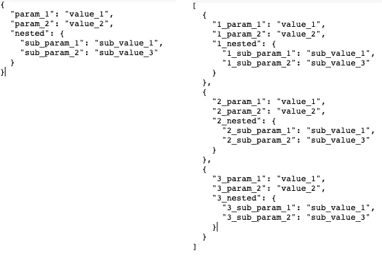

JSON 对象与 JSON 对象列表(图片由作者提供)

> 在本文中，我们将关注第二个场景(JSON 对象的列表)，据我所知，这是最常见的场景**，更重要的是，**通过学习处理列表场景，我们可以轻松地处理单个 JSON 对象。

为了处理 JSON 对象列表，我们可以使用 pandas，更具体地说，我们可以使用两个 pandas 函数:explode()和 json_normalize()。

让我们简单解释一下，然后再看完整的例子。

这篇文章内容如下:

1.  简要解释 explode()函数
2.  简要解释 json_normalize()函数
3.  在完整的示例中使用这两个来创建一个*固化的 D* 数据帧。
4.  做一些转换
5.  将转换后的数据转储为 CSV 格式

源代码请查看[笔记本](https://github.com/nachovrgs/data-engineering/blob/main/data-analysis/pandas/pandas-transformations-json.ipynb)。

# 1.激增

explode()函数用于将 list like 值的每个元素转换为一行，并为新元素保持旧的索引值。

像这样:

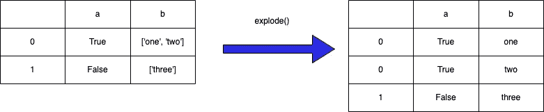

explode()简单示例(图片由作者提供)

该函数使用以下语法:

```
df.explode('***column_to_explode', ignore_index=False)***
```

我们还可以发送要展开的列的列表:

```
df.explode(['col_1', 'col_2'], ***ignore_index=False)***
```

它看起来会像这样

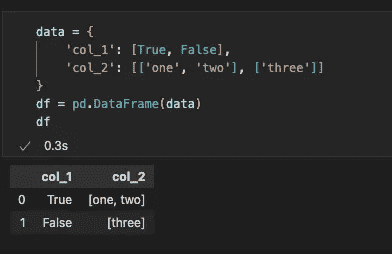

分解前的基本代码示例(图片由作者提供)

现在让我们来爆一下 *col_2*

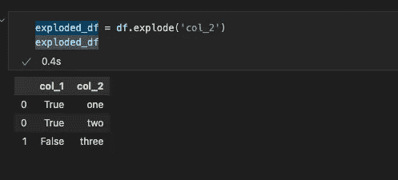

分解后的基本代码示例(图片由作者提供)

请注意分解行的索引是如何保持的。

# 2.JSON 正常化

json_normalize()函数在半结构化列上执行我们称为*的扁平化*操作。也就是说，它为结构的每个属性创建新列。

这是语法:

```
data = [
  {
    "id": 1,
    "name": {
      "first": "Coleen",
      "last": "Volk"
    }
  },
  {
    "name": {
      "given": "Mark",
      "family": "Regner"
    }
  },
  {
    "id": 2,
    "name": "Faye Raker"
  },

]**pd.json_normalize(data)***or within a column of your Data Frame***pd.json_normalize(df['a_column'])**
```

让我们来唱:

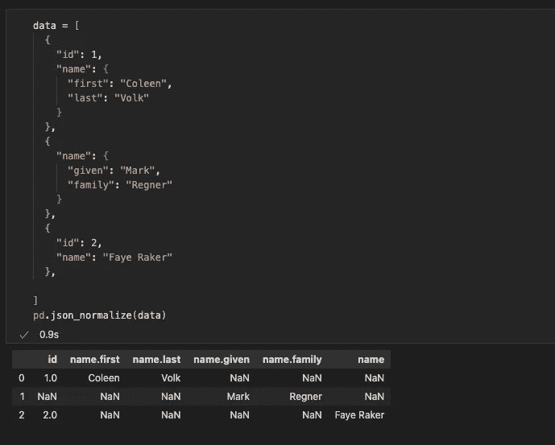

json_normalize 示例(图片由作者提供)

正如我们所看到的，它从我们的原始 JSON 创建了一个数据帧，将根中的每个属性作为一列。

嵌套属性是这里有趣的部分。JSON normalize 接受每一个，并创建一个保持其原始路径的列。

即。

```
"name": {
   "first": "Coleen",
   "last": "Volk"
}**becomes**name.first, name.last
```

我们还应该注意到，normalize 接受所有找到的" *name "(名、姓、名、族和一个普通字符串)*的子参数，并为每个子参数创建一列；用 *NaN* 填充缺失值。

我们可以选择分离器

```
pd.json_normalize(data, sep="<our_sep>")
```

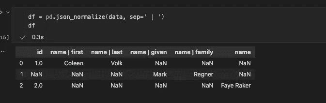

标准化的自定义分隔符(按作者排序的图像)

我们还可以控制 JSON 的级别，直到我们想要规范化为止

```
pd.json_normalize(data, max_level=<my_int_level>)
```

**哪里……**

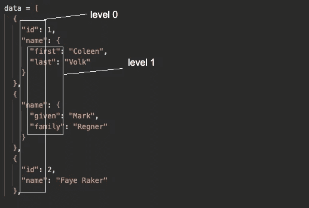

让我们看看实际情况

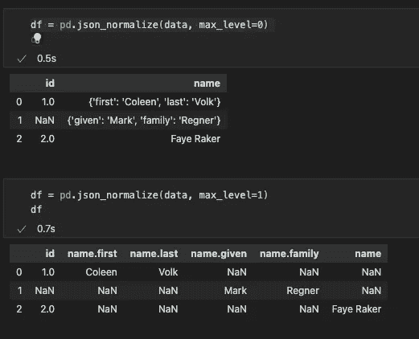

规格化的最大级别(按作者排序的图像)

# 3.让我们看一个完整的例子

> 例如，我们将使用来自电子商务商店的购物车商品列表，该列表来自于 [*dummyjson* api](https://dummyjson.com/docs/carts) 。

假设我们有一个需要以某种方式处理的购物车列表。

假设我们在需要提取和转换的 blob 中有一个原始格式的 JSON:

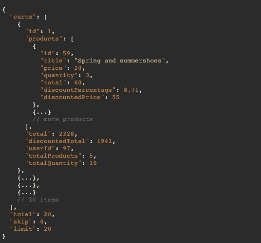

取自虚拟 json ( [来源](https://dummyjson.com/carts))

在这个例子中，我们有一个带有 *carts* 属性的主对象，其中包含我们需要的列表。

比方说，我们需要**提取**购物车产品或商品，并对其进行以下**转换**，并将结果输出到 AWS S3，以便进一步处理或存储:

*   基于产品的*总计*和构成*大销售额*的阈值，创建一个名为 **big_sale** 的新布尔列。
*   为每一行添加一个<processed_ts>时间戳。</processed_ts>

如果我们将购物车数据加载到 pandas 数据框中，并展开 *products* 列，它看起来会像这样:

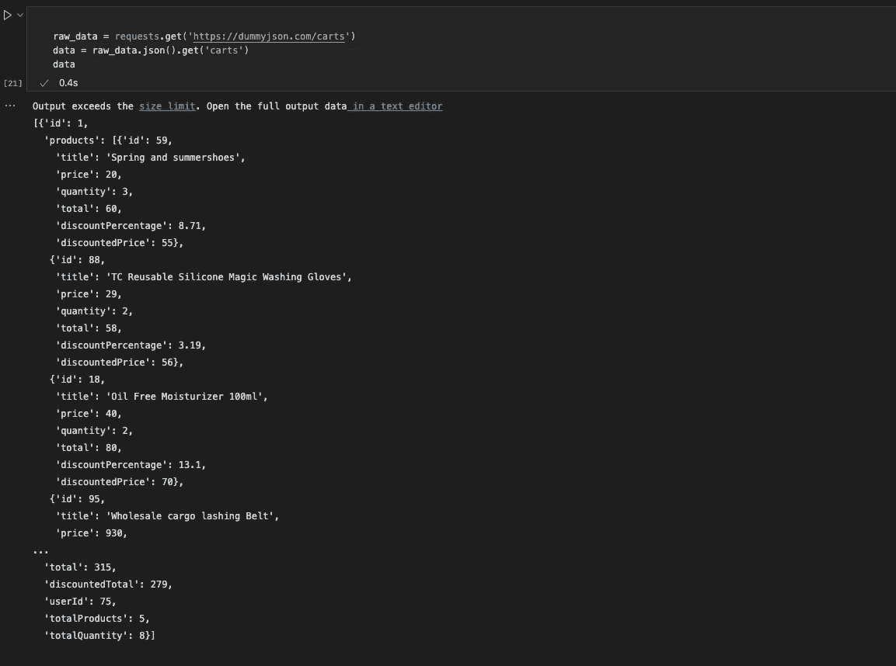

示例-加载-数据(图片由作者提供)

我们使用请求库加载数据。然后变成熊猫:

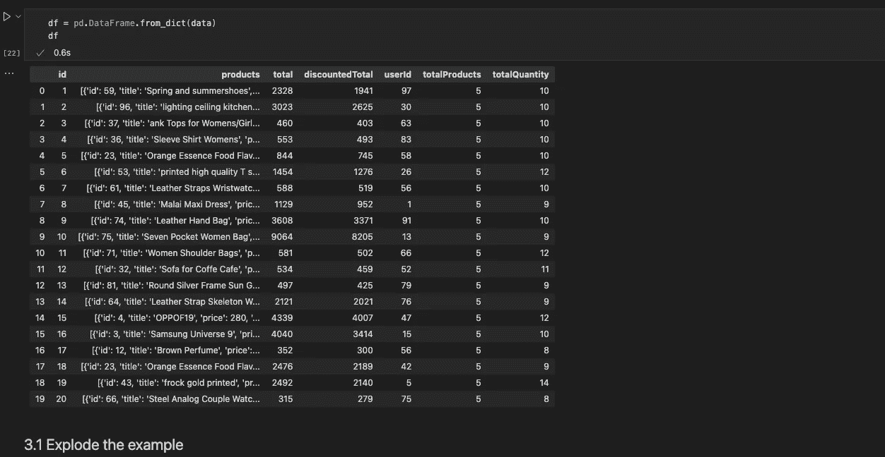

示例-数据框(图片由作者提供)

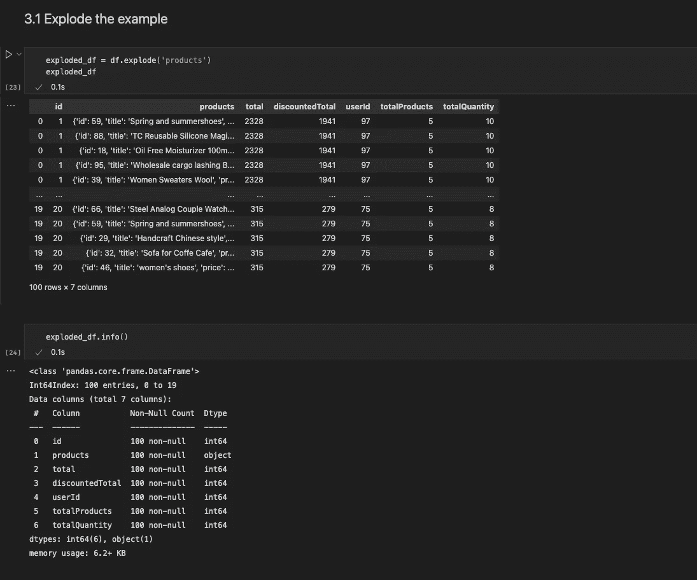

示例-分解(图片由作者提供)

看起来不错，现在每个购物车中的每个产品都有一行。注意购物车 id 重复，这就是我们现在想要的…

我们现在需要处理产品所在的 JSON 格式

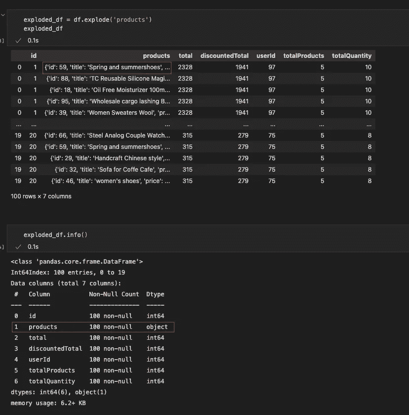

示例-展开-信息(图片由作者提供)

为此，我们将使用之前的 json_normalize 来规范化 json 数据，并将结果加入到我们的分解数据框中。让我们看看那个

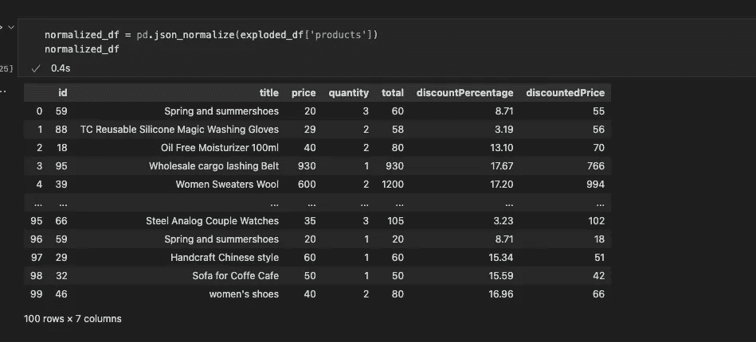

示例-规格化(作者图片)

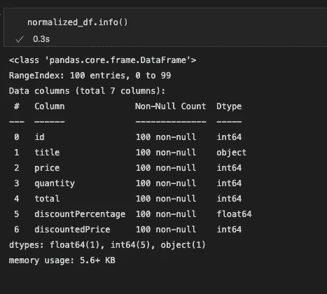

示例-规格化-信息(图片由作者提供)

现在，对于*产品*列的每个 JSON 属性，我们都有了一个列

接下来，我们可以连接*分解的*和*归一化的*数据帧，以在一个数据帧中获得 JSON 的完整表示。但是我们首先需要解决一个小问题:

*explosed _ df*的索引是错误的，我们需要重置它以通过索引加入。

因此，我们采取以下措施:

1.  从*分解的*数据框中移除旧产品栏
2.  重置*展开的*数据帧上的索引
3.  连接*分解的*和*归一化的*数据帧

我们走吧

首先我们删除旧的*产品*列，然后我们重置索引。

```
exploded_df.drop(['products'], axis=1, inplace=True)exploded_df.reset_index(inplace=True)
```

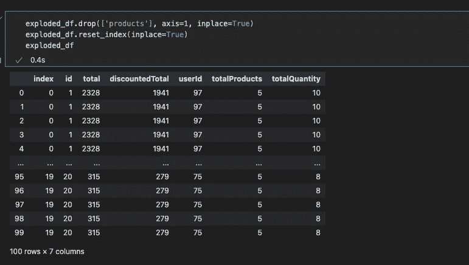

示例-drop(作者提供的图片)

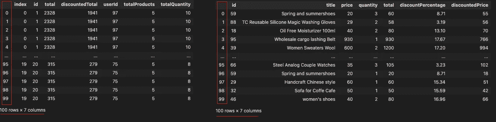

示例-索引-匹配(图片由作者提供)

请注意，索引现在匹配了。

在加入之前，我们需要处理两个重叠的列。

列 *id* 和 *total* 存在于分解和规范化 dfs 中。为此，当我们加入时，我们将使用 [panda 的加入](https://pandas.pydata.org/docs/reference/api/pandas.DataFrame.join.html)的后缀选项。

让我们看看

```
joined_df = exploded_df.join(normalized_df, *lsuffix='_cart'*, *rsuffix='_product'*)
```

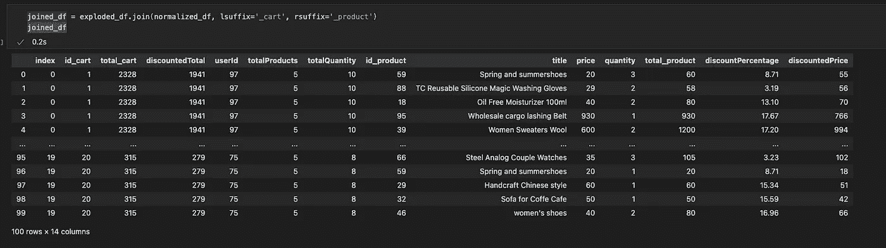

示例-已加入(图片由作者提供)

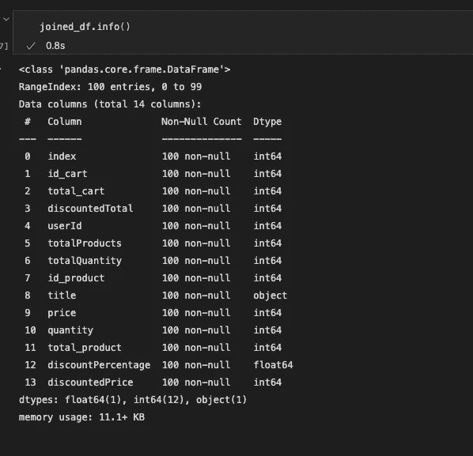

示例-加入信息(图片由作者提供)

完美，现在我们可以做一些转换…

# 4.转换

我们需要做两件事:

*   基于产品的总数*和构成*大销售额*的阈值，创建一个名为 **big_sale** 的新布尔列。*
*   为每一行添加一个<processed_ts>时间戳。我们走吧…</processed_ts>

我们将为 big sale (≥ is big)设置一个阈值 100，并使用 pandas 的 *apply()* 函数为 *big_sale* 列创建一个新系列。

> 请注意，产品的总计列在连接后被称为 total_product。

```
threshold = 100*big_sale_col* = joined_df.apply(lambda row: row.total_product >= threshold, axis=1)
```

现在我们可以将它添加到我们的*加入的*数据帧中

```
joined_df['*big_sale*'] = *big_sale_col*
```

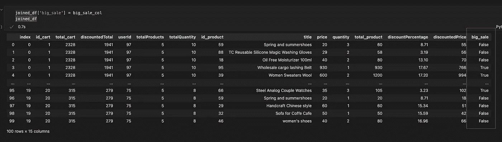

示例-大甩卖(图片由作者提供)

很好，现在对于下一个转换，让我们简单地添加一个新列，用当前日期作为时间戳。

```
from datetime import datetimenow = datetime.now()
timestamp = datetime.timestamp(now)joined_df['processed_ts'] = timestamp
```

> 不要忘记导入日期时间

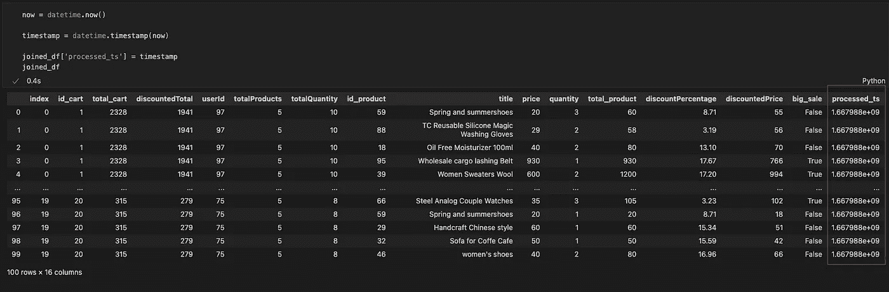

示例-已处理(图片由作者提供)

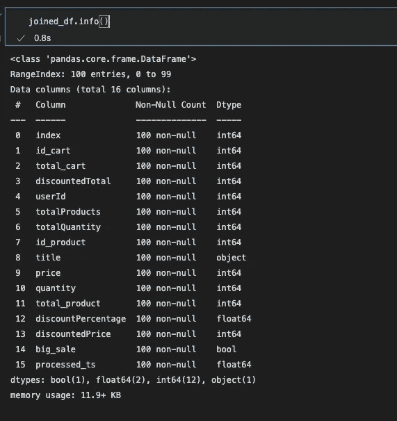

示例-已处理信息(图片由作者提供)

太好了！我们什么都有。让我们导出数据

# 5.将转换后的数据转储为 CSV 格式

显然，这是一个例子，在现实世界中，我们需要将处理后的数据输出到云中，可能不是 CSV，而是 parquet 或任何其他列格式。

尽管如此，按照示例，让我们在本地将其输出为一个 *processed.csv* 文件

```
joined_df.to_csv('processed.csv', index=False)
```

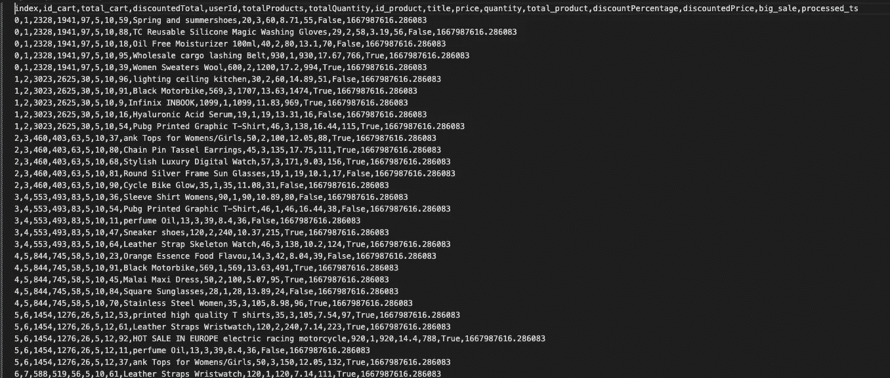

processed.csv 文件(图片由作者提供)

# 结论

处理一个原始的 JSON 文件是现实生活中非常常见的场景，pandas 非常适合这种情况。

通过结合 explode 和 normalize，我们可以将 JSON 文件放入数据框中进行处理。这对于处理来自例如通常为 JSON 格式的 API 的数据非常有用。

> 诚然，只有在处理对象列表时才需要 exploded，但这是一个相当常见的东西。无论如何，如果您的 json 不需要它，json_normalize()函数足以让您处理您的 JSON。

让我们总结一下我们所做的事情:

*   将 JSON 加载到数据框中
*   像列一样展开列表
*   规范化 JSON 格式列
*   做了一些简单的转换
*   导出了数据

感谢阅读！

来源请查看[笔记本](https://github.com/nachovrgs/data-engineering/blob/main/data-analysis/pandas/pandas-transformations-json.ipynb)。

# 参考

*   [爆炸()](https://pandas.pydata.org/docs/reference/api/pandas.DataFrame.explode.html)
*   [json_normalize()](https://pandas.pydata.org/docs/reference/api/pandas.json_normalize.html)
*   [from_dict()](https://pandas.pydata.org/docs/reference/api/pandas.DataFrame.from_dict.html)
*   [apply()](https://pandas.pydata.org/docs/reference/api/pandas.DataFrame.apply.html)
*   [to_csv()](https://pandas.pydata.org/docs/reference/api/pandas.DataFrame.to_csv.html)
*   [虚拟 json](https://dummyjson.com/docs/carts)