# 变形金刚释放:Python 中多元时间序列的深度预测

> 原文：<https://towardsdatascience.com/transformer-unleashed-deep-forecasting-of-multivariate-time-series-in-python-9ca729dac019>

## 深度预测

# 变形金刚释放:Python 中多元时间序列的深度预测

## 端到端示例:具有复杂季节性的多变量时间序列的概率预测

大多数经典预测方法仅限于单变量时间序列。只有少数几个接受多元数列，例如 SARIMAX。当多种季节性模式也开始发挥作用时，神经网络可以很好地战胜传统方法。

超级英雄女孩 Speed-pix abay 上的免费图片

在今天的文章中，我们将揭开神经网络预测者中一个相对较新的东西:变压器模型。我们将把它放在一个多变量时间序列上，这个时间序列由三个季节组成:小时、工作日和月。这为神经网络提供了一个适当复杂的时间序列。

我们将预测西班牙的电价。

[每小时能源需求生成和天气| Kaggle](https://www.kaggle.com/nicholasjhana/energy-consumption-generation-prices-and-weather) (作者 screesnhot)

相关矩阵的屏幕截图显示了影响电价的许多因素。转换者将学习整合其中的相关因素作为协变量(回归变量)。

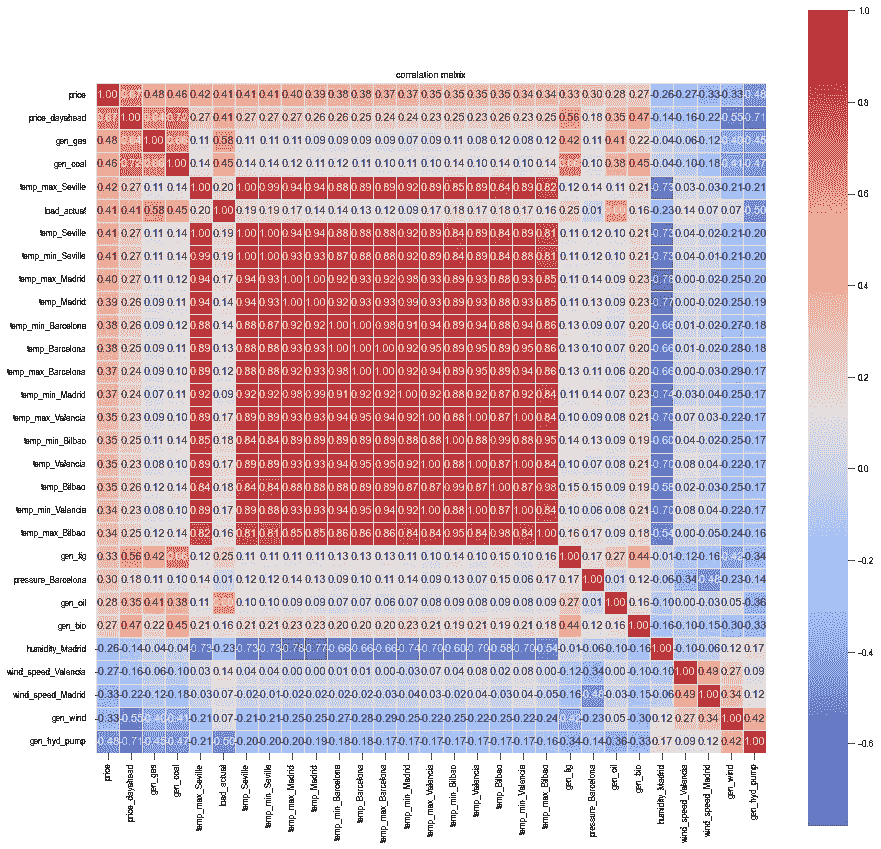

下面，观察到的电价的橙色发热曲线告诉我们，涉及到一些季节性模式，但显然不止一种类型，因为我们看到不同振幅的振荡。

蓝色曲线是一种剧透。它揭示了我们将要构建的变压器将能够以合理的精度跟踪和预测锯齿形峰值和谷值。其在测试集上的平均绝对百分比误差小于 5%。

让我们看看它是如何得到预测的。

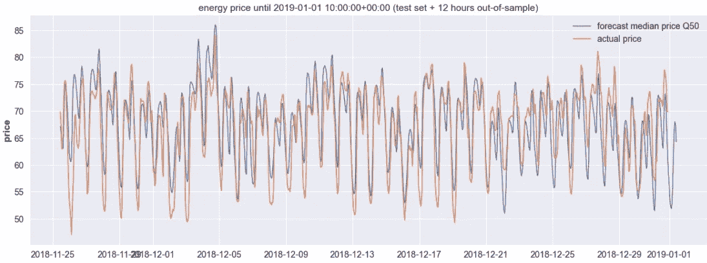

作者图片

# 1.概念

## 1.1 变压器神经网络

2017 年的一篇论文，“[注意力是你所需要的一切(arxiv.org)](https://arxiv.org/abs/1706.03762)”概述了基于注意力的网络的概念，最初是在自然语言处理的背景下。NLP 处理按语法和句法排序的单词序列。基于注意力的网络，又名 Transformer，获取输入文本序列，例如英语，并生成输出文本序列，例如西班牙语。时间序列分析使用按时间顺序排列的序列:时间步长。转换器必须从一系列训练观察值中沿着时间轴生成一个预测序列。

所谓的*注意力头*使转换器能够学习输入序列中一个时间步长和每隔一个时间步长之间的关系。在 NLP 训练中，它可以通过反向传播学会“注意”经常伴随其他单词的单词。这种上下文分析机制使它能够学会将单词与其他单词和序列关联起来。转换器更新其注意力权重，并降低最不相关的备选单词的等级。通过这种方式，它学习语法模式。得分矩阵表示其他单词与所讨论的单词的关联程度。

这是我们将从单词序列转移到时间步骤序列的能力。

你可以在 Ketan Doshi 撰写的一系列三篇 TDS 文章中找到关于 Transformer 架构的更深入的解释: [Transformers 直观解释| Ketan Doshi |迈向数据科学](/transformers-explained-visually-part-1-overview-of-functionality-95a6dd460452)。

## 1.2 概率预测:分位数回归

确定性预测方法生成点估计值:在每个时间步长上的单个值(通常是平均值)。确定性预测没有揭示不确定的“真实”未来值可能出现的上限和下限。

概率预测方法在每个时间步计算不止一个样本。神经网络评估一个*分位数损失*函数，一个传统损失函数的变体。我们将建议我们的转换器使用分位数回归来计算预测百分点。每个百分点代表一个单变量时间序列。分位数对(例如，1%/99%或 10%/90%)将中央预测值的曲线括起来。概率图显示了由此产生的不确定性范围。

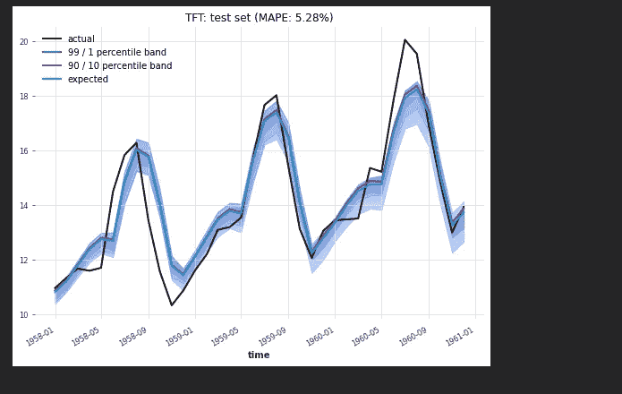

作者图片

你可以在上周关于时间融合转换器的文章中找到关于概率预测的其他解释:

</temporal-fusion-transformer-a-primer-on-deep-forecasting-in-python-4eb37f3f3594>  

# 2.属国

除了我们常用的核心包——pandas、numpy 和 matplotlib——我们还导入了 seaborn 的绘图功能，随后是几个 *Darts* 类:Transformer 模型和一些用于预处理、评估和绘图的实用程序类。

早期的一篇文章提供了安装 Darts 包的指导:

</temporal-loops-intro-to-recurrent-neural-networks-for-time-series-forecasting-in-python-b0398963dc1f>  

我还导入了小而有用的 *missingno* 包来可视化任何可能影响源数据的空值。它是一个可选工具:您可以选择删除它的导入行和使用它的 Juypter 单元格，而不会影响脚本的其余部分。

像往常一样，在安装像 PyTorch 这样包装大型库的包之前，创建一个新的虚拟环境，就像 Darts 一样。

三个可选的飞镖组件可以单独安装。除了 Darts 核心库，您还需要 darts[torch]组件来处理神经网络。您可以省略另外两个选项:pmdarima 和 prophet 包的 Darts 包装器。

# 3.控制设置和常量

我们设置了许多超参数来配置变压器模型和一些表示附加控制设置的其他常数。

在右上方，注意参数 *LOAD* 。

*   当它设置为 False 时，脚本将在训练集上训练一个 Transformer 模型。
*   当 Load 设置为 True 时，脚本不会重新训练模型。相反，它将从当前的工作目录——您保存 Jupyter 笔记本的文件夹——加载一个先前保存的 Transformer 模型。将跳过冗长的培训课程，脚本将继续从加载的模型生成预测。
*   一旦训练会话完成，脚本将自动将新训练的模型保存在 tar 文件中。您可以在第 2 行修改它的文件名。

变压器的超参数:

*   **时期**表示训练周期的数量:一次向前传递，随后是整个训练集的一次向后传递。我尝试了 50 个和 100 个纪元，最终确定了 200 个纪元，以达到令人满意的 MAPE。通过将训练扩展到 400 个或更多个纪元，我们可能实现甚至低于 4.5%的 MAPE。
*   **INLEN** 设置 input_chunk_length:输入层的**节点数。我们的时间序列具有每小时一次的频率，因此输入层大小应该至少包含 24 小时。一般来说，输入块需要足够大，以构成一个完整的季节周期，否则转换器将很难拼凑出季节模式。为了优化内存使用，输入层大小应该表示为 2 的幂。我用大于 32(例如 256，足够组成一周的 168 个小时)的输入块进行的实验在 MAPE 方面并没有产生更好的结果，但是伴随而来的是更长的训练时间。32 是一天 24 小时之上的下一个二进制上限。**
*   **VALWAIT** 参数告诉转换器在尽可能多的时期之后更新损失函数，而不一定是在每个循环之后。
*   **FEAT** 设置输入中预期特征的数量，默认为 512。我有一个可以接受的只有 32 的 MAPE。对于时间序列分析来说，512 看起来有点矫枉过正，可能会让我们面临过度拟合的风险。
*   **DIM_FF** 缩放前馈网络，默认值= 2048。我把它限制在 128 维。
*   **头数**定义注意头数，默认= 8。今天的例子适用于 4，我认为这足以处理三个季节性订单和一个潜在的趋势或周期性组件。
*   **编解码层数，**默认= 6。对于大多数时间序列，我不期望需要超过 4 层来识别趋势和季节模式。过多的层会使模型容易过度拟合。
*   0.1 的**丢失率**告诉变压器在一个时期内随机关闭 10%的节点。这可以防止网络过于深入地挖掘单个冻结的节点配置。
*   非线性**激活函数 ACTF** 转换两层之间的吞吐量。我们可以在校正线性单位函数“relu”(默认)和高斯误差线性单位函数“gelu”之间进行选择。更深入的见解，见:[现代激活函数|走向数据科学](/activation-functions-you-might-have-missed-79d72fc080a5)。
*   **批量大小**表示在更新其权重矩阵之前，转换器将处理的样本数量。大批量可能会导致过度拟合，并可能会碰到系统的内存限制。小批量会导致梯度下降，从而不规则地改变方向。理想情况下，为了优化内存使用，批处理大小应该用 2 的幂来表示。初始大小 32 是数据科学来源中最常见的指导。我将批量大小提高了一个档次，超过了 24 小时:32 小时是下一个二进制上限。
*   **N_FC，**预测展望期，设置为 1 小时的时间段，提前 1 步预测。
*   RAND 将**随机种子**设置为一个可以在运行之间重现的值。
*   **N_SAMPLES** 建议概率预测模型对尽可能多的预测值进行采样，以计算分位数。它代表单变量概率时间序列的第二个维度:时间轴上每个时间步长的样本。
*   FIGSIZE 定义了图的默认尺寸**。**
*   **分位数**列出了概率预测*的**下限和上限**。*
*   常数 **SPLIT** 控制时间序列中用于训练的百分比。
*   **N_JOBS** 限制脚本可以并行声明的处理器。如果设置为-1，所有处理器都将对其可用。

一般来说，我建议最初将变压器的超参数——本质上是它的矩阵大小——设置为比默认值低的值。高默认数字可能源于 PyTorch 对 NLP 应用程序的关注。时间序列的特征通常比自然语言问题要少。非常高的设置会导致模型必须处理的矩阵呈指数级增长。过大的模型会增加过度拟合的风险。

# 4.数据争论和探索

## 4.1 源数据

源数据可以在 Kaggle 上下载，并获得 CC0 公共域许可:

[每小时能源需求生成和天气| Kaggle](https://www.kaggle.com/nicholasjhana/energy-consumption-generation-prices-and-weather)

[每小时能源需求生成和天气| Kaggle](https://www.kaggle.com/nicholasjhana/energy-consumption-generation-prices-and-weather) ，作者截图

该源文件由两个 csv 文件组成，一个用于能源数据，另一个用于天气数据。

能量文件包含

*   2015 年至 2018 年西班牙电价水平的每小时记录，单位为欧元每百万瓦时(€/兆瓦时)；
*   按来源分类的发电量(煤、天然气、风力等。)，以 MWh 计；
*   和能量需求(“负载”)，单位为 MWh。
*   能源数据集由 29 列 35，064 行组成。

天气文件提供了 2015 年至 2018 年期间西班牙五个主要城市的每小时记录。我们没有“平均”的全国范围的天气数据集，因此分别位于伊比利亚半岛中心和对角的五个大都市地区必须作为整个西班牙的代表性样本。天气数据集包含 178，000 行，大约是能源数据集中的五倍，因为它是在 5 个城市之间逐项列出的。

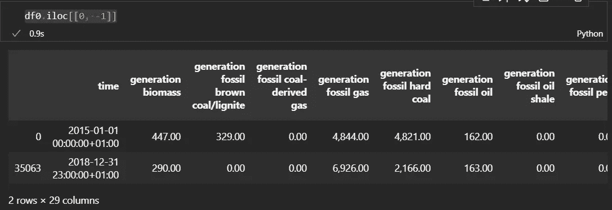

作者图片

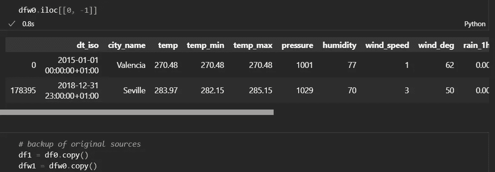

作者图片

除了发电和变化的需求负荷的影响之外，我们将研究温度、风速或湿度与电价的相关程度。

## 4.2 能源数据

能源数据框架的 *info()* 函数揭示了我们将不得不处理相当多的空白:不包含任何值的列；和其他不提供 35，064 个非空值的完整补充的列。

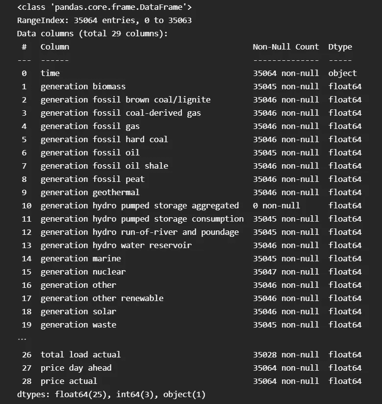

作者图片

在第 2 行中，我们首先将“time”列转换为 datetime 变量。

在第 6 行检查重复的行，产生一个否定的结果。

我们将日期时间列定义为数据帧的索引。

第 13 行确认了我们不需要将任何非数字变量转换成数字。

然后，第 17 到 23 行中的函数搜索间隙，如果找到了，就调用 *missingno* 图来可视化它们是如何分布在列和行中的。

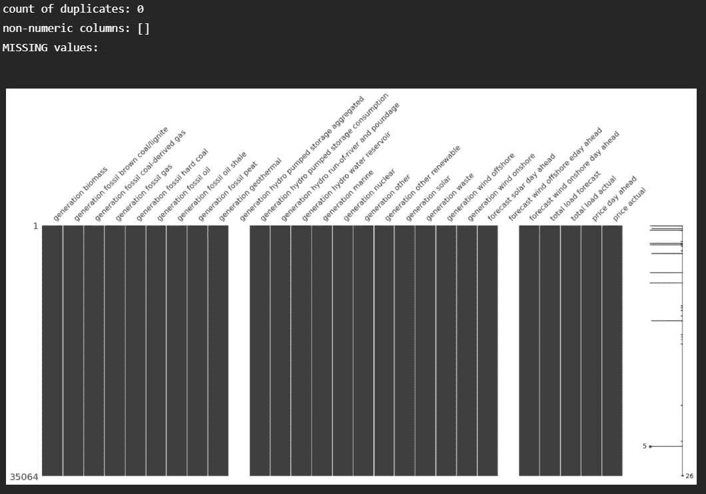

作者图片

我们观察到两个空的特征列。在右边，我们注意到其他列的个别行中有一些间隙。

在删除了第 3 行到第 4 行中的两个空列之后，我们在第 8 行中通过插值来填充剩余的空隙。

对第 10 行中的差距进行最后的检查，确认我们已经成功地处理了所有缺失的值。

作者图片

原始列名包含一些空格和特殊字符。让我们通过重命名这些列来消除它们。

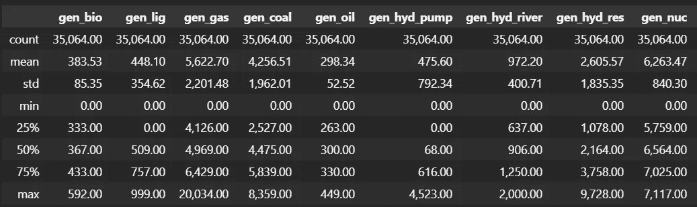

作者图片

小时价格的线图揭示了一条垂直曲线，该曲线似乎不遵循稳定的长期趋势或单一可识别的季节性，而是围绕€60 的平均价格波动。因为我们处理每小时的价格，我们必须假设时间序列服从三个季节性:

*   每日**小时**，受白天和营业时间不同用电水平的影响；太阳能的产生仅限于白天
*   工作日:工作日的用电量会比周末高
*   **月份:**季节性需求变化，由温差引起；以及太阳能和风能的季节性波动功率输出

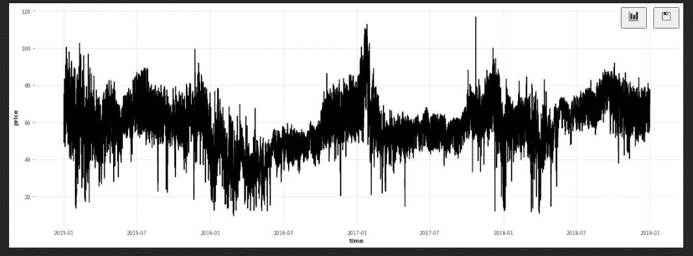

作者图片

## 4.3 天气数据

天气数据由 17 个特征列组成。info()函数告诉我们不需要处理任何丢失的值。

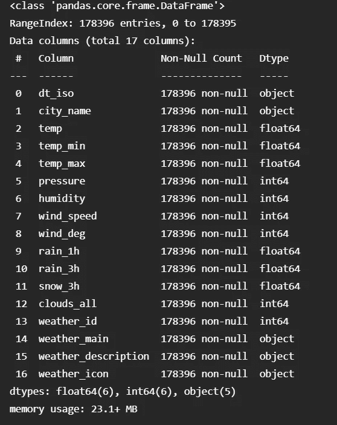

作者图片

我们首先将“dt_iso”列转换为 datetime 格式，使其与能源数据帧的 datetime 索引兼容。

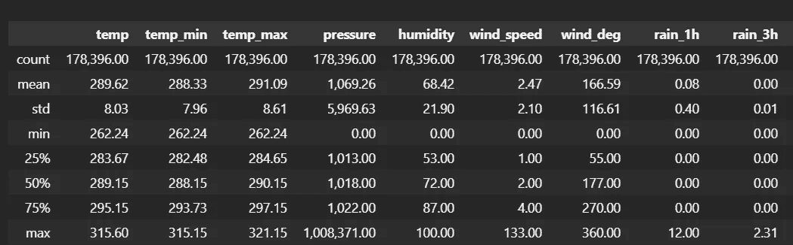

作者图片

描述性统计揭示了一些明显代表异常值的值。

*   大气压力不可能上升到 100 万毫巴以上而不压碎甚至一艘核潜艇。
*   本世纪西班牙还没有记录到高达 133 千米/小时的风速。

温度柱看起来很奇怪，数值超过 300 度。但是这些值只是用开尔文表示，因此并不意味着明显的异常值。

在第 2 行到第 3 行，我们删除了一些不相关或多余的列——这些列代表了定量列的口头总结；以及在过去 3 小时内测量的降雨量，这是多余的，只要我们也测量过去一小时的降雨量。

在第 7 行到第 8 行，我们将开尔文转换为摄氏度。

第 12 到 19 行将数值转换成 float32。

接下来，我们需要调查我们在描述性统计表中看到的异常值。

2015 年 2 月的几天，大气压力高得令人难以置信。它们的正常范围在 1000 毫巴左右的狭窄范围内。

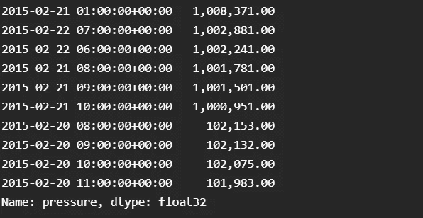

作者图片

2017 年 5 月 11 日，风速中出现了一个明显的异常值。

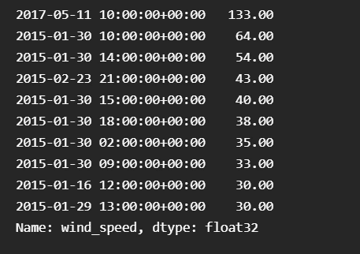

作者图片

箱线图可以帮助我们获得异常值的直观线索。

湿度和温度显示正常模式。最左边的零湿度可能是测量误差。我们可以考虑用相邻的非零值回填或前填来替换零值。但是在这个练习中，我保持它们不变。

然而，压力和风速的箱线图在标尺的高端隔离了一些严重的异常值。

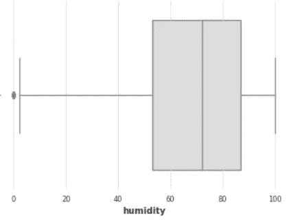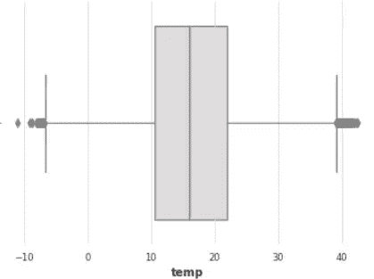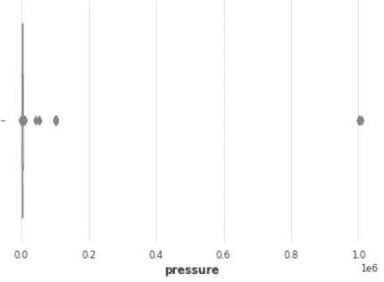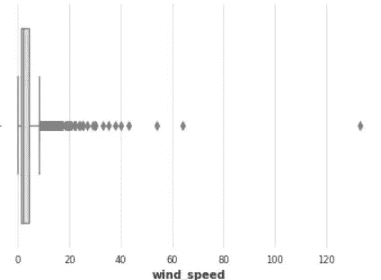

作者图片

或者，我们可以使用 seaborn 的 distplots 来识别异常值。

温度曲线显示了一个正常的季节循环，从寒冷的冬天到酷热的夏天。如果不与第三方数据进行比较，我们将无法辨别明显的温和异常值。

但是压力和风速分布的极端峰度和偏斜揭示了在它们的右尾部存在异常值。

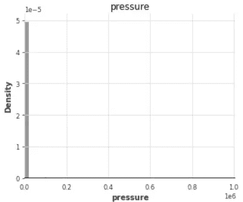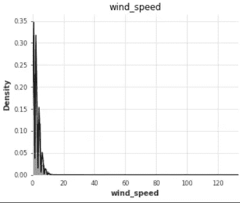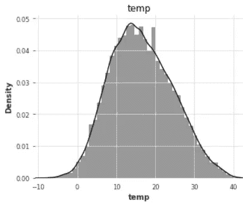

作者图片

为了处理异常值，我在第 2 行到第 5 行用 null 替换了超过所选阈值的值。然后，第 6 行通过反向插值填充新创建的间隙。

合理的阈值基于维基百科的西班牙极端天气日志:[欧洲大气压力记录列表—维基百科](https://en.wikipedia.org/wiki/List_of_atmospheric_pressure_records_in_Europe#Spain)

替换极值后，我们得到看起来正常的箱线图。

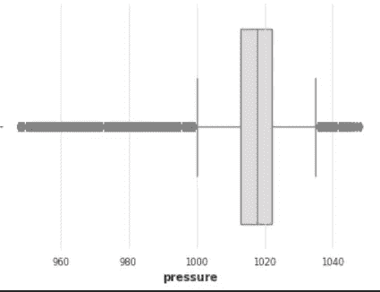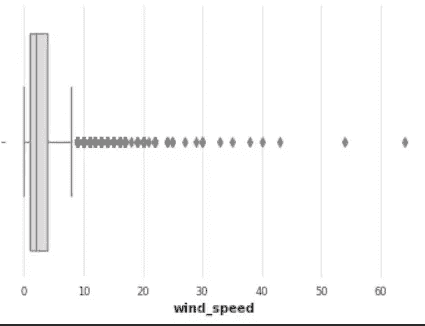

作者图片

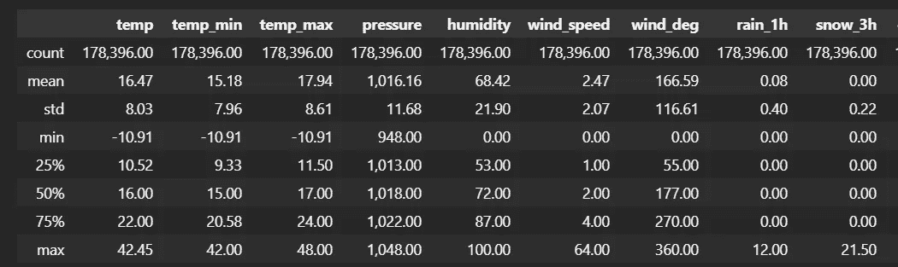

作者图片

能源和天气时间序列具有兼容的日期时间索引。

作者图片

记录了西班牙五个大城市的可用天气数据。

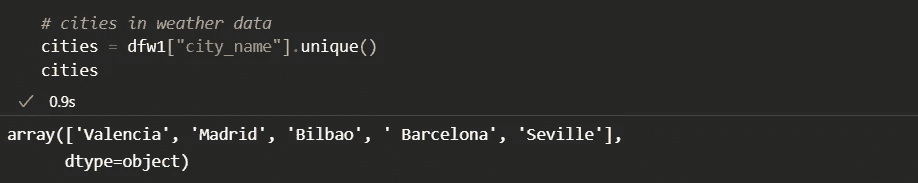

作者图片

当我们检查重复的城市和日期时间指数对的天气记录时，我们发现它们多达 3076 个。第 4 行删除了它们。

如果在第 15 行按城市分组，我们会发现每个城市现在有 35，064 条天气记录，与能源数据集中的记录数量相匹配。

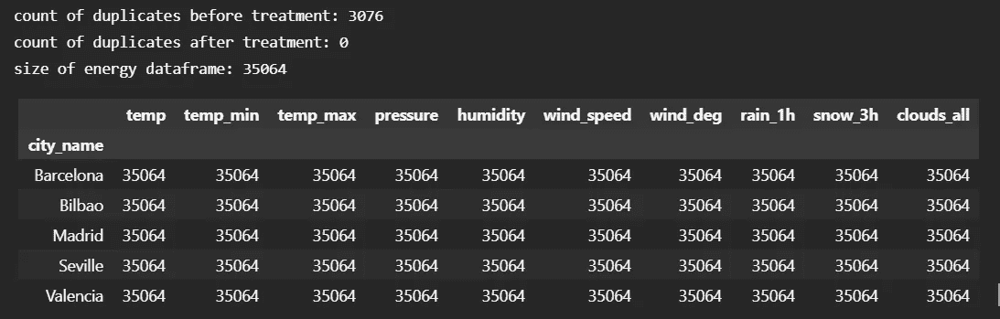

作者图片

我们将每个城市的天气记录单独放在一个数据框架中，为能源和天气记录的合并做准备。第 2 行中的字典理解创建了特定于城市的数据帧。

城市名作为字典的关键字。例如，当我们选择关键字“Bilbao”时，我们可以从字典中检索巴斯克地区的数据帧。

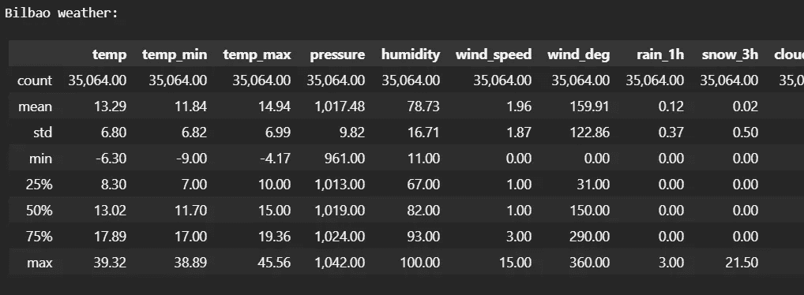

作者图片

# 5.准备数据

## 5.1 能源和气象数据的合并

第 3 行到第 7 行中的循环从天气字典中获取特定于城市的数据帧，并通过使用 *concat()* 方法将它们沿着列轴插入到能源数据帧中。第 4 行到第 5 行用各自城市的名称标记天气列。

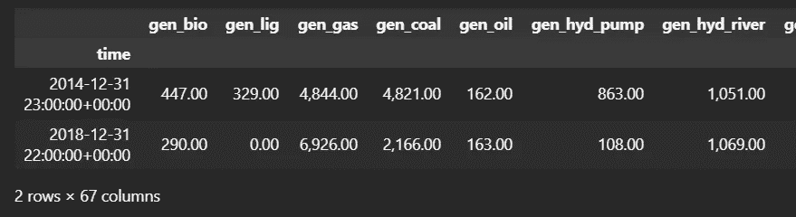

作者图片

得到的数据帧 df2 有 67 列。

对空值的检查证实了我们不必处理不匹配。

作者图片

在样本外预测中，我们希望估计未来几个小时的电价。值得怀疑的是，历史价格或任何特征变量已经形成了持续数年的模式，并将影响我们 12 小时后观察的价格。我选择将源数据限制在最后一年的 8760 小时，即 2018 年 1 月至 12 月。否则，培训时间会成倍增加。训练将需要半天或一夜(我不愿意做出这种牺牲，因为我需要处理器的能力来狂看《无垠》的最后一季)。

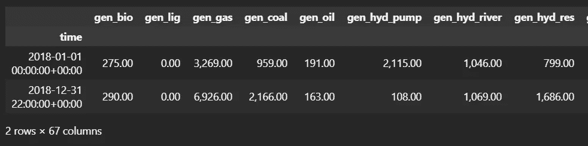

作者图片

## 5.2 特征提取

## 5.2.1 功能与价格的相关性

为了剔除 67 列中不相关的特性，我们计算与价格水平的相关性。

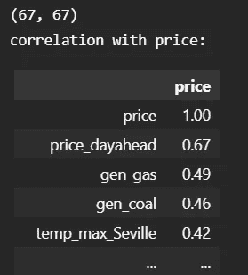

作者图片

让我们通过将输出限制为与价格至少有 25%相关性的那些来浓缩这 66 个特征。

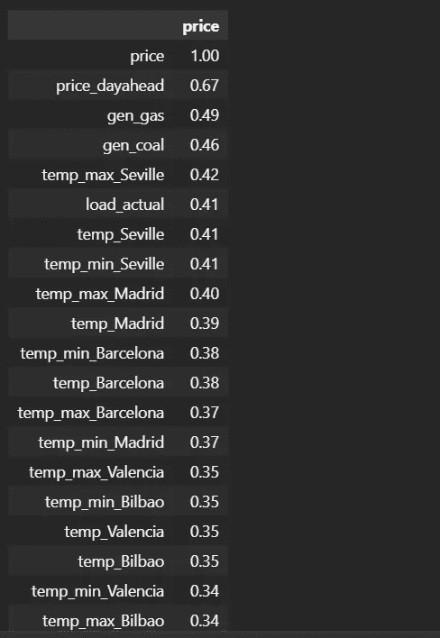

作者图片

我们得到了一长串 28 个与电价有中度到高度相关性的特性。其中大部分由城市温度组成，它们彼此高度相关。显然，这些特征之间有相当多的冗余，相关矩阵通过显示温度单元的深红色矩形来强调这一点。

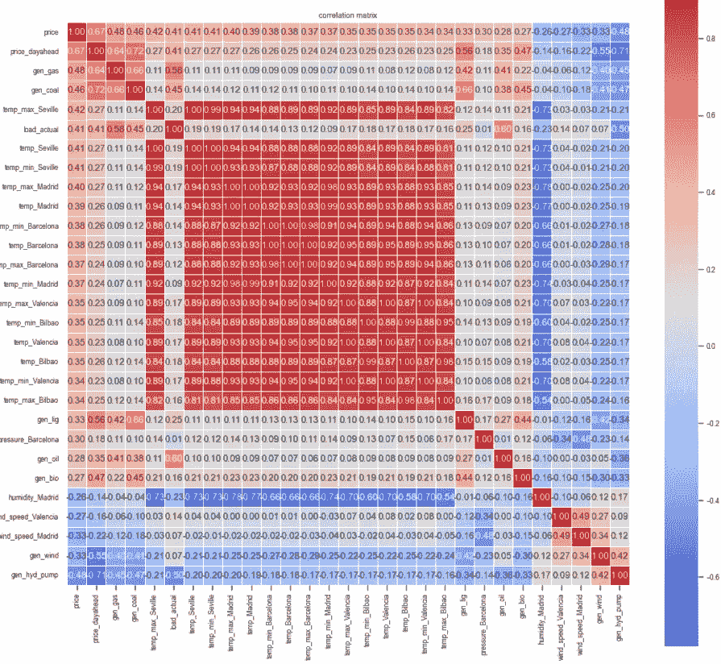

作者图片

我们可以在两种方法中选择。

第一个是 28 个与价格至少适度相关的原始特征。另一种方法是主成分分析，将 66 个特征减少到仅仅是它们的线性组合。

两种方法我都试过了。

## 主要成分

主成分分析表明，将需要多达 30 个成分来达到高于 90%的累积方差比。因此，PCA 并没有像我们希望的那样压缩特征列。

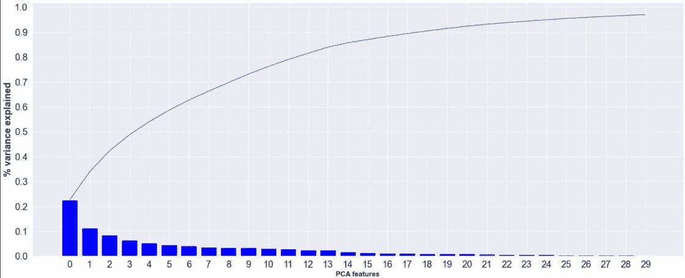

作者图片

让我们计算它们与价格水平的相关性，并将输出限制在那些与价格水平至少有 10%相关性的成分上。

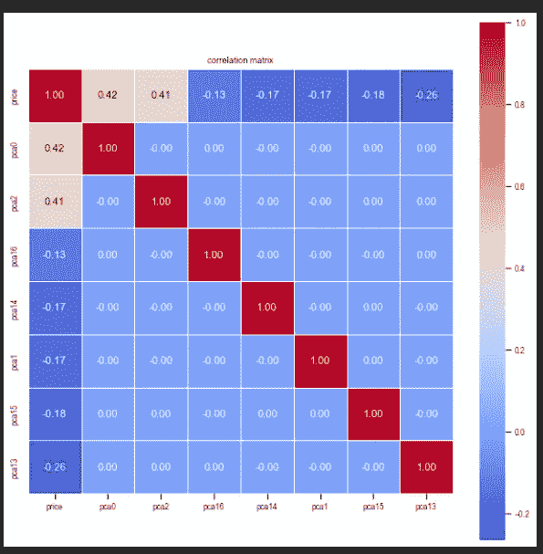

作者图片

只有 7 个组成部分与电价水平的相关性高于 10%。他们的低计数应该更容易训练变压器。

作者图片

当变压器使用这些主成分来预测测试集时，它实现了良好的准确性:5.55%的 MAPE。但是我决定采用第一种方法:28 个相关的特性列，这产生了 4.54%的更好的 MAPE。

作者图片

可能的话，我们可以通过包括一些具有弱相关性(低于 10%)的成分来改进基于 PCA 的方法。但是为了便于解释，我更喜欢使用原始的特性，而不是它们在 15 或 20 个组件中不太透明的线性组合。

在 GitHub 上，你可以找到我的两种方法的 Jupyter 笔记本:使用 PCA 的笔记本和使用原始特性的笔记本。

我们将数据帧的宽度缩小到目标变量及其 28 个最相关的特征列。

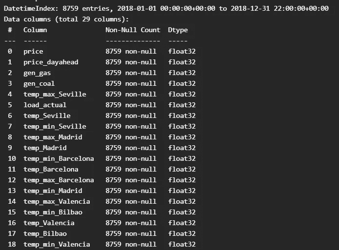

作者图片

## 5.2 日期时间功能

接下来，我们将进行一些特性工程，并从 datetime 索引中派生出额外的时间变量。

当我们在单独的列中隔离小时、工作日和月时，转换器会发现更容易识别时间轴上的模式。

数据透视表热图展示了工作日之间的不同价格水平以及每月的季节性波动。我们观察到工作日和周末之间的差异，此时电力需求较低；夏末的几个月里，我们看到了最高的价格。

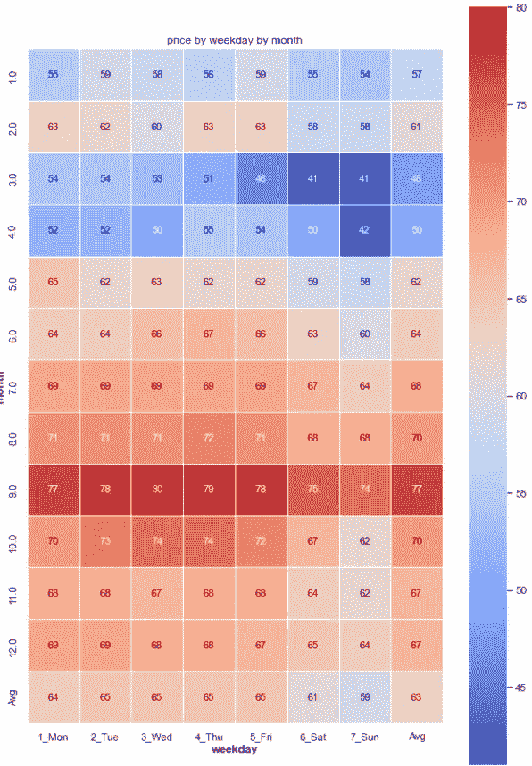

作者图片

第二个数据透视表揭示了白天和夜间的价格变化。下午早些时候可能意味着传统的西班牙午睡，在此期间商业活动的强度会降低。电力需求在下午晚些时候恢复，然后在晚餐时间激增。

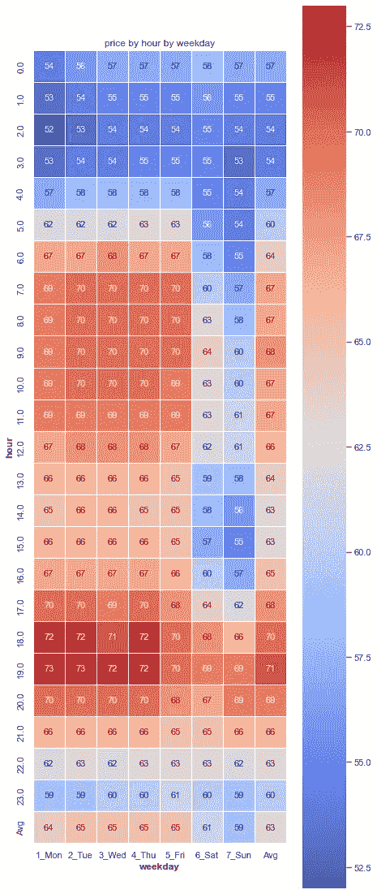

作者图片

这两个热图显示了预测模型必须了解的季节性的三个变量:小时、工作日和月。

## 5.4 时间序列对象

## 5.4.1 目标时间序列:价格

Darts 与*时间序列对象*一起工作，而不是 numpy 数组或 pandas 序列。

第 8 行将 dataframe 的 price 列转换为单变量目标时间序列: *ts_P* 。

第 10 到 17 行展示了我们可以从任何时间序列对象中获得的一些属性。

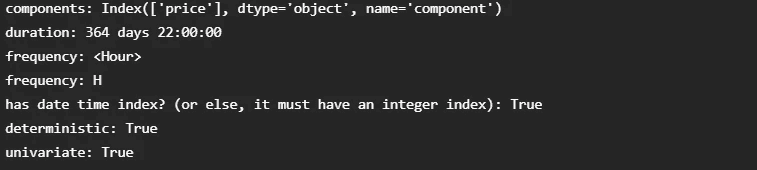

作者图片

## 特征协变量

接下来，我们将数据帧的特征列转换为时间序列。这些特征被称为目标时间序列的*协变量*。在回归分析中，我们称它们为自变量或回归变量。变量 *ts_covF* (“时序:协变特征”)形成一个多元时序对象。

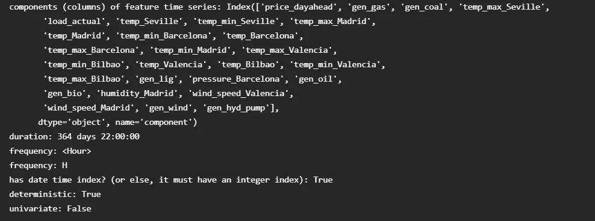

作者图片

必要时，可以使用以下 Darts 函数将 Darts 的时间序列对象转换回 numpy 数组、pandas 系列或 dataframes。

作者图片

作者图片

## 5.4.3 训练集和测试集的准备

我们应用 Darts 的 *split_after()* 函数来分离训练集和测试集。在 Jupyter 笔记本的顶部单元格中，我们将常量 *SPLIT* 设置为我们希望为培训保留的百分比。测试集将覆盖 2018 年 11 月下旬至 12 月底之间的 875 小时或 36.5 天。

我们从电价的目标时间序列 ts_P 开始。

如果神经网络在具有不同量值的张量上训练，它们可能会被引入歧途。因此，我们在第 11 到 12 行实例化 Darts 的 Scaler 类并使其适合训练时间序列。然后，第 13 行到第 15 行对所有三个时间序列应用相同的训练定标器:训练、测试和完整数据集。

这三个转换后的时间序列被标记为 ts_ttrain、ts_ttest 和 ts_t(“时间序列:转换后的训练集”、“时间序列:转换后的测试集”、“时间序列:转换后的完整序列”)

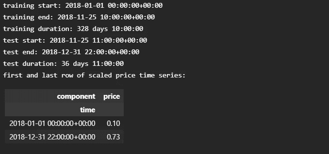

作者图片

接下来，我们在训练集和测试集之间划分特征系列。

我们将一个定标器安装到训练序列中，然后在第 4 到 8 行将其应用到训练和测试特性序列中。

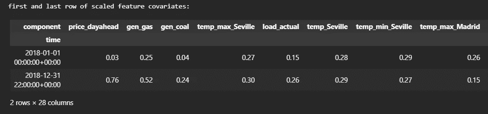

作者图片

## 5.4.4 日期时间协变量

现在我们将借助 Darts 的效用函数导出一些日期时间协变量。考虑到隐藏在源数据中的复杂的季节性成分，它们将使转换器更容易了解时间模式。

*   第 2 行到第 4 行从时间戳获得小时。请注意，第 4 行中的*“until”*参数将范围扩展到 2019 年 1 月 4 日，超过 2018 年 12 月 31 日测试集的结束时间。我们将使用额外的时间戳来准备样本外预测。我们也可以在稍后的阶段创建它们，在训练和测试之后，但是一次性准备所有的日期时间协变量可以节省时间。
*   第 5 行将工作日堆叠到小时。
*   第 6 行添加月份。

这三个组成部分将反映我们在源数据中发现的三个季节性。

在第 9 行，一个有用的函数添加了第四个协变量: *add_holidays()* 接受一个 *country_code* 参数并标记西班牙的公共假日。

第 14 行将训练集和测试集之间的协变量分开。

我们还需要缩放这些日期时间协变量，在第 18 到 22 行。

作者图片

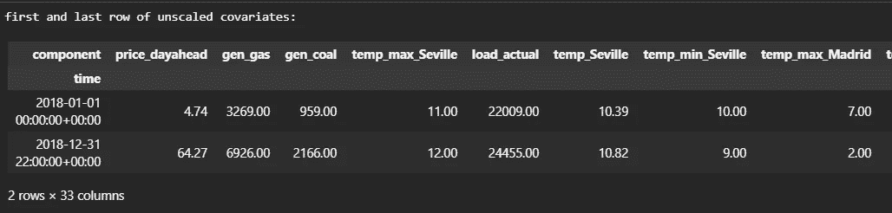

作者图片

# 6.变压器设置和培训

TransformerModel 接受我们在顶部的笔记本单元格中定义的超参数。

为了计算一个概率预测，为我们提供预测中心值曲线周围的一组分位数，我们使用参数*likelihood = quantier regression*运行模型。如果不定义可能性模型，预测将是确定性的:它将返回点估计，而不是将中心点包含在不确定性带之间。

在配置模型之后，我们使它适合训练集。

或者，如果我们将常量 LOAD 设置为 True，那么我们的脚本会将保存的模型加载到内存中(第 2 到 4 行)。保存的模型会保留其训练状态。加载后，我们不需要重新运行耗时的拟合过程，除非我们选择这样做。

# 7.测试:预测测试集

当训练完成时，或者先前训练的模型被提取到内存中时，我们可以为测试集生成 876 小时的预测。

*predict()* 函数将预测范围 *n* 作为其参数:时间步长的数量——这里是我们初始样本内预测的测试集的长度。

*num_samples* 参数设置预测分位数的百分比。我们在脚本的顶部将其设置为 100。请注意，根据我的实验，更多的样本不会显著增加处理时间。分位数损失函数没有太多的计算成本。

在列表*分位数*中，我们定义了我们想要获得预测范围的百分比:中心值(中位数)，以及 10%/90%、1%/99%和 20%/80%对，以及可选的其他分位数。每个分位数代表一个单变量时间序列。

第 28 行的 list comprehension 遍历列表分位数中的百分比，并对每个百分比调用辅助函数 *predQ()* 。然后 predQ 收集预测分位数，作为新数据帧 dfY 中的列。

50%的分位数或中位数值得特别关注。这个中心值代表我们将从确定性预测模型中获得的点估计。我们将其赋给一个单独的时间序列变量 ts_q50。

性能指标 q50_RMSE 和 q50_MAPE 将把这个中间预测 ts_q50 与测试集的实际价格进行比较。

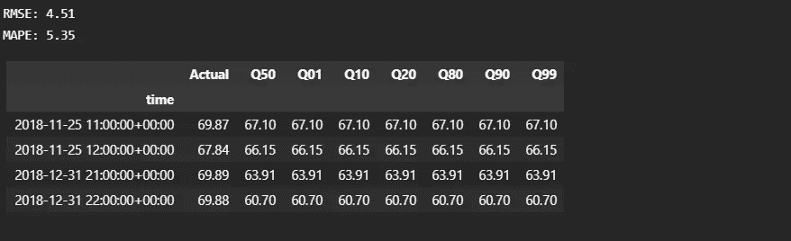

作者图片

上面的截图显示了*确定性*模型的结果:Transformer 模型是在没有要求 QuantileRegression 的情况下配置的。这就是为什么这些行显示常量值的原因。所有这些都只是反映了平均预测值，而不是分位数。这一点的 MAPE 估计是令人满意的 5.35%。

下面的截图显示了*概率*模型:在变压器的设置中，似然性参数被设置为 QuantileRegression。现在，每一个时间步长的分位数都因列而异。预测中值的 MAPE 为 4.57。

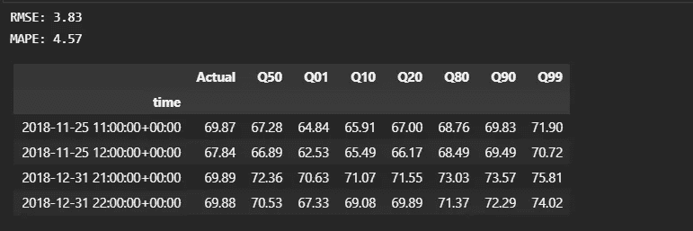

作者图片

下一个笔记本单元格绘制预测。它将预测价格中值与测试集的实际价格进行比较。

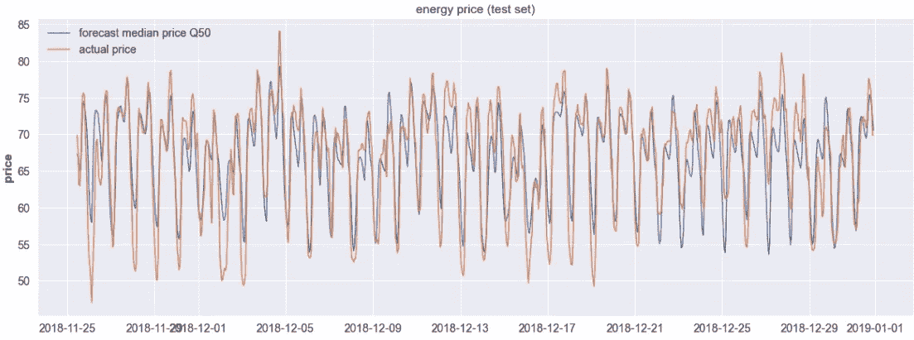

# 8.样本外预测

最后，我们将为测试期结束后的 12 小时准备一个样本外预测。

这要求我们将未来的协变量值输入到 *predict()* 函数中。

请记住，在定型模型之前，我们已经将日期时间协变量扩展到了 2019–01–04。因此，它们符合要求。

但是我们仍然需要得到特征协变量的预测，特别是天气变量。

如果我们有未来 12 小时的天气预报，我们可以将这些外源数据加载到内存中，并扩展我们现有的时间序列， *covF* 。

没有外部数据，我们将需要准备一个特征变量的预测。我们可以应用一种经典方法来为每个特征变量生成单变量预测:例如，SARIMA、指数平滑或 Theta 方法。我们还可以为每一个特性安装额外的变压器模型(没有协变量)。

但让我们在这个练习中保持简单:我们假设 2019 年 1 月 1 日的天气特征和电力需求将遵循与 2018 年 12 月 31 日相同的每小时模式。它们在 12 月 31 日的已知值将代表我们对 1 月 1 日的模拟天气和负载预测。

在第 2 行中，我们建议模型预测测试集结束后 12 小时的价格。

该模型没有在测试集上训练，因此其预测范围包括测试集的长度加上额外的小时数(第 4 行)。

9 号线使用了 *tail()* 功能的飞镖。tail 函数从现有时间序列中提取最后几个时间步长的值。在我们的例子中，它需要测试集的最后 24 小时。然后 *concatenate()* 函数将这 24 小时附加到测试集的末尾。这为我们提供了我们需要涵盖 2019 年 1 月 1 日的特征协变量。

第 12 行将时间和特征协变量组合在一个时间序列对象 cov_t_fut 中。

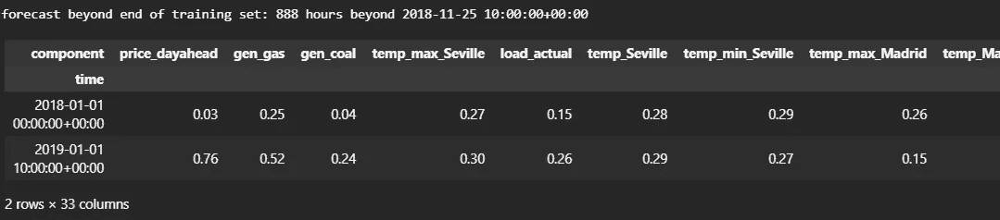

作者图片

*predict()* 函数采用扩展协变量和预测范围 n_FC 并生成预测。它们涵盖了测试集和 2019-01-01:888 小时的上午时间。

作者图片

我们重新初始化用于收集测试集预测结果的变量。现在，我们用新的扩展预测的预测分位数填充数据框架 dfY。

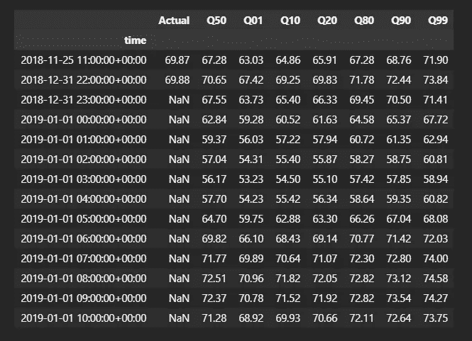

该屏幕截图显示了测试集的第一行和最后一行，后面是 12 个样本外预测行。

我们通过绘制预测图来完成今天的练习。折线图显示了对实际价格的复杂季节性模式的合理拟合。

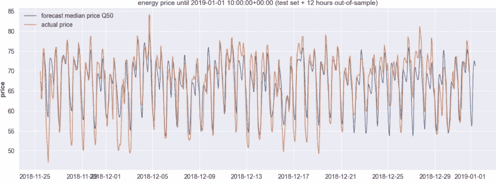

作者图片

# 9.结论

大多数经典的预测方法都没有扩展到多元时间序列。SARIMAX 接受外部回归变量，但难以反映一个以上的季节性顺序。

今天的教程演示了当协变量和复杂的季节性开始起作用时，神经网络预测器“变压器”如何发挥作用。

这两个 Jupyter 笔记本(使用相关功能或其主要组件)可在 GitHub 上下载:[h3ik 0th/ES _ energy _ Transformer:Transformer deep forecast(github.com)](https://github.com/h3ik0th/ES_energy_Transformer)

数据集元数据:[每小时能源需求生成和天气| Kaggle](https://www.kaggle.com/nicholasjhana/energy-consumption-generation-prices-and-weather/metadata)

<https://medium.com/subscribe/@h3ik0.th>  <https://medium.com/@h3ik0.th/temporal-fusion-transformer-unleashed-deep-forecasting-of-multivariate-time-series-in-python-674fa393821b>  </n-beats-unleashed-deep-forecasting-using-neural-basis-expansion-analysis-in-python-343dd6307010> 