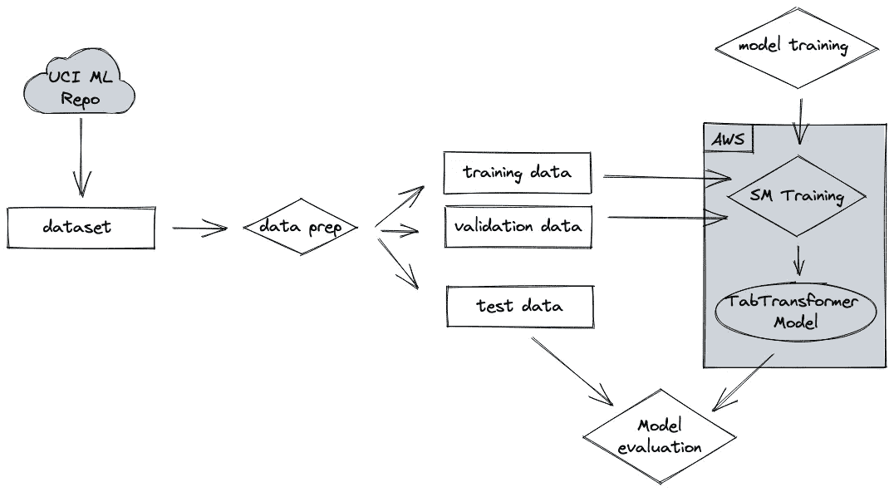
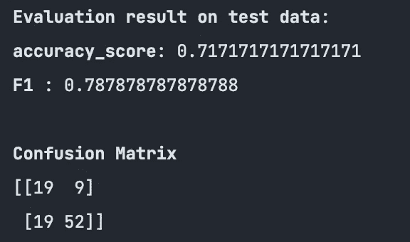

# 表格数据的转换器

> 原文：<https://towardsdatascience.com/transformers-for-tabular-data-b3e196fab6f4>

## 如何用自己的数据使用 SageMaker 内置的算法 TabTransformer

作者图片(用 OpenAI 的 DALL `·` E 2 创建)

# 这是怎么回事？

2022 年 6 月，AWS [宣布](https://aws.amazon.com/about-aws/whats-new/2022/06/amazon-sagemaker-built-in-algorithms-four-new-tabular-data-modeling-algorithms/)一系列新的内置表格数据算法。由于我已经在 NLP 领域研究了一段时间的变形金刚，我当然对 TabTransformer 算法很好奇。

TabTransformer 的前提是有希望的:根据上下文的不同，特性中的分类值可以有不同的含义。就像单词“bank”在句子中可以根据上下文表示不同的意思一样(“river bank”与“Bank of England”)，TabTransformer 在表格数据中使用该信息，如果上下文不同，则用不同的表示相同的值。你可以在这篇[论文](https://arxiv.org/abs/2012.06678)中了解更多。

在本教程中，我们将使用新的内置算法，通过自带数据来利用这一新功能。本教程的代码封装在 Python 脚本中，而不是笔记本中，因此我们可以在本地 IDE 中舒适地运行整个工作流。

本教程的代码可以在这个 [Github repo](https://github.com/marshmellow77/tab-transformer) 中找到。

# 为什么这很重要？

TabTransformer 使用自然语言处理(NLP)的上下文嵌入概念，并将其扩展到表格数据，这可能会导致对数据的更好理解，并可能最终导致比传统分类模型更好的结果。

但之所以这是一件大事，是因为绝大多数 ML 项目仍然是分类或回归问题，并处理表格数据。因此，我们可以通过新架构实现的任何改进都会产生巨大的影响，这仅仅是因为存在大量的表格数据项目。

# 行动（或活动、袭击）计划

AWS 文档提供了关于如何使用 TabTransformer 的[示例代码](https://docs.aws.amazon.com/sagemaker/latest/dg/tabtransformer.html#tabtransformer-modes)，但是该代码使用了已经相应准备好的标准数据集。然而，在本教程中，我们想带来我们自己的数据集，以便我们了解如何设置整个 ML 工作流端到端。

我们将准备数据并上传到 S3 桶，SageMaker (SM)可以在那里访问它。然后，我们将开始一项 SM 培训工作，以培训 TabTransformer 模型并将其部署到一个 SM 端点。一旦我们完成了这些，我们就可以用维持测试集来测试模型的性能。

作者图片

# 数据

我们将使用的数据集是来自 UCI 机器学习网站的[德国信用数据集](https://archive.ics.uci.edu/ml/datasets/statlog+(german+credit+data))。它通过[数据库内容许可证(DbCL)1.0 版](https://opendatacommons.org/licenses/dbcl/1-0/)获得许可，明确授予商业使用的权利。

数据集由 1000 条记录组成，包含 20 个特征和一个目标变量。每一个条目都代表一个获得荣誉的人。根据属性集，每个人被划分为好的或坏的信用风险(1 =好，2 =坏)。

对于 TabTransformer 来说，这是一个特别好的数据集，因为它有几个分类特征，这是该算法的亮点。

# 数据准备

我们可以直接从网站上下载数据到熊猫的数据框架中，就像这样:

如上所述，数据由 20 个属性和一个目标列组成。[文档](https://docs.aws.amazon.com/sagemaker/latest/dg/tabtransformer.html#InputOutput-TabTransformer)描述了我们必须如何准备数据。首先，目标变量需要是数据集中的第一列。接下来，我们要改变目标变量，使我们有 0 和 1，而不是 1 和 2。

然后，我们希望将数据分为训练、验证和测试数据集。训练和验证数据将用于训练模型，而测试集将用于在训练完成后评估模型性能。

最后，我们需要在 S3 桶中指定文件夹，以便算法可以访问数据。文件夹中的最终结构应该如下所示:

作者图片

我们可以这样实现:

# 模特培训

一旦我们准备好并上传了数据，我们就完成了大部分的前期工作。我们现在已经建立了能够运行算法的结构。事实上，我们可以从[文档](https://docs.amazonaws.cn/en_us/sagemaker/latest/dg/tabtransformer.html#tabtransformer-modes)中复制/粘贴代码。我们所需要做的就是调整路径，我们准备好了。

需要注意的一点是，我们可以提取算法的 hyper 参数的默认值，然后使用这些默认的[值](https://gist.github.com/bc1b72c459232be4fa29544b3a322c65)运行训练作业，或者像这样更改它们:

一旦我们开始了培训工作，我们就可以检查它的状态，并在培训完成后进行部署:

# 测试模型

一旦我们部署了模型，我们就可以通过使用数据准备步骤中的维持测试数据集来测试它的性能。我们需要做的只是在将数据提交给端点之前序列化数据，并解析响应以获得预测的标签:

然后，我们将这些预测与实际标签进行比较，并检查常用指标:

作者图片

这些结果是有希望的，不同的超参数值可能会进一步改进模型。

# 结论

在本教程中，我们对自己的数据使用了 TabTransformer 算法。我们已经准备了数据，根据我们的数据训练了算法，并在我们的 AWS 帐户中部署和测试了模型。

接下来我们可以:

*   将 TabTransformer 算法的结果与传统的非深度学习算法(如 XGBoost)进行比较。
*   查看 TabTransformer 在具有大量缺失数据的数据集上表现更好的能力，因为从 TabTransformer 学习到的上下文嵌入对于缺失和有噪声的数据特征都非常健壮，并且提供了更好的可解释性。
*   检查 TabTransformer 使用未标记数据训练模型的能力，因为这些模型在从未标记数据中提取有用信息以帮助监督训练方面很有前途，并且在未标记数据的大小很大时特别有用。

我希望这个教程是有用的，如果你有任何意见或问题，请随时联系我。