# 表格数据转换器(第三部分):分段线性和周期编码

> 原文：<https://towardsdatascience.com/transformers-for-tabular-data-part-3-piecewise-linear-periodic-encodings-1fc49c4bd7bc>

## 先进的数字嵌入提高了性能

由 [Pawel Czerwinski](https://unsplash.com/@pawel_czerwinski?utm_source=medium&utm_medium=referral) 在 [Unsplash](https://unsplash.com?utm_source=medium&utm_medium=referral) 拍摄的照片

# 介绍

这是我探索表格数据转换器的第三部分。

*   [第 1 部分:TabTransformer](https://medium.com/towards-data-science/transformers-for-tabular-data-tabtransformer-deep-dive-5fb2438da820)
*   [第 2 部分:具有线性数字嵌入的 FT-变压器](/improving-tabtransformer-part-1-linear-numerical-embeddings-dbc3be3b5bb5)

在第 2 部分中，我描述了线性数字嵌入以及它们是如何在 FT-Transformer 模型中使用的。这篇文章将探索数字嵌入的更复杂的版本，所以如果你还没有阅读前一部分，我强烈建议从那里开始，然后再回到这篇文章。

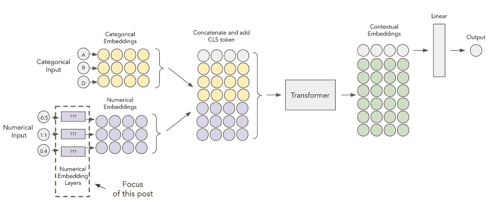

FT-变压器。图片作者。

提醒一下，上面你可以看到之前探索过的 FT-Transformer 的架构。该模型首先嵌入数字和分类特征，然后将这些嵌入通过变换器层，以获得最终的 CLS 令牌表示。

数字特征嵌入是一个相对较新的研究课题，这篇文章将深入探讨两种新提出的数字嵌入方法——分段线性编码和周期编码。Gorishniy 等人(2022)在名为[关于表格深度学习](https://arxiv.org/pdf/2203.05556.pdf)中数字特征的嵌入的论文中描述了这两种方法。看完这篇文章后，一定要去看看！

如果你对简单地应用这些方法感兴趣，那么去实用的[笔记本](https://github.com/aruberts/TabTransformerTF/blob/main/notebooks/fttransformer-numerical-demo.ipynb)看看，在那里我展示了如何用`tabtransformertf` [包](https://github.com/aruberts/TabTransformerTF)来使用它们。如果你对这些方法实际上是如何工作的感兴趣，那么请继续阅读！

# 数字嵌入

数字嵌入层将单个浮点转换成密集的数字表示(嵌入)。这种转换很有用，因为这些嵌入可以与分类块一起通过 Transformer 块传递，从而增加了更多的学习内容。

## 线性嵌入

线性嵌入。图片作者。

简单回顾一下，线性嵌入层是简单的全连接层(可选地具有 ReLU 激活)。这些图层之间不能共享权重，这一点很重要，因此每个数字要素都有一个嵌入图层。更多信息，请阅读[之前关于 FT-Transformer 的帖子](/improving-tabtransformer-part-1-linear-numerical-embeddings-dbc3be3b5bb5)。

## 周期性嵌入

周期性激活的想法现在在 ML 中相当流行。例如，Transformer 架构中的周期性编码允许模型表示单词在句子中的位置(您可以在此处阅读更多相关信息，例如)。但是如何将它应用于表格数据呢？Gorishniy 等人(2022)提出以下等式来编码特征 ***x*** :

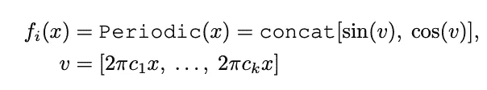

周期性编码方程。资料来源:Gorishniy 等人(2022 年)

让我们试着解开这个方法。编码过程有三个主要步骤:

1.  使用学习向量( ***c*** )转换为预激活值( ***v*** )
2.  使用正弦和余弦激活值( ***v***
3.  正弦值和余弦值的串联

第一步是学习发生的地方。特征的原始值乘以学习参数 ***c_i*** ，其中 *i* 是嵌入的维度。因此，如果我们选择嵌入维数为 3，那么每个特征将有 3 个参数要学习。

作为说明性示例，考虑下面随机生成的特征。

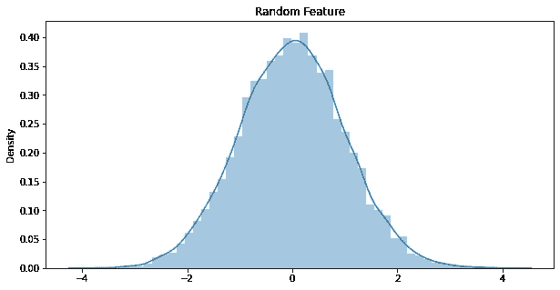

随机特征分布。由作者策划。

使用三个不同的 ***c*** 参数，我们可以将其转换为三个预激活值(即维数为 3 的嵌入)。

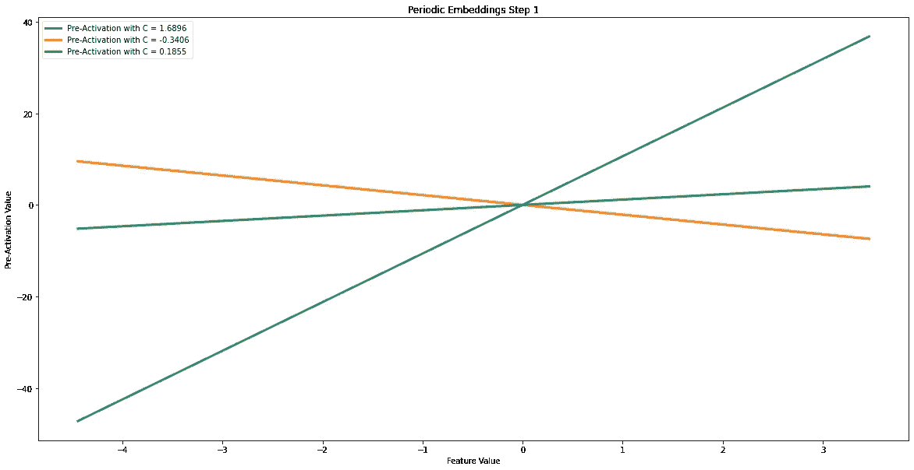

随机特征的周期性预激活嵌入。由作者策划。

然后，使用正弦和余弦运算将这些激活前值转换为激活后值。

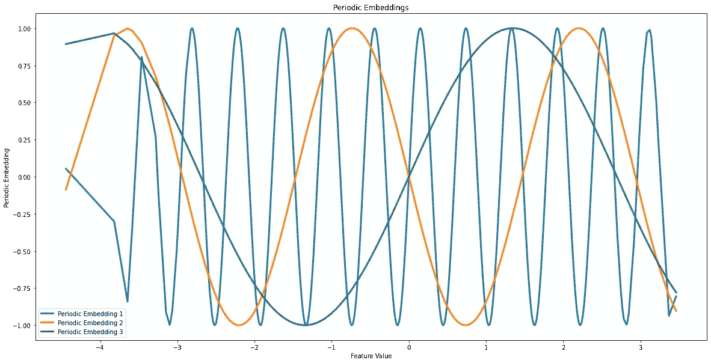

随机特征的周期性后激活嵌入。由作者策划。

如你所见，斜率影响周期性激活频率。斜率较大的预激活(蓝线)具有频率较高的后激活值。另一方面，斜率较小的预激活值(绿色和橙色线)会导致低频激活。从上图判断，`1`的特征值大概会被编码为`[-0.98, -0.90, 0.85]`,`-1`会被编码为`[0.97, 0.8, -0.9]`。

周期性嵌入。图片作者。

作者还建议在周期性编码的基础上添加一个额外的线性层，这样最终的嵌入图看起来如上所示。

## 分段线性编码(分位数宁滨)

这种嵌入方法从 one-hot-encoding(一种流行的分类编码方法)中获得灵感，并使其适应数字特征。该过程的第一步是将一个特征分割成 ***t*** 个箱。作者提出了两种分割方法——分位数法和目标宁滨法。本节描述第一种方法，第二种方法将在后面介绍。

分位数宁滨相对简单-我们将特征分成 ***t*** 等宽的条柱。例如，如果我们想要以 3 个箱结束(即 ***t = 3*** )，我们要计算的分位数是— `0, 0.33, 0.66, 1.0`。

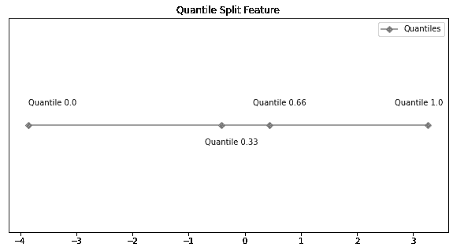

随机特征的分位数宁滨。由作者策划。

每个分位数( ***Bt*** )被表示为一个元组— `[bin_start, bin_end)`，所以在这种情况下，我们最终有 3 个箱— `[-3.85, -0.41), [-0.41, 0.44), [0.44\. 3.26)`。这种表示的公式符号如下:

宾斯公式符号。资料来源:Gorishniy 等人(2022 年)

一旦我们获得了这些箱，我们就可以开始对特征进行编码。编码公式如下所示。

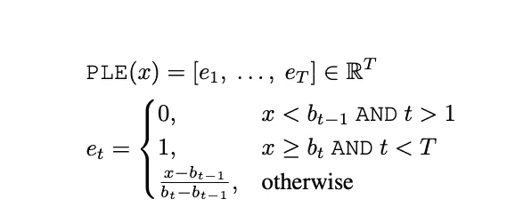

PLE 公式。资料来源:Gorishniy 等人(2022 年)

正如你所看到的，对于每个值，我们都将以一个 ***t*** 维嵌入结束。总共有 3 个选项——0、1 或介于两者之间。对每个 bin 和每个值应用此公式后，我们的嵌入结果如下所示:

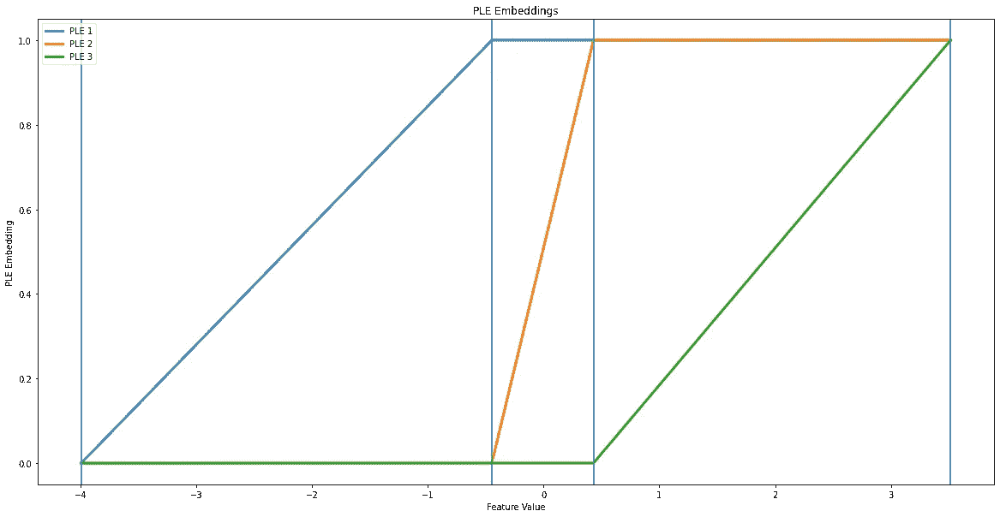

随机特征的 PLE 嵌入。由作者策划。

正如你所看到的，较小的值只有一个“活动嵌入”(PLE 1)，在中间我们得到 PLE 2 活跃。最后，在最后一个 bin 中，所有三个嵌入都被激活。这样，`-1`的值近似变成了`[0.8, 0.0, 0.0]`，而`1`变成了`[1.0, 1.0, 0.2]`。

分位数宁滨的 PLE 嵌入。图片作者。

## 目标宁滨方法

目标宁滨包括使用决策树算法来帮助构建箱。正如我们在上面看到的，分位数方法将我们的要素分割成等宽的条柱，但在某些情况下可能不是最佳的。决策树将能够找到关于目标的最有意义的分割。例如，如果有更多的目标方差朝向更大的要素值，则大多数条柱可能会向右移动。

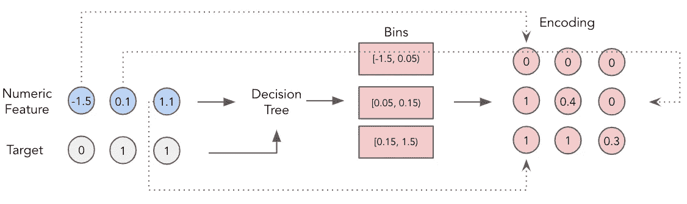

PLE 嵌入目标宁滨。图片作者。

# 报告的结果

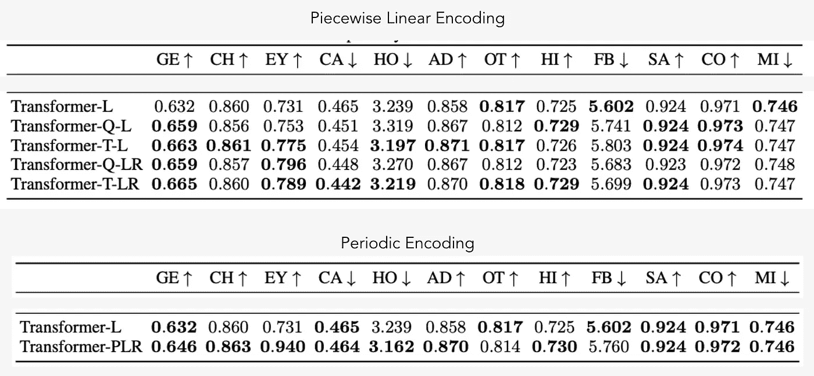

Gorishniy 等人(2022 年)报告的结果摘录

本文结合 MLP、雷斯内特和变压器架构，对所有提出的嵌入方法进行了广泛的比较研究。本表中 **L** 代表线性， **Q** 代表分位数， **T** 代表目标， **LR** 代表带 ReLu 的线性， **P** 代表周期性。

从上表可以看出，整个数据集没有唯一的赢家(没有免费的午餐定理在起作用)，因此嵌入类型可能被视为另一个要优化的超参数。然而，当我们将周期和 PLE 编码与简单的线性嵌入进行比较时，大多数时候我们会看到性能的显著提高。

# 验证结果

让我们看看是否可以在一个流行的玩具数据集上重现本文的结果——California Housing。你可以在这里看到完整的工作笔记本，而下面我将介绍建模所需的主要部分。像以前的帖子一样，我将使用我的`tabtrasnformertf` [包](https://github.com/aruberts/TabTransformerTF)(如果你喜欢，请给它一个星形⭐️)，你可以使用命令`pip install -U tabtransformertf`轻松安装(或更新)它。

## 数据下载和预处理

我们可以使用`sklearn`玩具数据库下载数据。预处理过程非常简单——进行 train/val/test 分割，缩放数据并将其转换为 TF 数据集。

## 周期性嵌入

要使用周期性嵌入，您只需在`numerical_embedding_type`参数中指定即可。所有其他参数我已经在[之前的](/improving-tabtransformer-part-1-linear-numerical-embeddings-dbc3be3b5bb5)帖子中介绍过了，所以如果你有任何问题，请参考一下。

## 具有分位数宁滨嵌入的 PLE

同样的程序适用于 PLE 分位数嵌入。您唯一需要更改的是将`numerical_embedding_type`参数设置为`ple`。

## PLE 与目标宁滨嵌入

如果您更喜欢使用基于目标的宁滨，而不是分位数，则需要指定几个附加参数。

*   需要为决策树训练提供目标(参数`y`)。
*   需要指定决策树`task`，可以是`regression`也可以是`classification`。
*   也可以指定额外的决策树参数(`ple_tree_params`)(可选)

# FT 变压器培训

您可以像任何其他 Keras 模型一样使用嵌入来训练 FT 转换器。下面你可以看到训练其中一个模型的代码，但是同样的步骤也适用于其余的模型。

# 估价

既然模型已经训练好了，我们可以将它们相互比较，与基线比较，与论文中报告的结果比较。请记住，这里报告的数字只是针对单个模型运行和训练/测试分割，因此您的结果很可能会有所不同(但相对性能应该大致相同)。

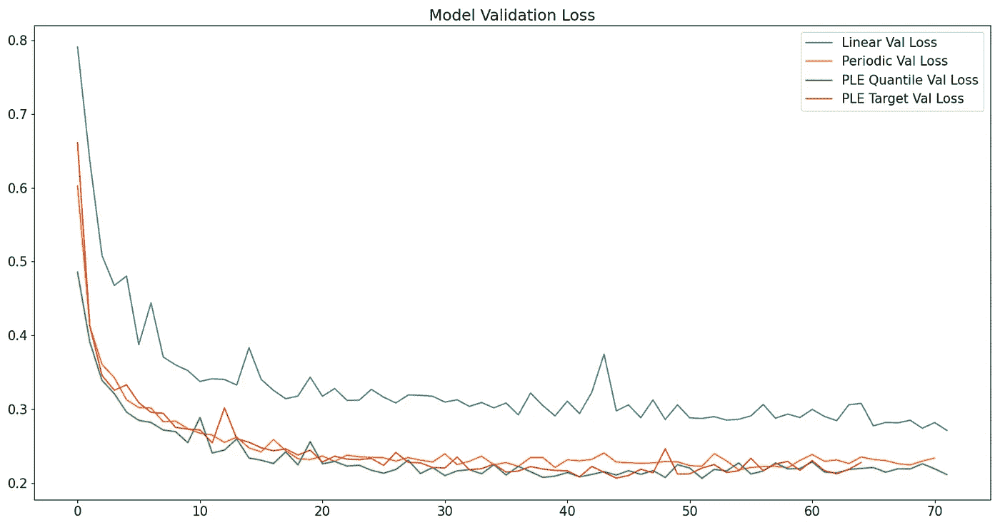

验证损失历史。由作者生成。

如您所见，对于这个特定的数据集，使用更复杂的数字嵌入有巨大的价值。具有 PLE 嵌入的 FT-变压器给出最好的结果，其次是周期性嵌入。

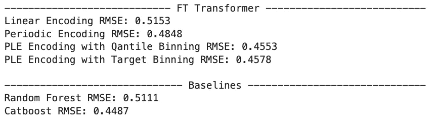

按模型划分的 RMSE 指标。由作者生成。

当我们将结果与两个基于树的模型(Random Forest 和 CatBoost)进行比较时，我们可以看到，具有 PLE 嵌入的 FT 转换器优于第一个，并接近第二个的性能。鉴于数据集很小，而且深度学习不太友好，这是非常令人印象深刻的。

观察到的性能比论文中报道的性能差。这很可能是由于次优超参数或实现中的差异。此外，论文中报告的结果是多次运行的平均值，因此这也可以解释一些变化。

# 结论

在这篇文章中，我们探索了两种强大的数字嵌入方法——周期编码和分段线性编码。你看到了它们如何转换数字特征，以及如何使用`tabtransformertf`包将它们用于 FT-Transformer。

虽然这两种方法在嵌入数字特征时应用了非常不同的逻辑，但它们都可以极大地提高深度学习模型的性能。这些方法的主要缺点是模型可能需要更长的时间来训练，但在 GPU 上这种差异可以忽略不计。所以在你的数据集上尝试一下，让我知道效果如何！

# 文献学

*   加州住房数据集；佩斯，r .凯利和罗纳德·巴里，稀疏空间自回归，统计和概率信，33(1997)291–297(CC0:公共领域)
*   Gorishniy 等人，2022 年，[关于表格深度学习中数字特征的嵌入](https://arxiv.org/abs/2203.05556)