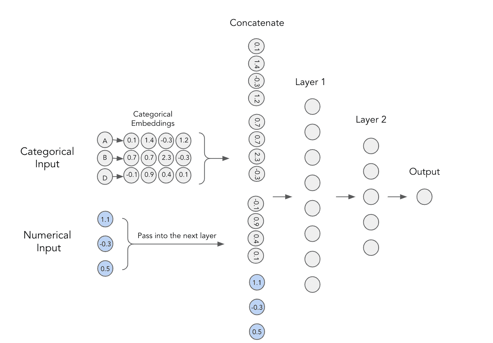
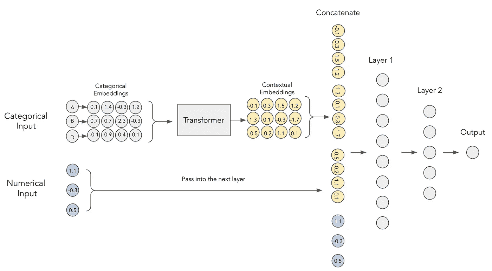
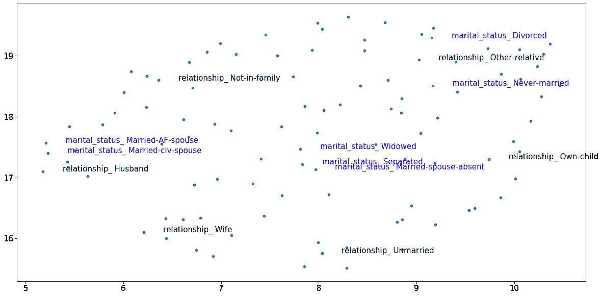
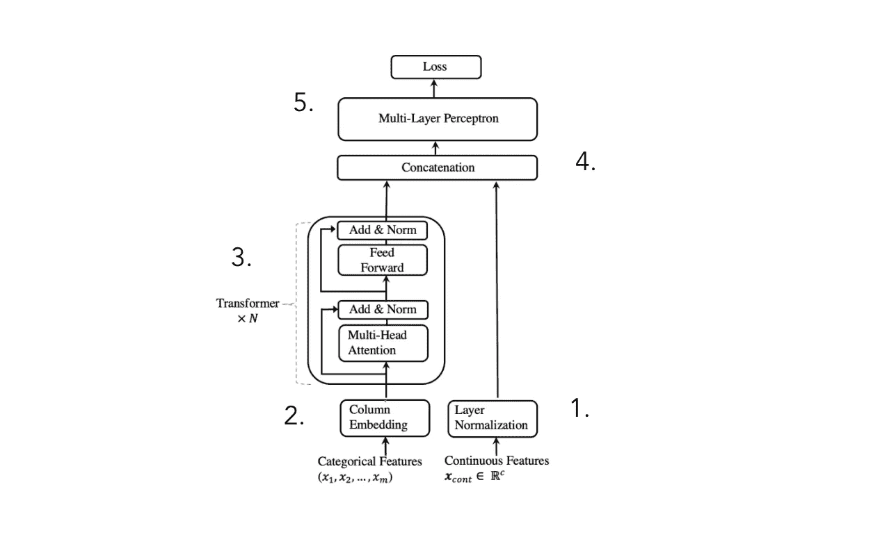
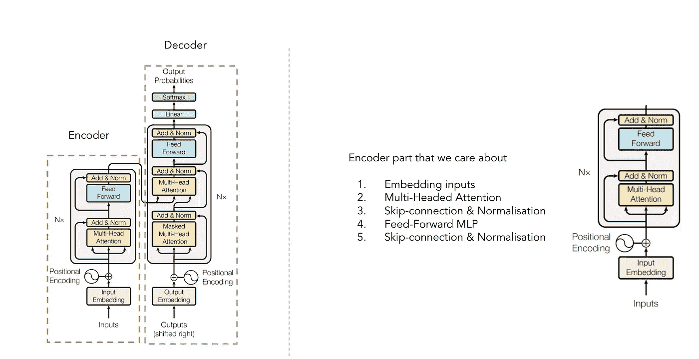
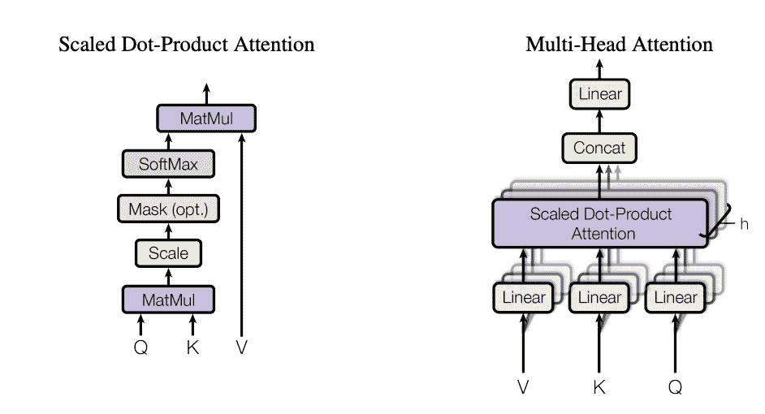
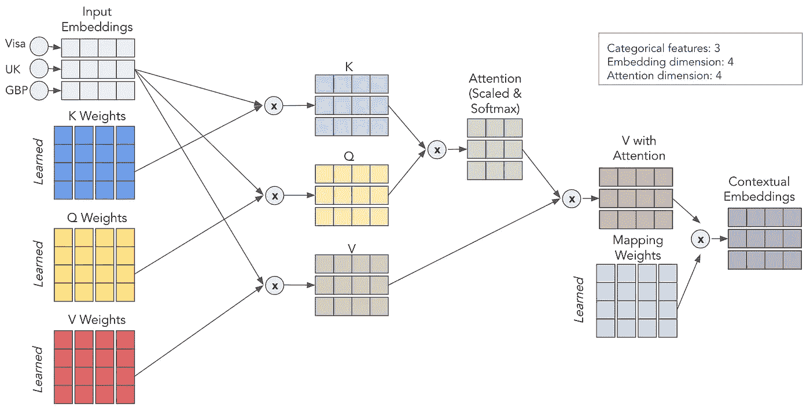
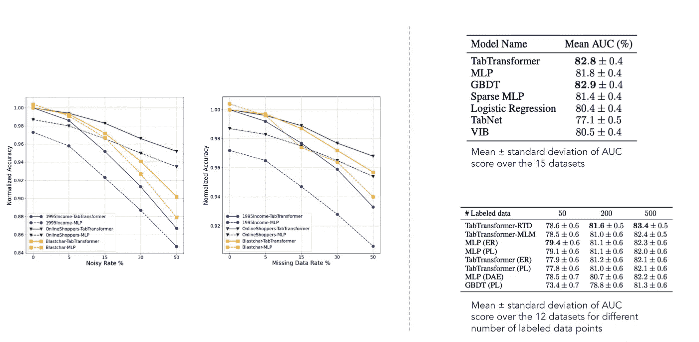

# 用于表格数据的转换器:TabTransformer 深入分析

> 原文：<https://towardsdatascience.com/transformers-for-tabular-data-tabtransformer-deep-dive-5fb2438da820>

## 理解我们的 TabTransformer 并学习应用它

[Samule 孙](https://unsplash.com/@samule?utm_source=medium&utm_medium=referral)在 [Unsplash](https://unsplash.com?utm_source=medium&utm_medium=referral) 上的照片

# 介绍

今天，变压器是大多数最先进的自然语言处理(NLP)和计算机视觉(CV)架构中的关键模块。尽管如此，表格领域仍然主要由梯度推进决策树(GBDT)主导，所以有人试图弥合这一差距是合乎逻辑的。第一个基于 transformer 的模型是由黄等人(2020)在他们的 [TabTransformer:使用上下文嵌入的表格数据建模](https://arxiv.org/abs/2012.06678)论文中介绍的。

这篇文章旨在提供论文的概述，深入模型细节，并向您展示如何使用 TabTransformer 处理您的数据。

# 论文概述

本文的主要思想是，如果我们使用转换器将正则范畴嵌入转换为上下文嵌入，正则多层感知器(MLP)的性能可以得到显著提高。让我们稍微消化一下这种说法。

## 范畴嵌入

在深度学习模型中使用分类特征的经典方法是训练它们的嵌入。这意味着每个分类值都有一个唯一的密集矢量表示，可以传递给下一层。例如，下面你可以看到每个分类特征都用一个 4 维数组表示。这些嵌入然后与数字特征连接，并用作 MLP 的输入。

带有范畴嵌入的 MLP。图片作者。

## 语境嵌入

该论文的作者认为，范畴嵌入缺乏上下文含义，即它们不编码范畴变量之间的任何交互和关系。为了将嵌入上下文化，建议使用当前在 NLP 中用于完全相同目的的转换器。

TabTransformer 中的上下文嵌入。图片作者。

为了形象化动机，考虑下面经过训练的上下文嵌入的图像。突出显示了两个分类特征— **关系(黑色)**和**婚姻状况(蓝色)**。这些特征是相关的，因此“已婚”、“丈夫”和“妻子”的值在向量空间中应该彼此接近，即使它们来自不同的变量。

经过训练的 TabTransformer 嵌入示例。图片作者。

通过训练的上下文嵌入，我们确实可以看到“已婚”的婚姻状态更接近于“丈夫”和“妻子”的关系水平，而“未婚”的分类值来自右侧的单独聚类。这种类型的上下文使得这些嵌入更加有用，而使用简单的分类嵌入是不可能的。

## TabTransformer 架构

考虑到上述动机，作者提出了以下架构:

TabTransformer 架构。改编自[黄等(2020)](https://arxiv.org/abs/2012.06678)

我们可以将该架构分为 5 个步骤:

1.  数字特征被标准化并向前传递
2.  嵌入了分类特征
3.  嵌入通过变换器块传递 N 次，以获得上下文嵌入
4.  上下文范畴嵌入与数字特征连接在一起
5.  连接通过 MLP 得到所需的预测

虽然模型架构非常简单，但作者表明，增加变压器层可以显著提高性能。当然，神奇之处就发生在这些变压器模块内部，所以让我们更详细地探索一下。

## 变形金刚(电影名)

变压器架构。改编自[瓦斯瓦尼等人(2017)](https://arxiv.org/abs/1706.03762)

你可能以前见过变形金刚的架构(如果你没有，我强烈推荐[这款带注释的笔记本](https://blog.varunajayasiri.com/ml/transformer.html))但是快速回顾一下，记住它由编码器和解码器部分组成(见上文)。对于 TabTransformer，我们只关心将输入嵌入上下文化的编码器部分(解码器部分将这些嵌入转换为最终输出)。但是它到底是怎么做到的呢？答案是——多头注意力机制。

## 多头注意力

引用我最喜欢的关于注意力机制的文章:

> 自我关注背后的关键概念是，它允许网络学习如何最好地在输入序列的片段之间传递信息。

换句话说，自我关注有助于模型找出在代表某个单词/类别时，输入的哪些部分更重要，哪些部分不太重要。我强烈推荐阅读上面引用的文章，以获得关于它为什么如此有效的良好直觉。

多头关注。改编自[瓦斯瓦尼等人(2017)](https://arxiv.org/abs/1706.03762)

注意力是通过三个学习矩阵来计算的——Q、K 和 V，分别代表查询、关键字和值。首先，我们将 Q 和 K 相乘得到注意力矩阵。该矩阵被缩放并通过 softmax 层。然后，我们将它乘以 V 矩阵得到最终值。为了更直观的理解，考虑下图，它显示了我们如何使用矩阵 Q、K 和 v 从输入嵌入到上下文嵌入。

自我关注流可视化。图片作者。

通过重复这个过程 *h* 次(用不同的 Q、K、V 矩阵),我们得到了多个上下文嵌入，形成了我们最终的多头注意力。

**简短回顾**

我知道这是很多，所以让我们总结一下上面所说的一切。

*   简单的分类嵌入不包括上下文信息
*   通过将分类嵌入传递给 Transformer Encoder，我们能够将嵌入上下文化
*   Transformer 架构可以将嵌入上下文化，因为它使用多头关注机制
*   多头注意力使用矩阵 Q、K 和 V 来寻找有用的相互作用和相关性，同时对变量进行编码
*   在 TabTransformer 中，上下文嵌入与数字输入连接，并通过简单的 MLP 输出预测

虽然 TabTransformer 背后的想法非常简单，但注意力的机制可能需要一些时间来掌握，所以我强烈建议你重新阅读上面的解释，如果你感到迷失，请按照所有建议的链接进行操作。会变得容易的，我保证！

## 结果

结果部分。改编自[黄等(2020)](https://arxiv.org/abs/2012.06678)

根据报告的结果，TabTransformer 优于所有其他深度学习表格模型(尤其是我在这里[提到的 TabNet](https://syslog.ravelin.com/classification-with-tabnet-deep-dive-49a0dcc8f7e8))。此外，它接近 GBDTs 的性能水平，这非常令人鼓舞。该模型对缺失和噪声数据也相对稳健，并在半监督设置中优于其他模型。然而，这些数据集显然不是详尽的，正如进一步的论文所证明的(例如 [this](https://arxiv.org/abs/2106.03253) )，仍然有很大的改进空间。

# 演示

现在，让我们最终了解如何将模型应用到您自己的数据中。示例数据取自[表格形式的操场追逐赛](https://www.kaggle.com/competitions/tabular-playground-series-aug-2022)。为了方便地使用 TabTransformer，我创建了一个`[tabtransformertf](https://github.com/aruberts/TabTransformerTF)`包。它可以使用`pip install tabtransformertf`进行安装，并允许我们在没有大量预处理的情况下使用该模型。下面您可以看到训练模型所需的主要步骤，但请务必查看[补充笔记本](https://www.kaggle.com/antonsruberts/tabtransformer)了解更多细节。

## 数据预处理

第一步是设置适当的数据类型，并将我们的训练和验证数据转换成 TF 数据集。先前安装的软件包有一个很好的实用工具来做到这一点。

下一步是为我们将传递给主模型的分类数据准备预处理层。

预处理到此为止！现在，我们可以开始构建模型了。

## TabTransformer 模型

初始化模型非常容易。有几个参数需要指定，但最重要的是— `embbeding_dim`、`depth`和`heads`。所有的参数都是在超参数调整后选择的，所以检查[笔记本](https://www.kaggle.com/antonsruberts/tabtransformer)来查看程序。

模型初始化后，我们可以像其他 Keras 模型一样拟合它。训练参数也可以调整，所以可以随意调整学习速度和提前停止。

## 估价

竞争指标是 ROC AUC，所以让我们一起使用它和 PR AUC 来评估模型的性能。

也可以自己给测试集打分，提交给 [Kaggle](https://www.kaggle.com/competitions/ieee-fraud-detection/overview) 。这个解决方案把我放在了前 35%的位置，这还不错，但也不算太好。为什么 TabTransfromer 表现不佳？可能有几个原因:

*   数据集太小，深度学习模型是出了名的数据饥渴
*   TabTransformer 很容易在像 tabular playground 这样的玩具例子上过度拟合
*   没有足够的分类特征使模型有用

# 结论

本文探讨了 TabTransformer 背后的主要思想，并展示了如何使用`[tabtransformertf](https://github.com/aruberts/TabTransformerTF)`包来应用它。

TabTransformer 是一个有趣的架构，在当时胜过了许多/大部分深度表格模型。它的主要优点是它将范畴嵌入情境化，这增加了它们的表达能力。它使用分类特征上的多头注意力机制来实现这一点，这是 Transformers 对表格数据的第一个应用之一。

该架构的一个明显缺点是数字特征被简单地传递到最终的 MLP 层。因此，它们没有被语境化，它们的值也没有在分类嵌入中被考虑。在下一篇的[文章中，我将探索如何修复这个缺陷并进一步提高性能。所以，一定要看完，给我你的想法！](/improving-tabtransformer-part-1-linear-numerical-embeddings-dbc3be3b5bb5)

# 接下来读什么…

*   [表格数据的转换器(第二部分):线性数字嵌入](/improving-tabtransformer-part-1-linear-numerical-embeddings-dbc3be3b5bb5)
*   [表格数据转换器(三):分段线性&周期编码](/transformers-for-tabular-data-part-3-piecewise-linear-periodic-encodings-1fc49c4bd7bc)