# 变形金刚在行动:注意力是你所需要的

> 原文：<https://towardsdatascience.com/transformers-in-action-attention-is-all-you-need-ac10338a023a>

## 变形金刚(电影名)

## 简短的调查、说明和实施


图一。人工智能生成的艺术品。提示:童话小屋风格的家的街景。[稳定扩散](https://huggingface.co/spaces/stabilityai/stable-diffusion)生成的照片。[链接到完整提示](https://gist.github.com/soran-ghaderi/105084c714f5bfc406dc1b4064fc9510)。

# 目录

1.[简介](#9dba)

2.[快速回顾注意力](#dc42)

3.[变压器架构](#f828)
3.1。[编码器和解码器组件](#ccd2)
3.1.1。[编码器](#761f)3 . 1 . 2
。[解码器](#0176)3.2
。[3.3 变压器](#dc94)中的模块
。[注意模块](#5cb5)
3.3.1。[3 . 3 . 2 缩放点积注意事项](#fcad)
。[多头关注](#d417)
3.4。3 . 4 . 1[注意变压器](#095c)中的变型。[自我关注](#80ae)
3.4.2。[被掩盖的自我注意(自回归或因果注意)](#825c)
3.4.3。[交叉关注](#36c1)
3.5。[逐位 FFN](#36df)
3.6。[残差连接和归一化](#01a4)
3.7。[位置编码](#1e8d)
3.7.1。[绝对位置信息](#845d)
3.7.2。[相对位置信息](#77d4)

4.[使用自我关注背后的动机](#c283)

5.[研究前沿](#16a4)

6.[问题](#ce9b)

7.[总结](#acde)

8. [TransformerX 库](#3a54)

9.[参考文献](#da58)

# 1.介绍

作为人工智能研究过程中的一个成功前沿， **Transformers** 被认为是一种新颖的深度前馈人工神经网络架构，它利用了自我注意机制，可以处理输入序列项之间的长程相关性。由于在行业和学术研究中取得了巨大成功，自 Vaswani 等人[3]于 2017 年提出以来，研究人员已经提出了丰富的变压器架构(也称为 X-formers)，并已在许多领域得到采用，如自然语言处理(NLP)、计算机视觉(CV)、音频和语音处理、化学和生命科学；他们可以在前面提到的学科中取得 SOTA 的成绩。在本文中，我通过底层数学、python 代码实现和不同层的可视化解释了 transformer 架构。端到端的例子可以在 GitHub 上的 [TransformerX 库库中找到。](https://github.com/tensorops/TransformerX)

# 2.注意力的快速回顾

诸如注意机制和与编码器-解码器模型相关的术语等低级概念是变形金刚的基本思想。因此，我提供了这些方法的简要总结。

注意是一种认知资源的分配方案，具有有限的处理能力**【1】。**

**Bahdanau 等人[2]提出的注意力背后的一般思想是，当翻译每一步中的单词时，它搜索位于输入序列中不同位置的最相关的信息。在下一步中，它为源令牌(单词)wrt 生成翻译。1)这些相关位置的上下文向量，以及 2)先前同时生成的单词。**

**它们可以根据几个标准分为不同的类别，例如:**

*   ****注意的柔软度:**
    1。软 2。硬 3。本地 4。全球的**
*   ****输入特征的形式:**
    1。逐项 2。位置方面**
*   ****输入表示:** 1。共同关注 2。自我关注 3。与众不同的注意力。分层注意**
*   ****输出表示:**
    1。多头 2。单输出 3。多维的**

> **如果你觉得注意力机制处于未知领域，我推荐你阅读下面这篇文章:**

**</rethinking-thinking-how-do-attention-mechanisms-actually-work-a6f67d313f99> ** 

# **3.变压器架构**

**基本变换器[3]架构由两个主要构建模块组成，即编码器和解码器模块。编码器从输入表示序列(𝒙₁ *，…，* 𝒙ₙ)生成嵌入向量𝒁 = (𝒛₁ *，…，* 𝒛ₙ)，并将其传递给解码器以生成输出序列(𝒚₁ *，…，* 𝒚ₘ).)在每一步产生输出之前，𝒁向量被输入解码器，因此模型是自回归的。**

**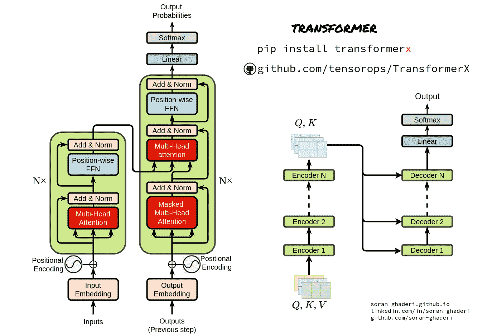**

**图二。变压器架构。照片由[作者](https://www.linkedin.com/in/soran-ghaderi/)拍摄。**

## **3.1.编码器和解码器组件**

**与序列到序列模型类似，转换器使用编码器-解码器架构。**

## **3.1.1.编码器**

**编码器只是多个组件或层的堆叠——𝑵*在原始论文中是 6——它们本身是一组两个子层，即多头自关注块和简单的位置式 FC FFN(全连接前馈网络)。为了实现更深的模型，研究人员通过包裹两个子层中的每一个，然后进行层归一化，来练习剩余连接。因此，每个子层的输出都是*layer norm(*𝒙*+sublayer(*𝒙*)*， *Sublayer(* 𝒙 *)* 是在自身内部实现的函数。所有子层以及嵌入的输出维度是𝒅 *_model = 512* 。***

***变压器编码器模块的实现:***

***Transformer 编码器实现( [TransformerX Discord](https://discord.gg/7BF9KUnBNT) 服务器讨论)。由[作者](https://github.com/soran-ghaderi)编写的代码。***

## ***3.1.2.解码器***

***除了编码器中使用的子层之外，解码器对编码器组件的输出应用多头关注。像编码器一样，残差连接被附加到子层，然后进行层归一化。为了保证位置𝒊的预测可以仅依赖于先前已知的位置这一事实，将另一个修改应用于自关注子层，以防止位置关注其他位置，同时将输出嵌入偏移一个位置。***

***变压器解码器模块的实现:***

***Transformer 解码器实现( [TransformerX Discord 服务器](https://discord.gg/7BF9KUnBNT)供讨论)。代码由[作者](https://github.com/soran-ghaderi)编写。***

## ***3.2.变压器中的模块***

***接下来，我将讨论组成原始 transformer 架构的基本组件。***

1.  ***注意模块***
2.  ***位置式前馈网络***
3.  ***剩余连接和规范化***
4.  ***位置编码***

## ***3.3.注意模块***

***该转换器集成了来自信息检索的查询键值(QKV)概念和注意机制***

*   ***标度点积注意力***
*   ***多头注意力***

## ***3.3.1.标度点积注意力***

***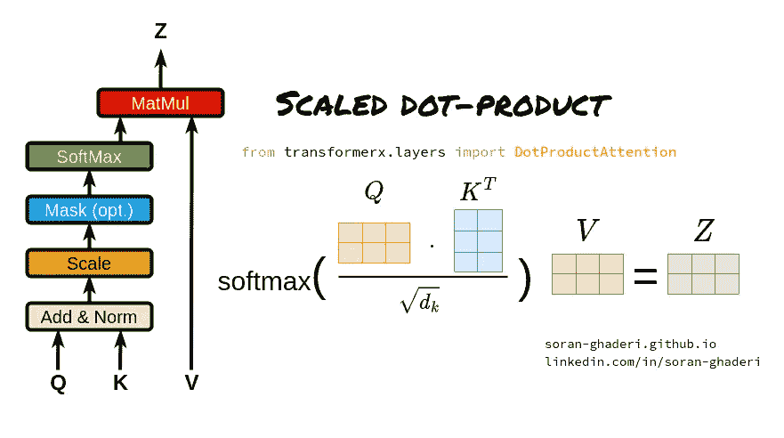***

***图 3。成比例的点积注意力。照片由[作者](https://www.linkedin.com/in/soran-ghaderi/)拍摄。***

***缩放的点积注意力被公式化为:***

***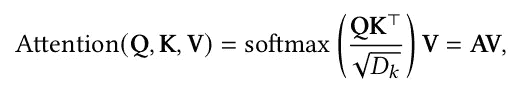***

***情商。一***

***其中𝑲 ∈ ℝ^𝑀×𝐷𝑘、𝑸 ∈ ℝ^ 𝑵 ×𝐷𝑘和𝑽 ∈ ℝ^ 𝑴×𝐷𝑣是表示矩阵。键(或值)和查询的长度分别由𝑴和𝑵表示，它们的维度由𝐷𝑘和𝐷𝑣.表示方程中的矩阵𝑨。1 通常被称为注意力矩阵。他们使用点积注意力而不是加法注意力的原因是由于矩阵乘法优化技术，在实践中的速度和空间效率，加法注意力使用具有单个隐藏层的前馈网络来计算兼容性函数。尽管如此，对于大𝐷𝑘值的点积有一个很大的缺点，它会将 softmax 函数的梯度推到极小的梯度。为了抑制 softmax 函数的梯度消失问题，键和查询的点积除以𝐷𝑘的平方根，由于这个事实，它被称为缩放的点积。***

***点积注意模块的实现:***

***使用 TransformerX 的缩放点积实现( [Discord 社区](https://discord.gg/7BF9KUnBNT)讨论)。代码作者[作者](https://github.com/soran-ghaderi)。***

## ***3.3.2.多头注意力***

***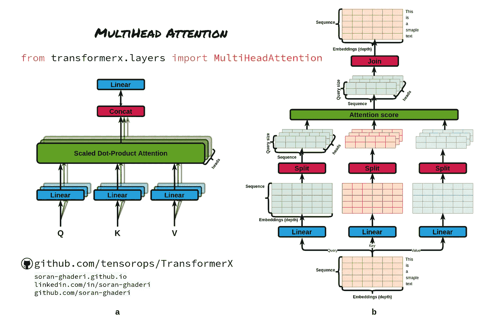***

***图 4。a .多头关注。b .多头注意中张量运算的端到端流程。照片由[作者](https://www.linkedin.com/in/soran-ghaderi/)拍摄。***

***引入多个注意头而不是单个注意函数，Transformer 分别用不同的、学习到的线性投影 *h* 次将𝐷𝑚-dimensional 原始查询、键和值线性投影到𝐷𝑘、𝐷𝑘和𝐷𝑣维度；通过它，注意力函数(等式。1)在这些投影上可以并行执行，产生𝐷𝑣-dimensional 输出值。该模型然后将它们连接起来，并产生一个𝐷𝑚-dimensional 表示。***

***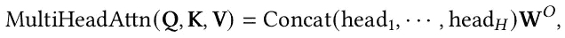***

***情商。2***

***在哪里***

***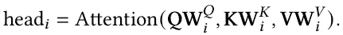***

***情商。3***

***这些投影是𝑾𝑸ᵢ ∈ ℝ^d_model×dk、𝑾𝑲ᵢ ∈ ℝ^d_model×dk、𝑾𝑽ᵢ ∈ ℝ^d_model×dv 和𝑾𝒐 ∈ ℝ^h*dv×d_model 矩阵。***

***这个过程使得变换器能够共同关注不同的表示子空间和位置。为了使它更具体，对于一个特定的形容词，一个头可能捕捉形容词的强度，而另一个头可能关注它的消极和积极。***

***多头注意力的实现***

***使用 transformer x([Discord community](https://discord.gg/7BF9KUnBNT))的多头注意力实现。代码由[作者](https://github.com/soran-ghaderi)编写。***

***可以看出，多头注意力具有三个确定张量维度的超参数:***

*   ***注意力头的数量***
*   ***模型大小(嵌入大小):嵌入向量的长度。***
*   ***查询、键和值大小:输出查询、键和值矩阵的线性图层使用的查询、键和值权重大小***

## ***3.4.变压器中的注意变量***

***在最初的 Transformer 论文中使用了三种不同的方式来使用注意力，这三种方式在将键、查询和值提供给注意力函数的方式上是不同的。***

*   ***自我关注***
*   ***隐蔽的自我注意(自回归或因果注意)***
*   ***交叉注意***

## ***3.4.1.自我关注***

***所有的关键字、查询和值向量来自相同的序列，在变换器的情况下，编码器的前一步输出，允许编码器的每个位置同时关注它自己的前一层中的所有位置，即𝑸 = 𝑲 = 𝑽 = 𝑿(前一编码器输出)。***

***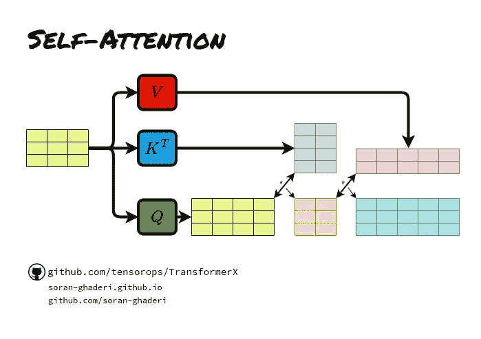***

***图 5。自我注意张量运算。照片由[作者](https://www.linkedin.com/in/soran-ghaderi/)拍摄。***

## ***3.4.2.隐蔽的自我注意(自回归或因果注意)***

***尽管有编码器层，但在解码器的自我关注中，查询被限制在它们之前的键值对位置以及它们的当前位置，以便保持自回归特性。这可以通过屏蔽无效位置并将其设置为负无穷大来实现，即𝑨𝒊𝒋=∞。如果𝒊 < 𝒋.***

## ***3.4.3\. Cross-attention***

***This type of attention obtains its queries from the previous decoder layer whereas the keys and values are acquired from the encoder yields. This is basically the attention used in the encoder-decoder attention mechanisms in sequence-to-sequence models. In other words, cross-attention combines two different embedding sequences with the exact dimensions which derive its queries from one sequence and its keys and values from the other. Let’s assume *S1* 和 *S2* 是两个嵌入序列，交叉注意力从 *S1* 获得其键和值，并从 *S2* 获得其查询，然后计算注意力得分并产生长度为 *S2* 的结果序列。在转换器的情况下，键和值来自编码器，查询来自前一步骤的解码器输出。***

***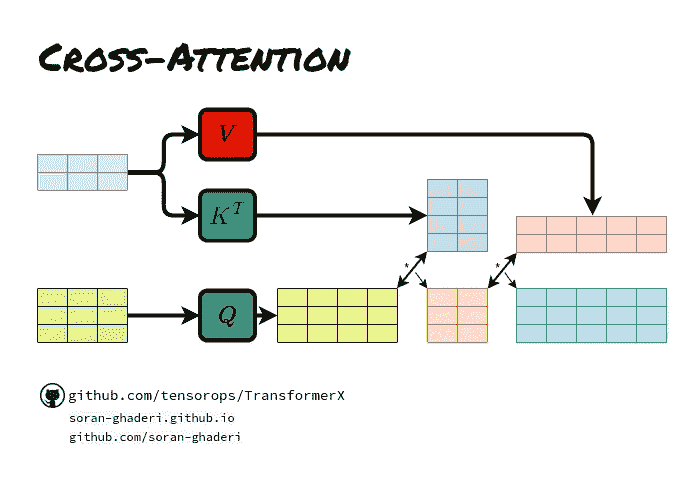***

***图 6。交叉注意张量运算。照片由[作者](https://www.linkedin.com/in/soran-ghaderi/)拍摄。***

***值得一提的是，两个输入嵌入序列可以是不同的形式(即文本、图像、音频等。).***

## ***3.5.位置明智的 FFN***

***在编码器和解码器中的每个子层之上，以完全相同的方式单独地将位置式全连接前馈网络应用于每个位置，然而，参数在层与层之间是不同的。它是一对线性层，中间有一个 ReLU 激活函数；它等同于内核大小为 1 的两层卷积。***

***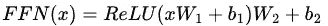***

***情商。四***

***其中 *x* 为前一层的输出，𝑾₁ ∈ ℝ^𝐷_ *模型* × 𝐷𝑓，𝑾₂ ∈ ℝ^𝐷𝑓 × 𝐷_ *模型*，𝒃₁ ∈ ℝ^𝐷𝑓，T7 模型为可训练矩阵，内层***

***实施基于位置的 FFN:***

***逐位 FFN 实现([变压器 x 不和谐社区](https://discord.gg/7BF9KUnBNT))。由[作者](https://github.com/soran-ghaderi)编写的代码。***

## ***3.6.剩余连接和规范化***

***用剩余连接包装每个模块支持更深层次的架构，同时避免梯度消失/爆炸。因此，转换器使用模块周围的剩余连接，然后进行层规范化。它可以表述如下:***

*   ***𝒙′=layernorm(selfattention(𝑿)+𝑿)***
*   ***𝒙=layernorm(ffn(𝒙*'*)+𝒙*'*)***

***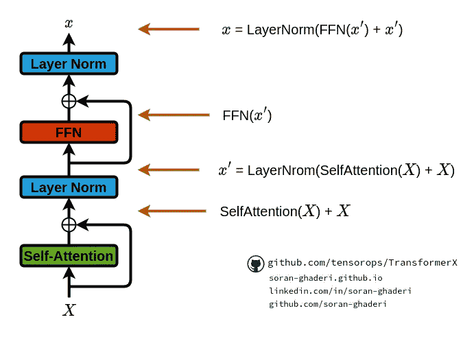***

***图 7。剩余连接和层标准化。照片由[作者](https://www.linkedin.com/in/soran-ghaderi/)拍摄。***

***剩余连接和归一化的实现:***

***剩余连接和归一化实现( [TransformerX Discord](https://discord.gg/7BF9KUnBNT) 服务器讨论)。由[作者](https://github.com/soran-ghaderi)编写的代码。***

## ***3.7.位置编码***

***Transfomer 的研究人员使用了一个有趣的想法，将有序感注入到输入令牌中，因为它没有递归或卷积。绝对和相对位置信息可用于暗示输入的序列顺序，其可以被学习或固定。矩阵之间的求和过程需要相同大小的矩阵，因此，位置编码维数与输入嵌入维数相同。它们被注入编码器和解码器模块底部的输入编码中。Vaswani 等人[3]在正弦和余弦函数的帮助下使用固定位置编码，然而，他们试验了相对位置编码，并意识到在他们的情况下，它产生几乎相同的结果[4]。设𝑿是包含 n 个 *d* 维嵌入的表征的输入表示。位置编码产生𝑿 + 𝑷，其中𝑷是相同大小的位置嵌入矩阵。第 I 行 *(2* 𝒋 *)第*或 *(2* 𝒋 *+1)第*列的元素为:***

***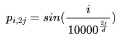***

***情商。5***

***和***

***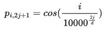***

***情商。七***

***在位置嵌入矩阵 P 中，行表示记号在序列中的位置，列表示不同的位置编码维度。***

***位置编码实现([transformer x Discord community](https://discord.gg/7BF9KUnBNT))。由[作者](https://github.com/soran-ghaderi)编写的代码。***

***在下面的可视化中，我描述了矩阵𝑷中 4 列之间的差异。请注意不同列的不同频率。***

***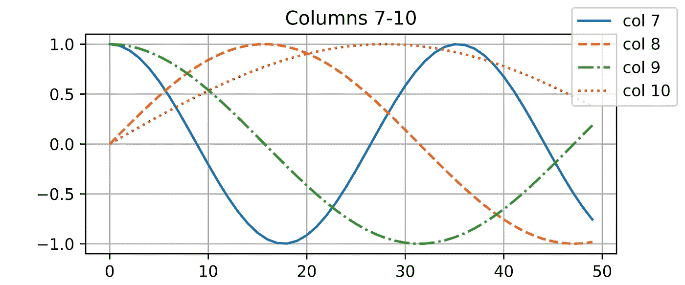***

***图 8。位置编码。照片由[作者](https://www.linkedin.com/in/soran-ghaderi/)拍摄。***

## ***3.7.1.绝对位置信息***

***在位置编码类型中，频率根据元素的位置交替变化。举例来说，看看下面的二进制编码；最没有价值的位置(右侧)上的数字波动更频繁，而具有更有价值的位置的其他数字相对于它们的位置具有较少的波动，即最有价值的位置更稳定。***

```
*0 **->** 000
1 **->** 001
2 **->** 010
3 **->** 011
4 **->** 100
5 **->** 101
6 **->** 110
7 **->** 111*
```

## ***3.7.2.相对位置信息***

***除了上面的位置编码，另一种方法是学习通过相对位置来参加。对于任何固定位置的𝛿，𝛿+𝒊的位置编码可以通过将其线性投影到位置𝒊 *得到。*让*ψ*=1/(10000^(2𝒋/d))，任何一对情商。4 和 eq。对于任何固定的偏移𝛿:，可以线性投影到𝛿+𝒊的位置***

******

***情商。七***

# ***4.使用自我关注背后的动机***

***在“注意力是你所需要的全部”[3]论文中，研究人员在将自我注意力与卷积层和递归层进行比较时考虑了多个标准。这些需求可以分为三大类:***

***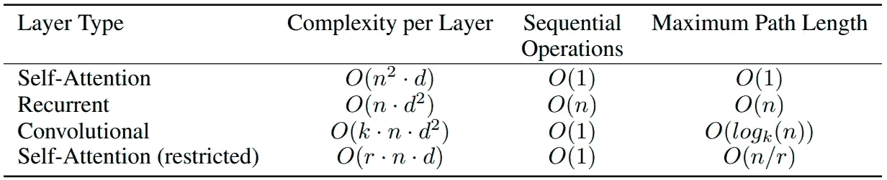***

***表 1。每层的计算复杂度、每层中发生的最小顺序操作以及最大路径长度。其中 *n 表示序列长度，d 表示表示的维数，k 表示卷积的核大小，r 表示受限自我关注中的邻域大小。表来自[3]。****

*   *****计算复杂度**:每层计算复杂度的总量***
*   *****并行化**:计算可以并行到什么程度***
*   *****学习长程相关性**:处理网络中长程相关性的能力***
*   *****可解释性**:检查学习到的分布的能力和关注输入的语义和句法特征的能力***

***表 1 说明了当序列长度 *n* 小于表示维度 *d* 时，自我注意在计算复杂度上优于递归层，这在 SOTA 翻译模型中是常见的情况，如单词片段[5]和字节对[6]表示。**受限自关注**是普通自关注的一个更复杂的版本，当涉及到非常长的输入序列中的计算复杂性时，它仅使用来自相应输出位置周围的输入序列的有限数量的大小为 *r* 的邻居。此外，当使用连续内核时，它可以击败需要几个 Conv 层的卷积层，其复杂性为𝑶 *(n/k)* ，对于扩张卷积，其复杂性为𝑶*(log _ k(n))*【7】。这种层的堆叠又延长了网络中任意两个位置之间的最长路径。卷积层的计算开销通常是递归层的 k 倍。值得一提的是，可分离卷积的复杂度要低得多，然而，在最好的情况下，它相当于自关注层和前馈层的组合。***

# ***5.研究前沿***

***最近的变体试图通过进一步探索改进架构的不同路线来提高原始作品的性能，即:***

*   *****效率**:自我注意力在处理长序列时会导致计算和记忆的复杂性，这促使研究人员通过引入轻量级注意力解决方案(例如稀疏注意力变体)和分治方法(例如递归和分层机制)来解决这个问题。***
*   *****一般化**:由于对输入数据的结构偏差不敏感，转换器需要大量的数据进行训练，因此需要引入结构偏差或正则化、对大规模未标记数据进行预训练等工作。来克服这个障碍。***
*   *****适应**:由于变形金刚有能力被各种领域采用，研究人员试图将它们与特定的下游任务整合在一起。***

# ***6.问题***

***在这一部分，我邀请你思考以下问题，并尝试在评论中给出答案。***

1.  ***如果你在《变形金刚》中用加法注意力取代比例点积注意力，会发生什么？***
2.  ***如果我们想使用转换器进行语言建模，我们应该使用编码器、解码器还是两者都用？***
3.  ***如果变压器的输入过长，会发生什么情况？我们该如何应对？***
4.  ***我们能做些什么来提高变压器的计算和存储效率？***

***说到这里，请留下评论，描述您认为哪些部分令人困惑或含糊不清。这篇文章对你有什么影响，你还想知道关于媒体写作的哪些话题。***

***我们可以在[不和谐服务器](https://discord.gg/7BF9KUnBNT)上进一步讨论它们。***

# ***7.摘要***

***在本文中，您了解了 Transformer 架构及其实现，并看到了它在不同领域带来的重大突破，如机器翻译、计算机视觉以及其他一些学科，同时降低了它们的复杂性，并使它们更具可解释性。转换器的另一个基本组件是不同头的并行化能力，因为它完全使用多头自关注，而不是使用递归或卷积层。现在，您已经熟悉了变压器的主要组件。***

***我希望这篇文章对你有所帮助。如果你有，请分享到你最喜欢的社交媒体频道，这样其他人也可以找到它。***

***我写关于机器学习和其他技术主题的最新研究。如果你对其中任何一个感兴趣，请查看并[跟随我](https://soran-ghaderi.medium.com/)。***

# ***8.TransformerX 库***

***[**transformer x**](https://github.com/tensorops/TransformerX)**是一个 python 库，为研究人员、学生和专业人士提供开发、培训和评估 transformer 所需的构建模块，并顺利集成到 Tensorflow 中(我们将很快添加对 Pytorch 和 JAX 的支持)。我们正在积极努力增加更多的功能。(我们最近发布了它的第一个版本，我非常感谢给我们一个🌟在 Github 上🌹)*****

*****我想请你在 [GitHub](https://github.com/soran-ghaderi) 上关注我，如果你想为一个尖端的深度学习库(TransformerX)做贡献，请随时联系我，我们期待着你的来信。我们将指导您完成第一笔捐款的每一步。*****

*****你也可以在 [TransformerX Discord 服务器](https://discord.gg/7BF9KUnBNT)和 [Twitter](https://twitter.com/tensorops) 上加入我们，我们会保持联系。*****

*****<https://www.linkedin.com/in/soran-ghaderi/> ***** 

# *****9.参考*****

*****[1] J. R. Anderson，2005，《认知心理学及其启示》，沃斯出版社，2005 年。
[2] D. Bahdanau，K. Cho，Y. Bengio，联合学习对齐和翻译的神经机器翻译，载:ICLR。
[3]阿什什·瓦斯瓦尼、诺姆·沙泽尔、尼基·帕马尔、雅各布·乌兹科雷特、Llion Jones、艾丹·戈麦斯、祖卡斯·凯泽和伊利亚·波洛舒欣。你需要的只是关注。NeurIPS，2017。
[4]乔纳斯·戈林、迈克尔·奥利、大卫·格兰吉尔、丹尼斯·亚拉茨和扬恩·多芬。卷积序列到序列学习。arXiv 预印本 arXiv:1705.03122v2，2017。
【5】吴永辉、迈克·舒斯特、、郭维乐、穆罕默德·诺鲁齐、沃尔夫冈·马切里、马克西姆·克里昆、、秦高、克劳斯·马切里等.谷歌的神经机器翻译系统:弥合人类与机器翻译之间的鸿沟。arXiv 预印本 arXiv:1609.08144，2016。
[6]丹尼·布里兹、安娜·戈尔迪、吴明堂和郭诉乐。神经机器翻译架构的大规模探索。更正，abs/1703.03906，2017。
[7]纳尔·卡尔希布伦纳、拉塞·埃斯佩霍尔特、卡伦·西蒙扬、亚伦·范登欧德、亚历克斯·格雷夫斯和科拉伊·卡武克库奥卢。线性时间内的神经机器翻译。arXiv 预印本 arXiv:1610.10099v2，2017。*****