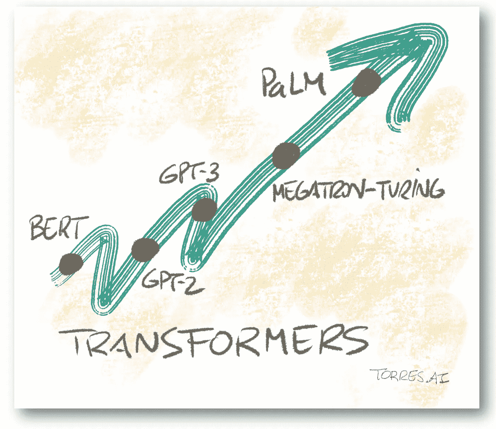
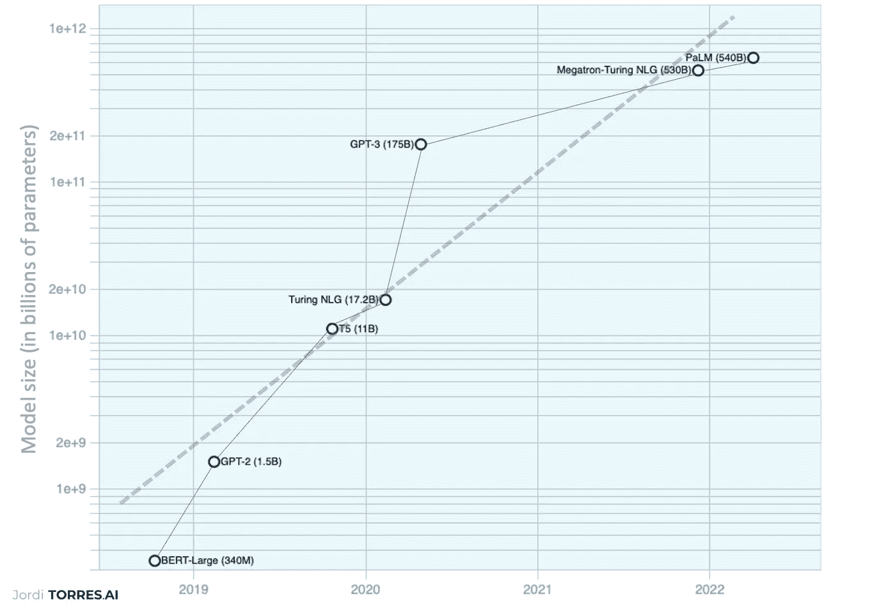
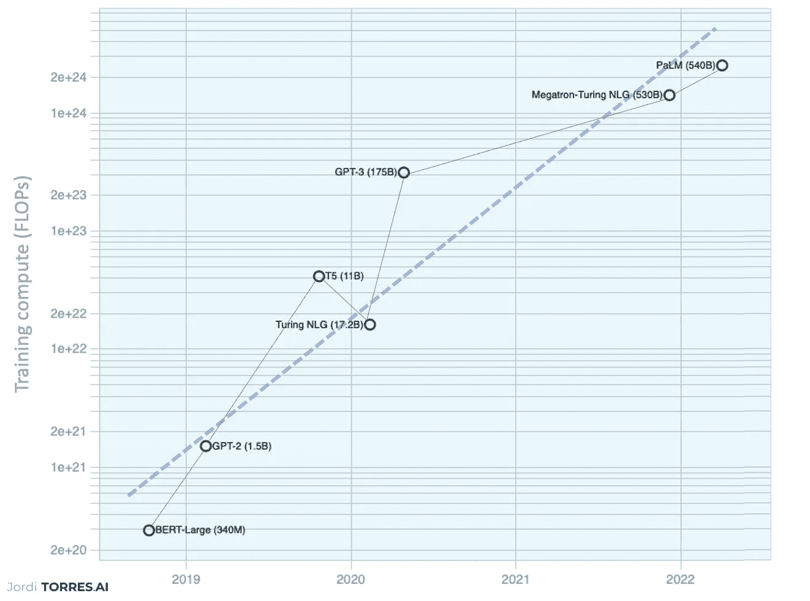

# 变形金刚:越大越好？

> 原文：<https://towardsdatascience.com/transformers-the-bigger-the-better-19f39f222ee3>

## 谷歌再次给我们带来惊喜，它创造了变压器参数数量的新纪录

*(图片由* [*作者*](https://torres.ai) *)*

([西班牙语版](https://torres.ai/nuevo-record-de-google-en-el-tamano-de-un-modelo-de-lenguaje-con-transformers/))

使用[变压器](https://torres-ai.medium.com/how-to-take-advantage-of-the-new-disruptive-ai-technology-called-transformers-9e57a26506cb)的大型语言模型目前构成了人工智能领域最活跃的领域之一，由于所需的计算资源，只有少数技术公司负担得起。几天前， [Google 用一个语言模型](https://storage.googleapis.com/pathways-language-model/PaLM-paper.pdf)中参数数量的新纪录让我们大吃一惊。

# **迄今为止最大的型号**

自 2018 年 [BERT](https://arxiv.org/pdf/1810.04805.pdf) 以来，其他几个大型语言模型(这些模型都是 [Transformer 架构](https://arxiv.org/pdf/1706.03762.pdf)的变体)已经被开发出来，这继续推动了艺术的发展。这些模型的改进主要来自于根据参数数量来缩放模型的大小(图 1)。谷歌的这个最新模型名为 Pathways 语言模型(PaLM ),优于目前所有现有的模型。具体来说，这个模型包括 5400 亿个参数，比迄今为止最大的模型，即所谓的微软/英伟达[威震天-图灵 NLG](https://arxiv.org/abs/2201.11990) 多 100 亿个参数。两者的参数都是著名的 [GPT-3](https://arxiv.org/abs/2005.14165) 的三倍多，后者“只有”1750 亿个参数。

*图 1:最先进的主要大型语言模型大小随时间变化的趋势(图片由作者提供)。*

# 需要大量的计算资源

正如我们在之前的几篇文章中讨论的那样，[人工智能是一个超级计算问题](/artificial-intelligence-is-a-supercomputing-problem-4b0edbc2888d)。因此，基于转换器的大型语言模型需要大量的计算资源来训练。谷歌报告称，这种模式需要 25.6 亿次失败。具体来说，他们已经使用了*“6144 个 TPU v4 芯片 1200 小时，3072 个 TPU v4 芯片 336 小时”*，也就是在一个巨型超级计算系统中已经需要超过两个月的执行时间。

在图 2 中，我们包括了我们在图 1 中展示的模型在模型训练所需的 FLOPs 方面的计算要求。在这个图中，我们可以很快观察到与模型规模成比例的计算需求的增长趋势。

*图 2:主大型语言模型的 FLOPs(指数轴)训练计算(图片由作者提供)。*

众所周知，能耗是最重要的运营变量之一，因为组成超级计算数据中心的不同元素需要大量能源。幸运的是，作者报告说，他们主要使用清洁能源来训练模型:*“俄克拉荷马州的数据中心主要由风力和其他可再生能源提供动力，在 PaLM-540B 被训练的时间段内，以 89%的无碳能源运行”*。好消息！

# **仍有改进的空间**

根据[文章](https://goo.gle/palm-paper)，所提出的模型显示了迄今为止相对于现有模型的卓越改进:推理、自然语言理解/生成或代码生成。在谷歌人工智能博客的[这篇文章中，](https://ai.googleblog.com/2022/04/pathways-language-model-palm-scaling-to.html)你可以找到 PaLM 性能优于以前型号的令人信服的例子。

但值得注意的是，作者认为该模型仍然可以通过增加其规模来改善其结果，因为他们已经验证了该模型的性能作为规模的函数(在本文中，他们对表 1 中所示的同一模型的三个不同规模进行了实验)遵循与以前的模型类似的线性对数行为，这表明规模带来的性能增益尚未达到稳定状态。有尝试改进的空间。

表 1:为了更好地理解缩放行为，[文章](https://goo.gle/palm-paper)显示了三种不同参数缩放的结果(图片来源于[文章](https://goo.gle/palm-paper))。

此外，考虑到 DeepMind 几天前刚刚发表的一篇文章表明这些模型的性能可以通过比参数更积极地扩展数据来大幅提高，如果对大量数据进行训练，该模型可能会更加强大。

# **结论**

谷歌提出的这个模型是一系列趋势的最新一个，证明了通过使用超级计算机(由数千个加速器组成)扩展它们，它们的性能可以在各种自然语言处理、推理和代码任务中得到改善。此外，随着这一研究领域的快速交叉授粉，未来似乎很快就会到来。这种迅速引发了另一场急需解决的关键辩论，这场辩论与我们正在创造的伟大语言模型相关的[道德和社会风险有关。但是我们把这个留给另一篇文章。](https://arxiv.org/pdf/2112.04359.pdf)

<https://torres-ai.medium.com/how-to-take-advantage-of-the-new-disruptive-ai-technology-called-transformers-9e57a26506cb>  <https://torres-ai.medium.com/transformers-the-new-gem-of-deep-learning-d0ae04bc4a75>  <https://torres-ai.medium.com/transfer-learning-the-democratization-of-transformers-1d2493b14883> 