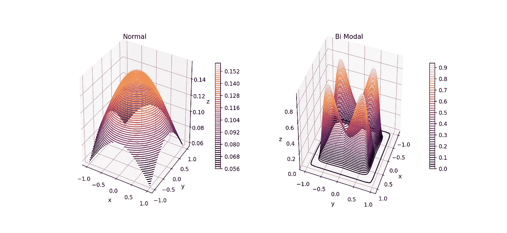
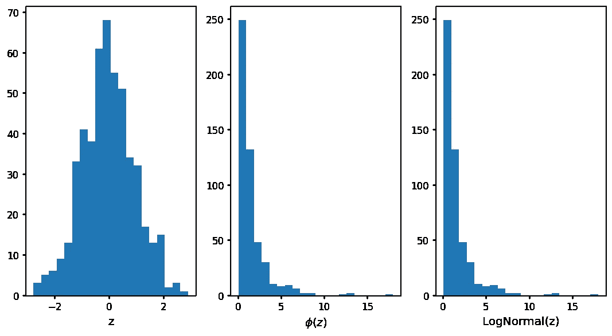
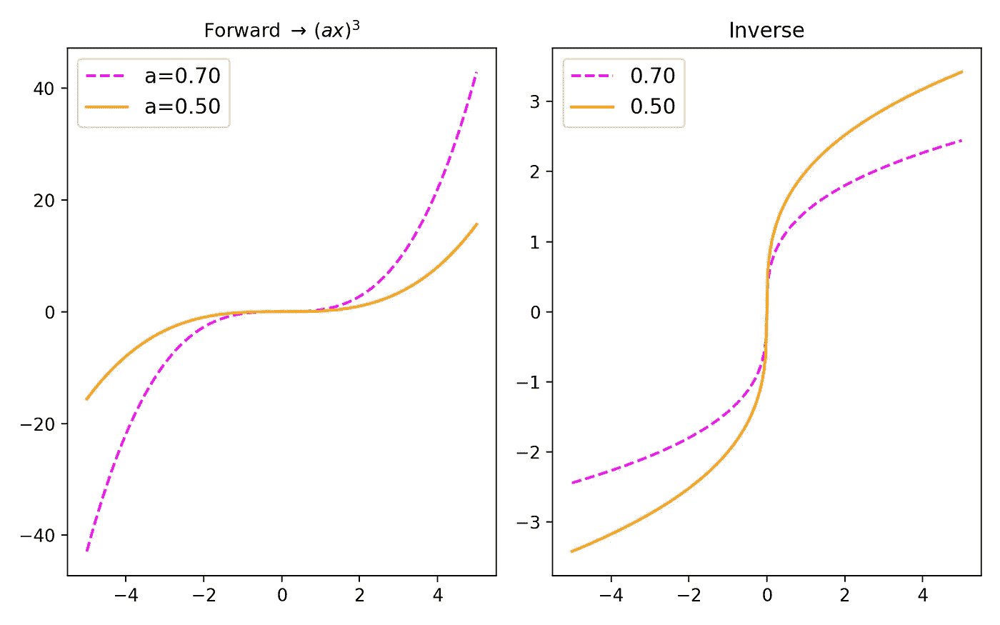
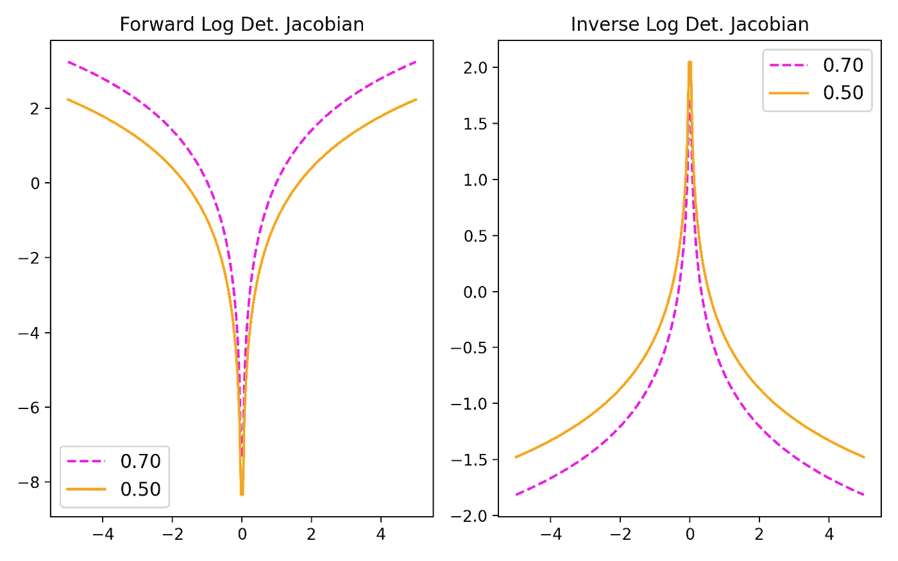
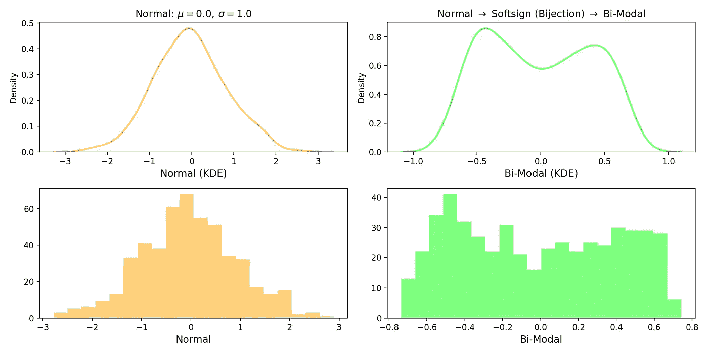
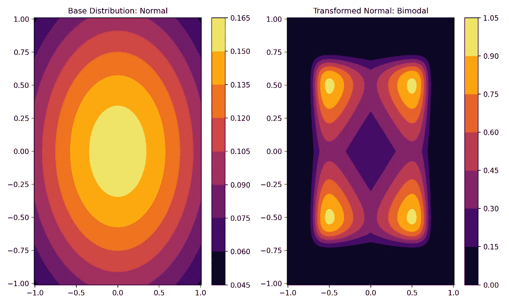

# 转换概率分布和标准化流程

> 原文：<https://towardsdatascience.com/transforming-probability-distributions-using-normalizing-flows-bcc5ed6ac2c9>

## 使用张量流使用简单的双投影变换分布



使用双射变换的正态到双峰分布。(图片由作者提供)

你可以从这篇文章中学到/回顾到什么—

1.  开始使用 [TransformedDistribution](https://www.tensorflow.org/probability/api_docs/python/tfp/distributions/TransformedDistribution) 模块(在 TensorFlow Probability library 中)通过双射运算转换基本分布。
2.  在 TensorFlow 中编写我们自己的自定义双射函数。
3.  如何在自定义双射函数中定义正向和反向变换？
4.  可视化原始和定制转换的发行版。

如果你想回顾双射和微分同胚的基础，作为规范化流程的开始，请查看[以前的帖子](https://medium.com/towards-data-science/getting-started-with-normalizing-flows-linear-algebra-probability-f2b863ff427d)；我们已经学习了双投影、雅可比和变换概率分布的基础知识，并推导了一些逆向和正向变换的数学公式，这些都将在本文中大量使用。所有的代码都可以在我的 GitHub 中找到，查看下面的参考资料。不要耽搁，让我们开始吧！

## 已转换的分发类:

在上一篇文章中，我们看到了如何定义一个双射体，并调用正向或反向方法来转换张量。在 TensorFlow 概率分布模块(`tfp.distributions`)中，TransformedDistributions 类帮助我们为分布做这件事，让我们看一个例子。让我们从正态分布开始，我们知道该分布的指数函数将遵循对数正态分布。我们将使用`TransformedDostributions`进行验证，我们从`Normal`分布开始，并使用指数双射器，如下所示:

这里我们从第 16 行(`tfd.Normal`)的正态分布开始，并在第 19 行(`tfb.Exp()`)引入了指数双射体。为了从正态转换到对数正态，我们在第 22 行中称之为 TransformedDistribution。为了确认给定起始正态分布，我们实际得到了对数正态分布，通过调用`tfd.Normal`并绘制这些分布的样本来验证，如下所示:



图 1:转换分布:从正态分布开始，我们达到对数正态分布ϕ(z)并用对数正态分布对数正态(z)进行验证。[图片由作者提供]

## 定义自定义对象:

在前面的示例中，我们使用了在 bijector 模块中已经可用的指数 bijector，但是如果我们想要一个在 bijector 模块中不可用的自定义操作呢？我们可以定义一个自定义的 bijector，方法类似于通过 Keras 中的[子类化来创建新层。让我们编写一个自定义 bijector 类，其中正向映射函数由 f → (ax)给出，其中 a，x ∈ R .为了编写自定义 bijector，我遵循了 GitHub 源代码中描述的](https://keras.io/guides/making_new_layers_and_models_via_subclassing/)`[tfp.bijectors.power](https://www.tensorflow.org/probability/api_docs/python/tfp/bijectors/Power)`类的结构。还提到不支持奇数整数作为幂:

> **像 1 这样的奇数的倒数的幂。/ 3 不被支持，因为数值精度问题使该属性难以测试。为了模拟这种行为，我们建议使用反向双向喷射器(即，而不是 tfb)。幂(幂=1。/3)使用 tfb。反转(tfb。幂(幂=3。))).**

下面的示例只是为了理解定义自定义 bijector 类的步骤:

前向方法实现 f → (ax)的 bijector 子类化示例。

给定这个简单的正向运算:f → (ax ),我们可以很容易地计算出正向 log-det-jacobian，这是上面代码块第 33 行的注释。给定正向 log-det-jacobian 函数，自动实现反向 log-det-jacobian。如果你想再次温习这些定义，请查看[上一篇文章](/getting-started-with-normalizing-flows-linear-algebra-probability-f2b863ff427d)。定义后，现在我们就可以使用该类了，我们可以用 python 绘制正向和反向转换的结果，如下所示:



图 2:给定一个函数 f → (ax ),我们画出正向和反向变换的结果。[图片由作者提供]

类似地，可以绘制正向和反向 log-det-Jacobian 的结果动作，如下所示:



图 3:给定一个函数 f → (ax ),我们画出雅可比行列式的正向和反向对数的结果。[图片由作者提供]

## 正态到双峰分布:

除了从正态分布到对数正态分布，另一个重要的基本转换是双峰正态分布。顾名思义，双峰指的是有两个峰值的分布。从正态分布开始，我们可以应用软符号双射运算来达到双峰分布，其中软符号函数定义如下:

```
def softsign(x): return x/(1+abs(x))
```

然而，这个双射在张量流概率中已经可用，所以我们可以像以前一样应用`TransformedDistribution`,让我们看看:

```
tf.random.set_seed(1234)normal_dist = tfd.Normal(loc=0., scale=1.0) 
# starting base distributionsample_s = 500normal_dist_sample = normal_dist.sample(sample_s, seed=10)## bijectorsoftsign = tfb.Softsign()# tf.random.set_seed(1234)bi_modal = tfd.TransformedDistribution(normal_dist, softsign)bi_modal_sample = bi_modal.sample(sample_s, seed=10)
```

我们可以根据转换后的分布绘制样本，如下所示:



图 4:从正态分布开始，我们应用软符号双射来达到双峰分布。[图片由作者提供]

我们还可以将转换后的分布和原始分布可视化为等值线图，如下图所示，左图显示正态分布，右图显示转换后的分布。



图 5:显示了基本分布(正态)和转换分布(双峰)的等值线图。[图片由作者提供]

除了 2D 等高线图，我们还可以绘制如下 3D 等高线图:


图 6:与图 5 相同，但是代替 2D 图，我们也可以将它们可视化为 3D 图。[图片由作者提供]

我们现在已经了解了规范化流程的所有基本要素；双射、转换概率分布、雅可比矩阵的正向和反向对数行列式的概念都在[之前的文章](/getting-started-with-normalizing-flows-linear-algebra-probability-f2b863ff427d)中描述过。在这里，我们学习了如何使用 TensorFlow 概率库来转换分布，以及一些我们自己定义自定义 bijector 类的例子。我们现在已经为深入研究基于正常化流的模型做好了准备，如 [RealNVP](https://arxiv.org/abs/1605.08803) 、 [Glow](https://arxiv.org/abs/1807.03039) 、[Masked Auto-Regressive Flow](https://arxiv.org/abs/1705.07057)等。更多基于流量的模型即将推出！

保持坚强！干杯！！

## 参考资料:

[1] [标准化流程:当前方法的介绍和回顾](https://arxiv.org/abs/1908.09257)。

[2]张量流[变换分布](https://www.tensorflow.org/probability/api_docs/python/tfp/distributions/TransformedDistribution)。

[3]岗位使用的代码:[笔记本](https://github.com/suvoooo/Learn-TensorFlow/blob/master/TF-Proba/Norm-Flows/NormFlow_TransformDistribution.ipynb)。

*除特别注明外，所有图片均为作者所有。*