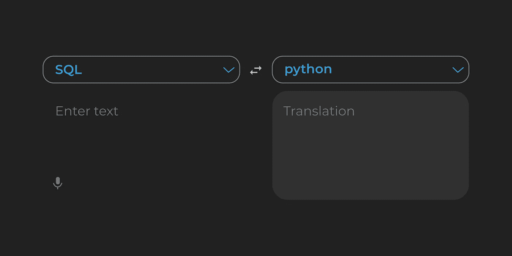

# 将 SQL 翻译成 Python-第 1 部分

> 原文：<https://towardsdatascience.com/translating-sql-into-python-part-1-92bf385d08f1>

## 有点像谷歌翻译，但对于̶l̶o̶v̶e̶语言的数据



作者图片

如果您对 Python 中 SQL 的相应语法感到厌倦，那么您就找对地方了。用两种语言写作的能力不仅能让你对客户或雇主更有吸引力，还能让你写出更高效、更精简的数据流程，从而节省你的大量时间。

在 python 中，您可以创建一个直接查询 SQL 数据库的脚本(使用您的 SQL 语言)，然后在同一个脚本中编写后续的数据流程(使用您的 python 语言)。我现在就不说舌头了，继续举几个例子。使用下面的内容跳到感兴趣的部分。

如果这里没有涉及到您想要的内容，那么可能会在下面的第 2 部分中讨论，包括 groupbys、datetimes、cast whens 和其他杂项功能。

</translating-sql-into-python-part-2-5b69c571ddc3>  

**目录:**

1.  <#80ca>
2.  **<#ca3b>**
3.  ****<#05ca>**的‘更新’******
4.  ******<#bc42>******
5.  ******<#f9a7>******

******首先，确保您已经安装了 pandas 库(这是 Anaconda 包的默认设置),并使用以下命令将其导入到您的脚本中:******

```
****import pandas as pd****
```

# ********1。**中的“选择”******

******a.全选******

```
******-- SQL**
select * from table
**# python**
table****
```

******b.选定列******

```
******-- SQL**
select col1 from table
**# python**
table.col1****
```

******c.选择所有唯一记录******

```
******-- SQL**
select distinct * from table
**# python**
table1.drop_duplicates()****
```

******d.从特定列中选择所有唯一记录******

```
******-- SQL**
select distinct col1, col2, col3 from table1 
**# python**
table1.drop_duplicates(subset = [col1, col2, col3])****
```

# ********2。**在哪里******

******a.其中列等于 x******

```
******-- SQL**
select * from table1 where col1 = 5
**# python**
table.loc[table['column_name'] == 5]****
```

******b.其中列不等于 x******

```
******-- SQL**
select * from table1 where col1 <> 5
**# python**
table.loc[table['column_name'] != 5]****
```

******c.其中列大于 x******

```
******-- SQL**
select * from table1 where col1 > 5
**# python**
table1[col1 > 5]****
```

******d.其中列包含“字符串”******

```
******-- SQL**
select * from table1 where col1 like '%string%'
**# python**
table.loc[(table['col1'].str.contains('string'))]****
```

******e.其中列以“字符串”开头******

```
******-- SQL**
select * from table1 where col1 like 'string%'
**# python**
table.loc[(table['col1'].str.startswith('string'))]****
```

******f.其中列以“字符串”结尾******

```
******-- SQL**
select * from table1 where col1 like '%string'
**# python**
table.loc[(table['col1'].str.endsswith('string'))]****
```

******g.其中列不为空******

```
******-- SQL**
select * from table1 where col1 is not null
**# python**
table[‘col1’].notna()****
```

******h.其中列为空******

```
******-- SQL**
select * from table1 where col1 is not null
**# python**
table[‘col1’].isna()****
```

******I .当列满足多个标准时******

```
******-- SQL**
select * from table1 where col1 > 50 or (col2 > 50 and col1 is null)
**# python**
table.loc[(table['col1'] > 50) | ((table['col2'] > 50) & table['col1'].isna())]****
```

# ******3.“更新”******

******a.基于单一条件更新列******

```
******-- SQL**
update table set col2 = 'Y' where col1 > 10
**# python**
table.loc[table.col1 > 10, ‘col2’] = ‘Y’****
```

******b.基于多个条件更新列******

```
******-- SQL**
update table set col3 = 'Y' where col1 > 10 and col2 = 'x'
**# python**
table.loc[(table.col1 > 10) & (table.col2 == ‘x’), ‘col3’] = ‘Y’****
```

******c.将为空的列更新为零******

```
******-- SQL**
update table set col1 = 0 where col1 is null
**# python**
table.loc[table[‘col1’].isnull(), ‘col1’] = 0****
```

******d.将列值更新为另一列的倍数******

```
******-- SQL**
update table set col2 = col1*100 where col1 > 10
**# python**
table.loc[table.col1 > 10, ‘col2’] = table.col*100****
```

# ********4。**的‘联接’******

******a.基于单个 id 匹配左连接两个表******

```
******-- SQL**
select * from table1 a left join table2 b 
on a.name = b.name**# python**
table = pd.merge(table1, table2, left_on = ['name'], right_on = ['name'], how = 'left')****
```

******b.基于多个 id 匹配右连接两个表******

```
******-- SQL**
select * from table1 a right join table2 b 
on a.name = b.name and a.id = b.id**# python**
table = pd.merge(table1, table2, left_on = ['name', 'id' ], right_on = ['name', 'id'], how = 'right')****
```

******c.基于多重 id 匹配的三个表的内部连接******

```
****select * from table1 a inner join table2 b 
on a.name = b.name
inner join table3 c 
on a.name = c.name**# python**
table = pd.merge(table1, table2, left_on = ['name'], right_on = ['name'], how = 'inner')table = pd.merge(table, table3, left_on = ['name'], right_on = ['name'], how = 'inner')****
```

# ******5.“排序”******

******a.基于一列按升序对表格进行排序******

```
******-- SQL**
select * from table sort by id asc**# python**
table.sort_values(by=[‘id’], inplace=True, ascending = True)****
```

******b.基于多列按降序对表格进行排序******

```
******-- SQL**
select * from table sort by id, name**# python**
table.sort_values(by=[‘id’, ‘name’], inplace=True, ascending = False)****
```

******这些是一些简单的例子，并不能涵盖所有的用例。为此，请参考 [pandas 文档](https://pandas.pydata.org/docs/)，它有助于解释输入参数的大量选项，并提供了一些有用的示例。我还推荐去看看 [W3 学校](https://www.w3schools.com/sql/default.asp)，那里教会了我几乎所有关于 SQL 的知识。******

******请留意第二部分(以及第三、第四和第五部分……)。******