# 将 SQL 查询转换为 Pandas 操作

> 原文：<https://towardsdatascience.com/translating-sql-queries-to-pandas-operations-2d27c354b8a2>

## Pandas 中的 SQL 查询及其对应方法

在 [Unsplash](https://unsplash.com?utm_source=medium&utm_medium=referral) 上 [engin akyurt](https://unsplash.com/@enginakyurt?utm_source=medium&utm_medium=referral) 拍摄的照片

Pandas 和结构化查询语言(SQL)无疑是数据科学家管理、处理和分析表格数据的首选工具。虽然 Pandas 是一个流行的用于数据分析的 Python 库，但是 SQL 是一个完整的用于与数据库交互的编程语言。它们之间有一个突出的共同点，那就是它们都是处理表格数据的优秀工具。

因为 Pandas 和 SQL 本质上都是用来处理和操作表格数据的，所以可以使用两者来执行类似的操作。因此，这篇文章试图将数据科学家最常用的 SQL 查询翻译成它们在 Pandas 中的等效操作。这篇文章的完整代码可以在这里找到: [GitHub](https://github.com/ChawlaAvi/SQL-to-Pandas) 。

出于实验目的，我创建了一个随机数据集，其中有 10 名在某个组织工作的员工。数据集由七列组成:员工 ID、名字、姓氏、性别、工资(美元)、级别和加入日期。如下图所示:

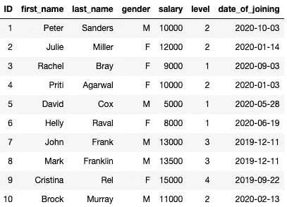

随机员工数据集(图片由作者提供)

此外，我使用 [ipython-sql](https://pypi.org/project/ipython-sql/) 直接从 Jupyter 笔记本运行 sql 查询，并在 SQLite 数据库中创建了一个表，如下所示:

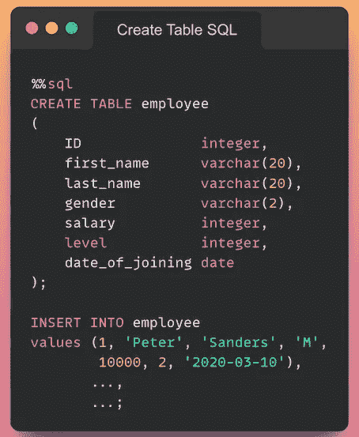

使用 SQL 创建表格的代码片段(图片由作者提供)

接下来，让我们继续执行 SQL 中常用的数据分析查询，并将它们转换成 Pandas 中相应的操作。

# 显示表格的前 5(或 k)行

在 SQL 中，我们可以在 *select* 之后使用 *limit* 并指定我们想要显示的记录数，如下所示:

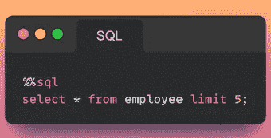

显示表格前五行的 SQL 语法(按作者排序的图像)

请注意，并非所有数据库系统都支持*限制*子句。下面，我总结了一些数据库管理系统的语法。

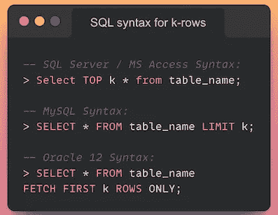

在不同的 DBMS 中显示前 k 行的 SQL 语法(图片由作者提供)

在 Pandas 中，使用 *head* 方法并传递行数作为参数来完成这项工作。

显示前五行的 Pandas 语法(图片由作者提供)

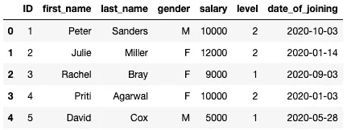

前五行的结果(图片由作者提供)

# 对一列(或多列)选择 with 条件

假设我们希望只选择在组织中工作的女性员工。在 SQL 中，我们可以使用如下所示的 *where* 子句来实现这一点:

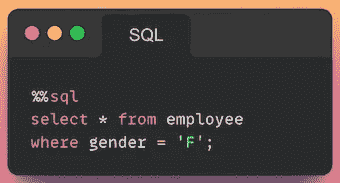

使用条件过滤的 SQL 语法(按作者排序的图像)

这将转化为熊猫的以下情况:

Pandas 使用条件过滤的语法(图片由作者提供)

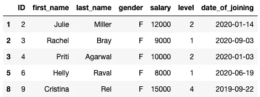

过滤数据的结果(图片由作者提供)

# 选择列的子集

接下来，假设我们只想从表中选择 ID、名字和姓氏。我们可以用 SQL 这样做，如下所示:

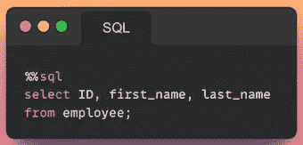

用于选择列子集的 SQL 语法(按作者排序的图片)

类似的过滤可以在 Pandas 中执行，如下所示:

用于选择列子集的 Pandas 语法(作者图片)

注意:SQL 语法不区分大小写。因此，以下两个查询将返回相同的结果:

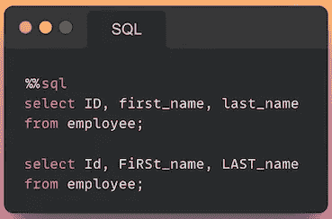

描述其不区分大小写行为的 SQL 语法(图片由作者提供)

然而，熊猫的语法是区分大小写的。因此，列名的格式和大小写应该与它们在原始数据帧中出现的格式和大小写相同。

# **根据列值对记录进行排序**

在此任务中，假设我们希望按照薪水的降序对员工数据进行排序。这可以使用 SQL 中的 *order by* 子句来执行，如下所示:

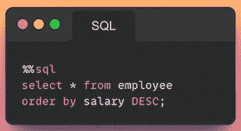

根据列值对数据进行排序的 SQL 语法(图片由作者提供)

在 Pandas 中，我们可以使用 *sort_values()* 方法并将列作为参数传递，如下所示:

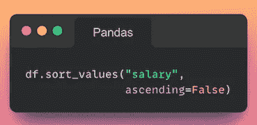

Pandas 对列值数据进行排序的语法(图片由作者提供)

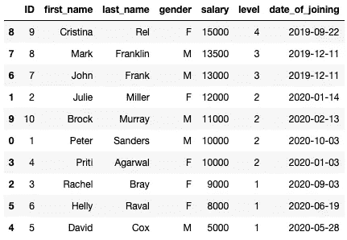

对列值数据排序的结果(图片由作者提供)

# **分组记录**

分组是分析表格数据时另一种广泛使用的操作。假设我们想要获得跨级别员工的平均工资以及在每个级别工作的员工数量。这可以通过使用如下所示的 *group by* 子句来实现:

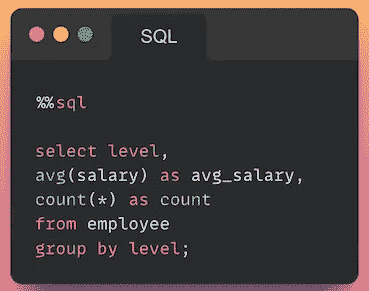

用于分组记录的 SQL 语法(按作者分类的图像)

另一方面，我们可以在 Pandas 中使用 *groupby* 方法，并传递我们需要执行的聚合，如下所示:

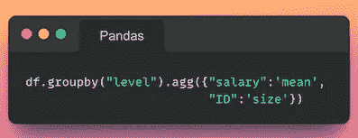

Pandas 记录分组语法(作者图片)

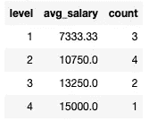

记录分组结果(按作者分类的图像)

# **不同记录的数量**

接下来，让我们看看如何显示列中的不同条目及其计数。在 SQL 中，这可以使用 DISTINCT 关键字来完成，如下所示:

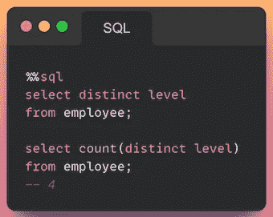

用于查找不同记录的 SQL 语法(按作者排序的图像)

为了在 Pandas 中实现这一点，我们可以对系列调用 *unique()* 和 *nunique()* 方法，如下所示:

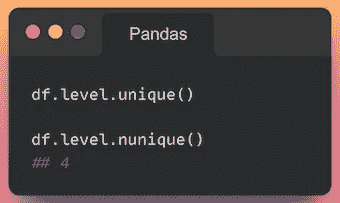

用于查找不同记录的 Pandas 语法(图片由作者提供)

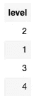

表中不同记录的结果(按作者排序的图像)

# 表格中的行数

最后，让我们看看如何使用 SQL 和 Pandas 找到表中的行数。在 SQL 中，我们可以使用如下所示的 *count()* 方法来实现这一点:

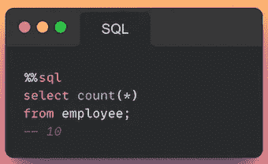

显示表中行数的 SQL 语法(按作者分类的图像)

在 Pandas 中，这转化为 DataFrame 的 *shape* 属性，返回行数和列数。

显示数据帧形状的 Pandas 语法(图片由作者提供)

总之，在这篇文章中，我们深入研究了几个 SQL 查询，并研究了如何在 Pandas 中获得相同的结果。因为 Pandas 和 SQL 本质上都是用来处理和操作表格数据的，所以我们可以使用它们来执行类似的操作。然而，根据我的经验，由于 Pandas 的 pythonic 语法，在 SQL 中实现复杂的操作，如计算交叉表和在 *groupby* 之后的复杂聚合，可能比在 Pandas 中更具挑战性。

回顾上一个 SQL-to-Pandas 示例，我们注意到 SQL 只返回表中的行数。如果希望使用 SQL 计算表中的列数，这种方法很复杂。另一方面，在 Pandas 中这样做需要打印 DataFrame 的一个属性(*形状*，我们得到 DataFrame 中的行数和列数。

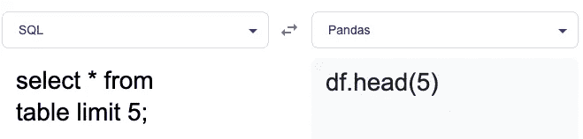

从 SQL 到 Pandas 的翻译系统(图片由作者提供)

如果你喜欢读这篇文章，并且学到了一些新的东西，我相信你也会喜欢我的其他文章，如下所列:

</20-of-pandas-functions-that-data-scientists-use-80-of-the-time-a4ff1b694707>  </why-i-stopped-dumping-dataframes-to-a-csv-and-why-you-should-too-c0954c410f8f>  </pandas-exercise-for-data-scientists-part-1-b601a97ee091> 