# 基于图论的交通网络分析

> 原文：<https://towardsdatascience.com/transportation-network-analysis-with-graph-theory-55eceb7e4de4>

# 基于图论的交通网络分析

## 用图论优化零售企业的道路运输网络

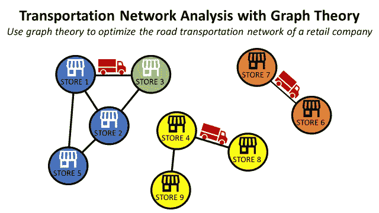

(图片由作者提供)

## 目标

构建**道路交通网络**的**图形表示**，以支持**优化研究**。

## 介绍

对于零售商来说，运送到商店的公路运输是物流成本的主要部分。

公司经常进行**路线规划优化研究**以降低这些成本并提高其网络的效率。

它需要**持续改进工程师**和**运输团队**之间的合作，后者负责管理日常运营。

在本文中，我们将使用**图论**来设计运输网络的**可视化表示**以**支持这种协作**并促进**解决方案设计**。

💌新文章直接免费放入你的收件箱:[时事通讯](https://www.samirsaci.com/#/portal/signup)

```
**SUMMARY**
**I. Distribution Network** Distribution centre of a retail company with 54 stores
**II. Problem Statement** Optimization of the route planning to reduce transportation costs
**1\. Exploratory Data Analysis** 1 year of deliveries to 50 stores **2\. Multi-Store Delivery** Use dedicated trucks to deliver several stores 
**III. Solution using Graph Visualization
1\. Visualization using the Graph Theory** What are the stores that are delivered together?
**2\. Challenge the current routing** Collaborate with the Transportation Planner to expand the routes
**IV. Conclusion & Next Steps**
```

*如果你愿意，可以观看 Youtube 视频版本*

# 一、**配电网**

## 语境

作为一名零售公司的**持续改进工程师**，你负责 [**仓储**](https://www.youtube.com/watch?v=OdLeRR4rvt0&list=PLvINVddGUMQWRel1u0RIBbKIYRUQBdrt9)**[**运输**](https://www.youtube.com/watch?v=ddthuvFQdGY&list=PLvINVddGUMQXkAtacSSmUavDoRFQbmvAW) **运营**的再造。**

**在您的范围内，您有一个位于**上海(中国)**的**主要配送中心**，为 **54 家大型超市提供服务。****

**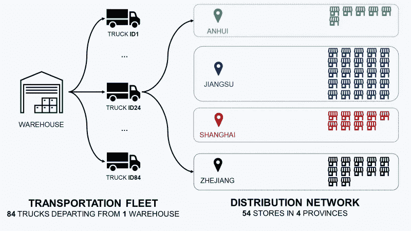**

**您的零售公司的分销网络—(图片由作者提供)**

## **卡车运输**

**这些商店位于四个不同的省份，使用第三方 [**运输服务提供商**](https://youtube.com/shorts/7y_mVdM_sZE) 送货。**

**他们为卡车提供三种不同的容量 (3.5 吨、5 吨和 8 吨)**。****

**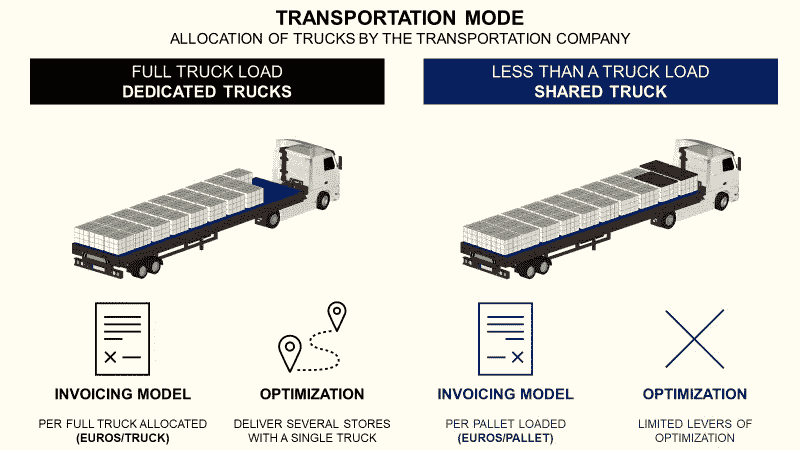**

**(图片由作者提供)**

**根据运输计划员设计的路线和装载计划，分配一辆专用卡车运送物料。**

## **装载计划示例**

**让我们想象一下这样一个场景:上海的三家商店总共订购了 **30 个托盘** (5 T)。**

*   **仓库团队[准备订单，将纸箱放在托盘](https://www.youtube.com/watch?v=XejgbF2m_8g)上**
*   **运输计划员决定用一辆 5T 卡车交付这三家商店**
*   **托盘被装入卡车**

**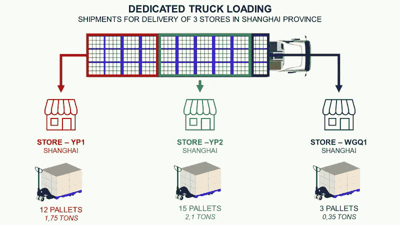**

**(图片由作者提供)**

**承运商根据路线上交付的**首个城市使用每辆卡车**的**价格*(人民币/卡车)*为您开具发票。****

**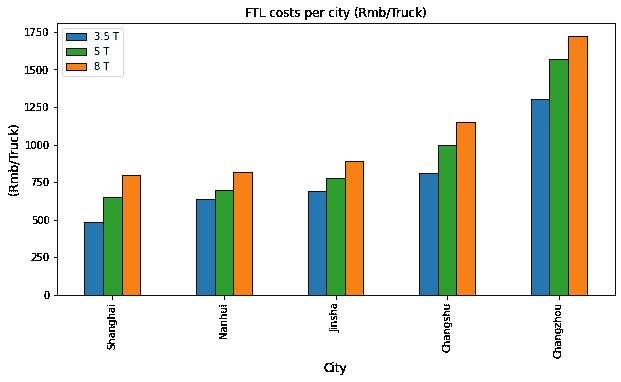**

**(图片由作者提供)**

```
**For the delivery of these three stores in Shanghai** Cost = 650 (Rmb)
```

**运输计划团队的职责是设计路线，以确保卡车在离开仓库时已满。**

**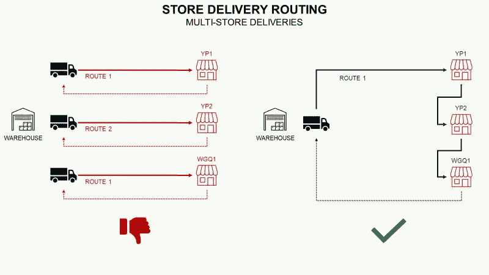**

**(图片由作者提供)**

**因此，他们避免尽可能多的单一商店路线，以最大化的填充率。**

**如果你想更多地了解 FTL 交通**

**(作者视频)**

**[](http://samirsaci.com) [## Samir Saci

### 数据科学博客，专注于仓储、运输、数据可视化和机器人过程自动化以及…

samirsaci.com](http://samirsaci.com)** 

# **二.问题陈述**

## **目标**

**你的目标是**降低**的**总运输成本。****

****洞察力:吨成本**优化的一个主要杠杆是卡车尺寸。**

****

**(图片由作者提供)**

**如果你**增加卡车的平均尺寸**，你就减少了每吨的整体**成本。一个好的方法是每条路线提供更多的商店**。******

## **探索性数据分析**

**你有 **12 个月**的出货量来了解当前的路线。**

**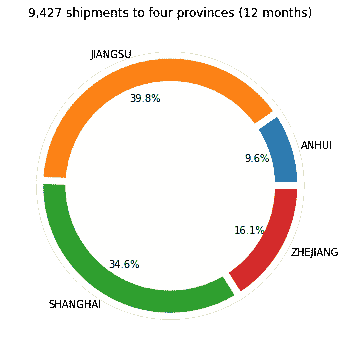**

**(图片由作者提供)**

****每店出货量
T31**上海**及周边省份**江苏**为大部分出货量。****

**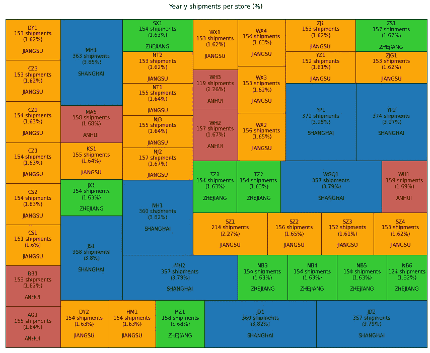**

**(图片由作者提供)**

****卡车尺寸** 除了上海的大型**超市**拉动了大部分需求外，其他省份都有相对**相同尺寸的**门店。**

**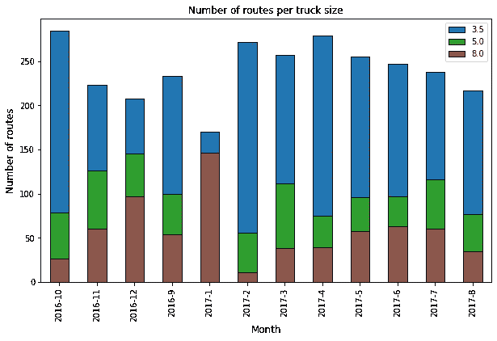**

**(图片由作者提供)**

****每车规模路线数**
除**1 月**外**农历新年**前的旺季，大部分路线均采用小型货车交付。**

**[](http://samirsaci.com) [## Samir Saci

### 数据科学博客，专注于仓储、运输、数据可视化和机器人过程自动化以及…

samirsaci.com](http://samirsaci.com)** 

# **三.使用图形可视化的解决方案**

> **你可以在我的 Github(跟我来:D)知识库中找到**源代码**和**虚拟数据**:[链接](https://github.com/samirsaci/graph-theory)**

**目标是设计一个新的运输计划，通过每条路线向**运送更多商店** e，来**增加卡车**的平均尺寸**

## **限制**

**由于操作限制，您需要遵守以下约束**

*   ****发货时间窗口**:商店只能在一天中的特定时间收到商品**
*   **道路限制:一些道路禁止大型卡车通行**
*   ****卸货条件**:部分店铺需要先发货**

## **1.协作的可视化支持**

**由于这些操作限制，y **ou 无法单独执行此分析**。**

****与**有日常管理路线规划经验的**运输团队**合作是关键。**

****解法:图论** 图是一个包含**个节点(商店)**的结构，每一对相关的节点被称为**一条边**。**

**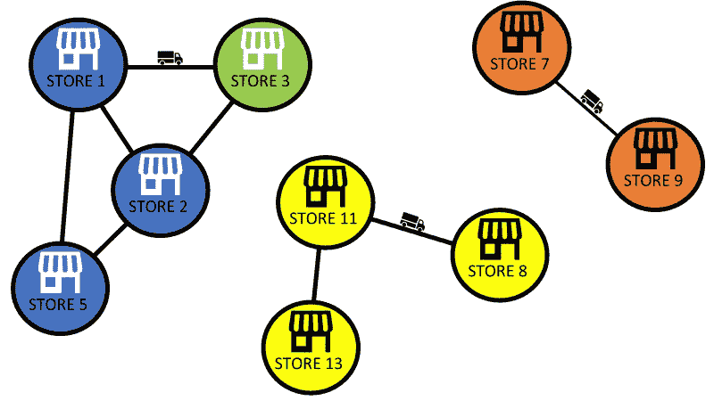**

**(图片由作者提供)**

**两个店铺的**边表示这些店铺已经**一起**在**交付了至少一次**。****

> **例如，商店 2 已与商店 3、商店 5 和商店 1 一起交付。**

****问题**
用现在的路由，哪些门店一起发货？**

## **2.挑战当前路由**

**让我们看看当前路由的结果。**

## ****举例:全年范围****

**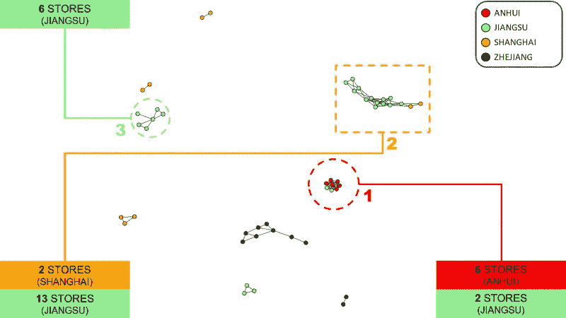**

**(图片由作者提供)**

**你可以找到不同类型的集群**

*   ****类型 1:** 商店都是相互连接的，通常代表一条路线*(最好将几个商店组合在一条路线中)***
*   ****类型 2:** 商店按顺序连接，形成一个连锁**
*   ****类型 3:** 1 个商店连接到所有其他商店**

**这种视觉效果可以支持与运输团队的讨论**

*   **为什么我们在**浙江**有 **2 家孤立门店**？**
*   **如果**将上海的两对**分开，我们能增加平均卡车尺寸吗？**
*   **我们能有更多的**1 型**集群吗？**

****问题** 卡车尺寸有什么影响？**

## **示例:仅 3.5 吨卡车**

**我们的主要问题是我们车队中小型卡车的比例很高。**

****3.5T 货车网络图****

**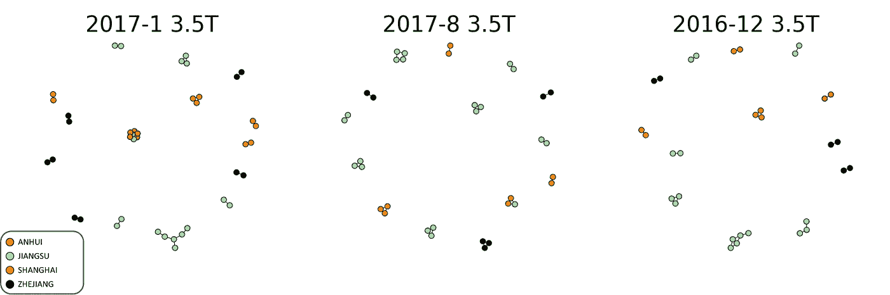**

**(图片由作者提供)**

**这些路线的互连较少。没有互连节点的主要集群。**

****平均卡车尺寸**
当您查看每种卡车尺寸的每条路线的平均交付数量时，观察结果得到了证实。**

**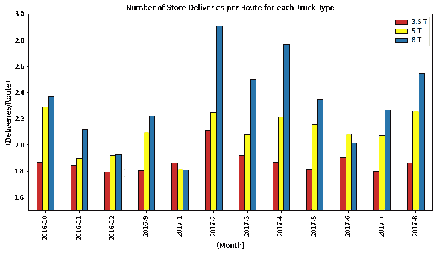**

**(图片由作者提供)**

**除了在**春节高峰期间，**你可以看到大货车每条路线的**交货数量**更高。**

****问题**
每条路线的店铺比例最低和最高有什么区别？**

**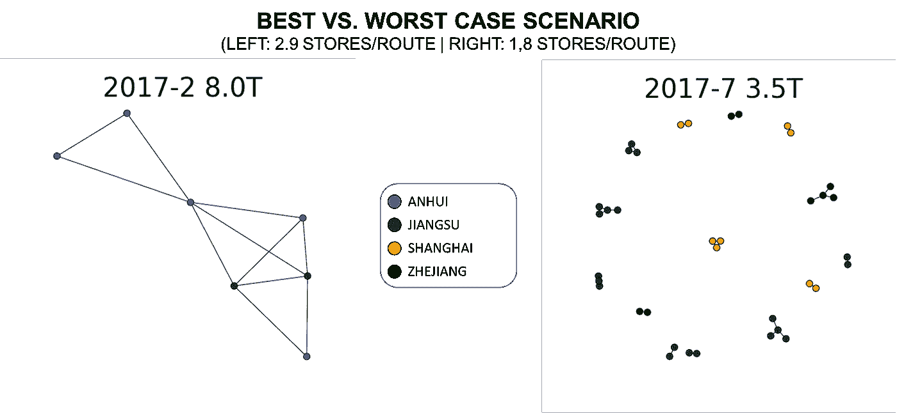**

**(图片由作者提供)**

**对于最佳场景*(左)*，商店高度互联*(最多 4 个连接)*。另一个网络**高度分散**与之形成鲜明对比。**

**[](http://samirsaci.com) [## 萨米尔·萨奇

### 数据科学博客，专注于仓储，运输，数据可视化和机器人流程自动化…

samirsaci.com](http://samirsaci.com)** 

# **四。结论和后续步骤**

***关注我的 medium，了解更多与供应链数据科学相关的见解。***

## **结论**

**该工具提供了分销网络的**可视化表示，以支持您和**运输团队**之间的协同工作。****

## **后续步骤**

**根据您的分析，您可以提出潜在的改进建议*(对更多商店进行分组，合并路线)*并与团队一起评估运营可行性。**

**该分析是研究的**开始，每个潜在的解决方案都需要由运营和商店经理**验证**以确保顺利实施。****

# **关于我**

**让我们连接上 [Linkedin](https://www.linkedin.com/in/samir-saci/) 和 [Twitter](https://twitter.com/Samir_Saci_) ，我是一名供应链工程师，正在使用数据分析来改善物流运作和降低成本。**

**如果你对数据分析和供应链感兴趣，可以看看我的网站**

**[](https://samirsaci.com) [## Samir Saci |数据科学与生产力

### 专注于数据科学、个人生产力、自动化、运筹学和可持续发展的技术博客

samirsaci.com](https://samirsaci.com)** 

# **参考**

**[1] — Networkx，用 Python 进行网络分析，[链接](https://networkx.org/documentation/stable/index.html)**