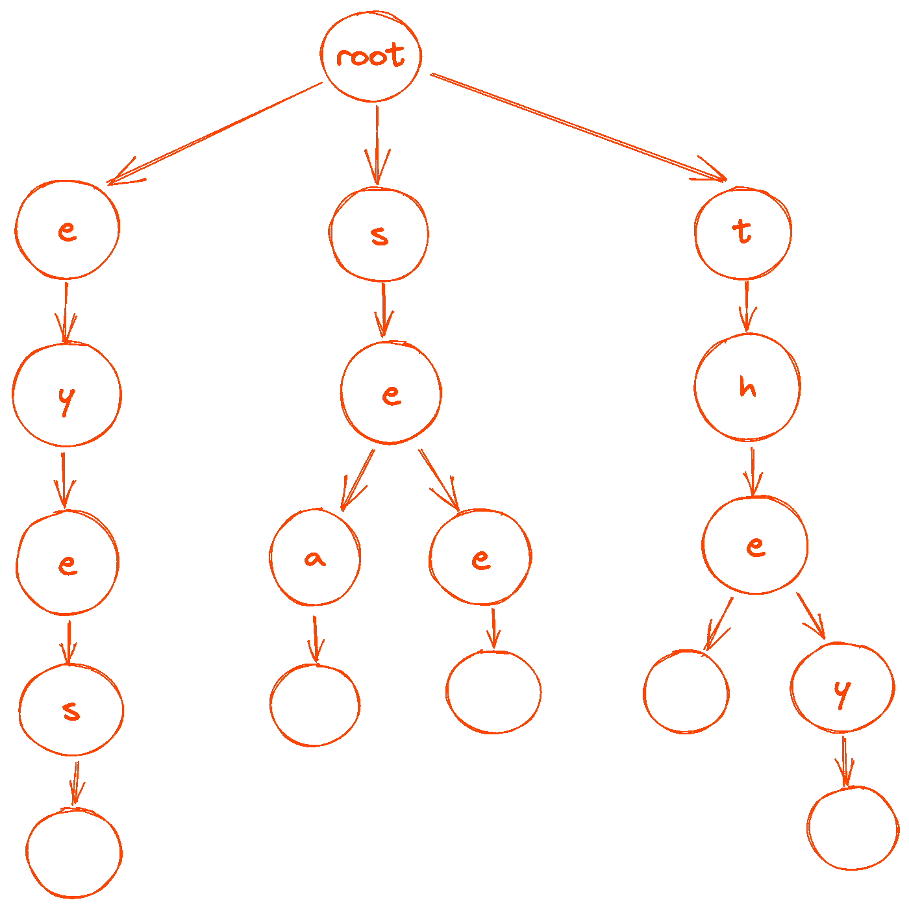

# Python 中的树遍历和变位词

> 原文：<https://towardsdatascience.com/tree-traversals-and-anagrams-in-python-97047bcc6f8e>

## 探索散列表和递归算法的周末项目


作者图片

我知道这只是语言上的意外，但是你可以把“眼睛”中的字母重新排列成“他们看见”的事实感觉…很神奇。

我从小就喜欢字谜游戏。所以，我想尝试用 Python 来构建一个变位词生成器。它变成了一个有趣的小周末项目，以 Python 字典和递归的形式使用哈希表。

哈希表用于实现数据库索引和缓存之类的东西。它们通过将计算成本较低的键映射到一个值来实现数据的快速查找。但是，如果您没有接触过树和图之类的东西，您可能不会考虑将哈希表的值作为其他哈希表的值。

正如您将看到的，用嵌套哈希表构建树结构有助于在大量数据中搜索模式，使之更易于管理。递归是一种工具，可以让你简洁明了地表达搜索逻辑。

你在这里看到的字谜生成算法是一种组合搜索算法。这类算法在机器人和人工智能中发挥着重要作用，其中可能状态的空间呈指数增长，甚至是阶乘增长。

不过，在我们深入研究生成变位词之前，让我们先来看看一个更简单的问题:识别两个字符串何时是彼此的变位词。

# 如何检查两个字符串是否是字谜

如果`string1`中的人物是`string2`中人物的重排，`string1`就是`string2`的变位词。

不过，角色的顺序并不重要。重要的是`string1`中每个角色的数量和`string2`中每个角色的数量是一样的。如果每个字符在每个字符串中出现的次数相同，那么这两个字符串就是彼此的变位组合。

Python 的`[collections.Counter](https://docs.python.org/3/library/collections.html#collections.Counter)`——它是一种特殊类型的字典——可以这样计算:

看到`Counter`对象中的空字符串`' '`了吗？这是个问题。“Theater”和“the tear”是变位词，尽管一个有空格，另一个没有。字谜不区分大小写。它们也可能有不同的标点符号，如“vitalise”和“IT'S ALIVE！”

一个健壮的解决方案需要考虑到所有这些，所以如果没有一些预处理的话`collections.Counter`不会削减它:

像大多数问题一样，有很多方法可以解决这个问题。

我想要一个易于理解的解决方案，万一它不能处理所有应该处理的情况，也要易于修改。我使用了 string `[.translate()](https://docs.python.org/3/library/stdtypes.html#str.translate)`方法，它根据翻译词典替换字符串中的每个字符。映射到`None`的字符从字符串中删除。另外，我可以用`[str.maketrans()](https://docs.python.org/3/library/stdtypes.html#str.maketrans)`轻松创建翻译词典。

这给了我在字符串被传递到`Counter()`之前如何处理字符串的细粒度控制:

在`process()`功能中使用`[.casefold()](https://docs.python.org/3/library/stdtypes.html#str.casefold)`而不是`.lower()`可能会更好。但总的来说，这是一个健壮的解决方案。这很好理解，前提是你了解`Counter`、`.translate()`、`str.maketrans()`。如果需要，可以很容易地交换处理功能。

但是，如何为特定的字符串寻找变位呢？

# 如何生成字谜

这比检查两个字符串是否是彼此的变位词更难。

简单地生成一个字符串所有可能的重排是不够的。你必须在有意义的地方插入空格和标点符号。字符串中的结果单词必须是实际的词典单词。

我们需要一种方法来有效地生成使用字符串中的字母的单词。

## 在纸上解决它

抛开获取单词列表的问题，从简单的开始:

```
eyes
the
they
see
sea
```

过程是这样的:

1.  写下您想要生成变位词的短语，例如“眼睛”
2.  从短语中选择一个字母(比如“t”)，然后浏览列表，寻找以该字母开头的单词(单词=“the”和“them”)。划掉短语中该字母的一个实例，并将该字母记为变位词的第一个字母(变位词=“t”)。
3.  从短语中挑选一个还没有被划掉的字母(比如“h”)，把上一步选择的单词过滤到第二个字母是你挑选的新字母的那些(words =“the”和“them”)。划掉短语中的字母，并将其添加到您的变位词中(anagram = "th ")。
4.  继续选择未使用的字母并过滤单词列表的过程。当你到达一个单词的末尾时，检查你目前生成的短语是否是原短语的变位词。如果是的话，你就完了。如果没有，从完整的单词列表开始，但是只使用没有被划掉的字母。
5.  用短语中不同的首字母重复整个过程。

如果你一步一步地按照上面的小单词列表中的算法，你会得到四个变位词:

*   眼睛
*   眼睛看着
*   他们看到了
*   看到他们了吗

当然，“眼睛”是你开始用的短语。那很好。扔掉它。

如果我们可以直接跳到所有以字母 T 开头的单词，而不是扫描整个列表，这不是很好吗？还是跳到所有以 th 开头的单词？还是从。

听起来我们需要一个散列表！

我们*真正*想要的是哈希表的一个哈希表*。*

哈希表的哈希表是表示树的一种方式。而且，如果你停下来想一想，我描述的生成变位词的方法感觉很像深度优先搜索。对于如何实现算法，这是一个很大的线索。

Python 拥有我们需要的所有部分。

## 构建字典树

我们将要构建的树看起来会像这样:



图片由作者提供(使用 [Excalidraw](https://excalidraw.com/) 制作)

Python 字典是散列表，所以它们是我们的树的基础的自然选择。每个字典的键是包含单个字母的字符串，值是 more dictionaries。我们需要知道什么时候是一个单词的末尾，所以我们会用字典`{" ": {}}`来标记那些地方。

眼睛、The、them、see 和 sea 这些词的字典树如下所示:

但是你如何构建这样的字典呢？

关键的观察是，您可以递归地将单词添加到字典中。从一本空字典开始。对于每个单词，去掉第一个字母——称之为`char`。如果`char`是字典中的一个键，获取它的值。否则，用空字典设置字典中的键`char`作为它的值。然后重复这个过程，使用映射到`char`的字典和没有第一个字符的单词。

假设`word`没有空格，将字符串`" "`加到末尾，这样我们就能得到正确的终端字典。

代码如下:

递归很好，因为它可以简洁地描述一个重复的过程。但是，如果不通过手工推理步骤，就很难理解递归算法做了什么。带有一些好例子的文档可以帮助读者(包括你未来的自己！)理解一个递归函数。

现在我们有了一棵树，我们可以开始生成变位词了。

## 遍历树来制作字谜

您可以将变位算法实现为遍历单词树中的节点。

我们选择一个初始节点——短语中的一个字符，我们希望对其进行变位——并在数组中将该节点标记为已访问。然后移动到以该节点为根的树中的分支。重复此操作，直到访问完短语中的所有字符或到达一个单词的末尾。更多递归！

它本质上是一种深度优先的搜索算法，除了可行走的节点受到树中节点和短语中尚未被访问的字符的限制。

这是在以下 Python 代码中捕获的:

`filter_()`函数应该返回一组可供遍历的节点。这对于寻找字谜有一些细微的差别。我们一会儿会谈到这个问题，暂时先不要定义过滤函数。

我们仍然没有完成变位算法的实现。

`walks()`产生遍历所访问的节点元组——在这种情况下是短语中的字符——但是遍历一到达单词的末尾就结束了。

要产生多词变位词，你需要绕圈子，继续从树根开始遍历这棵树。我称之为“绕着树走”。你不停地走来走去，收集单词，直到走完为止。

代码如下:

我们需要实现`done`和`filter`函数来传递给`walk_around()`，这两个函数都依赖于我们正在为其生成变位词的短语。

当遍历中访问的字符串是短语的变位词时，遍历完成。我们已经知道怎么做了！我们可以使用`are_anagrams()`功能:

现在我们需要定义`filter_()`。

我说过这里有一些细微的差别。

在行走的每一步，我们只需要移动到我们还没有访问过的短语中的一个字符。或者一个标点符号，因为我们想要包含像缩写这样的词。哦，我们也可以移动到一个`" "`字符，因为这是我们如何知道我们在一个单词的末尾。

我们可以使用[集合](https://docs.python.org/3/library/stdtypes.html#set)清晰地表达这些规则:

`Counter`便于计算短语中尚未访问过的字符。

从另一个中减去一个`Counter`会返回一个减去了计数的`Counter`。计数为零的字符将被删除。例如，`Counter("tea") - Counter("e")`返回`Counter({'t': 1, 'a': 1})`。

我们已经具备了编写变位词生成器的所有要素:

这里使用`functools.partial()`来“填充”`done()`和`filter_()`功能的`phrase`参数。我们必须这样做，因为`walk_around()`的`done`和`filter_`参数期望没有`phrase`参数的函数。因为`walk_around()`产生的遍历以空格结束，所以用`.rstrip()`去除了变位词中的空格。

让我们带着`anagrams()`在一个小单词列表上兜一圈:

嘿，成功了！

## 对大量单词进行测试

如果你的电脑有一个类似 Unix 的操作系统，你现在有一个很大的单词列表。

在大多数机器上，有一个位于`/usr/share/dict/words`或`/usr/dict/words`的`words`文件。这是一个用换行符分隔的字典单词列表。如果你有一台 Windows 机器或者没有一个`words`文件，你可以在 GNU 网站上找到一个用你的语言写的[文件。](http://ftp.gnu.org/gnu/aspell/dict/)

让我们试一试:

它可以工作，但是`words`文件包含单个字母和两个字母的单词，比如“te”这给我们的字谜增加了一堆噪音。我们应该清理一下。

让我们过滤掉一些我们知道我们不想要的单词:

这无疑给了我们更好的结果。对于一个更好的变位词生成器，你需要花一些时间来整理单词。并且`words`文件不一定是最好的单词集，因为它不包含任何缩写。

你可以使用 aspell 的[皱眉工具](http://app.aspell.net/create)生成更有趣的单词列表。

# 那么这一切有什么意义呢？

首先，这是一个有趣的项目，涉及了一些我在日常生活中不会用到的概念。仅此一点就值得了。

但是解决方案本身总的来说还是很有趣的。它提出了一种用组合约束构造对象的方法。人们可以想象它的许多应用，从构建代码和遗传序列到寻找组合问题的极值解。

对于一个周末项目来说还不错！

```
**Become a better coder in 5 minutes.**One email, every Saturday, with one actionable tip.
Always less than 5 minutes of your time.[Subscribe here](https://davidamos.dev/curious-about-code-newsletter/)
```