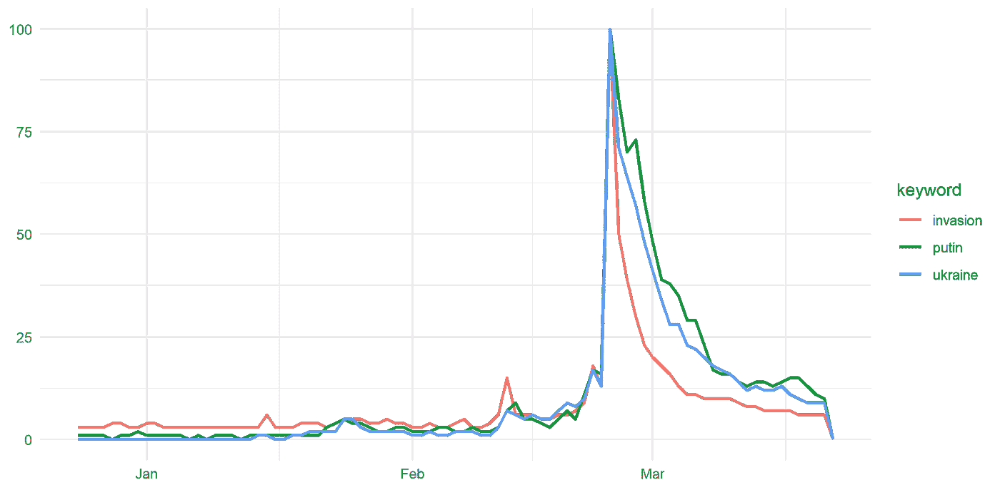
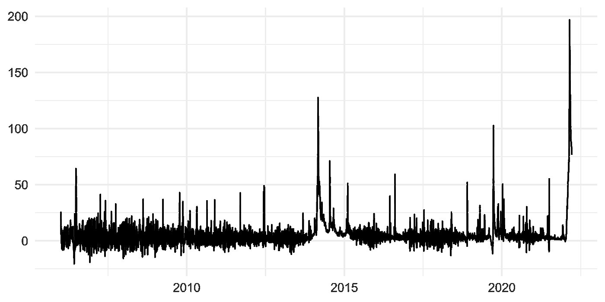

# 修复谷歌趋势数据的局限性

> 原文：<https://towardsdatascience.com/trendecon-essential-r-package-to-construct-time-series-from-google-trends-36365ea48382>

## 谷歌趋势数据有几个缺点。TrendEcon 是一个了不起的 R 包，它解决了这些问题，并有助于从标准化数据中创建一致的长期时间序列。

克劳迪奥·施瓦兹在 [Unsplash](https://unsplash.com?utm_source=medium&utm_medium=referral) 上的照片

Google Trends (GT)是一个公众可用的数据库，提供跨不同地区和语言的 Google 搜索查询的聚合数据。除了允许用户手动下载数据的[网页](https://trends.google.com/)和提供多个主题的预处理数据集的[*Google Trends Datastore*](https://googletrends.github.io/data/)之外，还有允许自动访问数据的 Python ( [PyTrends](https://pypi.org/project/pytrends/) )和 R 的 API。一个[免费的 Data Studio 连接器](https://gtrends.app/)也支持 GT 数据的实时报告。

尽管公司和研究人员大量使用该数据集，但很少有人讨论该数据集的特性和局限性。谷歌不提供搜索量，但将它们汇总到一个指数中，该指数反映了不同时间的变化以及与其他搜索词的相对差异。诸如**频率不一致**、**季节性**和**随机抽样**等主题，在分析时间序列时会带来显著的偏差。

在本文中，您将了解:

*   燃气轮机数据的局限性
*   TrendEcon R 包修复了大量数据规范化带来的潜在问题。

# 谷歌趋势的局限性

让我们更深入地了解一下关于 GT 数据局限性的文献。艾希瑙尔等人(202 1)指出了他们。第一个来自数据本身的构造，因为出于隐私原因，原始卷被转换成一个索引。

*谷歌如何转换原始数据？*

> 1.每个数据点除以它所代表的地理和时间范围的总搜索次数，以比较相对受欢迎程度。
> 
> 2.然后，根据一个主题在所有主题的所有搜索中所占的比例，将得到的数字在 0 到 100 的范围内进行缩放[(谷歌，2022)](https://support.google.com/trends/answer/4365533?hl=en.) 。

因此，时间序列的长期一致性在很大程度上取决于数据的时间范围和频率。原则上，我们可以依靠 Eichenauer 等人(2021) 提供的这些规则:

1.**月度**数据以最准确的方式捕捉了搜索活动的长期趋势。

2.**每周**的数据是分析几周的搜索**的最佳数据。**

3.**每日**数据最适合分析**几天**的短期行为。

将每日、每周和每月序列聚合到较低的频率会导致任何关键字的不同结果。这种**频率不一致**意味着每日数据无法捕捉长期趋势。因此，在使用忽略长期趋势的高频日序列和时间一致的月序列之间存在权衡，在时间一致的月序列中，搜索量在不同的和遥远的时间点是可比较的。

由于 GT 数据是时间序列，所以包含了全时间序列成分，包括**季节性**。不考虑这一因素(例如，通过将窗口限制在具有强烈季节效应的时段)也会给结果的解释带来偏差。

数据的另一个限制来自谷歌的随机抽样。他们非常务实地解释了原因:

*“虽然 Google Trends 中只使用了一个 Google 搜索样本，但这已经足够了，因为我们每天要处理数十亿次搜索。提供对整个数据集的访问会太大而无法快速处理。通过采样数据，我们可以查看代表所有谷歌搜索的数据集，同时找到可以在现实世界中发生的事件发生后几分钟内处理的见解。”* [*【谷歌 2022】*](https://support.google.com/trends/answer/4365533?hl=en)*。*

但是，在小国家或地区，返回序列的抽样变异可能很大。对于搜索量有限的关键词，即使在大型行政单位中，也可能存在大量采样噪声( [Eichenauer 等人，202](https://onlinelibrary.wiley.com/doi/full/10.1111/ecin.13049) 1)。这意味着，通过重复收集不同时期的时间序列，我们可以在某种程度上访问不同的数据集。

塔玛拉·加克在 [Unsplash](https://unsplash.com?utm_source=medium&utm_medium=referral) 上的照片

# 我们如何处理这些缺点？

幸运的是，有一个修复程序。 [*Trendecon*](https://trendecon.github.io/trendecon/) 与 Google Trends API 交互，并提供工具，只需一行开源 R 代码即可构建频率一致的长期时间序列。

它处理燃气轮机数据的局限性。更具体地说，它:

*   通过为每个关键词和频率绘制多个样本来提供采样调整
*   使用 Chow 和 Lin(1971)的分解程序、主成分分析(PCA)和其他计量经济学方法获得时间和频率一致的时间序列。

让我们用几个例子来说明它的应用:

## **1。用 R** 下载谷歌趋势数据

首先，要安装 *TrendEcon* ，请键入:

要在美国下载一系列关键词“乌克兰”、“普京”和“入侵”，请运行:

数据看起来是这样的:

作者图片，使用 ggplot2

## 2.构建稳健一致的时间序列

为了构建稳健一致的每日时间序列，使用 Chow-Lin 方法下载每日、每周和每月数据并进行一致汇总。

这是在美国搜索“乌克兰”的代码。很简单， *TrendEcon* 为我们做了所有的工作:

数据显示了预期的行为:

作者图片，使用 ggplot2

## 3.将多个关键字组合成一个时间序列

有时，我们需要监控与特定主题相关的几个关键词。比方说，我们需要测量一家名为“Apollo-Optic”的公司在奥地利的品牌知名度。顾客可以搜索该品牌的所有变体，例如，“阿波罗眼镜”、“阿波罗隐形眼镜”、“阿波罗光学”等。

我们可以从所有关键词中创建一个复合索引，并在我们的报告中使用它，而不是单独监控这些词。 *TrendEcon* 对归一化后的序列进行主成分分析，提取第一个主成分作为提供的关键词序列中的共同信号( [Eichenauer et al .，2021](https://onlinelibrary.wiley.com/doi/full/10.1111/ecin.13049) )。[本教程](https://trendecon.github.io/trendecon/articles/daily-series.html)提供了将关键词组合成复合指标的分步程序。

# 结论

*TrendsEcon* 增强了执行时间序列调查的研究人员和为公司建立重要指标报告的分析师使用 GT 数据的可能性。[这里的](https://trendecon.github.io/trendecon/reference/index.html)是它提供的处理数据的所有函数的列表。为了进一步阅读**，你可以查看[我的关于用 python 构建 GT 数据集的文章](https://medium.com/analytics-vidhya/build-your-google-trends-app-in-python-be8e6fb0324b)。**

*PS:你可以订阅我的* [*邮件列表*](https://medium.com/subscribe/@petrkorab) *在我每次写新文章的时候得到通知。如果你还不是中等会员，你可以在这里加入***。**

## *参考*

*[1]周光诚，林(1971)。时间序列的最佳线性无偏内插、分布和外推。*《经济学与统计学评论》*，第 53 卷第 4 期，第 372–375 页。*

*[2] Eichenauer，V. Z .，Indergand，r .，Martínez，I .，z .，Sax，C. (2021)。从谷歌趋势获得一致的时间序列。 [*经济查询*](https://www.research-collection.ethz.ch/bitstream/handle/20.500.11850/519009/EconomicInquiry-2021-Eichenauer-ObtainingconsistenttimeseriesfromGoogleTrends.pdf?sequence=3&isAllowed=y) ，60:694–705。*

*[3]谷歌(2022)。关于谷歌趋势数据的常见问题。检索自:[https://support.google.com/trends/answer/4365533?hl=en](https://support.google.com/trends/answer/4365533?hl=en)。*