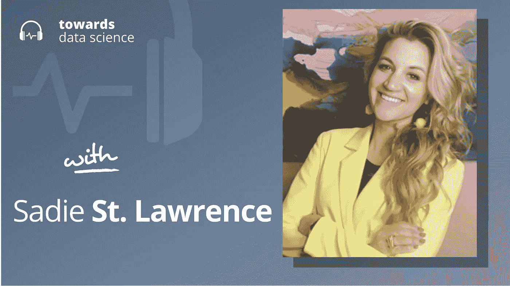

# 数据科学的趋势

> 原文：<https://towardsdatascience.com/trends-in-data-science-633f092ffa52>

## [播客](https://towardsdatascience.com/tagged/tds-podcast)

## Sadie St. Lawrence 介绍了数据领域的女性创始人、区块链的潜在数据优势以及数据科学的发展

[苹果](https://podcasts.apple.com/ca/podcast/towards-data-science/id1470952338?mt=2) | [谷歌](https://www.google.com/podcasts?feed=aHR0cHM6Ly9hbmNob3IuZm0vcy8zNmI0ODQ0L3BvZGNhc3QvcnNz) | [SPOTIFY](https://open.spotify.com/show/63diy2DtpHzQfeNVxAPZgU) | [其他](https://anchor.fm/towardsdatascience)

*编者按:TDS 播客由杰雷米·哈里斯主持，他是人工智能安全初创公司墨丘利的联合创始人。每周，Jeremie 都会与该领域前沿的研究人员和商业领袖聊天，以解开围绕数据科学、机器学习和人工智能的最紧迫问题。*

如果你关注播客，你可能会知道，我们通常会谈论尖端人工智能能力的世界，以及人工智能未来可能带来的一些新出现的安全风险和其他挑战。但我认为，对于今天的这一集，将事情稍微改变一下，谈谈数据科学的应用方面，以及该领域在过去一两年中的发展会很有趣。

我找到了一个完美的嘉宾:她的名字叫 [Sadie St. Lawrence](http://sadiestlawrence.com/) ，她是 [Women in Data](https://www.womenindata.org/) 的创始人，这是一个帮助女性进入数据领域并在职业生涯中进步的社区，她也是 [Data Bytes 播客](https://podcasts.apple.com/us/podcast/data-bytes/id1561613959)的主持人，一位经验丰富的数据科学家和杰出的社区建设者。Sadie 和我一起谈论了她的创始人的旅程，数据科学今天是什么样子，甚至是区块链在本期“走向数据科学”播客中介绍的数据科学的可能性。

以下是我在对话中最喜欢的一些观点:

*   赛迪的创始人之旅始于一次即兴实验:一次与对数据职业感兴趣的女性的简单会面。就像大多数早期创业经历一样，这几乎是一次失败:在她的首次女性数据活动开始 15 分钟后，她是唯一的参与者。但是几分钟后，一个参与者来了，还带了几个人。这个小规模的核心小组最终将成为今天“数据中的女性”的全球网络的核心，保留萨迪与早期采纳者的第一次对话中形成的亲密和支持的文化。Sadie 指出，这种文化是 Data 的秘方中的女性，也是该组织发展的关键因素。我们谈了很多关于成功创业中的创始人效应和文化传播。
*   越来越多的人采用区块链技术，赛迪认为这是面向数据的公司和数据科学家的一个重大机遇。因为区块链作为一个结构化的、可靠的金融数据的单一来源，他们提供了一个异常清晰的视角来观察生态系统中的资源流动。在区块链上，事务被同时记录和执行——事实上，事务的记录*就是它的执行*,这使得区块链数据异常接近真实情况，因此更加可靠。所有这些(加上基于图的 ML 方法的重大发展)使区块链成为一个有希望的新数据源，这一点还没有被充分利用。赛迪认为，如果你是一名初出茅庐或经验丰富的数据科学家，了解这项技术的来龙去脉是值得的。
*   我们谈了很多关于社区建设的内容，以及自早期女性数据时代以来，社区建设发生了怎样的变化(以及没有发生什么变化)。Sadie 观察到的一个关键变化是远程网络的可行性——一方面是因为如今人们在 Zoom 上更容易建立网络，另一方面是因为为远程社区建设设计的新一代工具使新的通信模式成为可能。然而，Sadie 也指出了一些没有改变的关键因素。其中最主要的是对面对面活动的需求，因为这种活动比在线活动更能体现亲密程度。用一堆半被动的成员建立一个松散的社区很容易，但最深层次的社区意识仍然来自于现实世界中的互动。
*   许多求职者认为“数据科学”角色是他们的最终目标，但随着经验的积累，他们往往最终会选择其他工作。例如，人们很容易低估数据分析和数据工程中不太重要的角色。除了长期适合许多申请人之外，这些工作通常是进入公司以数据为中心的团队的很好的切入点(如果这是你长期寻求的，它可以为你提供数据科学的角色)。

你可以[在推特上关注赛迪](https://twitter.com/sadiestlawrence)，或者[我在这里](https://twitter.com/jeremiecharris)。

# 章节:

*   0:00 介绍
*   2:00 数据领域的女性创始人
*   6:30 进行性别对话
*   11:00 文化方面
*   16:45 区块链的机遇
*   22:00 区块链数据库
*   32:30 数据科学教育
*   37:00 GPT-3 和非结构化数据
*   39:30 数据科学作为职业
*   42:50 总结