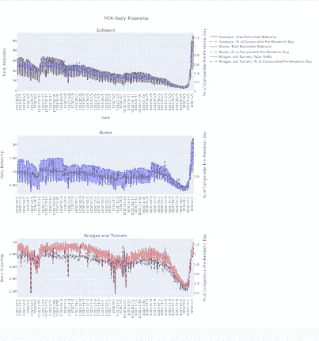
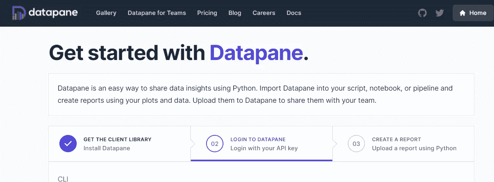
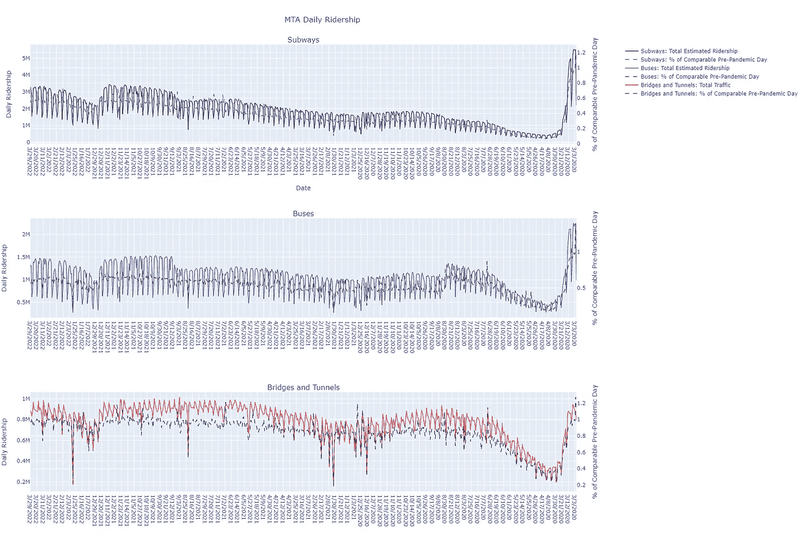
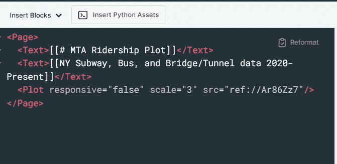

# 使用介质嵌入数据面板的技巧

> 原文：<https://towardsdatascience.com/tricks-for-datapane-embedding-with-medium-9b47d1d319e0>

## MTA 乘客可视化



Meagan V .的数据面板图表示例

大约两年前， [Khuyen Tran](https://medium.com/u/84a02493194a?source=post_page-----9b47d1d319e0--------------------------------) 发表了一篇关于在 Python 中使用 [Datapane 的文章。基于她的教程，我继续做了一个我自己的小项目，用一个](/introduction-to-datapane-a-python-library-to-build-interactive-reports-4593fd3cb9c8)[开源数据集](https://data.ny.gov/Transportation/MTA-Daily-Ridership-Data-Beginning-2020/vxuj-8kew)包含了自 2020 年以来 MTA 每天的乘客数据。

今天，我将向您介绍我的项目教程，希望其他人能够发现这个免费工具的价值。

首先，Datapane 是一个 Python 库，可以用来构建交互式报告。我发现它类似于 Plotly Chart Studio。不幸的是，当要将这些图形嵌入到中等大小的文章中时，Datapane 不能很好地适应中等大小的更宽的图形，这很像 Chart Studio 的缺点。

然而，就 UX 而言，我发现使用 Datapane 的过程比 Chart Studio 容易得多。例如，Datapane 使得开始执行基本代码变得非常简单。



基本上，您只需要几行代码就可以开始制作您的第一个交互式图形。首先，您必须使用 pip 或 conda 安装 datapan，但之后只需导入适当的库:

```
import pandas as pdimport altair as altimport datapane as dp
```

此外，您真的可以将任何您想要的数字包装到一个数据面板报告中。语法遵循一个基本模板:

dp。报告(
dp。剧情(Plot)，
dp。数据表(df)
)。上传(name=NAME，open=True)

您所要做的就是创建一个您想要显示的图形/绘图/图表，并用您的图形名称替换上面代码中的(绘图)。添加数据表是可选的。在我的报告中，我决定不在我的图下面显示数据表。如果你选择了那条路，就走吧

```
dp.DataTable(df)
```

既然我们已经介绍了基础知识，让我们进入我的项目——可视化从 2020 年至今的 MTA 日客流量。

我需要做的第一件事是在 google colab 中加载我的数据，并适当地格式化它。

我知道我想按天绘制数据图表，但我也想对每天的数据重新取样。为此，首先我必须将索引设置为 datetime。

```
df['Date2']=pd.to_datetime(df['Date'])
df=df.set_index(df['Date2'])
```

现在，由于我的数据跨越了过去两年的每一天，我知道用图表表示每一个数据点是不可行的。因此，我用下面的代码按月重新采样。

```
df.resample('M').mean()
```

我选择了均值重采样，因为我的数据既包括原始乘客数，也包括与典型的疫情前一天的百分比比较。因此，如果我使用一个总和来重新取样，我的百分比就会有偏差。

接下来，我知道我想使用 plotly 来创建我的交互式图表，所以我必须导入正确的库。

```
import plotly.graph_objects as gofrom plotly.subplots import make_subplots
```

具体来说，我需要制作支线剧情，因为我的数据被分成不同的类别。我有地铁数据、公交数据和桥梁/隧道数据。我决定要在 3 行 1 列中显示我的数据，定义如下。

```
fig = make_subplots(specs=[[{'secondary_y': True}], [{'secondary_y': True}],[ {'secondary_y': True}]], rows=3, cols=1, subplot_titles=('Subways',  'Buses', 'Bridges and Tunnels'))
```

如您所见，我还必须指定我想要创建一个辅助 y 轴。这是因为与疫情之前的百分比相比，乘客数量将处于不同的规模。

我有 6 组数据要绘制:

1.  地铁乘客量
2.  2.地铁百分比比较
3.  公共汽车乘客量
4.  总线百分比比较
5.  桥梁/隧道交通
6.  桥梁/隧道百分比比较

这是我用来为我的图形创建每个轨迹的基本模板:

```
fig.add_trace(go.Scatter(x=df['Date'], y=df['Subways: Total Estimated Ridership'], name = 'Subways: Total Estimated Ridership',line=dict(color='black', width=1, dash='solid')), secondary_y=False, row=1, col=1)
```

如您所见，我通过 X 和 y 值、系列名称、线条样式、是否使用辅助 y 轴以及行/列号来指定。

每个额外的轨迹都是相似的，但我只是更新了 y 值、名称、线条颜色和破折号、辅助 y 轴和行/列。例如，下一个轨迹是用于地铁百分比比较的，所以我必须更改一些东西，如下所示:

```
fig.add_trace(go.Scatter(x=df['Date'], y=df[ 'Subways: % of Comparable Pre-Pandemic Day'], name =  'Subways: % of Comparable Pre-Pandemic Day',line=dict(color='blue', width=1, dash='dash')), secondary_y=True, row=1, col=1)
```

为了继续其他 4 个跟踪，我遵循相同的格式。一旦我添加完六个轨迹，我就为我的图表设置了最终的格式。

首先，我设置标题和轴标签:

```
fig.update_layout(title_text='MTA Daily Ridership', title_x=0.4,xaxis_title='Date')fig.update_yaxes(title_text="Daily Ridership", secondary_y=False)fig.update_yaxes(title_text="% of Comparable Pre-Pandemic Day", secondary_y=True)
```

之后，只是设置我的尺寸，填充和显示图形。

```
fig.update_layout(autosize=False,width=1800,height=1200,margin=dict(l=50,r=50,b=100,t=100,pad=0),)fig.show()
```

因为我使用了 plotly，所以我能够轻松地将我的静态绘图导出为 png，如下所示。然而，下一步是将它包装在一个 datapane 对象中。



梅根 V 的静态图

```
dp.Report(dp.Plot(fig)).upload(name="MTA Ridership")
```

就这样——只有三行代码和我的图表就可以发布到 datapane 了。不幸的是，正如我前面所说的，默认大小不适用于 Medium 格式。原始的嵌入图表看起来很糟糕。你看不到整个图表，你不能滚动，缩放被关闭，等等。

然而，我进入数据面板编辑模式，并通过改变响应和规模设置硬编码。

默认情况下，responsive 被设置为 true，但是在一个更宽的图表的情况下，您可能需要将它更改为 false，并更新您的比例以获得您的支线剧情的正确大小。



这改进了绘图，但是我发现在 python 代码中将 responsive 设置为 False 允许在嵌入时从左向右滚动。

这需要一些策略，但最终我得到了下面的情节:

在线报道的链接在这里:[https://data pane . com/u/meagan/reports/o7ven 13/MTA-rider ship/](https://datapane.com/u/meagan/reports/O7vEn13/mta-ridership/)

此外，datapane 允许您将图表保存为 html 文件。你要做的就是替换。上传(…)

使用下面的代码

```
.save(path='report.html', open=True)
```

这就是我关于 datapane 和 python 入门的简单教程。尽管嵌入在 Medium 上没有成功，但我喜欢与 datapane 的其他集成，比如 LinkedIn posting、Twitter posting 和 Github。

点击此处查看 datapane 提供的所有功能:

[https://datapane.com/home/](https://datapane.com/home/)