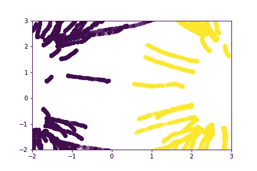
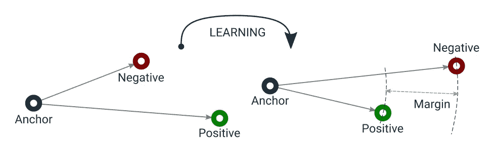
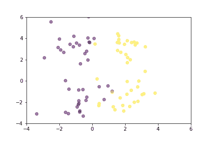
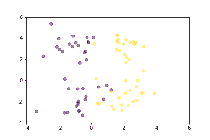

# 三重损失—高级简介

> 原文：<https://towardsdatascience.com/triplet-loss-advanced-intro-49a07b7d8905>

## 三重损失比对比损失有什么优势，如何高效实现？

三重损失下移动点的路径。图片作者。

三重损失最早于 2015 年在 [FaceNet:人脸识别和聚类的统一嵌入](https://arxiv.org/abs/1503.03832)中引入，此后它一直是监督相似性或度量学习最受欢迎的损失函数之一。用最简单的解释来说，三重态损失促使不同的线对与任何相似的线对相距至少一定的余量值。数学上，损失值可计算为`L=max(d(a, p) - d(a, n) + m, 0)`，其中:

*   `p`，即阳性，是与`a`标签相同的样本，即锚，
*   `n`，即阴性，是另一个标签不同于`a`的样品，
*   `d`是测量这三个样本之间距离的函数，
*   并且`m`是保持负样本远离的裕度值。

该论文使用欧几里德距离，但是使用任何其他距离度量也同样有效，例如余弦距离。

该功能有一个学习目标，可以如下图所示:

三重损失目标。作者图片

请注意，三元组丢失不会像对比丢失那样具有促使将锚和正样本编码到向量空间中的同一点的副作用。这使得三重损失容忍一些类内差异，不像对比损失，因为后者迫使锚和任何正值之间的距离基本上为`0`。换句话说，三联体丢失允许以包括异常值的方式拉伸聚类，同时仍然确保来自不同聚类(例如，负对)的样本之间的余量。

另外，三重态损失不太贪婪。与对比损失不同，当不同的样本很容易从相似的样本中区分出来时，它就已经令人满意了。如果没有负面例子的干扰，它不会改变正面簇中的距离。这是因为三重损耗试图确保负对距离和正对距离之间的余量。然而，对比损失仅在比较不相似对时才考虑裕度值，它根本不关心相似对在该时刻的位置。这意味着对比损失可以更早地达到局部最小值，而三重损失可以继续以更好的状态组织向量空间。

让我们通过动画演示两个损失函数如何组织向量空间。为了更简单的可视化，向量由二维空间中的点表示，并且它们是从正态分布中随机选择的。

展示对比损失如何在培训过程中移动点数的动画。图片作者。

展示三连音缺失如何在训练过程中移动点数的动画。图片作者。

从对双损耗函数的数学解释来看，很明显，三重损耗在理论上更强，但三重损耗有更多的技巧来帮助它更好地工作。最重要的是，三元组丢失引入了在线三元组挖掘策略，例如，自动形成最有用的三元组。

## 为什么三重开采很重要？

三重损失的公式表明它同时作用于三个物体:

1.  `anchor`，
2.  `positive` -与锚具有相同标签的样品，
3.  和`negative`——一个标签与锚和正不同的样本。

在一个简单的实现中，我们可以在每个时期的开始形成这样的样本三元组，然后在整个时期将成批的这样的三元组提供给模型。这就是所谓的“线下策略”然而，由于几个原因，这不是很有效:

*   它需要通过`3n`个样本才能得到`n`个三元组的损失值。
*   并非所有这些三元组都对模型学习任何东西有用，例如，产生正损失值。
*   即使我们用我将在本系列中实现的方法之一在每个时期的开始形成“有用的”三元组，它们也可能在时期中的某个点变得“无用”,因为模型权重将不断更新。

相反，我们可以得到一批`n`样本和它们相关的标签，并动态地形成三元组。这就是所谓的“在线策略”通常，这给出了`n^3`可能的三元组，但是只有这些可能的三元组的子集实际上是有效的。即使在这种情况下，我们也会从比离线策略多得多的三元组中计算出损失值。

给定三个一组的`(a, p, n)`，它仅在以下情况下有效:

1.  `a`和`p`有相同的标号，
2.  `a`和`p`是不同的样本，
3.  并且`n`具有与`a`和`p`不同的标签。

这些约束可能看起来需要使用嵌套循环进行昂贵的计算，但它可以通过距离矩阵、屏蔽和广播等技巧有效地实现。本系列的其余部分将集中在这些技巧的实现上。

## 距离矩阵

距离矩阵是形状为`(n, n)`的矩阵，用于保存由两个`n`大小的集合中的项目组成的所有可能对之间的距离值。该矩阵可用于矢量化计算，否则将需要低效的循环。它的计算也可以优化，我们将实现 Samuel Albanie 解释的[欧几里德距离矩阵技巧(PDF)](https://www.robots.ox.ac.uk/~albanie/notes/Euclidean_distance_trick.pdf) 。您可能想阅读这份三页的文档，以全面了解这个技巧，但下面是一个简短的解释:

1.  计算两个向量集合的点积，例如，在我们的例子中是嵌入。
2.  从这个矩阵中提取对角线，它包含每个嵌入的平方欧几里德范数。
3.  基于以下等式计算平方欧几里德距离矩阵:`||a - b||^2 = ||a||^2 - 2 ⟨a, b⟩ + ||b||^2`
4.  对于非平方距离，求这个矩阵的平方根。

我们将在 PyTorch 中实现它，所以我们从导入开始。

## 无效的三元组屏蔽

既然我们可以为一批中所有可能的嵌入对计算距离矩阵，我们可以应用广播来枚举所有可能的三元组的距离差异，并在形状为`(batch_size, batch_size, batch_size)`的张量中表示它们。然而，正如我前面提到的，这些`n^3`三元组中只有一个子集是有效的，我们需要一个相应的掩码来正确计算损失值。我们将分三步实现这样一个助手函数:

1.  计算不同索引的掩码，例如`(i != j and j != k)`。
2.  计算有效锚点正-负三元组的掩码，例如`labels[i] == labels[j] and labels[j] != labels[k]`。
3.  结合两个面具。

## 在线三元组挖掘的批量策略

现在，我们已经准备好实际实现三重态损失本身。三联体丢失涉及形成或选择三联体的几种策略，最简单的一种是使用所有有效的三联体，这些三联体可以由一批样品形成。由于我们已经实施了实用程序功能，这可以通过四个简单的步骤实现:

1.  获得所有可能对的距离矩阵，这些可能对可以由一批嵌入形成。
2.  将广播应用于该矩阵，以计算所有可能的三元组的损失值。
3.  将无效或简单三连音的损失值设置为`0`。
4.  对剩余的正值求平均值，以返回标量损失。

我将从实施这一策略开始，更复杂的将作为单独的文章跟进。

## 结论

我提到过，三元组损失与对比损失不仅在数学上不同，而且在样本选择策略上也不同，在这篇文章中，我通过使用几个技巧有效地实现了在线三元组挖掘的批量策略。还有其他更复杂的策略，比如批量硬挖掘和批量半硬挖掘，但是它们的实现，以及我在这篇文章中使用的提高效率的技巧的讨论，值得单独发表。未来的帖子将涵盖这些主题，并对一些技巧进行额外的讨论，以避免向量折叠并控制类内和类间的差异。同时，您可以加入 Qdrant 的 Discord 服务器，讨论、了解更多信息，并就公制学习提出问题。

 [## 加入 qdrant Discord 服务器！

### 在 Discord 上查看 qdrant 社区-与 111 名其他成员一起闲逛，享受免费语音和文本聊天。

discord.com](https://discord.com/invite/tdtYvXjC4h) 

最初发布于[https://qdrant.tech/articles/triplet-loss/](https://qdrant.tech/articles/triplet-loss/)