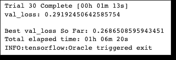
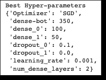
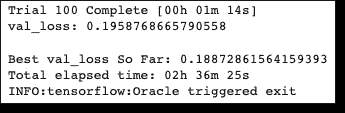
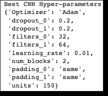

# 使用贝叶斯优化调整深度神经网络

> 原文：<https://towardsdatascience.com/tune-deep-neural-networks-using-bayesian-optimization-c9f6503a049f>

## 利用贝叶斯理论提高你的绩效


Syarafina Yusof 在 [Unsplash](https://unsplash.com?utm_source=medium&utm_medium=referral) 上的照片

在[之前的一篇帖子](/create-image-classification-models-with-tensorflow-in-10-minutes-d0caef7ca011)中，我们展示了一个关于使用 Tensorflow 和深度学习方法进行图像分类的案例研究。

虽然案例研究很少，但它展示了机器学习项目的每个阶段:清理、预处理、模型构建、训练和评估。**但是我们跳过了调优**。

在本文中，我们将更深入地研究超参数优化。同样，我们将使用 Tensorflow 中包含的[时尚 MNIST[1]](https://www.kaggle.com/datasets/zalando-research/fashionmnist) 数据集。

提醒一下，数据集在训练集中包含 60，000 幅灰度图像，在测试集中包含 10，000 幅图像。每个图像代表属于 10 个类别之一的时尚项目( *T 恤/上衣*’、*裤子*’、*套头衫*等等)。因此，我们有一个多类分类问题。

# 设置

我将简要回顾一下准备数据集的步骤。有关更多信息，请查看上一篇文章的[第一部分:简而言之，步骤如下:](/create-image-classification-models-with-tensorflow-in-10-minutes-d0caef7ca011)

1.  加载数据。
2.  分为*训练*、*验证*和*测试*套。
3.  将 0–255 到 0–1 范围内的像素值标准化。
4.  对目标变量进行一次性编码。

概括地说，所有训练集、验证集和测试集的形状是:

# 超参数调谐

现在，我们将使用 **Keras Tuner** 库[2]:它将帮助我们轻松地调整神经网络的超参数。要安装它，请执行:

```
pip install keras-tuner
```

**注意:** *Keras Tuner 需要 Python 3.6+和 TensorFlow 2.0+*

快速提醒一下，超参数调整是机器学习项目的基本部分。有两种超参数:

1.  **结构超参数**:定义模型整体架构的参数(如*隐藏单元*的数量、*层数*
2.  **优化器超参数:**影响训练速度和质量的参数(如*学习率*和*优化器类型*、*批量*、*周期数*)

## 为什么调优很棘手？

为什么需要超参数调节库？难道我们不能尝试每一种可能的组合，看看在验证集上什么是最好的？

不幸的是，没有:

*   深度神经网络需要大量的时间来训练，甚至几天。
*   如果你在云上训练大型模型(比如亚马逊 Sagemaker)，记住每个实验都是要花钱的。

因此，限制超参数搜索空间的剪枝策略是必要的。

## 贝叶斯优化

幸运的是， **Keras tuner** 提供了一个**贝叶斯优化tuner** 。贝叶斯优化调谐器不是搜索每一个可能的组合，而是遵循一个迭代过程，在这个过程中，它随机选择前几个组合。然后，基于这些超参数的性能，贝叶斯调谐器选择下一个最好的可能。

因此，超参数的每个选择取决于先前的尝试。基于历史选择下一组超参数*和评估性能*的迭代次数继续，直到调谐器找到最佳组合或用尽最大数量的**试验**。我们可以用参数' *max_trials* '进行配置。

除了贝叶斯优化调谐器之外， **Keras 调谐器**还提供了两个调谐器: **RandomSearch** 和 **Hyperband。我们将在本文的最后讨论它们。**

# **回到我们的例子**

接下来，我们将对网络应用超参数调整。在上一篇文章中，我们实验了两种网络架构，标准的**多层感知器** ( *MLP* )和**卷积神经网络** ( *CNN* )。

## 多层感知器(MLP)

但是首先，让我们记住我们的基线 MLP 模型是什么:

调整过程需要两种主要方法:

1.  **hp。Int():** 设置超参数的范围，其值为整数-例如，*密集层*中隐藏单元的数量:

```
model.add(Dense(units = hp.Int('dense-bot', min_value=50, max_value=350, step=50))
```

2.**惠普。Choice():** 为超参数提供一组值—例如， *Adam* 或 *SGD* 作为最佳优化器？

```
hp_optimizer=hp.Choice('Optimizer', values=['Adam', 'SGD'])
```

因此，在我们最初的 MLP 示例**、**上使用**贝叶斯优化*、*调谐器**，我们测试了以下超参数:

*   **隐藏层数**:1-3
*   **第一密层尺寸**:50–350
*   **第二和第三致密层尺寸**:50–350
*   **辍学率** : 0，0.1，0.2
*   **优化器** : *SGD* (内斯特洛夫=真，动量=0.9)或者*亚当*
*   **学习率** : 0.1，0.01，0.001

注意第 5 行的 for 循环:**我们让模型决定我们网络的深度！**

最后，我们启动调谐器。注意我们之前提到的 *max_trials* 参数。

这将打印:



该过程耗尽了迭代次数，用了大约 1 个小时才完成。我们还可以使用以下命令打印模型的最佳超参数:



就是这样！现在，我们可以使用最佳超参数重新训练我们的模型:

或者，我们可以用更少的冗长来重新训练我们的模型:

我们现在要做的就是检查测试的准确性:

```
# Test accuracy: 0.8823
```

与基线的模型测试精度相比:

**基线 MLP 模式:** 86.6 %
**最佳 MLP 模式:** 88.2 %

事实上，我们观察到测试准确度有大约 3%的差异！

## 卷积神经网络

同样，我们将遵循相同的程序。有了 CNN，我们可以测试更多的参数。

首先，这是我们的基线模型:

基线模型仅包含单组**过滤**和**汇集**层。对于我们的调优，我们将测试以下内容:

*   **卷积层、最大池层和漏失层的“块”数量**
*   **各区块 Conv 层的滤波尺寸** : 32，64
*   **conv 层上有效或相同的填充**
*   **最终附加层的隐藏层大小:**25–150，乘 25
*   **优化器** : *SGD* (内斯特洛夫=真，动量=0.9)或*亚当*
*   **学习率:** 0.01，0.001

像以前一样，我们让网络决定它的深度。

现在，我们准备调用贝叶斯调谐器。最大迭代次数设置为 100:

这将打印:



最好的超参数是:



最后，我们使用最佳超参数训练我们的 CNN 模型:

并检查测试集的准确性:

```
# Test accuracy: 0.92
```

与基线的 CNN 模型测试准确性相比(来自我们的前一篇文章):

**基线 CNN 模型:** 90.8 %
**最佳 CNN 模型:** 92%

同样，我们看到了优化模型的性能提升！

除了准确性之外，我们可以确认调音师做得很好，原因如下:

*   调谐器在任何情况下都选择非零的*压差*值，即使我们提供的调谐器也是零压差。这是意料之中的，**因为*压差*是一种减少过拟合的宝贵机制。**
*   有趣的是，最好的 CNN 架构是标准管道，其中每层的过滤器数量逐渐增加。这是意料之中的，因为随着计算在后续层中向前推进，模式变得更加复杂。因此，有更多的模式组合需要更多的过滤器来捕捉。

# **闭幕词**

毫无疑问， **Keras Tuner** 是一款用 Tensorflow 优化深度神经网络的万能工具。

最明显的选择是**贝叶斯优化**调谐器。然而，还有另外两种选择可供人们使用:

1.  **RandomSearch:** 这种类型的调优器通过随机选择几个超参数来避免探索超参数的整个搜索空间。但是，它不能保证这个调谐器会找到最佳的。
2.  **Hyperband:** 这个调谐器选择一些超参数的随机组合，并使用它们来训练仅几个时期的模型。然后，调优器使用这些超参数来训练模型，直到所有历元都用完，并从中选择最佳的。

# 感谢您的阅读！

*   订阅我的[简讯](https://medium.com/subscribe/@nikoskafritsas)！
*   在 Linkedin 上关注我！

# 参考

1.  时尚 MNIST 数据集由 Zalando，[https://www . ka ggle . com/datasets/Zalando-research/fashion mnist](https://www.kaggle.com/datasets/zalando-research/fashionmnist)，麻省理工学院许可(MIT)版权【2017】
2.  喀拉斯调谐器，[https://keras.io/keras_tuner/](https://keras.io/keras_tuner/)