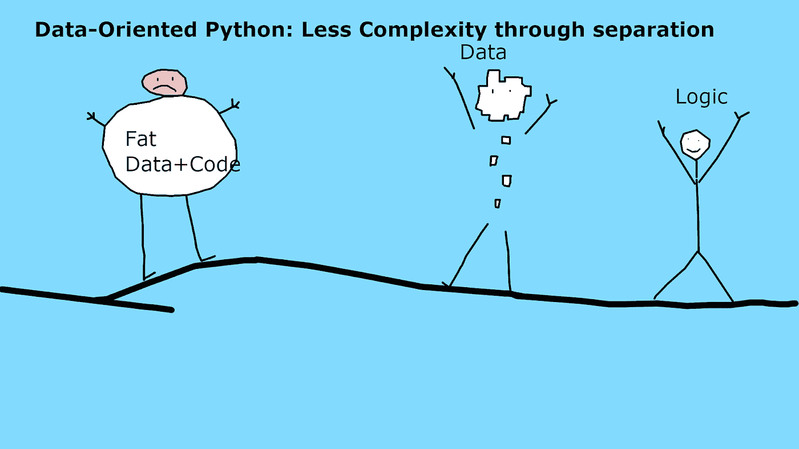

# 教程:面向数据——15 分钟内的 Python 通过数据/逻辑分离降低复杂性

> 原文：<https://towardsdatascience.com/tutorial-data-oriented-python-in-15-minutes-less-complexity-through-data-logic-separation-b5ee00518772>

## 一个 3 步教程，教你 Python 面向数据方法的三个主要概念



面向数据的代码让一切变得更简单、更快乐。图片由作者提供。

你听说过面向数据的编程方法吗？如果没有，现在你有了。本教程是为了让你对它感到兴奋，用 Python 编写的。

我们要做一些非常简单的事情:

1.我们将看看一个常见的虹膜分类问题，我已经通过编写两个 Python 类为您“解决”了这个问题。

2.然后我们将尝试在稍微不同的上下文中应用这些类，并重用它们。

3.这不会很顺利，所以我们将使用 ***面向数据的方法*** 把我的几个类变成很酷的面向数据的 Python 代码。

你可以跟着做，说明在下面和 GitHub 上。

# 第一步

标准 Python 代码转变为面向数据的 Python 代码的最简单示例如下:

```
# NON DO VERSION-----------------------------------class data(): X = 1 def add(self): self.X = X+1 ## DO version--------------------------------------class data(PRecord): ## (1) Using a base type PRecord = a map/dict in Python X = field() ## (2) Using an immutable type from pyristent def add(data): ## (3) Separating the logic (add) from the data return data.set(X=data.X+1) ## (2) return a new data piece, as data is immutable!
```

三个简单的步骤，听起来很简单，对吗？让我们简单地看一下我们在这里应用的这三个想法。

# 简而言之，面向数据的方法

面向数据的方法被称为面向数据的编程(DOP)或面向数据的设计(DOD)。国防部从游戏设计领域走出来，目标是让数据计算和游戏运行得更快。DOP 的人显然意识到 DOD 中用于游戏的想法在大多数数据密集型环境中有完全不同的意义！奇怪的是，使用的方法实际上是不同的。所以我在这里写的是以下的想法:

想法很简单:我们将数据与业务逻辑分离。我们通过使用通用结构并保持数据不变的方式来实现这一点。通过这样做，我们解耦了系统的各个部分，从而降低了整个系统的复杂性。*(用我自己的话说)*

**这里的关键成分是:**

*   分离数据，使其成为“一等公民”。许多编程语言事实上已经有了“数据类”,这些数据类只保存数据，其他什么也不保存。
*   我们使用[通用结构](https://www.geeksforgeeks.org/generics-in-c/)，像[映射和数组](https://livebook.manning.com/book/programming-with-types/chapter-9/)，因为它们已经自带了像“打印”或“排序”这样的内置方法，不需要我们编写它们。
*   我们保持数据[不可变](https://www.eventstore.com/blog/event-immutability-and-dealing-with-change),因为可变性产生了复杂性。没必要问“x=2 吗？或者在代码的这一点上 x=3？”。

所有这些因素都旨在通过让数据成为一等公民来降低复杂性。现在，让我们动手实践一下吧！

# 快速安装指南

转到 Github，[克隆存储库“DOP-Example”](https://github.com/sbalnojan/DOP-Example)并运行

```
./batect dev 
```

这将打开一个 Jupyter 笔记本服务器，正确的笔记本已经加载，都在 Docker 中。打开*“DO-Tutorial，ipynb”*，你就可以跟着做了。

# 编写第一个面向数据的 Python

我编写了两个简单的类和一段 Python 代码，它们完成了以下任务:

- *ML_Dataset* 可以加载并保存我的虹膜数据集，

- *ML_Predictor* 可将 SVM 拟合到 ML_Dataset，预测单个结果，并将孔输入矩阵的预测写入 ML_Dataset

- *程序代码*创建 ML_Dataset，ML_Predictor，拟合预测器，将新生成的测试空间的预测写入数据集中，最后运行一个测试预测。

下面是这两个类的 Python 代码。

```
#### — — — — — — — — — — — — — — — — — — — — — — — — — — — — — — — — ### These are our two machine learning classes. We wrapped stuff into classes to possibly extend this and make it more reusable…**class** ML_Dataset(): “”” Should hold our data, targets, predictions, basically X and y… Should also be able to fill itself, once we need it. “”” X **=** **None** y **=** **None** y_pred **=** **None** **def** load_iris(self): iris **=** datasets**.**load_iris() self**.**X **=** iris[“data”][:,3:] # petal width self**.**y **=** (iris[“target”]**==**2)**.**astype(np**.**int) **class** ML_CLF(): “””Should hold the classifier we want to use here, should also be able to fit and predict. “”” clf **=** **None** **def** fit_clf(self, m: ML_Dataset): self**.**clf **=** svm**.**SVC(gamma**=**’scale’, decision_function_shape**=**’ovo’, probability**=True**) self**.**clf**.**fit(m**.**X,m**.**y) **def** predict(self, X): **return** self**.**clf**.**predict(X) **def** write_preds(self,m): “””Writes predictions into an ML_Dataset using this classifier””” m**.**y_pred **=** self**.**clf**.**predict_proba(m**.**X)
```

这是我的小程序的样子:

```
*#### — — — — — — — — — — — — — — — — — — — — — — — — — — — — — — — —* *### Our running program. Yes, we’re still exploring stuff here.**# create our dataset, load stuff into it.*m **=** ML_Dataset()m**.**load_iris()*# create our classifier and fit it to the dataset*c **=** ML_CLF()c**.**fit_clf(m)*# let’s try it out, into a new dataset to predict on into our dataset, then write our prediction in it and print them out…*m**.**X **=** np**.**linspace(0,3,1000)**.**reshape(**-**1,1)c**.**write_preds(m)print(m**.**y_pred)print(“individual predictions: “, c**.**predict([[1.7],[1.5]]))
```

在这种特殊的情况下，这样做很好。现在让我们通过首先交换数据集来重用代码。

# Pt 1 分离数据和代码

让我们将数据集换成不同的数据集。我放置了业务逻辑，将 iris 数据集加载到保存数据的类中。因此，我们需要改变这个类或者创建一个新的类来将我们的数据集换成一个不同的类。我们可以这样做，它看起来像这样:

```
*#### — — — — — — — — — — — — — — — — — — — — — — — — — — — — — — — —* *# Option 1, write a new class***class** ML_Dataset_2(): “”” Should hold our data, targets, predictions, basically X and y… Should also be able to fill itself, once we need it. “”” X **=** **None** y **=** **None** y_pred **=** **None** **def** load_different_dataset(self): self**.**X **=** np**.**array([[1],[2],[3],[4],[5]]) self**.**yy**=**np**.**array([1,0,0,1,1])*# Option 2, change the class***class** ML_Dataset(): “”” Should hold our data, targets, predictions, basically X and y… Should also be able to fill itself, once we need it. “”” X **=** **None** y **=** **None** y_pred **=** **None** **def** load_iris(self): iris **=** datasets**.**load_iris() self**.**X **=** iris[“data”][:,3:] *# petal width* self**.**y **=** (iris[“target”]**==**2)**.**astype(np**.**int) **def** load_different_dataset(self): self**.**X **=** np**.**array([[1],[2],[3],[4],[5]]) self**.**y **=** np**.**array([1,0,0,1,1])
```

但是每次我想交换东西的时候都要写一个新的类，这听起来是有问题的。让我们试试面向数据的方法，把数据从“代码”中分离出来。为此，编写一个类来保存数据 X，y，y_pred，并编写一个函数将数据加载到数据类中。最后，我们编写第二个函数，将新数据加载到数据集中。可能是这样的:

```
*### THE DO Approach***class** ML_Dataset(): “”” Should hold our data, targets, predictions, basically X and y… Should also be able to fill itself, once we need it. “”” X **=** **None** y **=** **None** y_pred **=** **None****def** load_iris(m: ML_Dataset): iris **=** datasets**.**load_iris() m**.**X **=** iris[“data”][:,3:] *# petal width* m**.**y **=** (iris[“target”]**==**2)**.**astype(np**.**int)*## load old data*m **=** ML_Dataset()load_iris(m)*## load something new***def** load_new(m: ML_Dataset): m**.**X**=**np**.**array([[1],[2],[3],[4],[5]]) m**.**y**=** np**.**array([1,0,0,1,1])load_new(m)
```

这对我来说已经很容易理解了。让我们看看另一个问题，我们的数据的可变性。

# Pt 2 不可变数据

让我们打印出目前为止使用的数据:

```
## OLD Approachm **=** ML_Dataset()load_iris(m)*## load something new***def** load_new(m: ML_Dataset):…## print out our datasetprint(m**.**X)
```

注意 m.X 的内容是如何变化的。我们不能简单地做一个 print(m.X)，print(m_old_X)，因为数据确实在变化。在这种情况下，我们必须先打印，然后再修改。这很好，但是让我们来看看面向数据的方法，使用不可变数据的方法。

对于不可变数据，我们使用 Python 包 [pyrsistent](https://github.com/tobgu/pyrsistent) ，并通过导入“from pyrsistent import field，PRecord”将我们的类重新创建为具有不可变字段的类。然后，我们通过向数据集加载新数据来创建数据集的新版本。这可能看起来像这样:

```
*### NEW DOP Implementation**# We’re using the module for immutable python pyrsistent here***class** ML_Dataset(PRecord): X **=** field() y **=** field() y_pred **=** field() X_new **=** field()**def** load_iris(): iris **=** datasets**.**load_iris() r_1 **=** ML_Dataset() r_2**=**r_1**.**set(X**=**iris[“data”][:,3:]) r_3**=**r_2**.**set(y**=**iris[“target”]) **return** r_3*## Here’s how we use it*r **=** load_iris()r_2 **=** r**.**set(X **=** np**.**linspace(0,3,1000)**.**reshape(**-**1,1))## Just making sure this stuff is actually immutable!r**.**set(X**=**”1")*# print(r.X)**# >> [0\. ]…… [0.01201201]**## Oh that doesn’t work, let’s try direct item assignment maybe?*r[“X”]**=**1*## >> TypeError: ‘ML_Dataset’ object does not support item assignment**# Nice, so now this cannot happen accidentally.*
```

太好了，Python 现在阻止我覆盖数据，我现在基本上有了一个版本化的数据集。让我们看看第三步，使用通用数据结构的想法。

# Pt 3 通用数据结构

我想到了给我的分类器对象添加“注释”的想法，这样我就可以留下类似“试验 1，用 params x，y，z 进行试验”的注释。在我的旧代码中这样做，看起来会像这样:

```
*#### — — — — — — — — — — — — — — — — — — — — — — — — — — — — — — — —* *### These are our two machine learning classes. We wrapped stuff into classes to possibly extend this and make it more reusable…***class** ML_CLF():“””Should hold the classifier we want to use here,should also be able to fit and predict. “”” clf **=** **None** trial_note **=** “trial 1” **def** fit_clf(self, m: ML_Dataset): self**.**clf **=** svm**.**SVC(gamma**=**’scale’, decision_function_shape**=**’ovo’, probability**=True**) self**.**clf**.**fit(m**.**X,m**.**y) **def** predict(self, X): **return** self**.**clf**.**predict(X) **def** write_preds(self,m): “””Writes predictions into an ML_Dataset using this classifier””” m**.**y_pred **=** self**.**clf**.**predict_proba(m**.**X)
```

让我们创建一个分类器并打印出来，看看我的笔记是什么样的:

```
*#### — — — — — — — — — — — — — — — — — — — — — — — — — — — — — — — —* *### Now let’s create another classifier.**# Let’s print it out to see the comment*c **=** ML_CLF()print(c)*# <__main__.ML_CLF object at 0x7f7b102cbdf0>*
```

这不是我所期望的。我们可以通过提供 __str__ 方法来解决这个问题。但是面向数据的方法采取了不同的路线。让我们像使用字典一样使用泛型类来使用字典的内置函数，如 print()或 item()。我们仍然希望保持它不变，所以我们使用来自 pyrsistent 的预编码，它本质上是一个字典。如果我们这样做，我们的代码可能如下所示:

```
**class** ML_Predictor(PRecord): clf **=** field() note **=** field()**def** predict_stuff(m: ML_Predictor, d: ML_Dataset): m_2 **=** m**.**set(clf**=**m**.**clf**.**fit(r**.**X,r**.**y)) *# Al right! Now we got…* *# — m, as the initialized and unfitted CLF* *# — m_2 as the fitted predictor. From the outside, not easy to   distinguish…* d_2 **=** d**.**set(y_pred **=** m_2**.**clf**.**predict_proba(d**.**X_new)) **return** d_2*### Our Program — — — — — — — — — — — — — — — — — — — — — — — — — —* r **=** load_iris()r_2 **=** r**.**set(X_new **=** np**.**linspace(0,3,1000)**.**reshape(**-**1,1))c **=** ML_Predictor(clf**=**svm**.**SVC(gamma**=**’scale’, decision_function_shape**=**’ovo’, probability**=True**), note**=**”This is trial 1; using SVC”)c_2 **=** c**.**set(clf**=**svm**.**SVC(gamma**=**’scale’, decision_function_shape**=**’ovo’, probability**=True**, kernel**=**’poly’), note**=**”This is trial 2\; using SVC with polyn. kernel”)print(c)print(c_2)print(c**.**items()) *# we can use all the default cool functions on this generic Map!```
```

耶！为了使它完整，我还从之前的类中删除了业务逻辑。现在我们有了一段很好的可重用代码，使数据成为一等公民，更容易理解，也更容易模块化。

就这样，您已经学到了 Python 面向数据方法的第一课。让我们回顾一下。

# 概述

*   面向数据的 Python 让数据成为一等公民
*   至于降低复杂性
*   它将数据从业务逻辑中分离出来
*   它使用通用数据结构
*   它只使用不可变的数据

如果你感兴趣，我强烈推荐你继续阅读这种方法。

# 接下来读什么

遗憾的是，我没有任何特定于 Python 的资源。但是我有资源。

*   有一本名为《[面向数据编程](https://www.manning.com/books/data-oriented-programming)》的书，由曼宁出版，作者是耶霍纳坦·沙尔维特。他还在自己的[网站](https://blog.klipse.tech/databook/2020/09/29/do-principles.html)上免费发布了大量内容。
*   然后有一本书更针对面向数据的游戏设计社区。理查德·费边称之为“[面向数据的设计](https://www.amazon.de/Data-oriented-design-engineering-resources-schedules/dp/1916478700)”。这本书在他的网站上也有在线版本。
*   还有一个 [Github 库](https://github.com/dbartolini/data-oriented-design)包含了很多还没有提到的信息，包括视频等等，所以也来看看吧。
*   我发现一篇关于[面向数据的 Python](https://www.moderndescartes.com/essays/data_oriented_python/) 的文章解释得很好，即使我们依靠 NumPy 来处理像“指针优化”这样的大部分单词，我们仍然可以从中获得 5-10 倍的速度优势。

*对如何建立伟大的数据公司、伟大的数据密集型产品、成为伟大的数据团队感兴趣，还是对如何利用开源构建伟大的东西感兴趣？然后考虑加入我的* [*免费简讯《三个数据点周四》*](http://thdpth.com/) *。它已经成为数据初创企业、风投和数据领导者值得信赖的资源。*