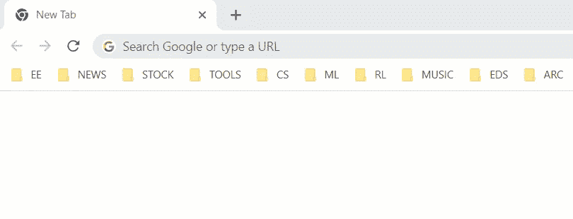
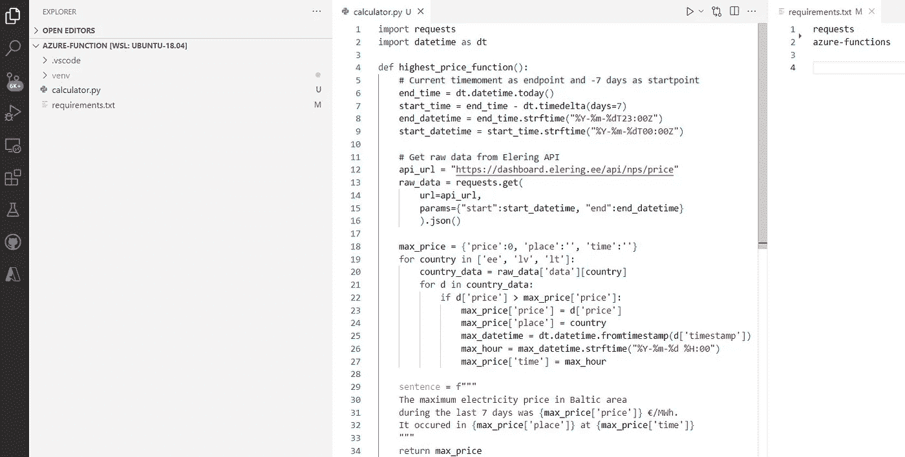
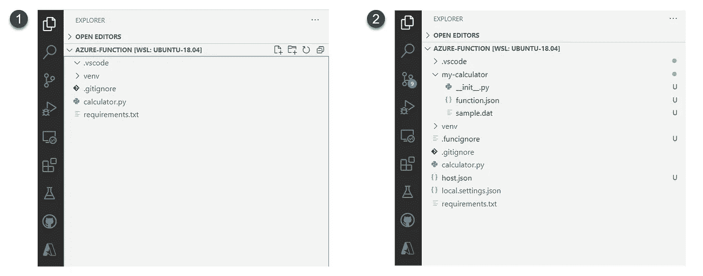
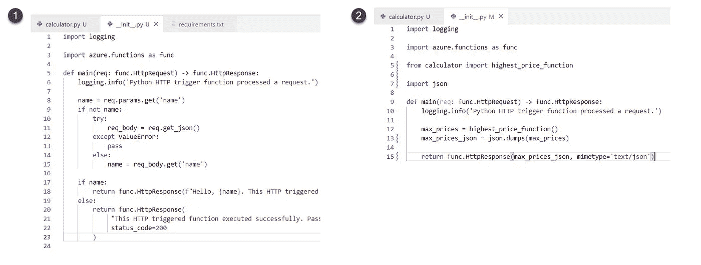
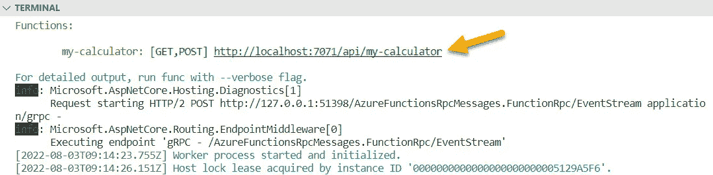
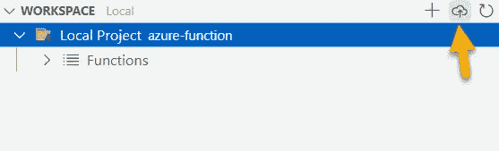

# Python Azure 函数教程

> 原文：<https://towardsdatascience.com/tutorial-of-python-azure-functions-81949b1fd6db>

由 [Unsplash](https://unsplash.com?utm_source=medium&utm_medium=referral) 上的 [Element5 数码](https://unsplash.com/@element5digital?utm_source=medium&utm_medium=referral)拍摄

## 将您的代码作为 API 发布，无需传统的服务器设置

# 介绍

Azure functions 是一个“**无服务器解决方案**”，这意味着你不必担心传统的服务器设置。它可以用于各种场景，包括 a)构建 web API，b)运行计划任务，c)响应数据库更改等事件。在本教程中，我们将使用 Azure 函数将应用程序发布为 web API。

本教程中描述的示例应用程序的发布版本(图片由作者提供)。

# 环境配置

如果你之前没有使用过 Azure 函数，那么最耗时的步骤就是环境设置。我建议进行以下设置:

1.  具有有效订阅的 Azure 帐户。[你可以免费创建一个账户](https://azure.microsoft.com/free/?ref=microsoft.com&utm_source=microsoft.com&utm_medium=docs&utm_campaign=visualstudio)。
2.  Azure 功能核心工具版本 3.x。
3.  Python 版。
4.  [Visual Studio 代码](https://code.visualstudio.com/)在一个支持的平台上([看一下支持的平台](https://code.visualstudio.com/docs/supporting/requirements#_platforms))。
5.  Visual Studio 代码的 [Python 扩展](https://marketplace.visualstudio.com/items?itemName=ms-python.python)。
6.  Visual Studio 代码的 [Azure 函数扩展](https://marketplace.visualstudio.com/items?itemName=ms-azuretools.vscode-azurefunctions)。

如您所见，有六个主要步骤可能会占用您几个小时的时间。幸运的是，你只需要做一次。

# 初始结构

我们从已经有工作应用程序的州开始这个项目。我们的应用程序告诉您，在过去的 7 天里，波罗的海地区的最高电价是在哪里、什么时候、什么价格( [**查看实时应用程序**](https://azurefunctionsresearch.azurewebsites.net/api/my-calculator) )。

项目的初始结构由包含最高价格计算函数的`calculator.py`文件和定义两个库的`requirements.txt`文件组成:`requests`和`azure-functions`。

初始项目结构(图片由作者提供)。

# 在本地创建 Azure 函数

要开始将我们的代码包装成 Azure 函数，我们首先需要创建本地 Azure functions 项目。遵循以下步骤(或微软的[详细说明](https://docs.microsoft.com/en-us/azure/azure-functions/create-first-function-vs-code-python#create-an-azure-functions-project)):

1.  在活动栏中选择 Azure 图标。然后在工作区(本地)区域，选择+按钮，在下拉列表中选择创建函数。出现提示时，选择创建函数。
2.  选择项目工作环境的目录位置，然后选择“选择”。
3.  根据提示提供以下信息:
    3.1 选择一种语言:`Python`。
    3.2 选择 Python 解释器创建虚拟环境。
    3.3 为您的项目功能选择模板:选择`HTTP trigger`。
    3.4 提供函数名:输入`my-calculator`。
    3.5 授权级别:选择`Anonymous`，可以让任何人调用你的函数端点。
    3.6 选择您希望如何打开您的项目:选择`Add to workspace.`

Visual Studio 代码自动创建必要的文件，我们的项目目录现在将具有如下图 2 所示的结构:

启动 Azure 功能前(图 1)和后(图 2)的项目结构(图片由作者提供)。

# 将您的代码与 Azure 函数链接起来

目前，Azure function backbone 已经创建，但我们还没有将我们的应用程序链接到它。

打开`my-calculator`文件夹内的`__init__.py`文件。该文件包含将作为 Azure 函数运行的`main`函数。目前，该文件中充满了示例代码(如下图 1 所示)。为了运行我们的计算器，我们对文件进行了以下修改:

1.  导入您的函数(在我们的例子中`from calculator import highest_price_function`，
2.  导入 json 库，将字典转换成 JSON 格式(REST APIs 的标准输出格式)。
3.  用自己的逻辑替换`main`函数里面的代码:
    a .运行函数，保存结果。
    b .将结果(我们的结果是一个字典)转换成 JSON。
    c .返回 JSON 结果。

已修改 __init__。py 文件将您的代码包装在 Azure 函数中(图片由作者提供)。

# 在本地测试该功能

要在本地启动该功能，请按 F5 或播放图标。如果一切顺利，您将在终端窗口中看到端点的 URL:

在本地启动该功能后，您将在终端窗口中找到该功能的 URL(图片由作者提供)。

复制此 URL 并将其粘贴到我们的浏览器中，或者只需在 VS 代码中单击它:

本教程中描述的示例应用程序的发布版本(图片由作者提供)。

# 将该功能部署到 Azure cloud

我们现在准备将该功能部署到 Azure。遵循以下步骤([或微软官方指令](https://docs.microsoft.com/en-us/azure/azure-functions/create-first-function-vs-code-python#sign-in-to-azure)):

1.  登录 Azure(如果需要)，
2.  打开 Azure 扩展，选择**创建资源**，搜索“**创建功能 App** ”。
3.  填写提示:
    3.1 选择订阅—选择订阅(如果只有一个订阅就看不到这个了)。
    3.2 输入全局唯一名称—输入函数的名称。
    3.3 选择运行时堆栈—选择您在本地机器上使用的语言版本。
    3.4 选择新资源的位置——选择您附近的某个地区。
4.  在 Azure 扩展的**工作区**部分，选择项目文件夹并点击 **Deploy** 。

该应用程序现已发布，您可以与任何有兴趣使用它的人共享它( [**查看本教程的实际应用**](https://azurefunctionsresearch.azurewebsites.net/api/my-calculator) )。

# 摘要

总的来说，Azure functions 绝对是一个值得考虑的工具，当你想与世界分享你的数据应用程序的原型时:

1.  **文档&教程** —非常好
2.  **初始设置复杂性** —中等
3.  **开发复杂度** —中低
4.  **部署复杂性** —低
5.  **授权可能性** —高
6.  **授权复杂度** —低
7.  **速度&可扩展性** —高水平
8.  **监控** —高功能开箱即用
9.  **定价** —几乎免费(用于原型制作)

你可以从这篇文章中读到[我对 Azure 功能的全面评测。玩得开心！](https://eljand.medium.com/rapid-prototyping-azure-functions-1cd8293ab300)