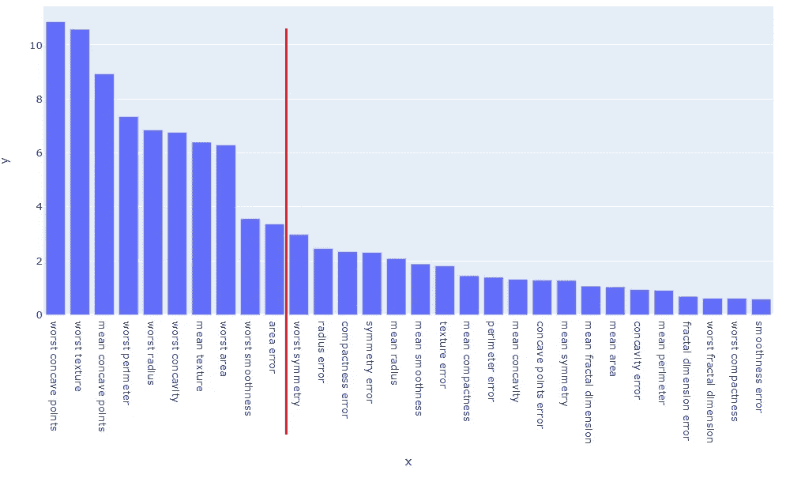
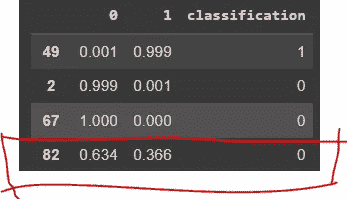
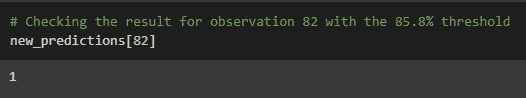

# 调整模型以降低错误预测

> 原文：<https://towardsdatascience.com/tweaking-a-model-for-lower-false-predictions-37d3bf028a3f>

## 调整您的模型，仅进行更高确定度的分类


照片由 [Kajetan Sumila](https://unsplash.com/@kajtek?utm_source=unsplash&utm_medium=referral&utm_content=creditCopyText) 在 [Unsplash](https://unsplash.com/s/photos/different?utm_source=unsplash&utm_medium=referral&utm_content=creditCopyText) 上拍摄

# 介绍

当创建分类模型时，许多算法提供函数`predict_proba()`来给我们观察值被分类到每个类别下的概率。因此，通常会看到这样的输出:

```
[0.925, 0.075]
```

> 在前面的例子中，模型有 92.5%的把握认为观察值属于类 0，而只有 7.5%的机会来自类 1。

因此，如果我们请求同一个模型使用`predict()`函数给我们一个二元预测，我们只会得到一个`[0]`作为结果，对吗？

在本例中，我们最有可能不希望模型预测观察值为*类 1* ，因为它只有很小的可能性。但是，假设我们对另一个观测值进行了预测，结果如下:

```
[0.480, 0.520]
```

现在怎么办？

当然，来自许多模型的*粗略*预测会给我们结果`[1]`。但这是最好的决定吗？有时候，是的。其他时候，没有那么多。

在这篇文章中，我们将学习如何使用 Python 中的`catboost`包，根据我们理解的用例可接受的假阳性【FPR】或假阴性率【FNR】的数量，为我们提供分类的最佳阈值。

# 数据科学背景

为了将这篇文章放在上下文中，让我们理解为什么我们想要将阈值从默认的 50%削减更改为另一个数字。

我们最好的例子来自医疗保健行业。我们知道，许多实验室检查、诊断和医学测试依赖于机器学习来帮助专家得出最精确的答案。毕竟在这个行业，每一个百分点都关系到一个人的一生。

所以，假设我们正在利用数据来诊断乳腺癌。*与利益相关者*交谈后，我们达成一致，我们希望我们的模型最多给出 1%的假阴性。我们想非常确定一个人是健康的，说它是乳腺癌阴性。如果有疑问，我们会将其归类为阳性，并建议进行第二次检查或不同的确认测试。

正如你可能已经得出的结论，这样做我们会降低模型的准确性，因为我们会增加假阳性的数量，但这是可以接受的，因为这个人总是可以再次检查并进行其他检查来确认这是不是真阳性。另一方面，我们不会遗漏任何患有该疾病并收到阴性结果的人。


照片由 [Towfiqu barbhuiya](https://unsplash.com/@towfiqu999999?utm_source=unsplash&utm_medium=referral&utm_content=creditCopyText) 在 [Unsplash](https://unsplash.com/s/photos/doubt?utm_source=unsplash&utm_medium=referral&utm_content=creditCopyText) 上拍摄

# 编码

你可以在我的 GitHub 资源库中找到这个练习的完整代码，这里是。

[](https://github.com/gurezende/Studying/tree/master/Python/CatBoost) [## 在 gurezende 大师学习/Python/CatBoost/学习

### 此时您不能执行该操作。您已使用另一个标签页或窗口登录。您已在另一个选项卡中注销，或者…

github.com](https://github.com/gurezende/Studying/tree/master/Python/CatBoost) 

要安装`catboost`，请使用`pip install catboost`。下面列出了一些需要进口的产品。

```
# Basics
import pandas as pd
import numpy as np
# Visualizations
import plotly.express as px
# CatBoost
from catboost import CatBoostClassifier
from catboost import Pool
# Train test
from sklearn.model_selection import train_test_split
# Metrics
from sklearn.metrics import confusion_matrix, f1_score
```

## 资料组

要使用的数据是著名的玩具数据集*乳腺癌，*来自`sklearn`。

```
# Dataset
from sklearn.datasets import load_breast_cancer

# Load data
data = load_breast_cancer()

# X
X = pd.DataFrame(data.data, columns=data.feature_names)
# y
y = data.target
```

您可能知道也可能不知道，这个数据集已经准备好了。在建模之前，没有太多需要探索或转换的地方。这不是我们的目的，所以我会继续讲代码。

## 列车测试分离

让我们把数据分开来进行训练和测试。

```
# Train test split
X_train, X_test, y_train, y_test = train_test_split(X, y, test_size=0.2, random_state=42)

print(f'Train shapes: {X_train.shape} | {y_train.shape}')
print(f'Test shapes: {X_test.shape} | {y_test.shape}')

Train shapes: (455, 30) | (455,)
Test shapes: (114, 30) | (114,)
```

## 第一个模型

接下来我们用`CatBoostClassifier`训练第一个模型。

```
# Creating a Pool for training and validation sets
train_pool = Pool( data=X_train, label=y_train)
test_pool = Pool( data=X_test, label=y_test)

# Fit
model = CatBoostClassifier(iterations=500)
model.fit(train_pool, eval_set=test_pool, verbose=100)
```

在序列中，这里是 F1 得分: *97%* 。

```
# Predict
preds = model.predict(X_test)
f1_score(y_test, preds)

0.971830985915493
```

非常好。但是我们的模型有点复杂，因为它有 30 多个特性。让我们试着在不损失太多性能的情况下降低它。 **Catboost** 具有`feature_importances_`属性，可以帮助我们确定要选择的最佳属性。

```
# Feature importances to dataframe
feature_importances = (
    pd.DataFrame({'feature': data.feature_names, 
                  'importance': model.feature_importances_})
    .sort_values(by='importance', ascending=False)
)
# Plot
px.bar(feature_importances,
       x= data.feature_names, y=model.feature_importances_,
       height=600, width=1000).update_layout(xaxis={'categoryorder':'total descending'})
```



减少 3 以下的重要性。图片由作者提供。

没有使用任何花哨的技术，我只是任意选择保留任何重要性为 3+的特征。这使得他们中的 10 个人，在红线的左边。

## 更简单的模型

让我们训练更简单的模型，并评估分数。

```
# Simpler model
features = feature_importances.feature[:10]
# Creating a Pool for training and validation sets
train_pool2 = Pool( data=X_train[features], label=y_train)
test_pool2 = Pool( data=X_test[features], label=y_test)

# Model 
model2 = CatBoostClassifier(iterations=600)
model2.fit(train_pool2, eval_set=test_pool2, verbose=100)

# Score
preds2 = model2.predict(test_pool2)
f1_score(y_test, preds2)

0.979020979020979
```

很好。同 F1 分: *97%* 。

由于我们正在进行医学诊断，我们不应该对假阴性非常宽容。只有当我们非常确定病人确实健康时，我们才会希望我们的模型说他健康。

但是我们知道 CatBoost 算法使用标准的 50%阈值来预测结果。这意味着，如果阳性概率低于 50%，患者将被诊断为乳腺癌阴性。但是我们可以调整这个数字，让它给出一个更高确定性的负面预测。

让我们看看这是怎么做到的。以下是我们模型的一些预测。

```
# Regular predictions
default_preds = pd.DataFrame(model2.predict_proba(test_pool2).round(3))
default_preds['classification'] = model2.predict(test_pool2)
default_preds.sample(10)
```



50%阈值模型的预测概率。图片由作者提供。

请注意，观察值 82 有 63.4%的几率为阴性，但也有 36%的几率为阳性，这对于医学标准来说是很高的。我们希望这个病例被归类为阳性，即使知道它可能是假的。所以我们可以在晚些时候送这个人去做另一个测试。因此，我们将假阴性率[FNR]容限设为 1%。

```
from catboost.utils import select_threshold
# Finding the right threshold
print(select_threshold(model2, test_pool2, FNR=0.01))

0.1420309044590601
```

太好了。既然 CatBoost 已经计算出了这个数字，那么被归类为负数的新阈值就是 1–0.142 = 0.858。**简单来说，0 类的概率必须超过 85.8%才能被标记为 0，否则将被归类为 1。**

好的。因此，我创建了一个自定义函数`predict_threshold(df, threshold, rate_type)` ( [访问我的 GitHub 查看代码](https://github.com/gurezende/Studying/tree/master/Python/CatBoost))，该函数将带有解释变量、所需阈值和汇率类型(FNR 或 FPR)的数据帧作为输入，并使用新的 cut 返回分类。

```
# Predict
new_predictions = predict_threshold(df= test_pool2, 
                                    threshold= 0.01, 
                                    rate_type= "FNR")

# Standard predictions
normal_predictions = model2.predict(test_pool2)
```

对指数 82 的相同观察，先前以 63%的概率被分类为负(0)，现在被分类为正(1)。



同样的观察#82 现在是积极的。图片由作者提供。

这是标准 50%阈值的混淆矩阵。

```
# Confusion Matrix 50% standard threshold
pd.DataFrame( confusion_matrix(y_true=y_test, y_pred=normal_predictions) )
```


分类 50%阈值。图片由作者提供。

这是具有更新阈值的新分类。

```
# Confusion Matrix 1% of false negatives allowed threshold
pd.DataFrame( confusion_matrix(y_true=y_test, y_pred=new_predictions) )
```


分类 85.8%阈值。图片由作者提供。

观察两个混淆矩阵的左下角单元格[true=1，pred=0，FN]。最上面的显示了一个假阴性。该人实际上患有癌症，并且该模型被分类为阴性。这个问题在新模型中得到了解决，没有假阴性。另一方面，我们也增加了一个假阳性。因此，就像数据科学中的许多事情一样，这都是关于权衡的问题。

> FPR(I 型误差)和 FNR(II 型误差)是互补的。当你减少一个时，另一个必然会增加。

如果您的项目需要非常低的误报率，那么可以使用相同的方法来降低 FPR。

# 在你走之前

总之，我们在这篇文章中学到的是:

*   分类的默认截止阈值是 50%的概率。
*   这个数字可以调整，以减少假阳性或假阴性的数量。
*   FPR(I 型误差)和 FNR(II 型误差)是互补的。减少一个会增加另一个。
*   使用`catboost`包计算分类的概率截止阈值。
*   例:`predict_threshold(test_pool2, threshold= 0.01, rate_type=”FNR”)`

如果你喜欢这个内容，关注我的博客或者在 [LinkedIn](https://www.linkedin.com/in/gurezende/) 上找到我。

[](http://gustavorsantos.medium.com/) [## 古斯塔沃·桑托斯-中等

### 阅读古斯塔夫·桑托斯在媒介上的作品。数据科学家。我从数据中提取见解，以帮助个人和公司…

gustavorsantos.medium.com](http://gustavorsantos.medium.com/) 

使用这个[推荐代码](https://gustavorsantos.medium.com/membership)成为一个媒体会员(你的订阅的一部分将会来到我这里，激励我继续创作内容)。

# 参考

[](https://github.com/catboost/tutorials/blob/master/events/2019_pydata_london/pydata_london_2019.ipynb) [## master catboost 上的 tutorials/pydata _ London _ 2019 . ipynb/tutorials

### 此时您不能执行该操作。您已使用另一个标签页或窗口登录。您已在另一个选项卡中注销，或者…

github.com](https://github.com/catboost/tutorials/blob/master/events/2019_pydata_london/pydata_london_2019.ipynb)