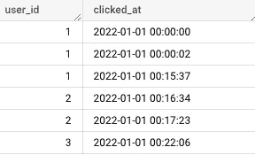
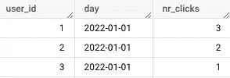

# BigQuery 中两种(完全不同的)dbt 增量模型

> 原文：<https://towardsdatascience.com/two-completely-different-types-of-dbt-incremental-models-in-bigquery-db794cbe022c>

## 基于分区的加载或使用增量加载跟踪下游模型的历史


[黄福生](https://unsplash.com/@killerfvith?utm_source=medium&utm_medium=referral)在 [Unsplash](https://unsplash.com?utm_source=medium&utm_medium=referral) 上的照片

[dbt](https://docs.getdbt.com/) 中的增量模型不是新发明，它们是将数据追加到表中的传统方式。在老式的数据仓库中，这是将日常数据引入数据存储环境的方法。为了不让事情失去控制，您应该放置一个键，并决定更新行(如果它存在的话),否则追加它(用一个`MERGE`操作)。

dbt 已经有了很棒的关于增量模型的文档[https://docs . get dbt . com/docs/building-a-dbt-project/building-models/configuring-incremental-models](https://docs.getdbt.com/docs/building-a-dbt-project/building-models/configuring-incremental-models)。几乎所有示例中提到的典型用例是切换到增量模型以降低成本，因此您不会每天删除表并从头开始重新构建，而是增量添加行。如果您正在使用 BigQuery，那么您应该已经了解了每天扫描数百 GB 或 TB 数据的成本(或者每天扫描几次，这取决于您如何安排 dbt)。下面，我将介绍两种类型的用例，以及如何在 dbt 中设计一个高效的增量模型。

## **类型 1 增量模型用例**

*   您的数据已经在您的数据湖中，完全，所有的，所以您可以每天重新创建您的表。
*   您有不可变的事件数据，并且有时间戳。例子可以是点击、浏览、印象、电子邮件打开等。
*   在表实体化上创建模型的成本很高。

## **类型 1 增量模型示例**

假设我有关于客户点击的数据，这些点击有`user_id`和`clicked_at`时间戳



原始客户点击数据示例

并且您希望创建一个模型，其中包含每个客户每天的点击量:



点击数据的类型 1 增量模型输出示例

对此的查询非常简单:

```
select 
     user_id, 
     date(clicked_at) as day, 
     count(clicked_at) as nr_clicks
from raw_data
group by user_id, date(clicked_at)
```

想象一下，你有万亿字节的数据，当你只能计算最后一天时，为什么每次都要从头开始重新计算所有的点击历史？

## **1 型增量模型的解决方案**

首先这类数据天生就是要分区的，请做到。在这个[链接](https://discourse.getdbt.com/t/benchmarking-incremental-strategies-on-bigquery/981)中，您可以看到 BigQuery 上不同策略的简洁对比以及每种策略的性能。很明显*插入+覆盖静态*策略的性能最好，几乎与数据 **🥳** 的增长成线性关系。所以让我们来实现它吧！

```
-- Let's define the partitions and decide the replace the last 2 
-- days, just in case some clicks did not arrive yet.-- Here we define the incremental model, the data will be
-- partitioned by the date and I am also clustering by user_id
-- to improve performance. I am choosing the insert_overwrite
-- strategy explicitly{{ 
   config(
          materialized='incremental',
          partition_by = { 'field': 'day', 'data_type': 'date' },
          cluster_by = "user_id",
          incremental_strategy = 'insert_overwrite'
         )
}}select 
     {{ dbt_utils.surrogate_key(['user_id',    dbt_utils.date_trunc('day','clicked_at')]) }} as user_day_pk,
     user_id, 
     date(clicked_at) as day, 
     count(clicked_at) as nr_clicks
from raw_data-- This is to replace the last 2 day partitionswhere date(clicked_at) in ({{ partitions_to_replace | join(',') }})
group by user_id, date(clicked_at)
```

我甚至没有展示这个用例的`merge`策略的例子，尽管它们会起作用，因为这确实是实现这个模型并获得最佳性能的一个简洁的方法。注意**对于`insert_overwrite`策略，你不需要一个键**。更重要的是，即使您在配置中为惟一键添加了一行，那一行也不会运行！所以不要这样做，你会给自己制造错误的期望:

```
{{ 
   config(
          materialized='incremental',
-- do not do this line below, it won't run anyways
          unique_key = 'user_day_pk'
          partition_by = { 'field': 'day', 'data_type': 'date' },
          cluster_by = "user_id",
          incremental_strategy = 'insert_overwrite'
         )
}}
```

那为什么不需要钥匙呢？嗯，上面的代码盲目地工作，从 dbt 模型中删除最近 2 天的分区，从`raw_data`中选择最近 2 天的分区，并重新追加它们。所以手术不需要钥匙，但是如果你愿意，你可以在桌子上留一把钥匙。

## **类型 2 增量模型用例**

*   您的数据源不保留历史记录，但您希望开始构建历史记录并停止丢失数据。
*   您的 dbt 模型有几个下游转换，并且您想要跟踪您的下游模型的历史。

这是一个与前一个案例完全不同的用例，因为这类似于保存快照。[这里的](https://docs.getdbt.com/blog/change-data-capture?utm_content=215567626&utm_medium=social&utm_source=linkedin&hss_channel=lcp-10893210)是 dbt 实验室关于这个用例的一个非常好的博客，其中他们明确声明不要给你的下游模型拍快照。我将展示的解决方案不仅可以帮助您跟踪历史和防止数据丢失，而且比维护多个快照的成本要低得多。

## **类型 2 增量模型示例**

假设您的数据源中有 6 个表，这些表保存了 Twitter 个人资料的不同属性，比如 Twitter 个人资料 URL、Twitter 用户名、Twitter 描述、Twitter 照片 URL 和 Twitter 位置。这些是工程表，保存了每个属性，以及创建和修改的时间戳。

`t_profile` — `t_profile_id`、`t_modified_at`、`t_deleted_at`

`t_username` — `t_profile_id`、`t_username`、`t_created_at`、`t_modified_at`

`t_url` — `t_profile_id`、`t_url`、`t_created_at`、`t_modified_at`

`t_description` — `t_profile_id`、`t_description`、`t_created_at`、`t_modified_at`

`t_photo_url` — `t_profile_id`、`t_photo_url`、`t_created_at`、`t_modified_at`

`t_location`——`t_profile_id`、`t_longitude`、`t_latitude`、`t_created_at`、`t_modified_at`

`t_profile_id`是每个表的一个键。用户名和配置文件 URL 是必需的属性，但是配置文件中可能缺少其他属性。连接这些数据的查询很简单，但是它只给出 Twitter 概要文件的当前版本。实际上，除非您开始跟踪历史，否则您无法找到每个属性的版本，只能找到当前的版本。

```
select
      t_profile.t_profile_id,
      t_username,
      t_url,
      t_description,
      t_photo_url,
      t_longitude,
      t_latitude,
      t_profile.t_created_at as t_profile_created_at,
      t_profile.t_deleted_at as t_profile_deleted_at
from t_profile
inner join t_username
      on t_profile.t_profile_id = t_username.t_profile_id
left join t_url
      on t_profile.t_profile_id = t_url.t_profile_id
left join t_description
      on t_profile.t_profile_id = t_description.t_profile_id
left join t_photo_url
      on t_profile.t_profile_id = t_photo_url.t_profile_id
left join t_location
      on t_profile.t_profile_id = t_location.t_profile_id
```

现在，您想要基于前面的查询创建一个表`t_profile_history`，但是还要跟踪工程数据中的每个属性。

## **2 型增量模型的解决方案**

我们不能再将分区用于数据加载策略，因为我们不希望删除任何分区并从数据源重新计算，因为数据源不保留历史记录。让我们把这种情况简化为每天进行一次修改。

```
-- Here we set the config as incremental and the unique key of each -- profile per day
-- I am pratitioning by date for query performance after the model 
-- is live, but it won't affect the merge
-- Add the strategy as merge
-- Do not forget full_refresh = false so there are no accidents{{ config(
          materialized='incremental',
          unique_key = 't_profile_history_pk',
          partition_by = { 'field': 't_profile_modified_at',     'data_type': 'timestamp', "granularity": "day" }, 
          cluster_by = "t_profile_id",
          incremental_strategy = 'merge',
          full_refresh = false
         )
}}with twitter_profile_versions as (
select
      t_profile.t_profile_id,
      t_username,
      t_url,
      t_description,
      t_photo_url,
      t_longitude,
      t_latitude,
      t_profile.t_created_at as t_profile_created_at,
      t_profile.t_deleted_at as t_profile_deleted_at,
      GREATEST(
               COALESCE(
                        t_profile.t_created_at,
                        t_username.t_modified_at,
                        t_url.t_modified_at,
                        t_description.t_modified_at,
                        t_photo_url.t_modified_at,
                        t_location.t_modified_at
                       ),
               COALESCE(
                        t_username.t_modified_at,
                        t_url.t_modified_at,
                        t_description.t_modified_at,
                        t_photo_url.t_modified_at,
                        t_location.t_modified_at,
                        t_profile.t_created_at
                       ),
               COALESCE(
                        t_url.t_modified_at,
                        t_description.t_modified_at,
                        t_photo_url.t_modified_at,
                        t_location.t_modified_at,
                        t_profile.t_created_at
                        t_username.t_modified_at
                       ),
               COALESCE(
                        t_description.t_modified_at,
                        t_photo_url.t_modified_at,
                        t_location.t_modified_at,
                        t_profile.t_created_at
                        t_username.t_modified_at
                        t_url.t_modified_at
                       ),
               COALESCE(
                        t_photo_url.t_modified_at,
                        t_location.t_modified_at,
                        t_profile.t_created_at
                        t_username.t_modified_at
                        t_url.t_modified_at,
                        t_description.t_modified_at
                       ),
               COALESCE(
                        t_location.t_modified_at,
                        t_profile.t_created_at
                        t_username.t_modified_at
                        t_url.t_modified_at,
                        t_description.t_modified_at
                        t_photo_url.t_modified_at
                       ),
               ) as t_profile_modified_atfrom t_profile
left join t_username
      on t_profile.t_profile_id = t_username.t_profile_id
left join t_url
      on t_profile.t_profile_id = t_url.t_profile_id
left join t_description
      on t_profile.t_profile_id = t_description.t_profile_id
left join t_photo_url
      on t_profile.t_profile_id = t_photo_url.t_profile_id
left join t_location
      on t_profile.t_profile_id = t_location.t_profile_id)select 
     {{ dbt_utils.surrogate_key(['t_profile_id',      dbt_utils.date_trunc('day','t_profile_modified_at')}} as t_profile_history_pk,
     twitter_profile_versions.*
from twitter_profile_versionswhere date_diff(current_date(), date(t_profile_modified_at), DAY) <= 2
```

上面这段代码为我们的`t_profile_history`设计了加载过程，它为每天保存一个版本的概要文件，以防有任何变化。我保留了带有属性的表的连接，以选择最近两天修改过的属性。要小心，因为内部连接要求所有属性都已更改，但情况可能并非如此。

我使用`GREATEST()`来选择最后修改的时间戳，这是为了简化查询，并试图找到每个表的修改时间戳之间的中间版本。在本例中，我们简化了用例，用运行 dbt 时获得的快照构建历史。注意，我正在使用`COALESCE()`并旋转所有修改过的时间戳，包括概要文件中的`t_created_at`。我这样做是因为如果任何元素为空，那么`GREATEST()`将返回`NULL`[https://cloud . Google . com/big query/docs/reference/standard-SQL/functions-and-operators](https://cloud.google.com/bigquery/docs/reference/standard-sql/functions-and-operators)并且我们可能有空值，因为我们有 5 个左连接。我轮换每个修改过的时间戳，所以如果它们不为空，那么它们都有机会成为`COALESCE()`的输出。

记得用`full_refresh=FALSE`。这将防止当有人运行`dbt run --full --refresh`而你的模型连同你迄今为止跟踪的历史不见了的时候发生意外。

边上的一张纸条:

第二类使用情形的替代解决方案也可以通过快照来解决。在这种情况下，您将每天对所有 6 个表进行快照，并在下游照常进行转换(表或增量具体化)。快照解决方案的优点是，您仍然有一种 ELT 过程，您可以跟踪源数据的历史，并在以后决定转换。当您不确定要跟踪什么并且希望模式发生变化时，这是一个很大的优势。快照解决方案的缺点是，与增量模型相比，它在处理(增量模型解决方案仅扫描最近 2 天的数据)和存储(我们在增量解决方案中仅存储 1 个模型，而不是在快照解决方案中存储 7 个模型)方面都非常昂贵。

## 让我们结束吧！

dbt 增量模型是提高性能和优化成本的神奇工具。当你的表很大并且事件不可变时，考虑使用`insert_overwrite`策略。一个不太传统的例子是跟踪下游模型的历史。这更像是一个 ETL 过程，您提取、执行转换，然后增量加载，这可以通过`merge`策略实现，保持唯一的键，并确保您不允许完全刷新。