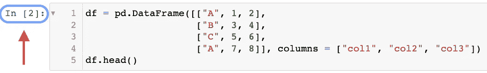
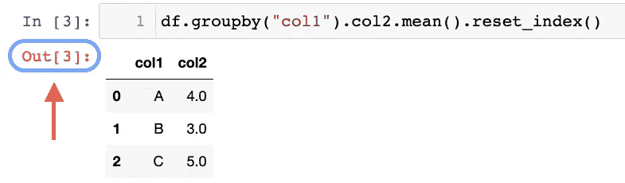
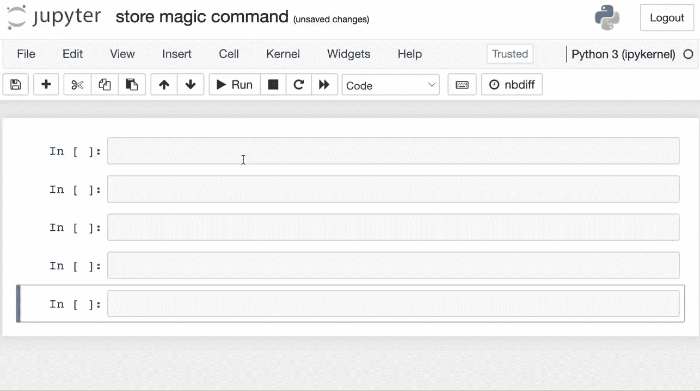

# 两个黑仔 Jupyter 黑客保证节省你的工作时间

> 原文：<https://towardsdatascience.com/two-killer-jupyter-hacks-that-are-guaranteed-to-save-you-hours-of-work-time-2b9e430988dd>

## 当你开始使用它们的时候

[布拉德在](https://unsplash.com/@bradneathery?utm_source=medium&utm_medium=referral) [Unsplash](https://unsplash.com?utm_source=medium&utm_medium=referral) 上整理的照片

Jupyter 笔记本，因为其简单、流线型、初学者友好和光滑的设计，几乎是当今任何面向 Python 的任务不可或缺的。

回想起来，我甚至无法想象没有像 Jupyter 这样的交互式 Python (IPython)工具的生活。

Jupyter(作者创建的图像)

本质上，IPython 最显著的优点是，只要内核是活动的，它们就将对象保存在内存中，从而减少了重新运行脚本的摩擦。

此外，Jupyter 也是典型原型制作的首选。

这使得数据清理、转换和可视化、数值模拟、统计建模、机器学习等任务相对更容易。

然而，由于它们的简单性，开发人员经常会犯一些常见的错误(无意的),从而耗费他们的时间和计算——这是项目中的两个基本支柱。

因此，在这篇博客中，我将分享几乎每个 Jupyter 用户都犯过的两个错误。这样，我还会向他们展示一个优雅的解决方案，为您节省大量时间。

我们开始吧🚀！

# 错误 1

你有没有遇到过这样的情况，你用 Jupyter 写了一些代码，但是在计算之后发现你忘记给变量赋值了？

在这种情况下，人们不得不再次执行单元格，并生成结果以将它们赋给一个变量。

我能体会那种感觉，因为我自己也经历过。

## 解决办法

如果我告诉你有一个巧妙的解决方法呢？

当你在 Jupyter 中执行一个单元格时，除了单元格之外，你还会看到类似于`In [2]:`的东西，不是吗？

Jupyter 细胞(图片由作者提供)

同样，除了单元格的输出面板之外，您还可以看到一些东西。更具体地说，它被表示为`Out[3]:`。

Jupyter 细胞(图片由作者提供)

在 IPython 中，`Out`是一个标准的 Python 字典，存储了`output-id`到`cell-output`的映射。`In`是一个 Python 列表，存储按顺序执行的代码。

它们的类型可以通过以下方式验证:

因此，如果您忘记将输出分配给某个变量，您可以使用`Out`字典并传递出现在输出面板旁边的`output-id`。

例如，在上面的`groupby`输出中，您可以使用`Out[3]`来检索结果。

是不是很酷？

# 错误 2

当在 Jupyter 笔记本中工作时，由于几个原因，人们可能想要重新启动内核。但是在重启之前，人们通常倾向于将数据对象转储到磁盘，以避免在后续运行中重新计算它们。

这是一个耗时的过程。此外，单独存储每个重要的数据对象相当麻烦。

## 解决办法

“**商店**”魔法指令是解决这一问题的理想方案。在这里，即使在重新启动内核之后，您也可以获得之前计算的值。

此外，您永远不需要经历将对象转储到磁盘的麻烦。

下面的视频演示了这一点:

存储命令演示(Gif 由作者提供)

如上所示，store magic 命令允许您甚至在重新启动内核后检索先前计算的值。

总而言之，这些是步骤:

**第一步:**使用`%store`存储变量。

这里“价值”是一个变量。

**第二步:**重启内核后，使用带有`-r`选项的`%store`。

注意，您也可以使用单个`%store`命令存储多个值。

# 结论

说到这里，我们就到此为止了。我希望你学到了新东西。

我相信，在交互式 Python 环境中工作时，这两个技巧将为您节省大量时间。

**觉得这些小技巧有趣吗？**

如果你想了解更多关于数据科学和 Python 的优雅技巧和诀窍，我每天都会在 LinkedIn 上发布一个信息丰富的提示。

你可以在 [**我的 LinkedIn 帖子存档**](https://www.linkedin.com/in/avi-chawla/recent-activity/shares/) 中找到我发布的所有提示。你可以在 [LinkedIn](https://www.linkedin.com/in/avi-chawla/) 上关注我，看看以后所有的帖子。

或者，您也可以通过电子邮件接收:

[🚀**订阅数据科学每日一剂。在这里，我分享关于数据科学的优雅技巧和诀窍，一天一个技巧。每天在你的收件箱里收到这些提示。**](https://avichawla.substack.com/)

[🧑‍💻**成为数据科学专业人士！获取包含 450 多个熊猫、NumPy 和 SQL 问题的免费数据科学掌握工具包。**](https://subscribepage.io/450q)

感谢阅读！