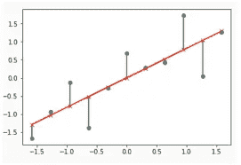
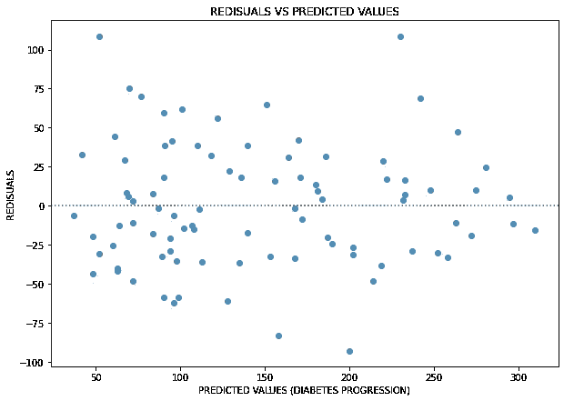
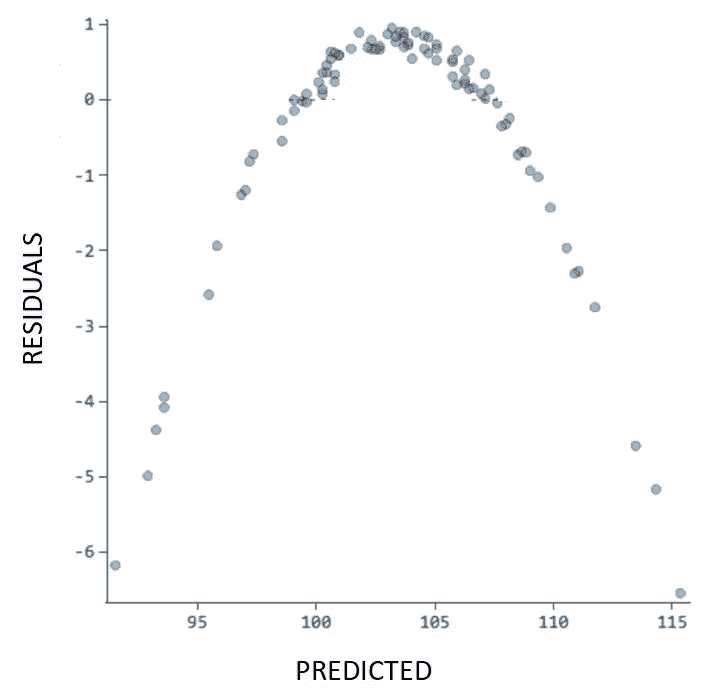
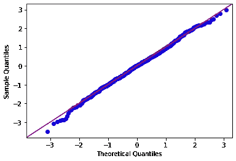

# 执行图形残差分析的两种方法

> 原文：<https://towardsdatascience.com/two-methods-for-performing-graphical-residuals-analysis-6899fd4c78e5>

## 猜测你是否可以在你的 ML 问题中使用线性模型的一些技巧


艾萨克·史密斯在 [Unsplash](https://unsplash.com/s/photos/analysis?utm_source=unsplash&utm_medium=referral&utm_content=creditCopyText) 上拍摄的照片

回归分析的一个重要部分是了解我们是否可以使用线性模型来解决我们的 ML 问题。有很多方法可以做到这一点，通常，我们必须使用多种方法来了解我们的数据是否真的是线性分布的。

在本文中，我们将看到两种不同的图形方法来分析回归问题中的残差:但这只是有助于理解我们的数据是否是线性分布的两种方法。

您可以只使用这些方法中的一种，甚至两种都用，但是您将需要其他度量的帮助来更好地验证您的假设(要使用的模型是线性的):我们将在以后的文章中看到其他方法。

但是首先…回归问题中的残差是什么？

# 1.解释残差

执行回归分析时，最好先检查其线性。当我们执行简单的线性回归分析时，我们得到所谓的最佳拟合线，这是最接近我们正在研究的数据的线。通常，用普通的最小二乘法计算“最适合”数据的线。有很多方法可以找到最符合数据的线；举个例子，一个是用一个正则化方法(如果你想加深正则化背后的概念，可以在这里阅读我的解释[。](/understanding-l1-and-l2-regularization-93918a5ac8d0)

让我们考虑将简单的线性回归公式应用于我们的数据；通常会出现的情况是，数据点没有恰好落在回归线上(即使我们使用两种正则化方法中的一种)；它们分散在我们“最适合”的系列中。在这种情况下，我们称**残差为数据点和回归线**之间的垂直距离。因此，残差可以是:

*   如果它们高于回归线，则为正
*   如果低于回归线，则为负值
*   如果回归线实际上通过该点，则为零



残差被可视化:它们是绿色的垂直线(红线是回归线)。图片作者。

所以，残差也可以看作是 t **任意数据点与回归线之间的差值，**与**，**由于这个原因，**，**它们有时被称为“误差”。在这种情况下，错误并不意味着分析有问题:它只是意味着存在一些无法解释的差异。

现在，让我们看看如何用图形表示残差，以及如何解释这些图形。

# 2.残差与预测值

我们可能感兴趣的与残差相关的图表之一是“**残差与预测值**的关系图。当我们用线性模型预测值时，必须绘制这种图形。

我从我的一个项目中提取了以下代码。假设我们的线性模型预测了我们的值:我们想要绘制“残差与预测”图；我们可以用这段代码来实现:

```
import matplotlib.pyplot as plt
import seaborn as sns#figure size
plt.figure(figsize=(10, 7))#residual plot (y_test and Y_test_pred already calculated)
sns.residplot(x=y_test, y=y_test_pred)#labeling
plt.title('REDISUALS VS PREDICTED VALUES')
plt.xlabel('PREDICTED VALUES (DIABETES PROGRESSION)')
plt.ylabel('REDISUALS')
```



残差与预测值。图片作者。

关于这个情节，我们能说些什么呢？

残差是随机分布的(上图没有明确的模式)，这告诉我们选择的(线性)模型还不错，但是残差的高值太多(甚至超过 100)意味着模型的误差高。

像这样的图可以给我们这样的感觉，我们可以应用线性模型来解决我们的 ML 问题。在这个项目的具体案例中，我不能(如果你想加深理解，你可以阅读我的研究的第一部分和第二部分)，这就是为什么我在上面写道，我们需要将这些图与其他指标“整合”，然后才能宣布数据确实是线性分布的。

有没有一种方法可以让残差警告我们，我们应用的线性模型不是一个好的选择？假设你找到了这样一个图表:



残差与预测值。图片作者。

在这种情况下，该图显示了一个清晰的模式(一个比喻),它向我们表明，线性模型可能不是这个 ML 问题的一个好选择。

*总结*:

这种图可以给我们一种直觉，告诉我们是否可以使用线性模型进行回归分析。如果图中显示*****没有特定的模式，很可能我们可以使用线性模型****；* ***如果有特定的模式，我们很可能应该尝试不同的 ML 模式*** *。* ***无论如何*** *，在这个情节之后，* ***我们必须用其他的度量来验证我们最初的直觉。*****

# **3.QQ 情节**

**QQ 图是“分位数-分位数”图，是一种通过绘制两个概率分布的分位数来比较它们的图形方法。**

**假设我们有数据(称为“数据”)要绘制在 qq-plot 中；我们可以用下面的代码来实现:**

```
**import statsmodels.api as sm
import pylab #qq-plot
sm.qqplot(data, line='45')#showing plot
pylab.show()**
```

****

**作者的 qq 图。**

**如果结果显示**残差分布在线**周围，就像上面的图一样，那么**很有可能我们可以使用线性模型**来解决我们的 ML 问题。但是，再一次:我们需要其他指标来证实这个最初的直觉。**

# ****结论****

**当我们执行回归分析时，一个好主意是首先测试 ist 线性。我们要做的第一件事是计算一些度量(例如 R 和 MSE)并获得对问题的第一直觉，试图了解是否可以用线性模型来解决；然后，我们可以用本文中看到的一个(或者两个)情节来加强(或者不加强！)我们最初的直觉；然后，我们必须使用其他方法来最终决定是否可以将线性模型应用于我们的问题(但我们将在另一篇文章中看到这些方法)。**

***我们一起连线吧！***

**[*中等*](https://federicotrotta.medium.com/)**

**[*LINKEDIN*](https://www.linkedin.com/in/federico-trotta/)*(给我发送连接请求)***

***如果你愿意，你可以* [*订阅我的邮件列表*](https://federicotrotta.medium.com/subscribe) *这样你就可以一直保持更新了！***

**考虑成为会员:你可以免费支持我和其他像我一样的作家。点击 [*这里*](https://federicotrotta.medium.com/membership) *成为会员。***