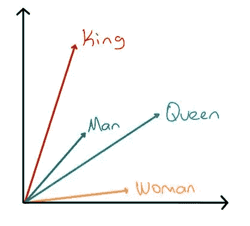
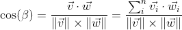
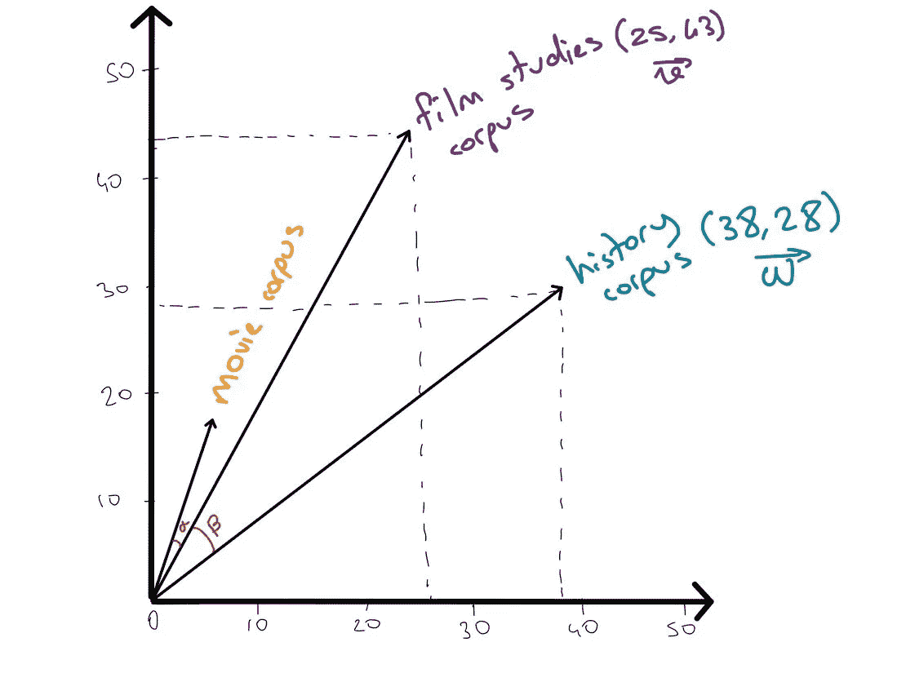
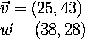
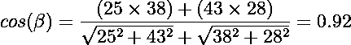
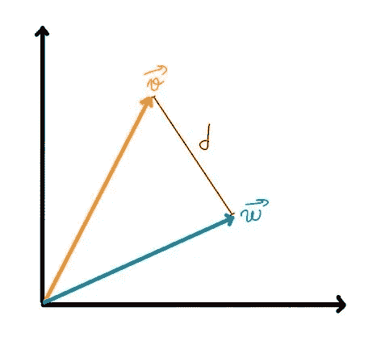
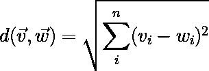
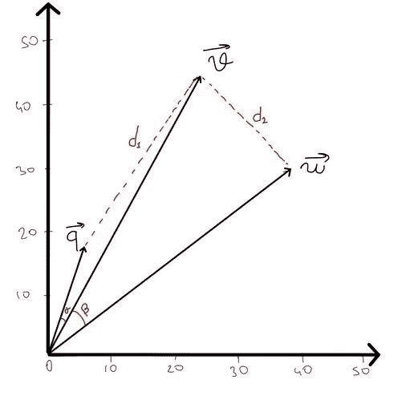

# 两个最常见的相似性度量

> 原文：<https://towardsdatascience.com/two-most-common-similarity-metrics-39c37f3fe14d>

## 找出两个文档相似程度的方法

当涉及到文档搜索或文本分类任务时，相似性度量是有用的。有几种方法可以衡量单词或文档之间的相似性。在这篇文章中，我将解释余弦相似性和欧几里德距离。

比阿特丽斯·佩雷斯·莫亚在 [Unsplash](https://unsplash.com?utm_source=medium&utm_medium=referral) 上的照片

## **目录**

1.  [简介](#0ef1)
2.  [余弦相似度](#ed9c)
3.  [欧几里德距离](#ef62)
4.  [使用哪一个](#94bd)
5.  [结论](#9aca)

## 介绍

你有没有想过计算机如何知道两个不同的单词有相似的意思，或者两个不同的文档有相似的上下文？好吧，让我解释给你听。

**什么是单词或文档向量？**

它将一个单词(或一个文档)的含义表示为一个实数向量。这些向量可以是多维的。并且语义相似的单词或文档具有相似的向量。

向量空间中的词向量(图片由作者提供)

## 余弦相似性

多维空间中两个向量之间的**角**的余弦决定了这两个向量的余弦相似度。

下面的公式给出了一个介于 0 和 1 之间的值，1 表示相似性最高，0 表示最低。

余弦相似公式(图片由作者提供)

我们来看一个例子。下图显示了一些语料库的假设向量表示。

语料库向量表示示例(图片由作者提供)

根据这种计算，假设的语料库在上下文中非常相似。

## 欧几里德距离

欧几里得距离就是两点之间的**距离**。单词向量在多维空间中彼此越接近，它们就越有可能具有相似的含义。

欧几里得距离的直观表示(图片由作者提供)

下面的公式给出了向量空间中两个向量之间的欧几里德距离。

欧几里德距离公式(作者图片)

## 用哪个？

何时使用其中一个取决于您的任务。一般来说，如果您想要度量相似性的文档大小不同，余弦相似性会给出更好的结果。如果其中一个语料库的规模比另一个大得多，自然地，一些单词在那个语料库中会比另一个重复更多。这就是为什么欧几里德距离可能不适合这种类型的任务。请参见下面的示例以获得直观的表示。

作者图片

在这个特别的例子中，d₂

However, in the exploratory type of data analysis, they both can be helpful to get insights from your data.

## Conclusion

Even though there are also other ways, I’ve tried to explain the two most common similarity metrics. Which one to use almost completely depends on your data and task. Sometimes using both and getting an understanding of the data might be useful too!

Thank you for reading!

If you have any feedback, please don’t hesitate to reach out to me on my [LinkedIn](https://www.linkedin.com/in/guldenturgay/) ！