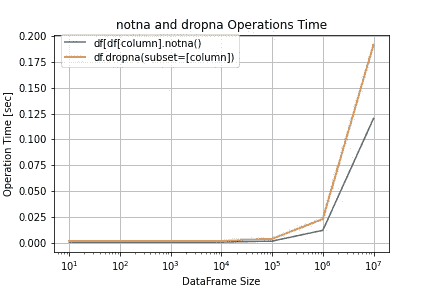
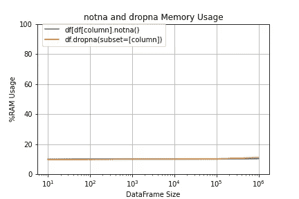
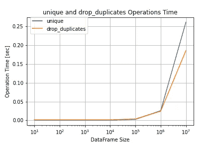
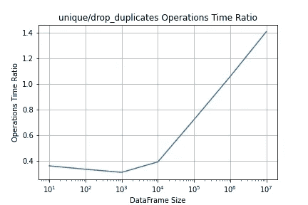
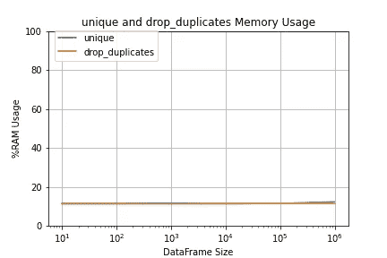

# 如何让你的熊猫代码运行得更快

> 原文：<https://towardsdatascience.com/two-pandas-tricks-i-wish-id-known-earlier-60af0a049735>

## 两只熊猫的把戏我希望我能早点知道

我们大多数数据科学家，在工作的某个时候都会用到熊猫图书馆。这篇文章将介绍两个技巧，让你的熊猫代码运行得更快。第一个是删除 None 值，第二个是从某一列中提取一组值。


[斯通王](https://unsplash.com/@stonewyq)在 [Unsplash](https://unsplash.com/s/photos/pandas) 上拍照。文本由作者添加。

# **删除无值**

像生活中的大多数事情一样，我们的数据并不完美。通常，在进行某些计算之前，我们没有想要删除的值。无论是简单的平均值、直方图还是更复杂的计算，我们都希望没有这些。我们如何用熊猫来做呢？小菜一碟！我们可以简单地使用 pd.dropna()方法。假设我们的数据帧名为 df，我们希望删除“日期”列中的所有 None 值:

```
import pandas as pd#load dataframe
df = pd.read_pickle("my_dataframe.pkl")
#remove rows with None in column "date"
df.dropna(subset=['date'])
```

我们将这种方法称为“dropna”。很长一段时间，这是我的首选方法...直到我遇到了这样一段代码:

```
import pandas as pd#load dataframe
df = pd.read_pickle("my_dataframe.pkl")
#remove rows with None in column "date"
df = df[df["date"].notna()]
```

我的第一反应是:“为什么不干脆用 dropna()？”嗯，我查了一下，答案很简单。它可能并不漂亮，但它要快得多！
我们来看下面的对比:



notna 和 dropna 方法的比较。作者创作的图表。

我在 10 到 10⁷.之间的各种数据帧大小上测试了这两种方法左侧显示了作为数据帧长度函数的移除 None 值的时间。因为它随着行数的增加而显著增加，所以可以更清楚地看到这两种方法之间的时间比——因此是右图。它显示 <notna time="">/<dropna time=""></dropna></notna>

**结论很明确:nonta 每次都赢。**

**有什么隐情？**

没有。没有内存消耗费用。



notna 和 dropna RAM 消耗的比较。作者创作的图表。

# **从列中提取集合**

有时我们需要从某一列中获取一组项目。我将比较 Pandas 的方法 drop_duplicates 和 Numpy 的方法 unique。对于这一部分，我们将首先删除“日期”列中的 None 值。下面是这两种方法的代码:

熊猫的掉落 _ 复制品:

```
import pandas as pd#load dataframe
df = pd.read_pickle("my_dataframe.pkl")
#extract "date" column and remove None values
date = df[df["date"].notna()]#get a set of column "date" values
date_set = date.drop_duplicates(subset=['date'])['date'].values 
```

Numpy 的独特之处:

```
import pandas as pd
import numpy as np#load dataframe
df = pd.read_pickle("my_dataframe.pkl")
#extract "date" column and remove None values
date = df[df["date"].notna()]['date'].values#get a set of column "date" values
date_set = np.unique(date)
```

所以我做了一个快速的比较，并再次想到我们有一个赢家——Numpy 的独特。然而，在仔细测试了各种数据帧大小后，我意识到实际情况要复杂得多。



unique 和 drop_duplicates 方法之间的比较。作者创作的图表。

对于短数据帧，unique 比 drop_duplicates 快。随着数据帧变得越来越大，drop_duplicates 占了上风，其中相等点位于 10⁶行附近的某处(其中时间比正好是 1)。我试着看看列数的影响，得到了同样的结果。同样，对于所有大小，这两种方法的内存消耗是相似的。



unique 和 drop_duplicates RAM 消耗的比较。作者创作的图表。

# **结论**

当我们想要执行操作时，我们每个人都有自己的 go-to 方法。通常还有另一个实现值得一试，它可能会节省您的时间和资源。
*使用 notna 删除 None 值。
*对于提取集合，这取决于您的典型数据帧长度:在 10⁵行下使用 unique。在 10⁶上空使用 drop_duplicates。

对于其他操作，检查替代方案，并让我知道你发现了什么！