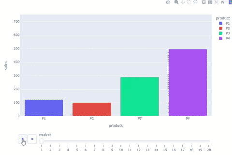
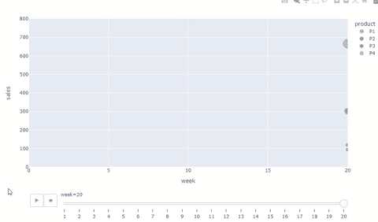
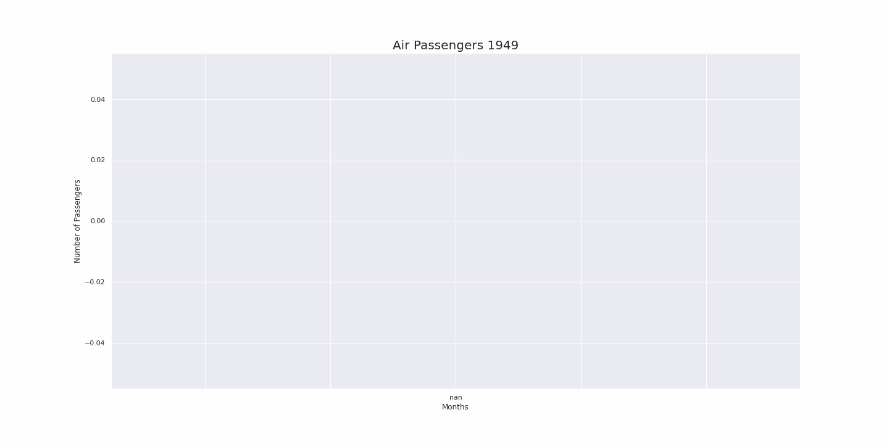

# 两个动画情节的快速代码片段

> 原文：<https://towardsdatascience.com/two-quick-codes-to-animate-your-plots-ecbaa99cd127>

## 使用 plotly 或 gif 库在 Python 中创建动画图


艾萨克·史密斯在 [Unsplash](https://unsplash.com/s/photos/line-chart?utm_source=unsplash&utm_medium=referral&utm_content=creditCopyText) 上拍摄的照片

这不是我第一次发表关于数据可视化的文章。这当然是引起我注意的事情。我喜欢在探索新的数据集时可视化数据，因为我相信我们的大脑被设计成从图像中捕捉比从文本或数字中捕捉更多的信息。

我确信不仅仅是我这么想。[麻省理工学院的科学家发现，我们的大脑可以识别 13 毫秒](https://news.mit.edu/2014/in-the-blink-of-an-eye-0116)内看到的图像！你能相信吗？我怀疑文本或数字也能做到这一点。

嗯，想想一本杂志。什么最先吸引你的注意力？图片、信息图表还是文字？不过，我会把这个想法留给你。

## 愉快的

回到主题，在 Python 中有很多用于绘制图形的库。Matplotlib、Seaborn、Bokeh、Plotly，等等。我甚至在这里写了一个完整的帖子，关于为什么你应该探索和使用更多 plotly express 来探索数据，因为它有惊人的交互性。

好的，但是我们还能做些什么来使我们的演示更有影响力呢？

我想提出的选项是动画情节。有一点我可以告诉你，他们第一眼就能产生影响。每当我在 LinkedIn 上看到一个，我都会停下来看看。我认为他们在某些情况下讲故事讲得很好。

显然，这是一个受众和要传达的信息的问题。并非每个图形或数据集都适合动画情节。这是你应该为你的项目和报告做的评估。我认为它们对于时间序列来说非常有效。例如，线是如何在几个月内形成的。

## Plotly Express

让我们现在编码。创建动画情节的第一个选项是使用我最喜欢的 Python 库之一: *Plotly Express* 。

```
import plotly.express as px
import pandas as pd
import numpy as np
```

让我们在数据集中创建一些值。

```
# create dataframe
df = pd.DataFrame( {'week': np.random.randint(1,21, size=200),
'P1': np.random.randint(10,220, size=200),
'P2': np.random.randint(15,200, size=200),
'P3': np.random.randint(10,490, size=200),
'P4': np.random.randint(10,980, size=200) } )df = df.melt(id_vars='week', var_name= 'product', value_vars= df.columns[1:], value_name='sales')
df = df.groupby(['week', 'product']).sales.mean().reset_index()
df = df.sort_values(by=['week', 'product', 'sales'])
```

现在，我们可以绘制一个动画条形图来检查每周产品的变化。

```
# Animated graphicfig = px.bar(df, x="product", y="sales", color="product",
animation_frame="week", animation_group="product", range_y=[0,750])
fig.update_layout(height=600, width=800)
fig.show()
```



这是你将看到的动画情节。图片由作者提供。

创建动画散点图也同样容易。

```
fig = px.scatter(df, x="week", y="sales", animation_frame="week", animation_group="product", size="sales", color="product", hover_name="product", range_x=[0,20], range_y=[0,800])fig.update_layout(height=600, width=1000)
```



用 plotly 创建的动画散点图。图片由作者提供。

## gif 库

创建动画情节的第二种方法是使用`gif`库。这个库所做的是创建一系列的情节，并把它们放在一个帧序列中，创建一个动画 gif 图像。

首先，我们来获取一些时间序列数据进行绘图。我们使用著名的[航空乘客数据集](https://github.com/mwaskom/seaborn-data/blob/master/flights.csv)，这是一个我们可以直接从 seaborn 图书馆获得的开放数据。

```
import seaborn as sns
df = sns.load_dataset('flights')
```

接下来，我们创建一个函数，为每个观察值创建一个图。

```
# Create a plot function to create the frames@gif.frame
def plot_flights(df, i):
    df = df.copy()
    **# Get the year for the plot title**
    yr = df['year'][i]
    **# Force X axis to be entirely plotted at once**
    df.iloc[i:] = np.nan
    **#Plot**
    ax = df.plot(x='month', y= 'passengers', legend=False, 
                 style="o-", figsize=(20,10))
    ax.set_title(f"Air Passengers {yr}", size=20)
    ax.set_xlabel("Months")
    ax.set_ylabel("Number of Passengers")
```

*   `@gif.frame`是一个装饰器，由`gif`库用来创建帧序列。
*   `df.iloc[i:] = np.nan`将所有未来的观测值转换为 NA。这是一种编程方式，一次仅绘制一个值( *i=0 所有 NAs，i=1，仅绘制索引 0，i=2，仅绘制 0 和 1…*)，并且 X 轴仍然从一端到另一端绘制，因此在动画过程中不会改变。剧情尺寸会保持不变，更容易观看。

现在我们使用函数创建一个循环来创建帧。

```
# Build the gif "frames"frames = []
for i in range(df.shape[0]):
    frame = plot_flights(df, i)
    frames.append(frame)
```

最后，保存生成的 GIF 图像。

```
# Choose the duration between frames (milliseconds) and save to file:gif.save(frames, 'gif_example.gif', duration=180)
```



用 gif 库绘制的航空乘客时间序列。图片由作者提供。

## 在你走之前

动画情节是一个好的演示文稿的有效资源。就像我们在这里展示的，时间序列，条形图和散点图很容易创建。

然而，并不是所有的情节都适合被动画化。你应该知道使用动画的最佳情况。并不是所有的公众都会喜欢这样，因为动画图形并不是深入分析的最佳选择，例如，当你需要一个静态图像来观察、比较和理解时。

要创建动画线条图，我建议你使用`gif`库，因为对于这种图形类型，它似乎比 plotly 更容易编码。如果您查看文档，您会发现动画线图需要使用 dash 模块进行更多的编码。另一方面，对于条形图和散点图，gor 对于`plotly.express`来说毫无疑问。

## 参考

[](https://plotly.com/python/animations/)  [](/a-simple-way-to-turn-your-plots-into-gifs-in-python-f6ea4435ed3c)  [](https://pypi.org/project/gif/)  

如果这些内容对你有用，请关注我的博客。

[](https://gustavorsantos.medium.com/)  

如果你想阅读大量的好内容，可以考虑订阅 Medium。您可以使用此[推荐代码](https://gustavorsantos.medium.com/)。