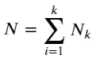
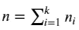
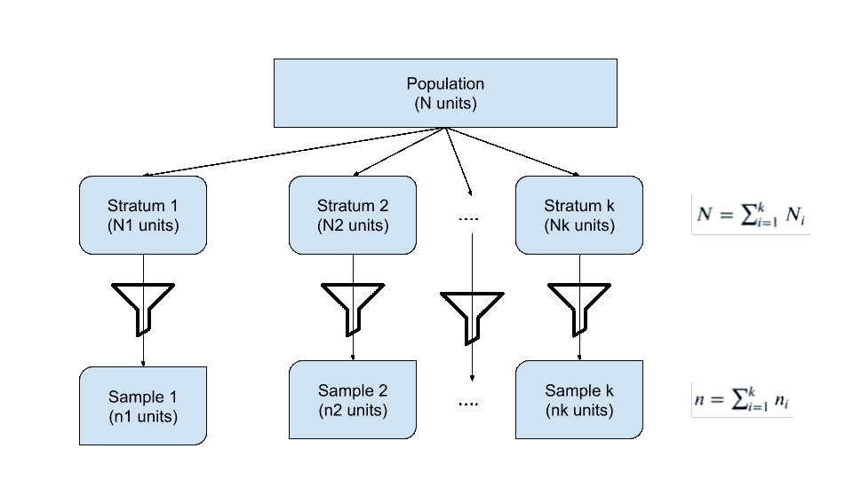
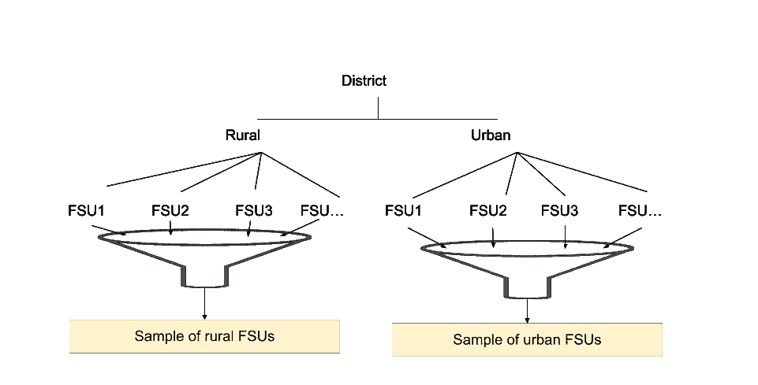
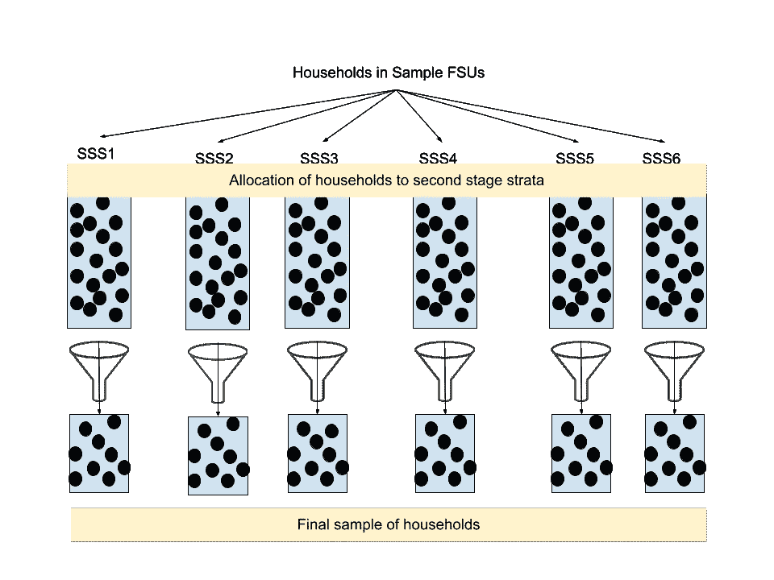
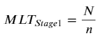
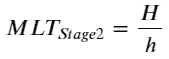
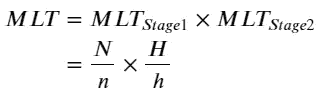

# 两阶段分层随机抽样——解释清楚

> 原文：<https://towardsdatascience.com/two-stage-stratified-random-sampling-clearly-explained-59788b110a84>

## 借助实际案例理解两阶段随机抽样的复杂过程

[斯科特·格雷厄姆](https://unsplash.com/@homajob?utm_source=medium&utm_medium=referral)在 [Unsplash](https://unsplash.com?utm_source=medium&utm_medium=referral) 上拍照

# 1.介绍

政府进行的大规模调查是获取人口/经济信息的重要工具。这些调查为社会经济规划提供了重要的投入。全国抽样调查办公室(NSSO)成立于 1950 年，负责进行全国范围的调查。在这种大规模的调查中，通常采用分层抽样的方法来收集调查数据。想过这意味着什么吗？这篇博客文章旨在通过参考全印度债务和投资调查(AIDIS)来澄清这一点，该调查使用两阶段分层抽样。所以继续读下去。

本文的其余部分分为以下几个部分:

*   什么是艾滋病
*   AIDIS 中使用什么样的抽样技术
*   什么是分层抽样
*   什么是两阶段分层抽样
*   乘数在分析 AIDIS 数据中的作用
*   结论

# 2.什么是 AIDIS？

AIDIS 的目标是获得关于资产存量、负债情况、资本形成和其他经济指标的定量信息，这些信息对于评估经济的信贷结构具有价值。此外，它还有助于估计(I)家庭的信贷需求和(ii)机构和非机构代理人的信贷供应，以便制定银行政策。简而言之，它收集家庭资产和负债的基本定量信息。最新一轮(第 77 次)AIDIS 于 2019 年分两次访问进行。

*   访问 1—2019 年 1 月至 2019 年 7 月(8 个月)
*   访问 2—2019 年 8 月至 2019 年 12 月(4 个月)

第一次和第二次访问期间所提问题的参照期分别为 H2:2018 年和 H1:2019 年。

NSSO 进行的 AIDIS 是分层抽样技术的一个典型例子。我们将通过一个简单的例子来理解这种技术，并推断出理解更复杂的 AIDIS 采样的想法。

# 3.什么是分层抽样？

分层抽样背后的基本思想是将一个异质群体分成更小的群体或亚群体，这样，就所研究的特征而言，抽样单位是同质的。这些同质的群体统称为地层。每一组被认为是独立的，从每一层抽取预定大小的随机样本。

***3.1 分层抽样的程序***

a.将 n 个单位的总体分成 k 个同质组(地层),每个组包含 Nₖ单位。每个地层由非重叠单元组成，这些单元在所研究的特征方面是同质的，因此

b.从每个独立于其他地层的地层中随机抽取一个 nᵢ大小的样本。

c.从每一层抽取的所有抽样单位汇集在一起构成一个大小为𝑛的分层样本

分层抽样:作者图片

***3.2 分层抽样的例子***

让我们用一个例子来理解这个概念。假设我们有兴趣知道一个学校 1 班到 12 班学生的平均体重。一般来说，学生的体重因年龄而异。与高年级学生相比，低年级学生往往体重较轻。确定学生平均体重的一种方法可以是测量所有学生的体重，然后取平均值，然而，这需要大量的资源和时间。当学生数量非常大时，这肯定是不可行的。在这些情况下，分层抽样就派上了用场。人们可以把所有的学生分成不同的阶层，例如

一班的学生:阶层 1

二班学生:第二阶层

…

12 级学生:第 12 阶层

可以从每一层抽取预定大小的随机样本。所有抽取的样本组合在一起构成最终的分层样本。

让我们通过引入另一个层次的复杂性来扩展前面的例子。所有班级都有男生女生怎么办？女孩的体重通常与男孩不同。班级一级的随机抽样可能无法确保反映在班级一级人口中的正确的男女比例。这可能会使平均体重的估计有偏差。在这种情况下，在每一类中有一个性别层次的亚阶层可以使我们更接近实际的人口平均数。这仍然是一个单阶段分层抽样，因为抽样只发生一次，只是抽样的发生率进入了人口分层分配的更深层次，即从每个阶层到每个阶层的性别。

# 4.什么是两阶段分层抽样？

在两阶段分层抽样中，抽样在人口分层分配的两个不同层次上进行两次。为了更好地理解这一点，让我们考虑一下 AIDIS 调查的抽样过程。第一阶段单元(FSU)是村庄/街区，取决于农村/城市区域。第二阶段单元是这两个部门的家庭。艾滋病信息系统的抽样程序列举如下:

***第一阶段***

1.  出于抽样目的，每个地区被视为一个阶层。在每个区内，农村和城市地区被视为亚阶层。
2.  在每个农村亚层中，根据其人口形成了许多第一阶段单元(FSU ),因此每个 FSU 的人口在 1000-1200 之间大致相同(根据 2011 年人口普查)。在每个城市次级阶层内，家庭支助股的组成也是这样，住户数量大约等于 250 户。
3.  从农村和城市每个阶层的每个子阶层中，通过简单随机抽样(SRSWOR)方案选择所需数量的 FSU。

第一阶段的取样过程通过以下信息图进行了说明:

AIDIS 分层抽样阶段 1:作者提供的图像

***第二阶段***

1.  考虑到 MPCE 和家庭负债情况，在选定的 FSU 农村/城市地区形成了六个第二阶段阶层。
2.  抽样 FSU 的所有家庭都被列入清单，并被分配到六个社会保障系统中的一个。
3.  从每个第二阶段阶层(SSS)中选取所需数量的样本家庭，采用无替换分层随机抽样法(SRSWOR)。

下面的信息图展示了第二阶段的取样过程:

AIDIS 分层抽样阶段 2:作者提供的图像

从上面的过程可以看出，取样分两个阶段进行，这一点再强调也不过分:

**1。FSU 的选择:**从每个阶层内的农村和城市部门的所有子阶层中，通过简单随机抽样无替换(SRSWOR)方案选择所需数量的 FSU。

其中 N 是任何亚层中 FSU 的总数，N 是在该特定亚层中调查的样本 FSU 的数量。

**2。住户的选择:**每个第二阶段阶层(SSS)的样本住户都是通过无替换分层随机抽样(SRSWOR)选择的。

其中 H 是在一个选定的 FSU 样本的特定社会抽样调查中列出的家庭总数，H 是在那个 FSU 样本的社会抽样调查中调查的家庭数目。

# 5.乘数的作用

所有样本家庭汇集在一起，给了我们在调查数据中看到的样本。从上述过程中可以明显看出，调查数据中的每个家庭代表了一组在 MPCE 和负债方面具有相似特征的家庭。

乘数可以被认为是每个调查实体从人口中代表的家庭的大概数目。因此，在汇总调查数据以得出人口属性时，适当的权重变得很重要。例如，调查实体的简单平均数/平均值不能反映人口平均数/平均值，因为它给予所有被调查家庭同等的权重。因此，在估计总体均值/平均数时，有必要使用乘数作为权重进行加权平均。

# 6.结论

在这篇博文中，我讨论了两阶段分层抽样程序，并使用全印度债务和投资调查的实际用例进行了说明。还有哪些调查使用了这种抽样技术——请在下面留下您的评论。

在我们结束之前，

我邀请你和我一起参与这个激动人心的数据科学旅程。关注我的[中页](https://skantbksc.medium.com)，探索更多关于数据科学的精彩内容。

*免责声明:观点为个人观点。*

# 参考

1.  [采样理论，模块四，NPTEL](https://nptel.ac.in/content/storage2/courses/111104073/Module4/Lecture9.pdf)
2.  [采样理论，模块 X，NPTEL](https://nptel.ac.in/content/storage2/courses/111104073/Module10/Lecture33.pdf)
3.  [NSS 第 77 轮样本设计和估计程序说明](https://www.mospi.gov.in/documents/213904//1254325//1628934729753_Estimation_procedure_NSS77_DPD.pdf//6642b415-4cdc-5cfd-3219-e43aa65ea6e9)
4.  [现场工作人员须知—第 1 卷](https://www.mospi.gov.in/documents/213904//1254325//1628934469628_77th_V_I_Final.pdf//83e8ac7b-7018-28f7-8ed4-ddc7bcdf7192)
5.  [现场工作人员须知—第 2 卷](https://www.mospi.gov.in/documents/213904//1254325//1628934585662_77th_V_IIFinal.pdf//479f8bb2-e2a1-c7b7-f5fb-d3834909ffda)