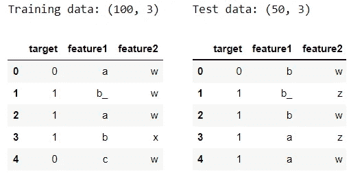
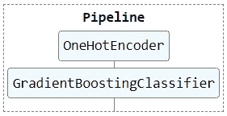
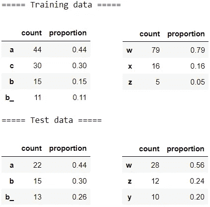
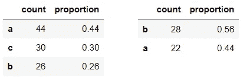
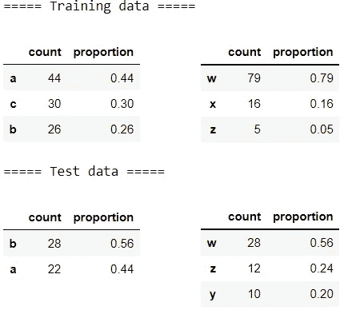
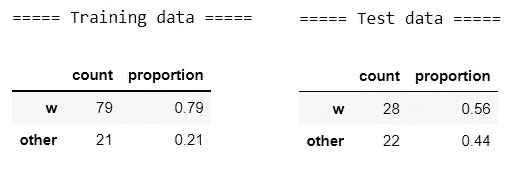
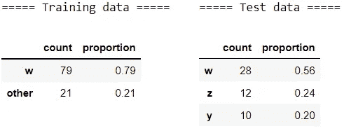
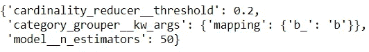

# 用 Scikit-learn 创建自定义变压器的两种方法

> 原文：<https://towardsdatascience.com/two-ways-to-create-custom-transformers-with-scikit-learn-b9089acacd37>

照片由 [v2osk](https://unsplash.com/@v2osk?utm_source=medium&utm_medium=referral) 在 [Unsplash](https://unsplash.com?utm_source=medium&utm_medium=referral) 上拍摄

## 数据科学基础

## 提升你的预处理技能

预处理是构建成功的机器学习模型的重要部分。Scikit-learn 的开箱即用的变形器如`OneHotEncoder`和它的其他对象如`Pipeline`使这个过程变得容易和简化。然而，当我们需要以定制的方式对数据进行预处理时，这些预构建的转换器有时是不够的。在这些情况下，我们可以用 Scikit-learn 构建定制的转换器来满足我们的定制数据预处理需求。在这篇文章中，我们将熟悉两种方法来创建这样的自定义变压器。

由 [David Marcu](https://unsplash.com/@davidmarcu?utm_source=medium&utm_medium=referral) 在 [Unsplash](https://unsplash.com?utm_source=medium&utm_medium=referral) 上拍摄的照片

# 设置📦

让我们从导入库和创建样本数据集开始:

我们有两个分类特征来保持简单和集中。我们现在将对数据进行分区，并构建一个简单的管道:

让我们想象一下，我们想要通过以下额外的预处理步骤来构建这条管道:
1️⃣ **分组类别:**分组`b_`与`b` 2️⃣ **一起减少基数:**将少数类别分组在一起

我们保持了简单的预处理步骤，这样我们就可以专注于构建定制的转换器。让我们检查一下这些特征的出现频率:

对于这两个预处理示例，我们将看看如何使用
1️⃣ `FunctionTransformer`和
2️⃣ `BaseEstimator`和`TransformerMixin`构建定制的转换器。

# 📍示例 1:分组类别

在本节中，我们将重点关注`feature1`，因为`feature2`没有名为`b_`的类别。让我们首先手动预处理数据，以说明我们想要实现的目标:

左边是训练数据中特征 1 的频率，右边是测试数据

我们可以看到`b_`已经和`b`分在了一起。现在让我们用`FunctionTransformer`将它转换成一个定制的转换器:

左边是训练数据中特征 1 的频率，右边是测试数据

我们传递了一个预处理函数，并在`kw_args`中指定了参数。我们可以看到`FunctionTransformer`的名字是不言自明的:它将函数转换为转换器。

让我们看看另一种方法。我们现在将创建继承了`BaseEstimator`和`TransformerMixin`的`CategoryGrouper`对象。通过继承这些父类并定义`__init__()`、`fit()`和`transform()`方法，我们得到了一个定制的转换器:

左边是训练数据中特征 1 的频率，右边是测试数据

很好，我们得到了相同的结果。对于这个预处理任务，两种方法都同样有效。然而，情况并非总是如此。这个特定的预处理任务被认为是无状态的转换，在训练期间什么也没有学到。我们可以看到`CategoryGrouper`中的`fit()`方法只是`return self`。在一些预处理任务中，我们需要做*一个* [*有状态*](https://stackoverflow.com/a/25582424/9724079) *转换*在训练过程中学习到的信息。在下一个例子中，我们将看到这两种方法在有状态转换中的不同之处。

# 📍示例 2:减少基数

让我们检查变量的频率:

我们将使用 20%的任意阈值来定义不常见的类别，并将少数类别组合在一起。由于`feature1`的类别高于阈值，我们将在本节重点关注`feature2`。让我们首先手动转换它:

我们将用`FunctionTransformer:`将它翻译成一个定制的转换器

预处理的测试数据看起来与我们预期的不同。看起来在培训中没有学到最重要的类别。这个例子说明了为什么`FunctionTransformer`不应该用于有状态转换。

让我们看看另一种方法。在本例中，我们将创建一个名为`find_top_categories`的额外方法，使代码更有条理:

这个输出看起来是正确的！这种使用`BaseEstimator`和`TransformerMixin`的方法更加通用，可以用于任何转换。

# 📍超参数调谐

通过创建定制的变压器，我们可以用 [Scikit-learn 的](/pipeline-columntransformer-and-featureunion-explained-f5491f815f) `[Pipeline](/pipeline-columntransformer-and-featureunion-explained-f5491f815f)`集中并简化我们的预处理步骤。创建自定义转换器的另一个好处是，我们可以微调模型和其他转换器的参数。让我们看一个例子:

学会了两种制造定制变形金刚的方法，你可以制造的变形金刚的范围是无限的！这项技能将派上用场，尤其是在将 ML 管道部署到生产环境中时。如果您想了解更多关于 Scikit-learn 的数据转换，请查看本文档。

汤姆·亨德森在 [Unsplash](https://unsplash.com?utm_source=medium&utm_medium=referral) 上拍摄的照片

*您想访问更多这样的内容吗？媒体会员可以无限制地访问媒体上的任何文章。如果您使用* [*我的推荐链接*](https://zluvsand.medium.com/membership) ，*成为会员，您的一部分会费将直接用于支持我。*

谢谢你看我的帖子。如果你感兴趣，这里有我的一些帖子的链接:
◼️️ [管道，ColumnTransformer 和 FeatureUnion 解释](/pipeline-columntransformer-and-featureunion-explained-f5491f815f?source=your_stories_page-------------------------------------)
◼️️ [FeatureUnion，ColumnTransformer &管道用于预处理文本数据](/featureunion-columntransformer-pipeline-for-preprocessing-text-data-9dcb233dbcb6)
◼️ [用这些提示丰富你的 Jupyter 笔记本](/enrich-your-jupyter-notebook-with-these-tips-55c8ead25255)
◼️ [用这些提示组织你的 Jupyter 笔记本](/organise-your-jupyter-notebook-with-these-tips-d164d5dcd51f)
◼️ [解释 scikit-用 SHAP](/explaining-scikit-learn-models-with-shap-61daff21b12a)
◼️️ [特性选择学习模型](/feature-selection-in-scikit-learn-dc005dcf38b7)

再见🏃💨