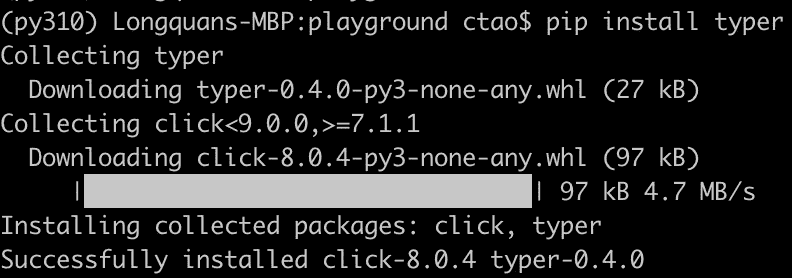
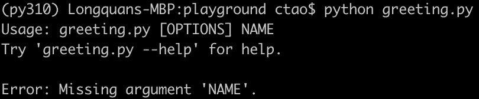
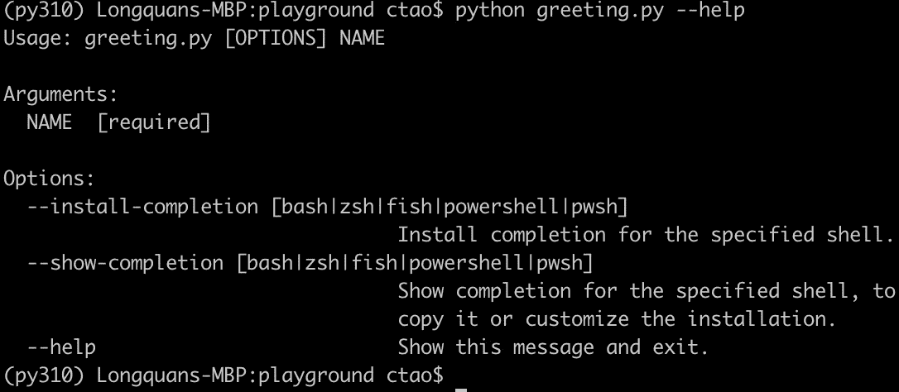
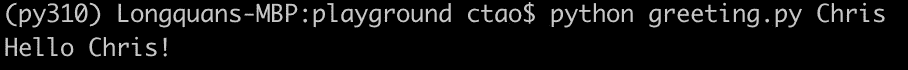
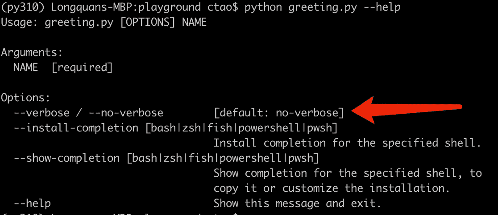
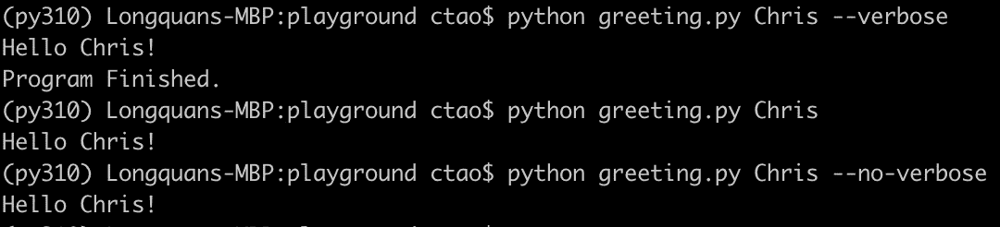
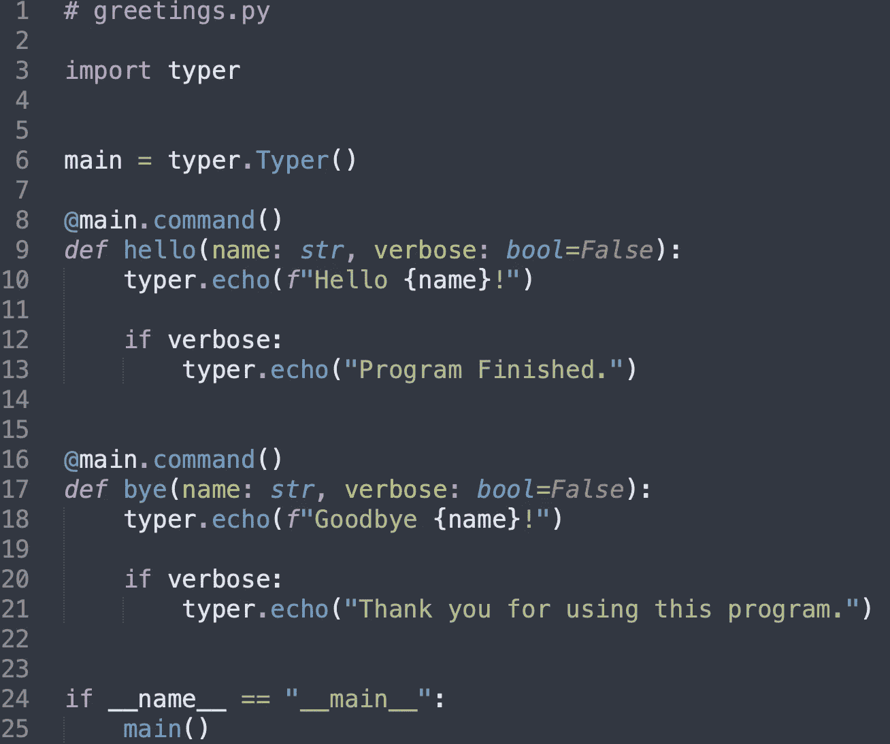
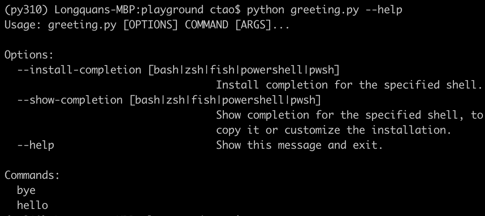
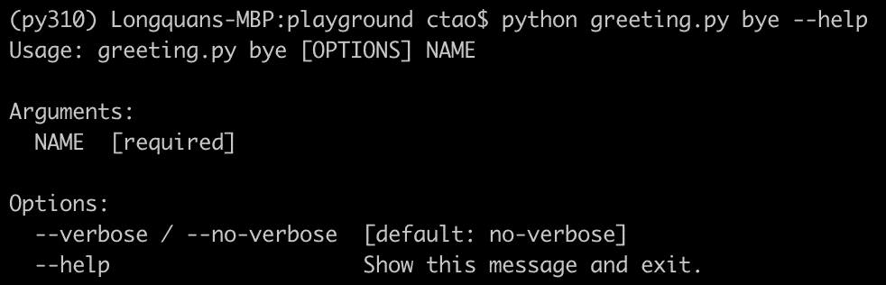

# typer——可能是最容易使用的 Python 命令行接口库

> 原文：<https://towardsdatascience.com/typer-probably-the-simplest-to-use-python-command-line-interface-library-17abf1a5fd3e>


图片来自 [Pixabay](https://pixabay.com/?utm_source=link-attribution&utm_medium=referral&utm_campaign=image&utm_content=19070)

## 它站在一个巨人的肩膀上——点击

上周，我介绍了 Python 内置模块之一——arg parse。它允许我们非常容易地开发命令行界面工具。我们可以用它来定义位置参数和可选参数。它也有现成的帮助说明，所以我们只需要为每个参数写一个字符串。如果你错过了那篇文章，在这里。

[](/using-python-argparse-to-develop-a-command-line-interfaced-program-73040940ca94) [## 使用 Python Argparse 开发命令行界面程序

### 开发 Linux 系统程序的方法

towardsdatascience.com](/using-python-argparse-to-develop-a-command-line-interfaced-program-73040940ca94) 

该模块确实易于使用，但也有一些缺点。因此，在本文中，我将介绍一个名为 **Typer** 的第三方库，我认为它可能是开发 Python CLI 程序的最佳工具之一。

# Argparse 的缺点


图片来自 [Pixabay](https://pixabay.com/?utm_source=link-attribution&utm_medium=referral&utm_campaign=image&utm_content=1966448)

正如我在上面的文章中提到的，Argparse 模块有一些缺点。

1.它有一种内在的行为来猜测某件事是一个论点还是一个选项。当处理不完整的命令行时，这就成了一个问题。这意味着在不完全了解命令行的情况下，行为可能是不可预测的。

2.当我们需要一些更高级的特性，比如参数值的复杂验证时，它不是很容易使用。

著名的第三方库 Click 很好地解决了这些问题。

 [## 欢迎使用点击-点击文档(8.0.x)

### Click 是一个 Python 包，可以用最少的代码以可组合的方式创建漂亮的命令行界面…

click.palletsprojects.com](https://click.palletsprojects.com/en/8.0.x/#documentation) 

这篇文章的主角 Typer 是建立在 Click 之上的。甚至比 Click 还好用。此外，已经有太多关于 Click 的教程，所以我宁愿介绍一些不太受欢迎但更有潜力的东西。

值得一提的是 Typer 是在 Click 之上开发的。因此，它继承了 Click 几乎所有的优点，但进一步简化了使用。

# 1.快速启动


图片来自 [Pixabay](https://pixabay.com/?utm_source=link-attribution&utm_medium=referral&utm_campaign=image&utm_content=67721) 的 [WikiImages](https://pixabay.com/users/wikiimages-1897/?utm_source=link-attribution&utm_medium=referral&utm_campaign=image&utm_content=67721)

首先，我们需要安装 Typer 库。像往常一样，我们可以使用皮普。

```
pip install typer
```



我们可以清楚的看到 Click 是 Typer 唯一的依赖，它会被一起安装。

## 样板文件

现在，让我们使用与上一篇文章相同的 Argparse 示例。假设我们想开发一个简单的 Python CLI 程序来发送问候消息。因此，用户需要输入姓名。

Python 脚本文件`greeting.py`的代码如下。

```
import typerdef main(name: str):
    typer.echo(f"Hello {name}!")if __name__ == "__main__":
    typer.run(main)
```

对上面的代码做一点解释。首先，我们需要导入 Typer 库。

然后，我们定义一个`main()`方法，它将成为命令行程序的入口点。这需要一个叫做`name`的论点。此外，鼓励使用类型提示来控制参数的类型。

最后，我们只需要告诉 Typer 我们希望在程序启动时运行`main()`方法。

这比 Click 容易(当然比 Argparse 容易多了)。我们甚至不需要做“添加选项”这样的事情。Typer 将足够聪明地从`main()`方法的参数中找出选项和标志。

## 为什么是“回声”？

你可能会注意到，我们使用`typer.echo()`输出，而不是普通的`print()`方法。Typer 中的这个特性是从 Click 库中继承的。

使用`echo()`方法的好处是 Click 试图一致地支持不同的环境，即使环境配置错误也非常健壮。Click 希望至少在基本水平上可以正常工作，即使一切都完全坏了。

因此，我们也应该尝试使用 Typer 中的`echo()`方法来拥有这个特性。如果不需要该特性，没有什么可以阻止我们使用`print()`方法。

## 示范

现在，如果我们在没有任何参数的情况下运行这个脚本文件，Typer 将生成错误消息，指出我们错过了一个参数。

```
$ python greeting.py
```



当然，它也会为我们生成帮助文档。

```
$ python greeting.py --help
```



现在，让我们通过把我的名字传递给程序来实现它。

```
$ python greeting.py Chris
```



我们可以使用这几行代码作为基于 Typer 的 Python CLI 项目的样板。

# 2.可选参数


图片来自 [Pixabay](https://pixabay.com/?utm_source=link-attribution&utm_medium=referral&utm_campaign=image&utm_content=1767563)

您可能会注意到，在样板示例中,`name`参数是必需的。如果我们想让一个论点可选呢？

这就像我们通常用 Python 编码一样简单，只需给它一个默认值。

```
def main(name: str, verbose: bool=False):
    typer.echo(f"Hello {name}!") if verbose:
        typer.echo("Program Finished.")
```

我们在`main()`方法中添加了一个布尔参数`verbose`，并提供了一个默认值。如果我们调用帮助文档，标志将自动生成。



因此，我们可以很容易地使用布尔参数来控制程序行为，如下所示。



# 3.嵌套命令


来自 [Pixabay](https://pixabay.com/?utm_source=link-attribution&utm_medium=referral&utm_campaign=image&utm_content=3123834) 的 [Couleur](https://pixabay.com/users/couleur-1195798/?utm_source=link-attribution&utm_medium=referral&utm_campaign=image&utm_content=3123834) 的图像

作为 Click 最重要的雄心勃勃的功能之一，嵌套命令也受到 Typer 的支持。不仅支持而且简化了它的使用。

嵌套命令允许我们在 CLI 应用程序中定义“子命令”。例如，我们可能希望我们的`greeting.py`程序也有说再见的功能。使用嵌套命令，我们可以很容易地将其与“hello”功能分开定义。这使得我们的代码整洁干净。

```
import typermain = typer.Typer()[@main](http://twitter.com/main).command()
def hello(name: str, verbose: bool=False):
    typer.echo(f"Hello {name}!")if verbose:
    typer.echo("Program Finished.")[@main](http://twitter.com/main).command()
def bye(name: str, verbose: bool=False):
    typer.echo(f"Goodbye {name}!")if verbose:
    typer.echo("Thank you for using this program.")if __name__ == "__main__":
    main()
```



如代码所示，我们实例化了一个 Typer 对象，并将其命名为`main`。然后，我们定义两个方法并将它们注册为命令。最后，我们需要将 Typer 对象称为方法。

如果我们调用帮助文档，它现在看起来如下。



指示命令`hello`和`bye`。我们可以调用其中一个子命令的帮助消息来查看它的参数。

```
$ python greeting.py bye --help
```



借助嵌套命令功能，我们可以为非常复杂的 CLI 选项需求定义带有子命令的简单方法。

# 摘要


图片由来自 [Pixabay](https://pixabay.com/?utm_source=link-attribution&utm_medium=referral&utm_campaign=image&utm_content=6400060) 的 [Erik Karits](https://pixabay.com/users/erik_karits-15012370/?utm_source=link-attribution&utm_medium=referral&utm_campaign=image&utm_content=6400060) 拍摄

在本文中，我介绍了一个用于开发 CLI 程序的第三方 Python 库。它极大地简化了我们定义带有选项和标志的 CLI 应用程序所需编写的代码。虽然它非常直观且易于使用，但它也具有可伸缩性，允许我们编写相对复杂的应用程序。

[](https://medium.com/@qiuyujx/membership) [## 通过我的推荐链接加入灵媒-陶

### 作为一个媒体会员，你的会员费的一部分会给你阅读的作家，你可以完全接触到每一个故事…

medium.com](https://medium.com/@qiuyujx/membership) 

**如果你觉得我的文章有帮助，请考虑加入灵媒会员来支持我和成千上万的其他作家！(点击上面的链接)**