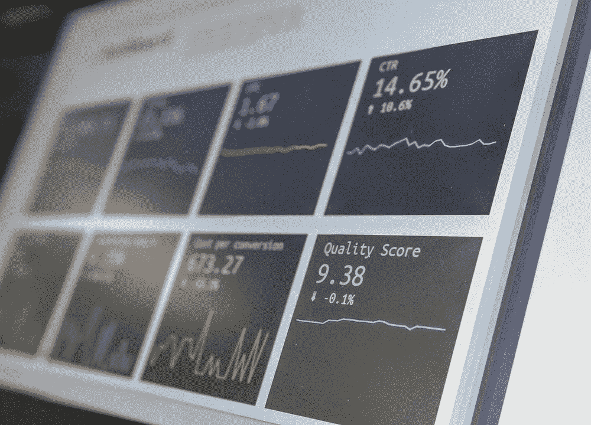
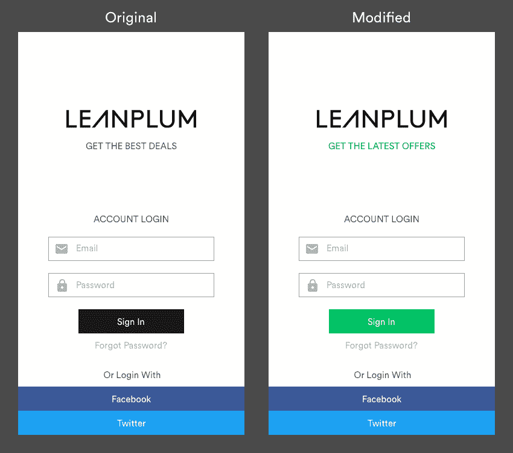

# 2022 年数据科学家的典型 8 步 A/B 测试工作流程

> 原文：<https://towardsdatascience.com/typical-9-step-a-b-test-workflow-for-data-scientists-in-2022-d672c9a0d658>

## 数据科学家在科技公司的 A/B 测试项目中所做工作的总结

来源:[斯蒂芬·道森在 Unsplash 上的文章](https://unsplash.com/photos/qwtCeJ5cLYs)

# 太长；不要读

*   **实验启动前:** (1)思考产品&与产品经理交谈；(2)设计实验；(3)检查 A/A 变化  。
*   **实验期间:** (4)检查不变度量&实验设置；(5)监控关键评估指标。
*   **实验结束后:** (6)读取 p 值、差值大小、最小可检测效应(MDE )，惊讶时潜得更深；(7)制定产品建议；(8)写报告。

# 介绍

本文旨在详细讨论数据科学家在 A/B 测试任务中具体应该做什么，以及哪一个应该是主要关注点。最好是已有 t 检验、最小样本量计算等 A/B 检验知识，并有兴趣学习实际工作场景中的流程的从业者。

## 我为什么要写这个？/我们为什么要关心？

我觉得写这篇文章很有动力，因为我意识到在科技公司的日常实验实践和来自学校的 A/B 测试知识之间仍然存在差距。尽管理论论证全面，但大多数在线课程或文章，甚至是谷歌在 Udacity 上进行的著名的 [*A/B 测试，都无法将这些点联系起来，并提出一个关于数据科学家如何在 A/B 测试中应用统计知识的整体程序。*](https://www.udacity.com/course/ab-testing--ud257)

此外，数据科学家如何进行 A/B 测试**在最近几年发生了很大变化**，从或多或少**的体力劳动**转变为**广泛使用不同的工具**。然而，管理工具可能令人望而生畏，尤其是当一个数据科学家被期望负责多个 A/B 测试时。

这**强调了清楚理解新工作流程**的必要性，以及 A/B 测试工具的进步，这有助于我们保持组织性并提前计划。虽然受欢迎的 **A/B 测试平台**承担了大部分计算工作，包括但不限于样本大小和 p 值，将数据科学家从列出统计公式和手工计算数字中解放出来，但至关重要的是，我们作为数据科学家将大部分时间**花在思考产品和实验本身**上，而不是**被困在复杂的工具**中来回重复工作。

来源:[卡洛斯·穆扎关于 Unsplash](https://unsplash.com/photos/hpjSkU2UYSU)

# 详细展开:典型的工作流程

## 在实验开始之前

**1)思考产品&与产品经理(PM)交谈**

从我的角度来看，这是整个 A/B 测试工作流程中最重要的事情。有两个关键方面需要彻底评估:**可行性**和**影响**。在详细探索了产品逻辑和用户旅程之后，我们将非常批判性地思考使用随机在线 A/B 测试来测试这个特性是否合适，甚至是否可行。要问的几个问题包括“ ***假设是什么*** ”、“ ***我们能找到可计算的指标来测试吗？*** 、 ***我们的产品和用户有哪些风险？*** 、*有网络效应吗？*、*是否有可能让用户表现出强烈的新奇效果或者变化厌恶*、*让部分用户远离我们的新功能待遇*是否公平等。

此外，作为数据科学家，我们必须是**影响驱动的**而不是**输出驱动的**，这意味着我们应该关注这项功能测试的潜在收益或投资回报(ROI)。 ***我们为什么需要这个？*** “，” ***我们的预期收益是什么，是短期的还是长期的？*** “是我们应该问自己并与产品经理辩论的一些关键问题。

为什么我们需要把按钮换成更亮的颜色？衡量标准是什么(例如，两个按钮的点击率，落选率)？会不会太打扰用户？长期有益吗？[资料来源:Leanplum](https://www.leanplum.com/platform/optimization/#)

**2)设计实验**

基于 1)中的假设，我们作为数据科学家为产品经理和工程师提供设计实验的建议，包括但不限于:

*   **评估指标:**我们的北极星指标、直接影响指标、护栏指标和治疗组的采用指标是什么。除了业务解释之外，评估指标最好具有**较低的方差**和**对变化的敏感性**。
*   **分流单位:**我们是基于 user_id 还是 session_id 随机化测试？
*   **最小所需样本:**对于不同的评估指标和各种最小可检测效应(MDE)，要使结果具有统计显著性，所需的样本量是多少？如今，大多数大型科技公司都提供了成熟的工具来计算样本大小，**但是，当感兴趣的指标过于具体且不被 A/B 测试平台支持时，我们往往不得不检索历史数据并自行计算**。
*   **实验持续时间&流量部分:**这通常取决于所需的样本大小和可能看到新功能的合格流量大小。我们也将考虑到实验的风险。
*   **实验层&实验类型:**此外，我们将确定在哪个实验层部署我们的 A/B 测试。常见的情况是，大多数实验层已经被其他测试填充，导致剩下的流量非常少。在这种情况下，如果我们的特征与其他特征不相关，我们可能希望选择另一层或考虑正交实验。

**3)检查 A/A 变化**

与以往不同的是，2022 年大部分 A/B 测试平台已经将这一过程自动化，需要的劳动力非常少。我们需要做的是检查模拟/模拟变化输出，并确保一切如预期一样——模拟/模拟的 p 值是均匀分布的。

## 在实验中

**4)检查不变指标&实验设置**

这正是我们开始将我们的分析从**离线过渡到在线 A/B 测试平台**的阶段。在实验过程中，数据科学家要做的第一件事就是反复检查实验是否设置良好。具体来说，我指的是确保处理组中的用户看到所有预期的处理过的特性。在科技公司中有很多这样的例子，实验参数是错误的，没有人及时发现，导致时间和流量的巨大损失。*这在广告场景中更糟糕，我们使用广告商购买的流量进行 A/B 测试，但最终由于错误的参数(个人经验…)而破坏了实验*。

第二件事是探索不变指标并确保两件事:(1) **交通的转向是随机的** ( *我们通常使用卡方检验来检查对照组和治疗组的总体*)；(2) **用户资料(如性别、年龄)在不同群体中的分布是一致的**(大多数平台会为我们计算这些资料，点击几下就可以轻松显示出来)。

**5)监控关键评估指标**

尽管样本通常不足以解释最初几天的统计意义，但有必要密切跟踪治疗组和对照组之间的描述性差异。如果关键指标和护栏指标持续大幅下降，为了我们的产品和用户的利益，我们应该考虑后退一步，重新评估实验，因为负面的显著结果很可能只是时间问题。

## 实验结束后

**6)读取 P 值&差值的大小&最小可检测效应，惊讶时更深入**

数据科学家收集治疗组和对照组之间的描述性差异以及 p 值。此外，我建议**重新审视我们的产品假设**和**评估我们是否对实验结果**感到惊讶。如果没有，我们可以进行下一步。但是，如果我们确实发现了超出我们预期的东西(*例如，差异应该是显著正的，但不是显著或显著负的*)，我们应该通过将其分解为关键业务维度(**例如，新/老用户、渠道、地理区域**)来更深入地了解原因。

值得注意的是，结果不显著的常见原因是**统计能力不足。**除了增加样本量，我们还可以用**较小方差**或[CUPED(*使用已有数据的受控实验* )](/how-to-double-a-b-testing-speed-with-cuped-f80460825a90) 方法尝试其他指标。此外，比较**经验 MDE** ( *为了产生显著结果，差异应该有多大，通常由平台*提供)和关键指标的**实际差异**通常会揭示指标的不稳定性。这在未来研究用户行为或设计类似实验时是一个很好的参考。

**7)制定产品建议**

收集完所有数据后，我们可以开始制定实验结论，并得出产品建议，即我们是应该逐渐将更多流量用于治疗，还是选择更保守的策略。

8)写报告

最后，数据科学家需要撰写并归档一份报告，内容包括(1)产品背景和特性假设；(2)实验辞职；(3)结果分析；以及(4)产品推荐。

# 摘要

上述 8 步 A/B 测试工作流程有助于最大限度地减少实质性错误，并确保可信的受控实验。不同的科技公司可能在细节上有所不同，但这可以被视为一个总体框架，以便我们可以节省更多的时间**探索重要的产品问题**(这是数据科学家的核心价值观之一，对个人成长最有成效)，而不是**解决程序问题**。

# 注意

1.  **A/A 变异:** A/A 变异是一个对照组(A 组)和另一个对照组(~ A 组)之间关键指标的差异。由于两者之间没有实际差异，A/A 变化预计不会以统计上显著的方式偏离 0。
2.  **最小可检测效应(MDE):** MDE 衡量的是我们希望在受控实验中检测到的相对于基线的最小改善。