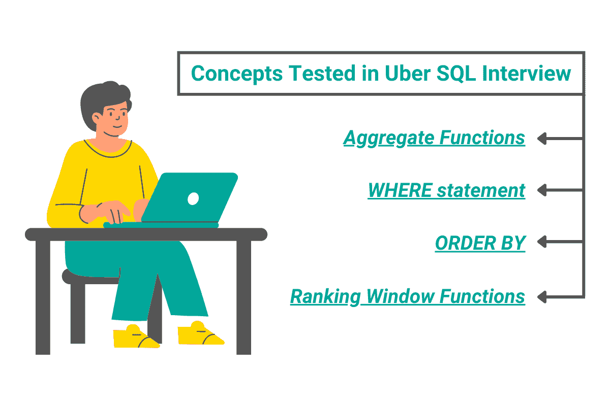
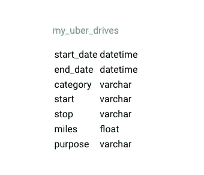
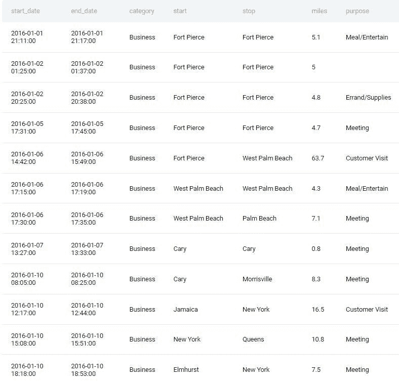
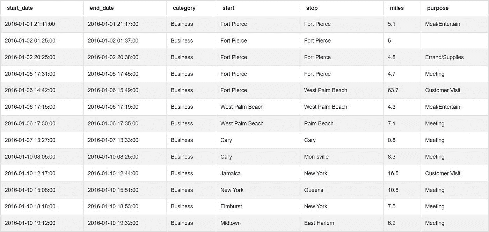
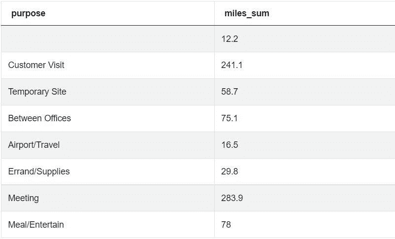
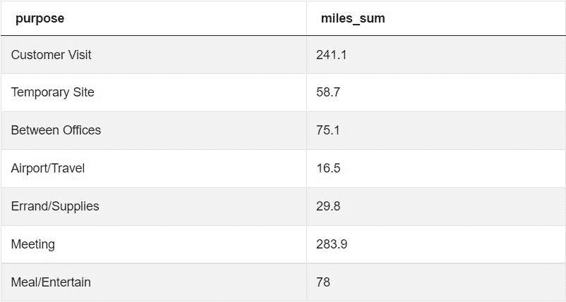
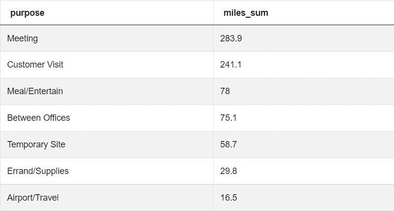
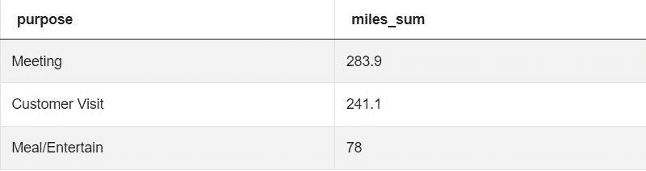

# 优步 SQL 面试问题

> 原文：<https://towardsdatascience.com/uber-sql-interview-questions-cf6a2a08a23c>

## *分解一个有趣的优步 SQL 面试问题的答案*


作者在 [Canva](https://canva.com/) 上创建的图片

优步公司改变了市中心的交通，让数百万用户的生活变得更加轻松。他们的主要产品是一款智能手机应用，可以让用户以合理的价格找到便车。优步还参与了许多其他业务，如食品配送、货运等。

所有这些运营都有一个共同点:依靠稳定高效的物流来顺利完成行程。为了达到这个目标，优步每天收集大量的数据。该公司拥有一支才华横溢的数据科学家团队，以从可用信息中获得可操作的见解。

在本文中，我们将探讨在优步面试中被问到的一个 SQL 面试问题。

# 在优步 SQL 访谈中测试基本到中级概念



作者在 [Canva](https://canva.com/) 上创建的图像

## 聚合函数

在参加面试之前，请阅读这篇《[*SQL 聚合函数终极指南*](https://www.stratascratch.com/blog/the-ultimate-guide-to-sql-aggregate-functions/?utm_source=blog&utm_medium=click&utm_campaign=medium) 》来刷新你的聚合函数知识。你需要知道聚合函数来解决面试中的大多数 SQL 问题，更重要的是，在你的日常工作中编写 SQL 查询。

您需要掌握聚合函数的基本知识，例如语法、参数以及如何使用 GROUP BY 语句汇总结果。

如果你真的想在竞争中脱颖而出，再深挖一点是个好主意。例如，学习如何将聚合函数与其他 SQL 特性结合使用，比如 DISTINCT 语句。

SUM()是最常用的聚合函数之一。需要解决某一列的数值相加的问题。在下面的问题中，我们将使用它来计算总里程。

要知道 SUM()只能用来计算数字的总数，不能和文本、日期或者其他类型的数值一起使用。了解一些小细节，比如这个函数如何处理空值，会有很大帮助。

## 在哪里

WHERE 语句是 SQL 的基本特性之一。尽管它很简单，但它对于在 SQL 中过滤数据是必不可少的。您应该知道如何在 SELECT/FROM 语句中使用它来过滤掉不符合条件的行。

要过滤 SQL 中的表，您应该知道如何为 WHERE 语句设置条件。对于条件可以是什么没有限制。您可能需要检查一列中的数值是否比另一列高。您应该准备好如何使用比较运算符来比较其他值，如字符串、日期和浮点数。

书写条件有语法规则。例如，在比较数字、字符串、日期和其他类型的值时，是否有必要使用引号。

了解比较运算符如何处理非数字数据很重要。例如，如果您正在处理销售数据，您可能希望将输出限制在一个特定的月份。您可以使用比较运算符来获取某个特定月份的记录，或者确定两个日期中哪个日期先出现。

## 以...排序

面试官经常要求你返回一列中 X 个最高值。为此，您需要从最高到最低排列数据，并按顺序输出指定数量的值。

我们使用 ORDER BY 语句对 SQL 中的行进行排序。它允许您指定一列，SQL 将根据该列中的值对记录进行排序。为了解决一些更困难的问题，您可能需要指定多个列。了解如何在表中通过名称或索引来指定列是很有用的。

一个好的候选人应该知道如何指定值排序的升序和降序，以及如何对日期和字符串值进行排序。

此外，对细节的了解，比如没有指定顺序时会发生什么，会有很大帮助。

## 排名窗口函数

如前所述，为了解决一些问题，候选人必须在一列中输出特定数量的最高值。有多种方法可以解决这些问题。

在某些情况下，比如下面的问题，可以说一个简单的极限语句足以输出特定数量的值。

另一方面，排序窗口函数总是输出一定数量的最高值的最准确和最简单的方法。

研究 [SQL 窗口函数](https://www.stratascratch.com/blog/the-ultimate-guide-to-sql-window-functions/?utm_source=blog&utm_medium=click&utm_campaign=medium)和 [SQL 等级函数](https://www.stratascratch.com/blog/an-introduction-to-the-sql-rank-functions/?utm_source=blog&utm_medium=click&utm_campaign=medium)，为任何需要你输出 X 个最高值的 SQL 问题做准备。

RANK()和 DENSE_RANK()之类的函数允许您根据某一列中的值为行分配等级。理解这两种功能之间的区别很重要。

# 优步 SQL 面试问题演练

**最高总里程数**

在这个问题中，我们有一个数据表，描述了通过优步应用程序预订的每一次旅行。候选人被要求找出促使企业客户使用优步进行旅行的三个最常见的目的。

在 StrataScratch 平台上被标注为‘中等’难度，所以只要注意，应该能找到解决方法。有多种方法可以解决这个优步 SQL 面试问题。


截图来自 [StrataScratch](https://platform.stratascratch.com/coding/10169-highest-total-miles?code_type=1&utm_source=blog&utm_medium=click&utm_campaign=medium)

问题的表述可能有点令人困惑，因此您可能需要查看可用的数据来理解问题。

问题链接:[https://platform . stratascratch . com/coding/10169-最高总里程](https://platform.stratascratch.com/coding/10169-highest-total-miles?code_type=1&utm_source=blog&utm_medium=click&utm_campaign=medium)

# 可用数据集

我的优步司机



截图来自 [StrataScratch](https://platform.stratascratch.com/coding/10169-highest-total-miles?code_type=1&utm_source=blog&utm_medium=click&utm_campaign=medium)

# 数据假设

这是一个令人费解的问题，所以你应该多次阅读它，以了解你必须做什么。

对于像这样的[数据科学面试问题](https://www.stratascratch.com/blog/40-data-science-interview-questions-from-top-companies/?utm_source=blog&utm_medium=click&utm_campaign=medium)，预览最终表格或要求面试官描述预期输出是有用的。你可以利用这个机会从最后的结果反推来理解这个问题。

当你阅读这个问题时，只要有可能，你也应该看看表格中的实际值。这可以帮助你更好地掌握可用的数据。



截图来自 [StrataScratch](https://platform.stratascratch.com/coding/10169-highest-total-miles?code_type=1&utm_source=blog&utm_medium=click&utm_campaign=medium)

让我们看看下表中的列:

**start_date** —该问题没有要求我们计算每次旅行的持续时间，因此我们不需要旅行开始的确切日期和时间。

**end_date —** 类似于 **start_date** 列，我们也不需要该列中的值。

**类别** —我们将检查该列中的值，以仅保留业务费用的记录。

**开始** —拾取点与此问题无关。

**停止** —最终目的地与优步 SQL 面试问题无关。

**里程** —我们需要计算每个目的的总里程。所以我们要把这一列的值加起来。

**目的** —我们的最终输出将包括每个目的的总里程。所以我们肯定需要这个列中的值。

查看表格时，请注意每列中值的类型，以了解它们所代表的含义。例如，知道' **miles** '列包含浮点值可以帮助您决定如何按英里对目的进行排序。

考生要仔细检查**目的**栏以及里面的所有数值。如果您仔细观察，您会注意到一个重要的细节—一些驱动器记录在这个列中包含一个空值。这是一个需要处理的边缘案例。

您应该看看每一列中的值的范围。**“类别”**列中的大部分值都是“业务”，这意味着硬盘属于业务费用。然而，如果你仔细看，你会注意到有一些个人费用混在里面。

一旦你多次阅读这个问题，你就可以开始制定你的方法了。

# 解决方案逻辑

这个优步 SQL 面试问题可能很难理解，所以你应该多看几遍。一个条件是只计算业务费用的总里程。换句话说，“类别”列中的值必须是“业务”。

将解决方案分解成几个易于管理的步骤。写下你的方法可以帮助你坚持下去。这个问题的解决方案包括四个主要步骤:

1.  过滤记录
2.  计算总里程
3.  订购记录
4.  输出前 3 个业务目的

**过滤掉不是业务费用的记录**

第一步，我们将使用一个简单的 WHERE 语句来过滤掉不是业务费用的记录。

如果您查看可用数据，您会注意到一些记录有一个空的“目的”列。换句话说，该列中的值为 NULL。

我们将不得不修改我们的 WHERE 语句，以过滤掉非业务费用以及“目的”栏为空的记录。为此，我们将使用 AND 逻辑运算符。该条件将只保留同时满足这两个条件的行:在**‘类别’**列中的值是‘业务’，在**‘目的’**列中有一些值。

第一个条件可以是一个简单的等式运算符，以确保“**类别**”列中的值等于“业务”。对于第二个条件，我们可以简单地写**目的不为空**，它将过滤掉所有的空值。

**计算每个目的的总里程数**

一旦我们有了过滤后的表，我们就可以得到每个目的的总里程。为此，我们将使用 SUM()聚合函数和 GROUP BY 语句来汇总结果。

我们将使用 ORDER BY 语句，根据各种用途的里程总和按降序排列行。

正如您在最后的表中看到的，我们将只有两列:**目的**列，它将包含代表每个组的唯一值，另一列将包含每个目的的聚合值。最后，我们将输出三个最高值。

**根据总里程值降序排列记录**

我们可以简单地编写 ORDER BY 2 来表示应该根据第二列中的值对行进行排序，第二列包含总里程数。

**输出总里程最高的三个目的**

最后一步是输出总里程数最高的三个目的。这一步可以用两种不同的方法来处理:一种是使用 LIMIT 语句。在这种情况下，解决方案非常简单，并且可能在 99.99%的时间里都有效。

另一种解决方案是使用窗口排序函数，这往往会产生更准确的结果。在下面几节中，我们将讨论解决这个问题的两种方法。

极限语句的明显优点是它简单易读。

使用 LIMIT 的问题是数据是不可预测的。总里程数排名第三和第四的目的之间可能存在关联。在这种情况下，使用 LIMIT 语句会忽略这一事实，仍然输出表中的前三个值。

分级窗口功能使您能够更好地控制这些边缘情况。它们允许您输出三个最高值，包括第一、第二或第三名的平手。如果出现平局的几率很高，排序窗口函数是更合适的选择。

如果我们看一下 **miles** 列，我们可以看到它包含浮点值。总里程将是该列中值的汇总。因此，我们不太可能打成平手。

在这种情况下，可以认为极限陈述的简单性超过了由于平局而得到不准确结果的风险。但是，如果您想确保结果的准确性，您应该使用 RANK()或 DENSE_RANK()函数。

比起 LIMIT 的简单性和可读性，一些雇主可能更喜欢更健壮的方法，所以你能做的最好的事情就是去问。展示你可以从两个方面解决问题，展示你的分析思维和对 SQL 的全面了解。

这可以帮助您展示读取数据的能力，并注意细微差别和细节，比如浮点值不太可能被绑定。

如果面试官要求你使用窗口排名功能，做好使用的准备。最重要的是表明你了解这两种解决方案的利弊。

最后，我们必须使用 AS 命令来命名存储每个目的的总英里数的列。应该是一些描述性的东西，比如 **miles_sum** 。

# 解决方法

## 第 1 步:过滤表，只保留业务费用

我们可以从获取所有业务支出记录开始。

```
SELECT *
FROM my_uber_drives
WHERE category = 'Business'
```

如果我们运行这段代码，输出将包含业务费用。它看起来会像这样:



截图来自 [StrataScratch](https://platform.stratascratch.com/coding/10169-highest-total-miles?code_type=1&utm_source=blog&utm_medium=click&utm_campaign=medium)

## 第二步:获得每个目的的总里程数

我们可以将输出限制为两个必要的列，而不是获得一整行。一个是**目的**列，另一个将使用 SUM()聚合函数生成。我们将使用 AS 命令为该列指定一个描述性名称。

我们可以添加 GROUP BY 子句来汇总每个目的的总里程。

```
SELECT purpose,
       SUM(miles) AS miles_sum
FROM my_uber_drives
WHERE category = 'Business'
GROUP BY purpose
```

如果我们运行这个查询，我们将得到一个更接近最终结果的结果:



截图来自 [StrataScratch](https://platform.stratascratch.com/coding/10169-highest-total-miles?code_type=1&utm_source=blog&utm_medium=click&utm_campaign=medium)

## 步骤 3:处理无效目的

前面的查询返回一个包含一个空列的表，该列表示具有 NULL(空)目的的记录的总英里数。

目前，我们使用一个条件过滤该表:检查**类别**列中的值，并且只保留业务费用。

我们可以使用 AND 逻辑运算符向我们的过滤器添加另一个条件。现在，SQL 还将检查并只保留属于业务费用的值，并且**目的**列中的值不为空。

```
SELECT purpose,
       SUM(miles) AS miles_sum
FROM my_uber_drives
WHERE category = 'Business'
  AND purpose IS NOT NULL
GROUP BY purpose
```

如果我们运行代码，我们将看到输出不再包含空单元格。



截图来自 [StrataScratch](https://platform.stratascratch.com/coding/10169-highest-total-miles?code_type=1&utm_source=blog&utm_medium=click&utm_campaign=medium)

## 第四步:降序排列

为了找到答案，我们需要根据购买的总里程来排序。它们应该按降序排列，最高的在顶部，最低的在底部。

我们将使用 ORDER BY 语句来实现这一点。

```
SELECT purpose,
       SUM(miles) AS miles_sum
FROM my_uber_drives
WHERE category = 'Business'
  AND purpose IS NOT NULL
GROUP BY purpose
ORDER BY 2 DESC
```

请注意，我们使用数字 2 来指定列。SQL 将解释它，并根据第二列中的值对记录进行排序，第二列是 **miles_sum** 。

如果你运行这段代码，你会发现我们几乎得出了答案:



截图来自 [StrataScratch](https://platform.stratascratch.com/coding/10169-highest-total-miles?code_type=1&utm_source=blog&utm_medium=click&utm_campaign=medium)

## 第五步:保留前三行

最后一步，我们需要输出前三行。我们可以用一个简单的极限语句来做这件事。这是一个简单的解决方案，在这种情况下，几乎每次都会返回正确的答案。

```
SELECT purpose,
       SUM(miles) AS miles_sum
FROM my_uber_drives
WHERE category = 'Business'
  AND purpose IS NOT NULL
GROUP BY purpose
ORDER BY 2 DESC
LIMIT 3
```

它将为我们提供最终的、正确的预期输出:



截图来自 [StrataScratch](https://platform.stratascratch.com/coding/10169-highest-total-miles?code_type=1&utm_source=blog&utm_medium=click&utm_campaign=medium)

# 另一个正确的解决方案

在这种方法中，我们使用一个通用的表表达式(简称为 CTE ),来过滤掉那些**目的**列为空而**类别**列为除“业务”之外的任何内容的记录。在 CTE，我们还会累计各种用途的里程。

我们可以使用 SELECT 语句从 CTE 中提取每组目的及其对应的总里程。

然后，我们使用 RANK()窗口函数按照降序为值生成等级。最后，我们可以使用另一个 WHERE 语句来只显示等级值小于或等于 3 的记录。

这种方法更加稳健，因为它处理的是目的可能与总里程数相关的边缘情况。

```
WITH cte AS
  (SELECT purpose,
          sum(miles) AS miles_sum
   FROM my_uber_drives
   WHERE purpose IS NOT NULL
     AND category ILIKE '%business%'
   GROUP BY purpose)
SELECT purpose,
       miles_sum
FROM
  (SELECT purpose,
          miles_sum,
          rank() OVER (
                       ORDER BY miles_sum DESC) AS rnk
   FROM cte) a
WHERE rnk<=3
```

# 最后的话

在过去的十年里，优步从一个小公司发展成为今天的大型科技公司。

这些年来，数据收集和分析一直是其商业模式的重要元素。数据科学家的努力让优步以合理的价格提供舒适的服务。

您可以查看“ [*优步数据科学家面试问题*](https://www.stratascratch.com/blog/uber-data-scientist-interview-question-walkthrough/?utm_source=blog&utm_medium=click&utm_campaign=medium) ”以了解更多针对优步数据科学家候选人的问题。在 StrataScratch 复习实际问题，更新你的 SQL 知识，确保你在优步面试时不会措手不及。