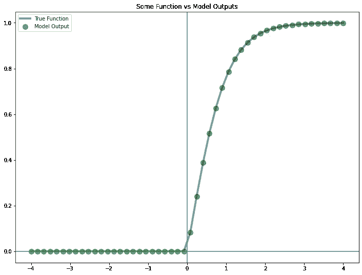
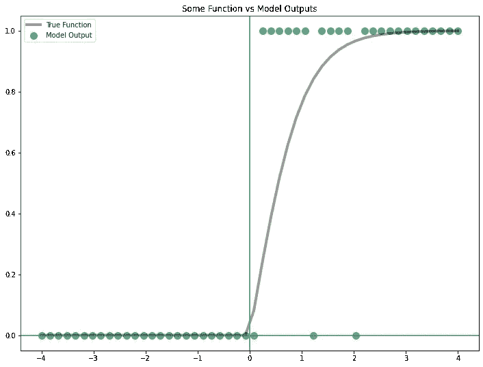
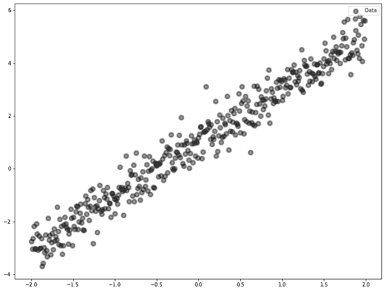
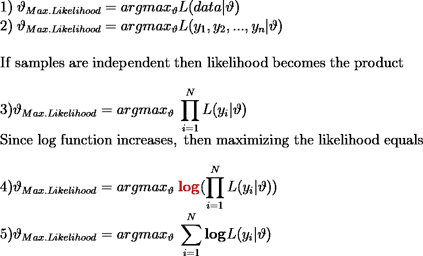
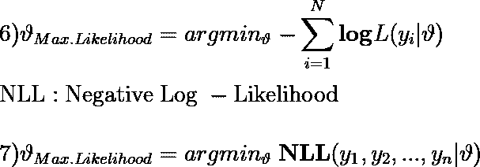
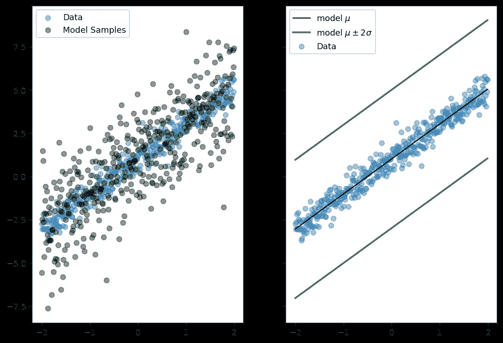
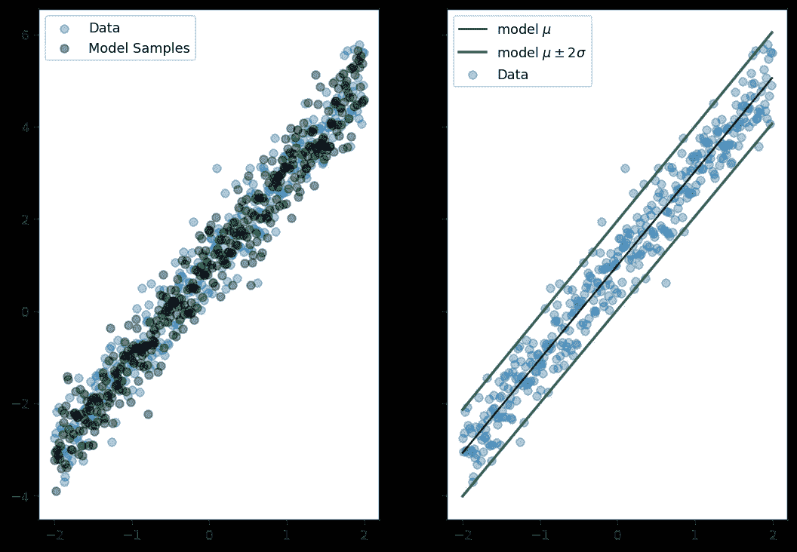
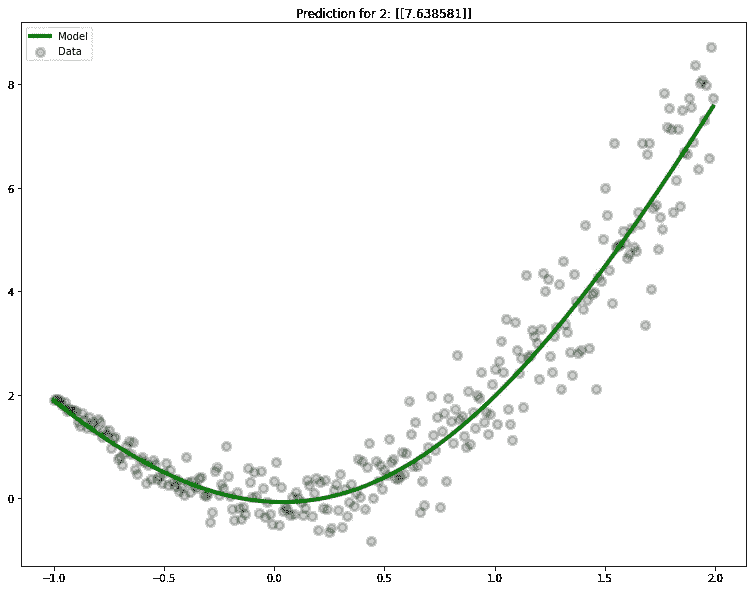
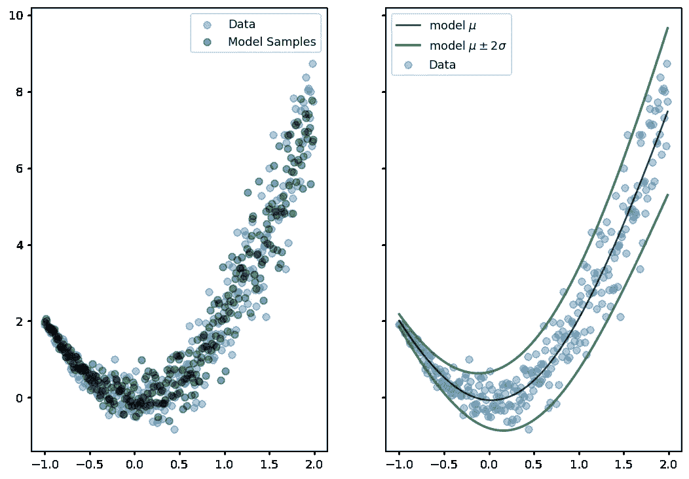
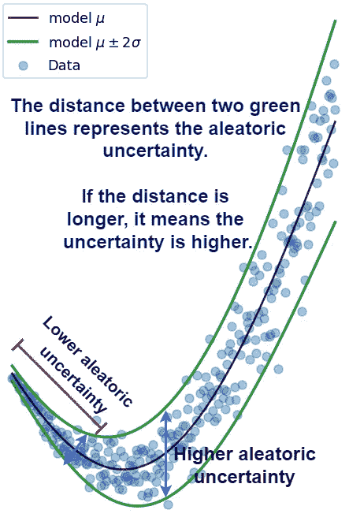

# 深度学习中的不确定性——随机不确定性和最大似然估计

> 原文：<https://towardsdatascience.com/uncertainty-in-deep-learning-aleatoric-uncertainty-and-maximum-likelihood-estimation-c7449ee13712>


纳赛尔·塔米米在 [Unsplash](https://unsplash.com?utm_source=medium&utm_medium=referral) 上的照片

在[之前的文章](/uncertainty-in-deep-learning-brief-introduction-1f9a5de3ae04)中，我们讨论了深度学习中的 softmax 输出和不确定性。现在，我们用张量流概率来扩展这些。

我将会有一系列的文章来解释这些术语并展示 TFP 的实现。

*   [第 1 部分——简介](/uncertainty-in-deep-learning-brief-introduction-1f9a5de3ae04)
*   **第 2 部分——随机不确定性和最大似然估计**
*   [第 3 部分——认知不确定性和贝叶斯反推](/uncertainty-in-deep-learning-epistemic-uncertainty-and-bayes-by-backprop-e6353eeadebb)
*   [第 4 部分—实现完全概率贝叶斯 CNN](/uncertainty-in-deep-learning-bayesian-cnn-tensorflow-probability-758d7482bef6)
*   [第五部分——贝叶斯 CNN 实验](/uncertainty-in-deep-learning-experiments-with-bayesian-cnn-1ca37ddb6954)
*   第 6 部分—贝叶斯推理和转换器

# 简而言之张量流概率..

TensorFlow Probability (TFP)是一个用于概率编程和统计推断的库。它提供了一个高级 API 来构建和操作概率分布，并对它们进行后验推断。 **TFP 与 TensorFlow 生态系统**集成，允许您在 TensorFlow 中构建和训练概率模型，然后在文本分类、图像识别等应用中使用这些模型进行推理。

在接下来的部分中，我们将使用张量流概率来表示**随机不确定性**:

## 本文组织如下:

*   什么是任意不确定性？
*   **未能捕捉任意不确定性的模型**
*   **张量流概率层简介**
*   **最大似然估计和负对数似然**
*   **捕捉随机不确定性的概率模型**

在开始任何事情之前，让我们看看这些任务的导入:

# 什么是随机不确定性？

Aleatoric 来自 alea ，拉丁词“骰子”。随机不确定性是由事件的随机性引入的不确定性。例如，抛硬币的结果是一个任意事件。

**在深度学习中，**随机不确定性通常是指输入数据的随机性，这可能是由多种因素造成的，包括传感器噪声、像素噪声等。因此，这意味着我们的训练数据在表示输入和目标的真实关系方面并不完美，这反过来会导致我们的模型不太准确。

**还有一件事，增加更多的数据不会减少任意的不确定性。**

# **未能捕捉任意不确定性的模型**

1.  我们的训练数据只是一个线性关系，可以表示为:`y=2x+1`，然而数据并不完美，存在一些正常的噪声。
2.  模型有 **2 个线性层，**因为训练数据是线性的。**还要注意，别忘了我们用** `**mse**` **作为损失函数**。我们将在 MLE 部分回顾这一点。
3.  我们拟合我们的模型，得到了对`2`的预测。

运行上面的代码，我们将得到以下结果:


图片作者。

我们在这里讨论一下是哪里出了问题。首先，正如我们在[上一篇文章](/uncertainty-in-deep-learning-brief-introduction-1f9a5de3ae04)中所讨论的，该模型具有点估计权重。除此之外，我们还有一个点估计预测。

模型也不能捕捉数据的范围。如果我们可以建立一个模型，使用标准差和平均值绘制以下数据的 95%区间，会怎么样？

# 张量流-概率层简介

在进入 TFP 之前，让我们从一个普通的模型开始:

当我们运行上面的代码时，我们将得到以下结果:



图片作者。

这是意料之中的，因为我们的`Dense`层是由一个`tanh`函数激活的，权重是由 1 初始化的。

因此，该模型获得输入并将它们乘以 1，然后将这些值传递给`tanh`函数。回想一下我们的模型是:

带线路:

```
model_predictions = np.maximum(0, model.predict(space))
```

负值被消除，因此生成了上面的图。综上所述，我们创建了一个模型*模型*模型`np.maximum(0, tanh)`。

## 探索前馈对象类型

```
# Output:
Feedforward returns: tf.Tensor([[0.19737528]], 
                     shape=(1, 1), dtype=float32)Allclose!
```

重要的一点是前馈(**模型(x)** )返回一个`tf.Tensor`。我们也刚刚确认了模型准确输出`np.maximum(0, tanh)`。

## 预测同一个样本五次

```
sample = tf.convert_to_tensor([0.2])
for _ in range(5):
    print(model(sample).numpy()[0])--> [0.19737528]
--> [0.19737528]
--> [0.19737528]
--> [0.19737528]
--> [0.19737528]
```

他们都是一样的，现在也记住这一点。**这意味着模型是确定性的。**

添加 TFP 层很容易，因为 TFP 与 TensorFlow 本身集成在一起。

# 输出分布的模型

```
Feedforward returns: tfp.distributions._TensorCoercible("tensor_coercible",
                                   batch_shape= [1, 1],
                                   event_shape=[], dtype=int32)
```

让我们一行一行地解开这个模型。该模型具有如前一示例的密集层，但在此之后它具有`tfpl.DistributionLambda`。这允许模型输出一个分布而不是一个固定值。所以这就是为什么前馈型现在不一样了。

**TFP** 在`tfp.distributions (tfd)`下有许多分布，但为了简单起见，使用伯努利分布。

简单地说，**伯努利**分布是一种离散概率分布。它用于模拟二元事件的概率，即一个事件有两种可能的结果**。这些**结果可以标记为“成功-1”和“失败-0”。

```
tfpl.DistributionLambda(lambda x: tfd.Bernoulli(probs = x),
                    convert_to_tensor_fn = tfd.Distribution.sample)
```

来自密集层的输出被传递到伯努利分布中，该分布创建了成功事件的概率。而且我们需要从这个分布中提取数值(在训练时)，这是通过`convert_to_tensor_fn`论证来完成的。使用`tfd.Distribution.sample`，输出将是来自该分布的样本。典型的选择有:

```
1) tfd.Distribution.sample (default value)
2) tfd.Distribution.mean
3) tfd.Distribution.mode
```

当我们从模型中取样时，我们得到了不同的结果。现在我们的模型**不再产生确定性的**输出。



作者图片

正如我们所讨论的，伯努利样本将是 0 和 1。这张图显示，当`x`值越高，成为`1`的概率也越高。

我们现在有了所有的片段，我们看到了如何在我们的模型中包括分布对象，**唯一缺少的是在训练时我们应该使用什么作为损失函数？**

# **最大似然估计和负对数似然**

回忆我们的数据:



图片作者。

`x`和`y` 值之间没有完美的线性关系。换句话说，我们不能通过每个点画一条直线，所以我们得出结论，数据有一些噪音。然而，我们可以通过使用线性回归模型来找到线性关系的良好近似，我们首先已经做到了这一点。回想一下我们的第一个模型:


图片作者。

这条直线似乎是一个合理的近似值，我们使用`mse`作为损失函数。但是，这个`mse`从何而来？

## 最大似然估计

神经网络是深度学习的基本工具。它们将数据点映射到参数值，确定看到给定输入的概率，并通过找到最小化训练数据的负对数似然**的权重来帮助训练自己。在**可能性**中，**数据是固定的**，并且是θ或模型权重**的**函数。**

这听起来可能令人困惑，所以让我们一步一步来，我们已经给出:



图片作者。

在优化过程中，**我们更喜欢最小化**而不是最大化，所以:



图片作者。

现在我们已经看到了负对数似然性的来源。但是`mse?`怎么样呢？嗯，如果你假设，数据有高斯误差(噪声)和固定方差(误差是独立的),你会以**最小化误差平方和**结束。

## 将 NLL 定义为自定义损耗

由于我们处理的是分布和分布对象(其中有`.log_prob()` ( log-PDF)方法)，我们可以直接最小化 **NLL** 作为自定义损失函数。

# **捕捉随机不确定性的概率模型**

我们可以输出方差固定的独立正态分布。这里，我们只学习目标分布的均值。

换句话说，我们拟合了一个方差固定的正态分布！

我们还可以用这个模型绘制±2sd，因为输出是一个分布对象。我不会在这里包括效用函数，因为它是一个简单的绘图和从分布中获得标准差。

```
Loss: 1.6406861543655396
Model mean: 1.0017924
Mean of the data: 1.0012743054317013
```



图片作者。

学习的平均值似乎非常接近原始平均值！但是我们这里处理的是深度学习，所以也可以学习标准差。

这种模式需要一些改变:

模型摘要:

```
Layer (type)                Output Shape              Param #   
=================================================================
 dense_8 (Dense)             (None, 32)                64        

 dense_9 (Dense)             (None, 2)                 66        

 distribution_lambda_3 (Dist  ((None, 1),              0         
 ributionLambda)              (None, 1))                         

=================================================================
```

由于涉及到性病，我们可能需要更长时间的训练。现在有 **3** 主要变化:

1.  最后一个密是`Dense(1 + 1)`，一个是 mean，一个是 std。
2.  我们将`tf.nn.softplus`应用于`scale`论证，因为**不能为负**。
3.  我们传递第一个指数作为平均值，传递第二个指数作为标准差。

该模型将产生以下结果:

```
Loss: 0.68198561668396
Model mean: 0.98936194
Mean of the data: 1.0012743054317013
```



图片作者。

现在，这些绿色条代表 95%区间内的数据分布，带有学习平均值和标准差。在进入另一个复杂的例子之前，我想展示一些关于那些`tfp.layers.`的东西

你看到我们需要`Dense(1 + 1)`用于新的模型。然而，TFP 中有一个很好的包装器来处理这些参数。我们可以编写相同的模型:

`params_size`确保最后一个密集层有正确的单元数。

此外，我们可以使用`tfpl.IndependentNormal`来代替`DistributionLambda`，它是 lambda 层的包装器。这次通过事件形状就够了。`event_shape`为 1，因为数据只有一维。

请注意，返回的模型摘要是相同的。

## 任意不确定性非线性数据

现在，由于数据不再是线性的，所以模型被激活了。



图片作者。

我们可以写一个模型来捕捉任意的不确定性，想法是一样的:

该模型将给出以下结果:



图片作者。

让我们讨论一下任意不确定性的高低。



图片作者。

## 分类示例

分类也遵循同样的逻辑。我们可以为`imdb_reviews`数据集写一个模型。

我将只为它添加代码:

现在，我们已经用`IndependentBernoulli`代替了 Lambda 层。如果我们做多类分类，我们会使用`tfpl.OneHotCategorical()`。

# 结论

我们

*   所讨论的随机不确定性不能通过增加新的样本来减少，
*   简要了解了 TFP 分布对象以及如何将它们集成到我们的 Keras 模型中，
*   看过 MLE 和 NLL，
*   创建了 Keras 模型来表示任意的不确定性。

所有的代码都可以在[这里](https://github.com/Frightera/Medium_Notebooks_English/blob/main/Uncertainty%20in%20DL%20-%20Aleatoric%20Uncertainty/Aleatoric%20Uncertainty.ipynb)找到。

# 后续步骤

在接下来的文章中，我们将讨论一些使用 TFP 来表示认知不确定性，也就是模型不确定性的方法。

此外，我们还将看到如何编写一个完全概率模型来表示噪声项不是正态或高斯的数据中的不确定性。