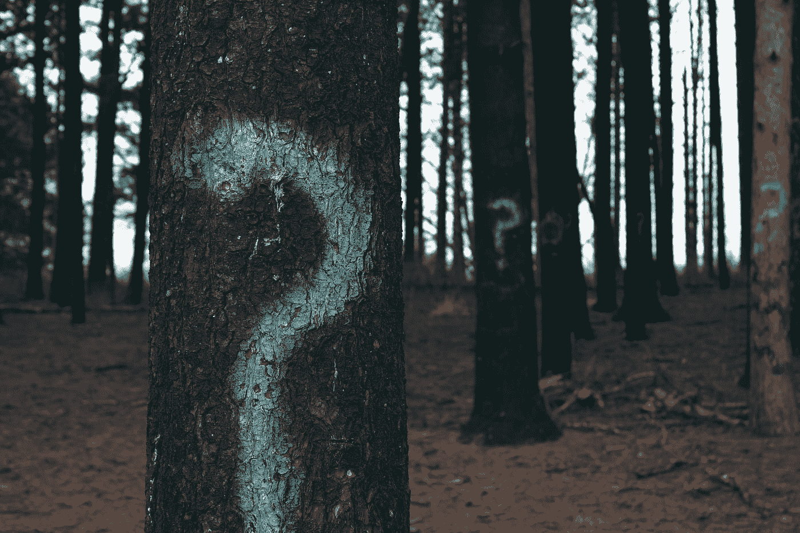
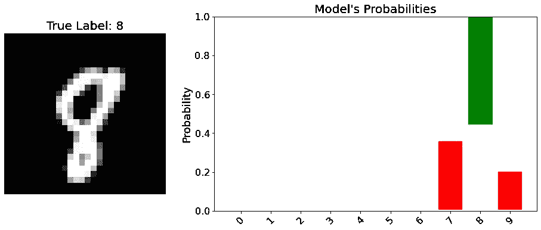
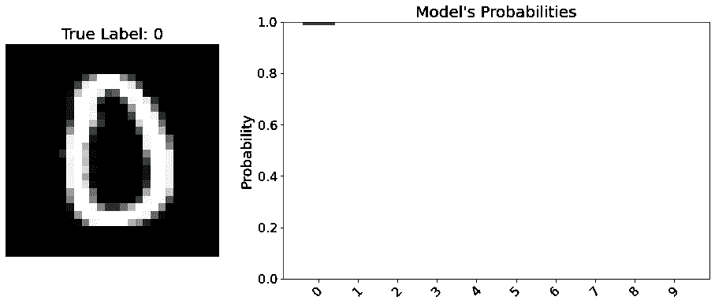
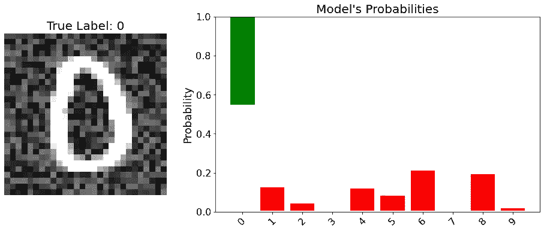
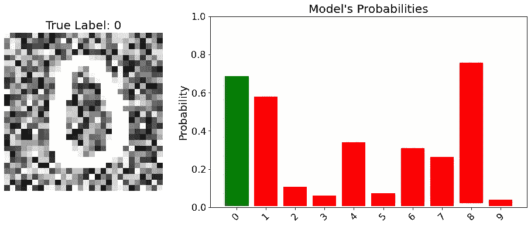
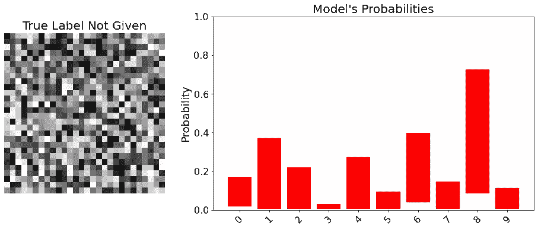

# 深度学习中的不确定性—贝叶斯 CNN |张量流概率

> 原文：<https://towardsdatascience.com/uncertainty-in-deep-learning-bayesian-cnn-tensorflow-probability-758d7482bef6>

## 创建一个深度学习模型，知道它不知道什么。



埃文·丹尼斯在 [Unsplash](https://unsplash.com?utm_source=medium&utm_medium=referral) 上的照片

这是深度学习**不确定性系列**第四** **部分**。**

*   [第 1 部分—简介](/uncertainty-in-deep-learning-brief-introduction-1f9a5de3ae04)
*   [第 2 部分—随机不确定性和最大似然估计](/uncertainty-in-deep-learning-aleatoric-uncertainty-and-maximum-likelihood-estimation-c7449ee13712)
*   [第 3 部分——认知不确定性和反向投影贝叶斯](/uncertainty-in-deep-learning-epistemic-uncertainty-and-bayes-by-backprop-e6353eeadebb)
*   **第 4 部分——实现完全概率贝叶斯 CNN**
*   [第五部分——贝叶斯 CNN 实验](/uncertainty-in-deep-learning-experiments-with-bayesian-cnn-1ca37ddb6954)
*   第六部分——贝叶斯推理和变形金刚

# 介绍

在本文中，我们将探索如何使用张量流概率(TFP)实现完全概率贝叶斯 CNN 模型。在[第二部分](/uncertainty-in-deep-learning-aleatoric-uncertainty-and-maximum-likelihood-estimation-c7449ee13712)中，我们创建的模型只能捕捉**随机不确定性，或数据不确定性**。

在接下来的部分([第 3 部分](/uncertainty-in-deep-learning-epistemic-uncertainty-and-bayes-by-backprop-e6353eeadebb))我们**改变了我们的模型层，使它们具有概率分布，而不是固定的权重和偏差**。通过这种方式，我们能够捕捉模型参数上的**认知不确定性**。

现在，是时候将[第二部分](/uncertainty-in-deep-learning-aleatoric-uncertainty-and-maximum-likelihood-estimation-c7449ee13712)和[第三部分](/uncertainty-in-deep-learning-epistemic-uncertainty-and-bayes-by-backprop-e6353eeadebb)组合在一起了。换句话说，我们将在本帖中介绍如何**创建一个基本的 BNN** ，并解释图层参数。

文章组织如下:

*   **变化和重新参数化层**
*   **正常 CNN 和参数**
*   **重新参数化层中的自定义优先级**
*   **KL 散度的近似值**
*   **创建全概率贝叶斯 CNN**
*   **这个模型知道自己不知道的！**
*   **结论&下一步**

在我们开始之前，让我们看看导入:

# **变层和重新参数化层**

首先，从 2022 年 2 月 27 日**起**在 TFP 中没有像我们在第 3 部分中使用的**dense varianial**那样的**conv variant**层。相反，

*   卷积 1 去参数化
*   卷积 2 重新参数化
*   卷积 3 重新参数化

层是存在的。底层的**算法与我们在[第 3 部分](/uncertainty-in-deep-learning-epistemic-uncertainty-and-bayes-by-backprop-e6353eeadebb)中讨论的**算法相同。

让我们看看**convolution 2d 重新参数化**层的参数:

`divergence_fn` =回想一下:“我们希望先验和变分后验之间的**KL-散度**尽可能低**，同时保持**预期可能性尽可能高(** [**第 3 部分**](/uncertainty-in-deep-learning-epistemic-uncertainty-and-bayes-by-backprop-e6353eeadebb) **)”。**因此，根据我们对先验函数和后验函数的选择，如果可以解析地计算 KL-散度，并且已在 TFP 中注册，它将使用精确的计算。这就是`kl_use_exact`参数在`DenseVariational`层实际做的事情！但是在**convolution 2d 重新参数化**中我们提供了它。最后，我们将它除以样本总数，这是我们在第 3 部分看到的原因。**

**如果 KL 无法解析计算，我们将看看我们应该提供什么。**

**`prior_fn & posterior_fn` =这些是`prior`和`variational_posterior`功能(第三部分)，我们可以定制它们。例如，我们可以使用拉普拉斯先验等。**

**`is_singular` =如果设置为`True`，数值再次变成点估计值，而不是概率值。考虑这个场景:**

```
bias_prior_fn = None,
bias_posterior_fn = ...normal_fn(is_singular=True)
```

**在上面的代码中，偏差参数的学习方式与常规卷积层相同，它固定为一个值。**

**当`is_singular=True`被传递时，一个`tfd.Deterministic`的实例将被创建。这就是点估计值的获得方式。**

**现在我们已经看到了重新参数化层的参数。我们可以开始写模型了。**

# **普通 CNN**

**首先，让我们从如何创建一个普通的 CNN 开始:**

**相当简单，只是一个普通的 CNN 网络！我们将把这个模型转换成贝叶斯卷积神经网络。**

**并且注意这个型号总共有 **98.442 个参数**。**

# **概率贝叶斯 CNN**

## **重新参数化图层的自定义先验**

**由于**重新参数化**层在方法参数方面不同于**密集变量化**层，我们需要在编写自定义先验&后验时考虑这一点。**

**例如，如果我们想要提供自定义病历，它们应该定义如下:**

**现在，每个功能都需要`dtype, shape, trainable, add_variable_fn`。让我们打开`batch_ndims`和`reinterpreted_batch_ndims`的包装:**

**我们使用正态分布来观察`reinterpreted_batch_ndims`如何影响分布。**

****重新解释 _ 批处理 _ndims: 0****

*   ****batch_shape(4，)** =四个正态分布**
*   ****样本形状:(4，)** =四个样本**
*   ****将它们放在一起:**来自四个正态分布的四个样本。**

****重新解释 _ 批处理 _ndims: 1 →** 要重新解释为事件形状的批处理形状的数量。在我们的例子中是 1。**

*   ****event_shape(4，)**=多元正态分布。所以这个正态分布是由四个随机变量组成的。**
*   ****样本形状:(4，)** =四个样本**
*   ****将它们放在一起:**来自多元正态分布的四个样本。**

**由于后验概率需要是可训练的，我们将在下一部分中看到**如何创建自定义后验概率。我不想在这篇文章中过多地描述 BNN 的具体部分。****

## **逼近 KL 散度**

**我不会在这里讨论数学，因为这超出了本文的范围。**

**KL 散度的蒙特卡罗近似可以实现如下:**

**出于演示目的，我们将使用这个近似函数。**

## **创建模型**

**现在，我们将创建一个函数来获得**convolution 2d 重新参数化**层**。**由于这篇文章涵盖了基础知识，我们将使用`mnist`数据集。**

**在这个模型中，我们使用默认的**值作为**后**和**前**的值。我们将在本系列的下一部分**中看到如何完全定制它们。**

****输出**也是一个**分布对象(onehotcategorial)**，所以我们可以直接使用**负对数似然**作为损失函数。这意味着我们也可以用这个模型捕捉任意的不确定性。**

**这里重要的一点，BNN 的**总参数是普通 CNN**型号**的**两倍**。这是因为每个权重和偏差现在都有均值和方差，所以我们用 **Bayes-by-Backprop** 学习这些值。这让我们能够代表模型参数的认知不确定性。****

**由于我们可以**捕捉任意的和认知的不确定性**，我们称这个模型为**全概率贝叶斯神经网络。****

**`divergence_fn`是我们为 KL 近似创建的函数。这里，我们可以使用 KL-Divergence 的分析值，因为先验和后验选择是具有均值和方差的正态分布。**

**这是贝叶斯 CNN 模型的一个缺点，它可能会变得计算密集，这取决于变分后验概率的选择。如果我们还想通过使用 `MultivariateNormalTriL`来**学习协方差，那么将会有更多的参数。****

## **分析模型预测和输出**

**首先，让我们从数据集中抽取一些样本:**

**我们将定义一个效用函数来分析预测和输出。现在，每次向前传递将给出不同的值，因为我们从模型参数中采样以获得预测结果。它可以被解释为集成分类器。**

**首先，我们创建空数组来存储输出。我选择`forward_passes`为 10，你可以增加到任何合理的数字，比如 100 或者 200。`forward_passes`定义从**(第 8 行)**模型中获取的样本数量。**

**模型输出一个分布对象，为了得到概率我们使用`mean()`方法**(第 10 行)**。同样的事情也适用于`extracted_std`。**

**每门课会有 10 个不同的预测。在绘制它们之前，我们独立地获得每个类别的 95%预测区间**(第 31 行-第 33 行)**。如果我们用 100 作为`forward_passes`，那么将会有 100 种不同的预测。**

**绘图过程很简单，我在这里不赘述。**

**让我们测试一下这个功能:**

```
analyse_model_prediction(example_images[284], example_labels[284])
```

**这将给出输出:**

```
Label 8 has the highest std in this prediction with the value 0.157
```

****

**图片作者。**

**在进入细节之前，考虑一下最好的情况。如果对于给定图像，模型在每次向前传递时输出 1.0，则计算 95%的预测间隔也将给出 1.0**

**在这种情况下，柱会更短，表明预测的不确定性较低。**因此，关键的一点是，柱越高，不确定性就越高！****

**在这个预测中，我们看到模型将概率指定为 8。然而，它们之间的范围概率有明显的区别。在向前传递中，输出大约是 0.5，而在另一个传递中，输出是 1.0。**因此，我们得出结论，模型对该预测不太确定。****

```
analyse_model_prediction(example_images[50], example_labels[50])
```

**输出如下所示:**

```
Label 0 has the highest std in this prediction with the value 0.001
```

****

**图片作者。**

**瞧啊。模型在每次向前传递中分配了非常高的概率。我们说这个模型对这个预测是有把握的。**

****这个模型居然知道自己不知道的东西！****

**在下结论之前，让我们添加随机噪声向量，看看它如何影响预测。**

```
noise_vector = np.random.uniform(size = (28, 28, 1), 
                                 low = 0, high = 0.5)# Make sure that values are in (0, 1).
noisy_image = np.clip(example_images[50] + noise_vector, 0, 1)analyse_model_prediction(noisy_image, example_labels[50])
```

****

**图片作者。**

**类 0 的概率仍然很高，但是检查结果可能是值得的。想象你正在使用一个贝叶斯 CNN，如果你得到这样的输出，你会怎么做或者你会怎么解释它？**

**我的解释是，模型认为它属于 0 类，但是有一些不确定性，所以我可能会看一下。**

**如果我们增加图像中的噪声，使其更加扭曲，会发生什么？**

```
noise_vector = np.random.uniform(size = (28, 28, 1), 
                                 low = 0, high = 0.5)noisy_image = np.clip(example_images[50] + noise_vector*2, 0, 1)
analyse_model_prediction(noisy_image, example_labels[50])
```

****

**图片作者。**

**如果我们使用一个普通的 CNN 模型，对于某个类，输出可能仍然很高。这就是为什么正常的神经网络被认为对自己的预测过于自信。**

**但是贝叶斯 CNN 模型说它不能正确地分类这个图像。当它不知道的时候是可以的，这比分配一个错误的标签要好。我们可以通过观察高柱得到这个结论，有 3 个非常高的柱和 3 个中等高的柱。这足以说明不确定性很高。**

**最后一个样本，噪声矢量:**

```
analyse_model_prediction(np.random.uniform(size = (28, 28, 1),
                         low = 0, high = 1))
```

**这将产生以下输出:**

```
Std Array: [0.27027504 0.22355586 0.19433676 0.08276099 0.1712302  0.14369398
 0.31018993 0.13080781 0.47434729 0.18379491]
```

****

**图片作者。**

**结果是预料之中的，没有不确定性低的单一预测。这个模型说它不能正确分类这个向量。**

# **结论和下一步措施**

**在本文中，我们:**

*   **查看**convolution 2d 重新参数化**层。**
*   **如果 KL 散度不能用张量流概率进行解析计算，我看到了如何近似 KL 散度。**
*   **创造了一个完全概率的**贝叶斯 CNN** 。**

**你可以从这里得到密码和笔记本。**

****在下一部分**中，我们将**使用**自定义先验和后验函数**同时使用**真实数据集**自定义**模型。**