# 深度学习中的不确定性——简介

> 原文：<https://towardsdatascience.com/uncertainty-in-deep-learning-brief-introduction-1f9a5de3ae04>

> 当人类不知道某个特定问题的答案时，他们会说“我不知道”。但这也适用于深度学习模型吗？


[迈特·沃尔什](https://unsplash.com/@two_tees?utm_source=unsplash&utm_medium=referral&utm_content=creditCopyText)在 [Unsplash](https://unsplash.com/s/photos/question-mark?utm_source=unsplash&utm_medium=referral&utm_content=creditCopyText) 上拍照

在这篇文章中，我将尝试给出深度学习模型中不确定性的直觉，而不是深入解释这些不确定性。在接下来的部分中，我们将使用**张量流概率**对它们进行解释。

我将会有一系列的文章来解释这些术语并展示 TFP 的实现。

*   **第一部分——简介**
*   [第 2 部分——随机不确定性和最大似然估计](/uncertainty-in-deep-learning-aleatoric-uncertainty-and-maximum-likelihood-estimation-c7449ee13712)
*   [第 3 部分——认知不确定性和反向投影贝叶斯](/uncertainty-in-deep-learning-epistemic-uncertainty-and-bayes-by-backprop-e6353eeadebb)
*   [第 4 部分——实现完全概率贝叶斯 CNN](/uncertainty-in-deep-learning-bayesian-cnn-tensorflow-probability-758d7482bef6)
*   [第五部分——贝叶斯 CNN 实验](/uncertainty-in-deep-learning-experiments-with-bayesian-cnn-1ca37ddb6954)
*   [第 6 部分——贝叶斯推理和变压器](/bayesian-inference-and-transformers-3dc473ac1af2)

# 第一，什么是不确定性？

不确定性可以定义为对某事缺乏了解或确定性。这是生活中不可避免的一部分，在自然和人工系统中无处不在。

**在深度学习的背景下，有两种主要类型的不确定性:**

*   **1)随机不确定性:**这是由于数据的随机性而产生的不确定性。
*   **2)认知不确定性:**这种不确定性是由于缺乏关于模型真实参数的知识。

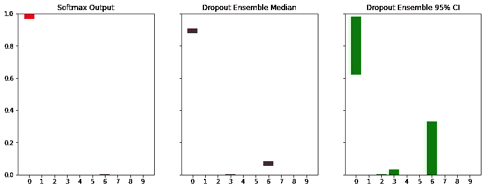

预测中不确定性的例子。作者图片

当我们训练我们的深度学习模型时，我们采用**最大似然估计(MLE)。**

简单来说， **MLE** 是从一组数据中估计统计模型参数的方法。这是一种寻找参数值的技术，可以在数据和模型之间产生最佳匹配。

换句话说，我们寻找能很好解释数据的权重。或者，根据我掌握的数据，最佳权重是多少？这是一个经典的优化问题，也是一个随机过程。但问题是，是否有多组权重可以很好地解释数据？

# 基本线性回归

首先，我们创建一个带有随机噪声的线性数据。

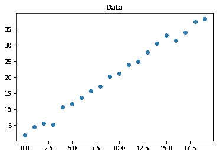

图片作者。

根据我们掌握的数据，应该有不同的模型组合。首先让我们定义一个效用函数。该函数将采用 3 个独立的模型，并使用相同的损失和优化器来训练它们。然后，它将打印 15 的预测结果，并绘制线条。

我们实际上不需要`relu`激活，因为数据集是线性的。我在试验一些模型，它们的最终形式有`relu`，所以我最终没有移除它们。

如你所知，**每个模型都有不同的起点，因为初始化器是不同的**。因此，学习到的权重应该不同，但不会相差太多。

当我们运行上面的脚本时，我们将得到:

```
Model1: Prediction for 15: [[31.22317]]
Model2: Prediction for 15: [[30.969236]]
Model3: Prediction for 15: [[31.227913]]
```

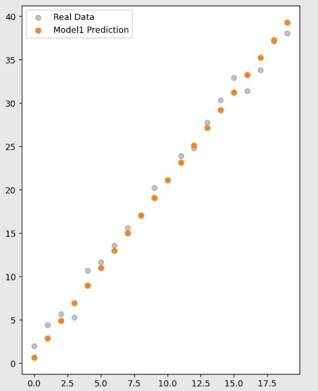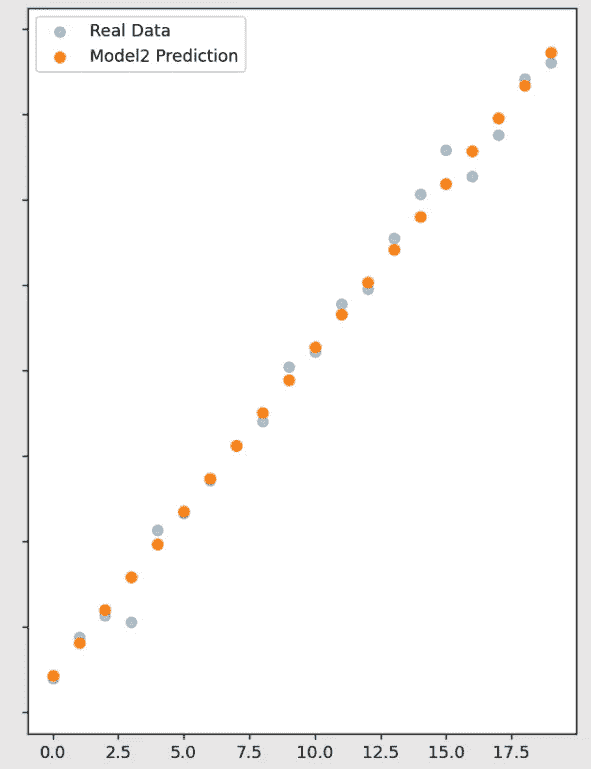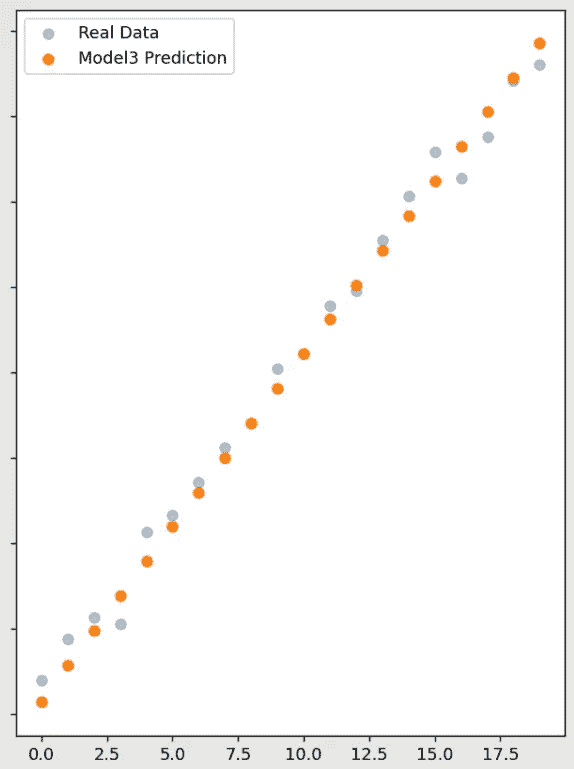

作者提供的图片

所有的线看起来都是合理的，尽管学习到的权重是不同的。那是一个**不确定性**，根据起点的不同，有不止一个模型来解释给定的数据。**换句话说，权重是不确定的！**

**估计的参数主要取决于两个因素:**

*   数据集大小
*   梯度下降的起点

正如你可能猜到的，当有更多的数据时，估计的参数会更准确。

如果考虑更大的模型和数据，在每次重新运行(拟合过程)中，大多数情况下结果是相似的，但权重不会完全相同。

# 基本图像分类和 Softmax

这一次，我将展示一个不同的例子，其中的任务是一个多类分类。为此，我将使用 [fashion_mnist](https://www.tensorflow.org/datasets/catalog/fashion_mnist) 作为基本示例。

加载和处理数据后，可以编写如下简单模型:

模型总结看起来是这样的，没有什么特别的:

```
Layer (type)                Output Shape              Param #   
=================================================================
 conv2d (Conv2D)             (None, 28, 28, 16)        160       

 max_pooling2d (MaxPooling2D  (None, 14, 14, 16)       0         
 )                                                               

 conv2d_1 (Conv2D)           (None, 14, 14, 32)        4640      

 max_pooling2d_1 (MaxPooling  (None, 7, 7, 32)         0         
 2D)                                                             

 conv2d_2 (Conv2D)           (None, 7, 7, 64)          18496     

 max_pooling2d_2 (MaxPooling  (None, 3, 3, 64)         0         
 2D)                                                             

 conv2d_3 (Conv2D)           (None, 3, 3, 128)         73856     

 global_max_pooling2d (Globa  (None, 128)              0         
 lMaxPooling2D)                                                  

 dense_6 (Dense)             (None, 128)               16512     

 dense_7 (Dense)             (None, 10)                1290      

=================================================================
Total params: 114,954
Trainable params: 114,954
Non-trainable params: 0# Last Epoch
Epoch 16/16
469/469 [==============================] - 6s 12ms/step - loss: 0.1206 - acc: 0.9551 - val_loss: 0.3503 - val_acc: 0.9014
```

让我们忽略这里的过度拟合部分，并绘制一些预测的`softmax`输出。在此之前，我们将从数据集中抽取一些样本和标签，并对它们进行预测。

我们拿第一批来预测。

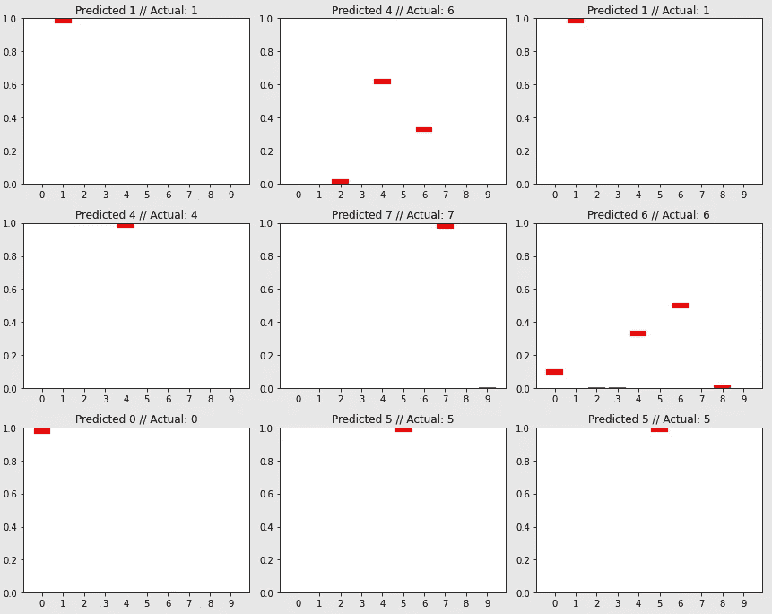

作者图片

对于第一个图，正确的标签是 1。并且模型为该样本输出如此高的`softmax`值。虽然`softmax`值很高，但是这个**并不能说明模型有多可靠。**

为了测试这一点，一个随机噪声向量将被给予模型。我们将讨论`softmax`输出。

(我将在后面的部分解释第二个模型的参数`ensemble`

```
{0: 6.912527, 1: 0.0038282804, 2: 0.9346371, 3: 0.7660487, 
 4: 4.7964582, 5: 3.58412e-05, 6: 80.114265, 7: 0.0002095818, 
 8: 6.4642153, 9: 0.007769133}
```

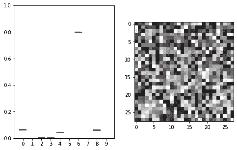

图片作者。

根据`softmax`输出，有 80% *的概率*该给定向量属于类别 6。

关于`softmax`的**误解**是**的值**越高，模型就越**有信心**[1]。**情况并非总是如此**。`Softmax`预测错误时，值可能非常高。例如:

*   敌对攻击
*   非分布数据(例如:随机噪声向量)

此外，在我们讨论的回归示例中，根据梯度下降的起点，存在多个模型权重来解释数据。这里，我们完全忽略了它们，因为**模型具有点估计权重**，而我们只有一个模型。

**所以现在问题来了**，如果我们考虑其他可能的模型，并把它们组合起来得到一个预测，会怎么样？比方说，如果我们为这些数据集合 100 个不同的模型会怎么样？

## 组装 100 个模型

训练 100 个不同的深度学习模型，如果考虑现实生活中的项目，并不实用。我们可以想一个简单的方法从单点估计模型中得到不同的预测。

如你所知，辍学是深度学习中采用的一种正则化技术，以防止过度拟合。它的工作原理是在训练过程中随机从网络中删除一些单元(神经元),希望这样可以防止任何一个神经元变得太有影响力。我将解释我们如何使用它来得到不同的模型并将它们组合在一起。

在此之前，让我们创建相同的模型，并添加辍学。

从模型中获取预测时，丢弃层不活动。如果我们在预测输入的同时使用漏失层的效果会怎么样？

如果我们使用`__call__`模型的方法，我们仍然可能使它们保持活跃:

```
for _ in range(4):
    predict_noise = model2(tf.expand_dims(random_vector,axis = 0),
                        training = True).numpy().squeeze()
    print('Softmax output for class 0:', predict_noise[0] * 100)
```

使用`training = True`，我们保持活跃的`Dropout`层，就好像网络正在训练，但我们只应用向前传递。上面的代码将打印这些结果:

```
Softmax output for class 0: 3.7370428442955017
Softmax output for class 0: 4.5094069093465805
Softmax output for class 0: 0.9782549925148487
Softmax output for class 0: 1.7607659101486206
```

这是因为脱落层，一些神经元随机脱落。因此，**作为一种天真的方法**我们可以使用这种策略来获得不同的预测，就好像我们有 100 个不同的模型一样。

第一个模型是完全**确定性的**，如果你预测相同的样本，你每次都会得到**相同的输出，并且因为它没有**层，所以没有实际可行的方法来得到不同的预测。但是现在，我们可以从一个**单一模型得到**不同的预测**！******

回想一下，我们有一个效用函数来预测给定噪声矢量的`softmax`输出:

现在我们将`model2`作为模型参数，将`100`作为集合大小。所以现在我们从模型中得到 100 次预测，同时保持脱落层活动。对于最终的预测，我们将只取预测的**平均值**。

```
{0: 4.0112467, 1: 0.4843149, 2: 11.618713, 3: 8.531735, 
 4: 8.837839, 5: 0.04070336, 6: 59.83536, 7: 0.96540254, 
 8: 4.8854494, 9: 0.7892267}
```

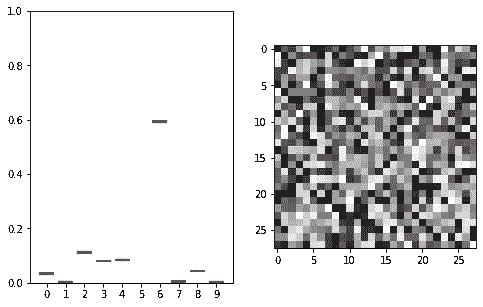

作者图片

嗯，结果比其他模型好，但不是最好的。这是因为即使我们使用了某种集合技术，模型的权重也有点估计值。

让我们用新模型预测第一批并检验结果。

```
predictions = []
for _ in range(1000):
    predicted_ensemble = model2(samples,
                        training = True).numpy().squeeze()
    predictions.append(predicted_ensemble)
predictions = np.array(predictions)
print('Predictions shape:', predictions.shape) # (1000, 128, 10)
predictions_median = np.median(predictions, axis = 0)
```

我们不用均值，取**中值**作为最终预测。当我们绘制预测图时，它们看起来像这样:

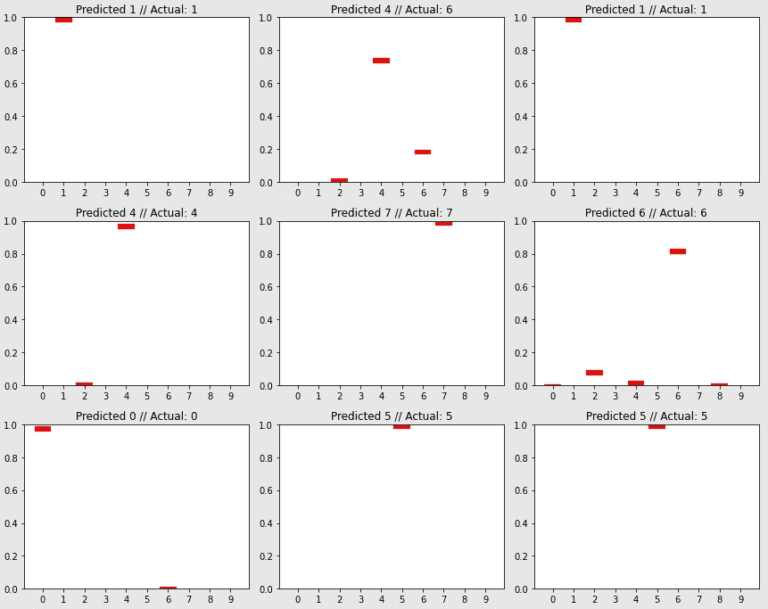

作者图片

如果我们将这些预测与另一个进行比较，我们会发现一些预测略有变化。这是因为我们在获得预测的同时保持主动退出，这使得我们能够拥有随机集合模型。

现在，我们可以针对单个输入获得多个不同的预测。这意味着我们可以从一组预测中生成**置信区间**。

## 退出以获得置信区间

使用 for 循环，我们可以获得样本的预测:

我将添加一些示例图来对它们进行评论:

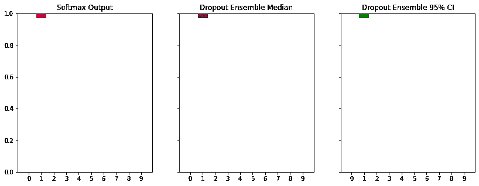

图片作者。

该图向我们展示了，即使我们集合了特定输入的`1000`预测，95%区间的范围与中值和正常预测相同。所以我们可以说这个样本确实属于`class 1.`和**不确定性低。**

让我们看看另一个例子:

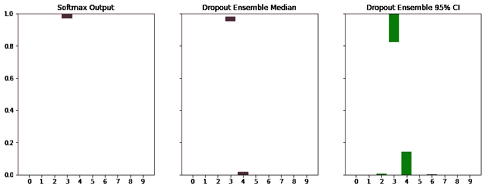

图片作者。

刚刚发生了什么？当我们检查 95%的间隔时，我们看到绿色条比以前高了。这是因为通过辍学模型，我们能够捕捉到预测中的一些不确定性。

**结论是，随着这些绿条越来越高，预测越来越不确定。**

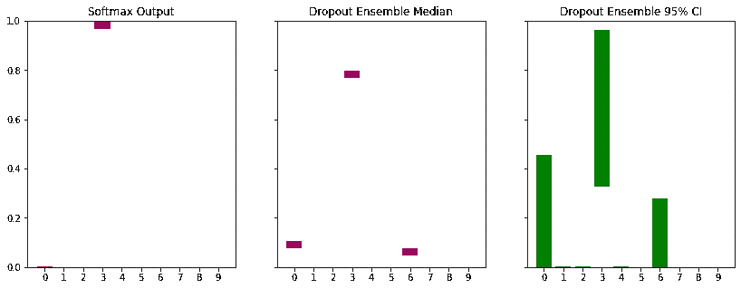

图片作者。

最后，让我们来检验这个预测。当我们使用单点估计模型时，0 类的概率很小。当我们应用集成技术时，我们看到预测中有巨大的不确定性。注意绿色的条有多高！

# 结论

我们讨论过:

*   假设数据集是相同的，则存在取决于梯度下降起点的一组权重。
*   普通的辍学集合不是最好的方法，因为它有点随机。

# 后续步骤

在下面的文章中，**我们将使用一种更系统的方式**来表示任意的和认知的不确定性，使用**张量流概率**同时详细解释这些术语。

你可以从这里查看用过的笔记本[。](https://github.com/Frightera/Medium_Notebooks_English/tree/main/Brief%20Introduction%20to%20Uncertainty)

# 参考

[1]:蒂姆·皮尔斯，亚历山德拉·布林特鲁普·朱军，[了解 Softmax 信心和不确定性](https://arxiv.org/pdf/2106.04972.pdf)，2021。