# 深度学习中的不确定性——认知不确定性和反向投影贝叶斯

> 原文：<https://towardsdatascience.com/uncertainty-in-deep-learning-epistemic-uncertainty-and-bayes-by-backprop-e6353eeadebb>

> 知识是在不确定性边缘的无止境的冒险。
> 
> 雅各布·布朗诺夫斯基


由[凯尔·格伦](https://unsplash.com/@kylejglenn?utm_source=medium&utm_medium=referral)在 [Unsplash](https://unsplash.com?utm_source=medium&utm_medium=referral) 上拍摄

这是深度学习**不确定性系列**第三部**。**

*   [第 1 部分—简介](/uncertainty-in-deep-learning-brief-introduction-1f9a5de3ae04)
*   [第 2 部分—随机不确定性和最大似然估计](/uncertainty-in-deep-learning-aleatoric-uncertainty-and-maximum-likelihood-estimation-c7449ee13712)
*   **第 3 部分——认知不确定性和反向投影贝叶斯**
*   [第 4 部分——实现完全概率贝叶斯 CNN](/uncertainty-in-deep-learning-bayesian-cnn-tensorflow-probability-758d7482bef6)
*   [第五部分——贝叶斯 CNN 实验](/uncertainty-in-deep-learning-experiments-with-bayesian-cnn-1ca37ddb6954)
*   第六部分——贝叶斯推理和变形金刚

# 介绍

在本文中，我们将探讨如何使用张量流概率来表示认知不确定性，以及理解底层算法和理论背景。

文章组织如下:

*   **什么是认知不确定性**
*   **普通神经网络的问题**
*   **贝叶斯神经网络**
*   这个方案背后的数学原理
*   **变分贝叶斯方法**
*   **贝叶斯神经网络中的反向传播**
*   **迷你批次&对 KL 背离重新加权**
*   **使用张量流概率的重量不确定性**
*   **结论&下一步**

# 什么是认知不确定性？

**认知不确定性是关于世界的知识缺失、不精确或者可能是错误的。**它存在于现实世界中，不仅仅是一种主观感受。

如果你问我，这是需要处理的最重要的不确定性，因为它阻止你确定任何事情。我们的现实往往是一个很大的未知数，我们做出决定所依据的信息可能是有缺陷的、不完整的，或者根本不可用。

没有人确切地知道任何事情，因为我们出生在一个不确定的世界。

**例如**，你可能对一个数学问题的答案非常有信心，但这并不意味着你是正确的。这也是深度神经网络的一个问题，由于输出激活，它们被认为过于自信。

一个更具体的例子，如果你随机测量 **10 个人**来找出拥挤人群的平均身高，你对人群平均身高的估计将会不准确。这是因为你可能选择了比平均水平高或矮的人。你衡量的人越多，你的估计就越准确。这被称为认知的不确定性。

**显然，认知的不确定性可以通过更多的数据来减少。因为如果测量的人多，估计会更准确。**

在我们开始之前，我将添加导入:

# 普通神经网络的问题

由于我们使用最大似然估计来获得解释数据的最佳权重值，并且还考虑到我们的数据是有限的，因此应该有不止一个模型来解释或拟合数据。**关键在于，权重是单个确定性点估计值。**

我们来看看是不是这样，线性回归:

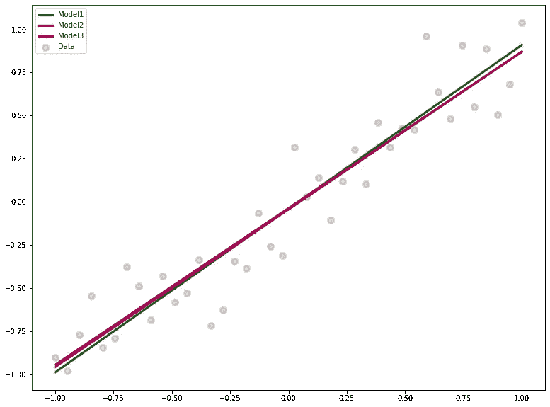

图片作者。

当拟合 3 个独立的模型时，它们的起点将会不同，因为权重是随机初始化的。此外，优化过程是一个随机过程，因此每次的最佳权重值都会不同。

这是关于模型权重的认知不确定性，因为没有唯一的答案。有一组合理的权重。如果数据集变大，我们可以得到更好的估计。

让我们检查一下非线性回归问题:

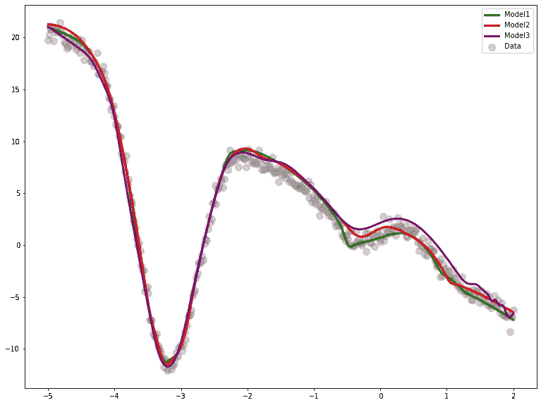

作者图片

正如我们所料，尽管学习到的权重不同，但这三行似乎都是合理的。同样的事情也适用于这种情况。

而如果考虑现实生活问题，比较复杂，应该有多组权重才能很好的解释数据。因为在现实生活中，模型也更复杂，同时考虑到在损失情况下存在许多局部极小值，权重集对于获得合理的结果更有意义。

简而言之，问题是我们不知道权重的可能值，但有点估计值。

**但是，我们如何在神经网络中融入认知不确定性呢？**

# 贝叶斯神经网络

## 想法

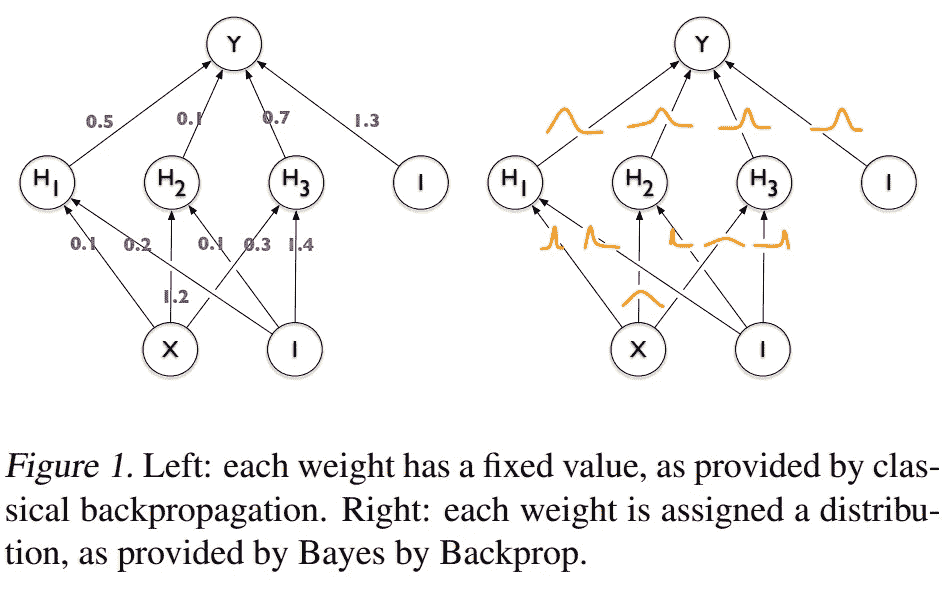

神经网络中的权重不确定性[1]。

当我们训练一个神经网络时，我们将最终得到权重的点估计值。然而，正如我们所讨论的，有多组权重应该能够合理且很好地解释数据。

为了捕捉模型权重中的认知不确定性，我们简单地将它们转换成概率分布。因此，我们不是学习这些点估计值，而是通过反向传播来学习这些分布的均值和标准差。

## 深潜

由于每个权重都被一个概率分布所代替，所以现在没有这样的单一值。为了进行预测或获得前馈值，我们需要从这些分布中抽取样本。

*   **1)** 样本来自网络的权重
*   **2)** 确定输出值
*   **3)** 更新平均值和标准差。

# 这个方案背后的数学

论文**神经网络中的权重不确定性****【1】**介绍了一种完成这项任务的方法**，称为反向投影贝叶斯**。关键思想依赖于著名的贝叶斯定理:

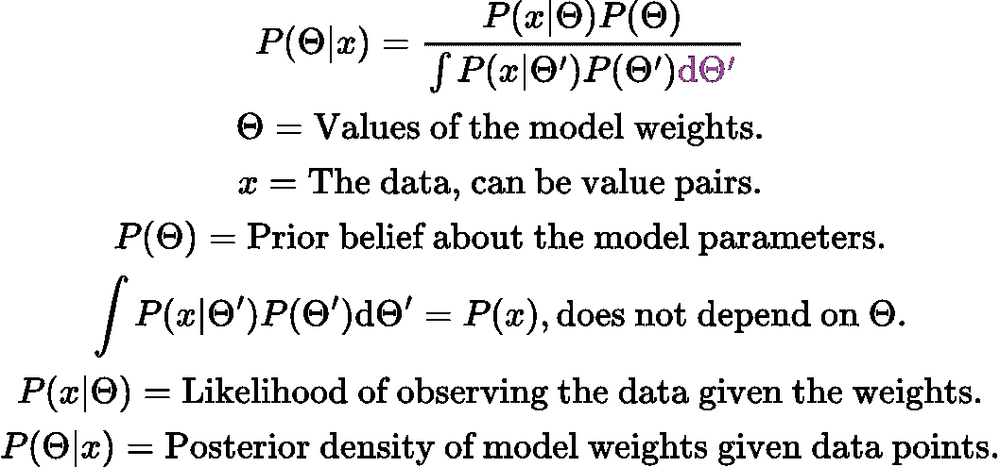

图片作者。

如果你替换分母，贝叶斯定理的最终形式可以写成:

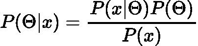

作者图片

贝叶斯定理使得**结合先验置信和似然**获得模型参数的分布成为可能，称为**后验分布。**

## 原则上的培训流程

1.  选择先前的分布
2.  确定可能性
3.  使用贝叶斯定理确定后验分布

然而，计算真实的后验概率是困难的，并且可能根本不可能，因为它包含复杂的积分。

**最后，我们的目标是得到模型权重的分布。**

# 变分贝叶斯方法

您可能已经注意到，分母包含一个复杂的积分来计算真实的后验分布。为此，我们需要近似后验分布。

变分贝叶斯方法试图用已知的分布来逼近真实的后验分布，具体称为变分后验分布。你可能认为用另一个函数逼近一个函数会有风险，因为逼近的函数可能非常糟糕。是的，这是真的，但是为了减轻这个问题，变分后验概率有一些参数。这些参数被调整，使得近似的一个应该尽可能接近真实的后验分布。


图片作者。

变分后验在这里用`phi`参数化。`Theta`代表权重，而`x`代表数据。

## 库尔贝克-莱布勒散度

凭直觉，这两个分布应该彼此接近。那么，我们如何衡量这一点？嗯，有一个指标叫做 **KL-Divergence，定义为**:

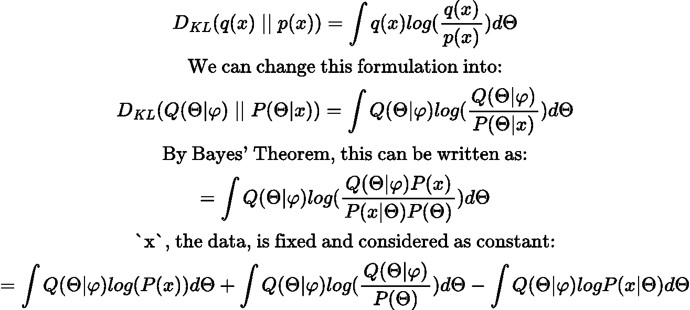

图片作者。

最后一个等式实际上告诉我们:

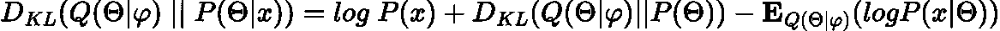

我们将第一个积分转换为`log(P(x))`，因为`Q(Theta | Phi)`是一个概率分布，积分为 1。

请记住，我们希望 KL 偏差尽可能低。所以现在，这是一个优化问题。因为`P(x)`是常数，我们可以忽略它。最终，我们只剩下这个等式:

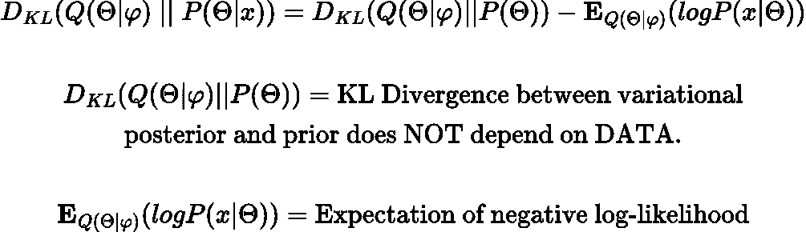

图片作者。

我们将会看到 NLL 的确切含义。但首先让我们总结一下，我们的损失函数是:

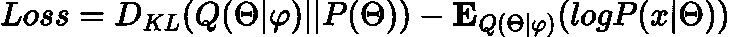

图片作者。

还有一件事我想提一下，我不会讨论它是如何得出的，但想展示一下**证据下限**或 **ELBO。**

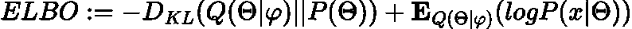

图片作者。

你可能已经注意到了， **ELBO** 是我们损失函数的负值。因此，最小化损失实际上相当于最大化 **ELBO。**

在一天结束时，我们希望先验和变分后验之间的 KL-Divergence 尽可能低，同时保持 T21 期望的可能性尽可能高。

# 贝叶斯神经网络中的反向传播

**回忆一下我们的损失函数:**

****

**图片作者。**

**因此，期望项意味着对负对数似然乘以每个参数进行积分。另一方面，我们有一个 KL 散度，这是另一个积分。跳过很多数学，如果我们把这些方程写成积分，我们将得到:**

**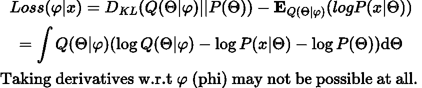**

**图片作者。**

> **天真地精确最小化这个成本在计算上是禁止的。相反，使用梯度下降和各种近似法[1]。**

**对`phi`求导涉及对`Theta`的积分，也就是模型权重。从计算的角度来看，这可能是非常昂贵的，甚至是不可能的！**

**一种方法是，我们可以改变这种期望形式，并应用蒙特卡罗近似法来计算 w.r.t `Theta`的导数。**

**现在我们有:**

****

**图片作者。**

**这个预期在计算上也有一些问题，因为底层分布依赖于`phi`。**

## **无偏蒙特卡罗梯度**

**解决计算复杂性问题的一种方法是使用**重新参数化技巧。****

**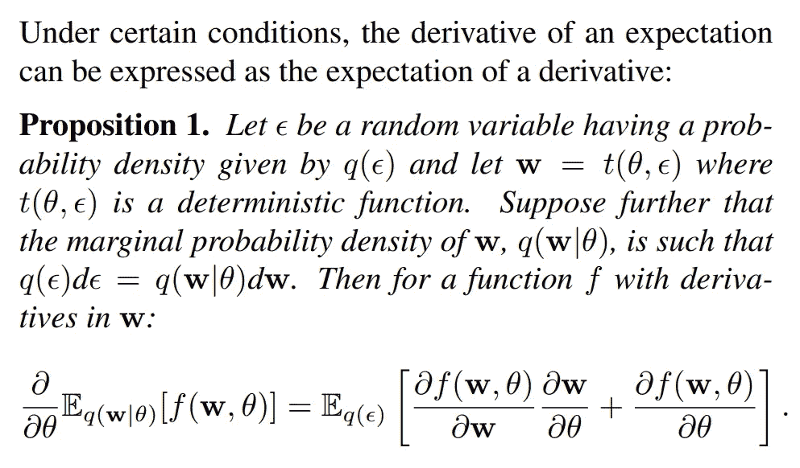**

**期望值的导数[1]。**

> **命题 1 是高斯重新参数化技巧的推广(奥珀和阿尚博，2009；金玛和韦林，2014；Rezende 等人，2014 年)— [1]**

**我不会在这里更深入，但简单地说，通过**重新参数化，我们试图将依赖性从** `**phi**` **移开，这样期望最终将被独立地获取。****

**如果你假设`Q(theta | phi)`，它是变分后验概率，**是高斯分布，**你将得到上图中的公式(*期望值的导数[1])。***

**所以，我们现在有了所有的片段。让我们将学习过程视为一个高层次的概述:**

**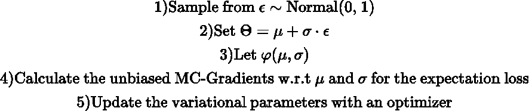**

**图片作者。**

# **迷你批次&重新加权 KL-散度**

**回忆一下我们的损失函数:**

****

**图片作者。**

**一种常见的方法是使用小批量，并对所有元素的梯度取平均值:**

**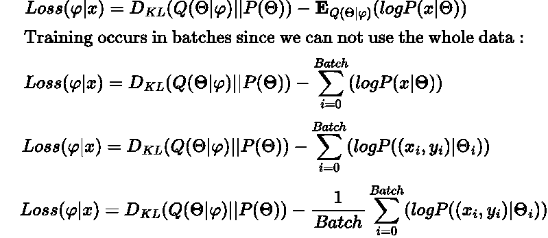**

***(BatchSize 写为*缩写 *)***

****右边的项由 TensorFlow 自动计算。**我们还需要重新权衡 KL 术语的权重，以便进行适当的培训。这可以通过以下方式实现**

****

**图片作者。**

**其中 **M** 为样本总数。默认情况下，TensorFlow 将始终对您训练的每个损失函数或模型的小批量中所有元素的损失进行平均。这也是 KL 背离需要重新加权的原因。从这个推导中可以看出，我们得到了真实 ELBO 物镜的无偏估计。**

**就是这样，这就是贝叶斯反推方法。现在是时候使用张量流概率来实现这一点了。**

# **使用张量流概率的重量不确定性**

## **致密变异层**

**我们所说的可以在`DenseVariational`层的帮助下实现。**

**该层有四个重要参数。该层具有:**

**`make_prior_fn` : Python 可调用函数取`[tf.size(kernel)](https://www.tensorflow.org/api_docs/python/tf/size)`、`[tf.size(bias)](https://www.tensorflow.org/api_docs/python/tf/size)`、`dtype`并返回另一个可调用函数，该函数取一个输入并产生一个`tfd.Distribution`实例。**

**`make_posterior_fn` : Python callable 取`[tf.size(kernel)](https://www.tensorflow.org/api_docs/python/tf/size)`、`[tf.size(bias)](https://www.tensorflow.org/api_docs/python/tf/size)`、`dtype`，返回另一个 callable 取一个输入，产生一个`tfd.Distribution`实例。**

**`kl_weight`缩放之前和之后的 KL 发散损失的量。**

**`kl_use_exact` Python `bool`表示应该使用解析 KL 散度，而不是蒙特卡罗(MC)近似。**

**那些解释摘自[的原始文献。让我们用例子来探究它们。](https://www.tensorflow.org/probability/api_docs/python/tfp/layers/DenseVariational)**

## **回归中的权重不确定性**

**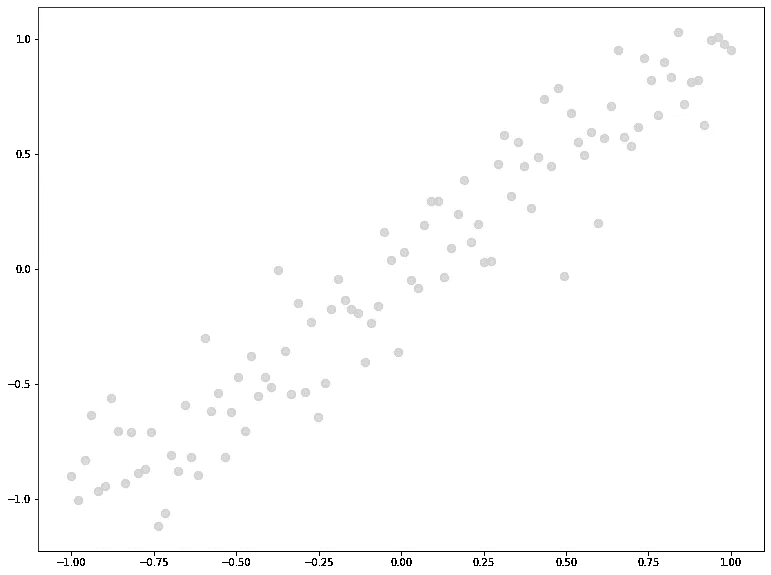**

**图片作者。**

**让我们通过反向传播算法实现我们在 Bayes 中描述过的`prior`和`posterior`函数。**

**`prior`和`posterior`函数的参数为`kernel_size`和`bias_size`。它们被添加并引用到我们想要学习的参数总数中。由于**这个先验是不可训练的，**当使用`Laplace`先验时，我们简单地返回一个`Sequential`模型的可调用对象。**先验是不可训练的，因为我们对分布的均值和标准差进行了硬编码。****

**`posterior`函数遵循相同的逻辑，但是我们现在使用`VariableLayer`来表示这将是可训练分布。而对于`params_size`，我们让 TFP 来决定为其修正形状，并选择正态分布作为后验。**

**到目前为止，我们的先验是拉普拉斯先验，后验是正态先验。这就是我们以前讨论过的**`**posterior**`**，即变分后验。******

****由于输出不是分布，我们可以用`mse`作为损失函数。换句话说，这个模型不能捕捉任意的不确定性。****

****`kl_weight`参数是我们在**迷你批次&部分讨论的加权 KL-Divergence 项。通过对 KL 项重新加权，我们将得到无偏估计。回忆公式(ELBO 目标):******

********

****图片作者。****

****`M`对应于数据集中元素的总数。所以在图层中我们设置了`kl_weight = x_100.shape[0]`。****

****我们也没有设置`kl_use_exact = True`。根据用于后验和先验的分布的选择，有可能解析地计算 KL 散度，并且如果它是并且解析解被登记在 TFP 库中，那么`kl_use_exact`自变量可以被设置为`True`。否则这将引发一个错误。这里我们用 MC 近似来计算。****

****你可能会问，在`model.compile()`我们把亏损设为`mse`而没有关于`KL Term`的东西？没错，KL 项是在使用这一层时由`model.add_loss`内部添加的。实际上，我们可以通过运行以下命令来查看 KL 项:****

```
**model_100.losses # Returns list.**
```

****这将提供:****

```
**[<tf.Tensor 'dense_variational/kldivergence_loss/batch_total_kl_divergence:0' shape=() dtype=float32>]**
```

****我们看到，我们不需要担心损失函数，唯一需要做的事情是设置`kl_weight`，它完成了。****

****我们已经完成了我们的模型和层规范，让我们看看摘要:****

```
**Layer (type)                Output Shape              Param #   
=================================================================
 dense_variational (DenseVar  (None, 1)                4         
 iational)                                                       

=================================================================
Total params: 4
Trainable params: 4
Non-trainable params: 0**
```

****输出形状是预期的，但是在正常情况下，我们只有 2 个参数，它们对应于问题 **y = ax + b.** 中的系数和 y 截距****

******问题还是一样。**但是现在我们学习权重和偏差的分布参数。在这种情况下，它们中的每一个都有一个均值和方差，**总共 4 个可学习参数。******

****现在，我们有一个权重和一个偏差项，因此在`mean()`和`variance`数组中有两个值。例如，后验方差的第一指数对应于权重分布的学习方差。****

****现在，每次向前传递都会给出不同的预测，因为我们是从权重的分布中取样的。也就是说，可以认为它是一个集成分类器。运行上面的代码，我们将得到:****

****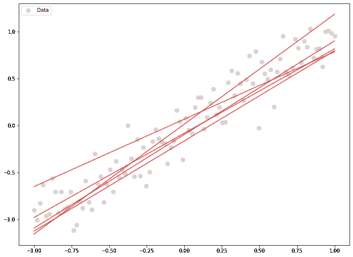****

****图片作者。****

****注意红线是如何**摇晃的。这些线是由模型在每次向前传递时生成的。不稳定的线条意味着在这种情况下认知的不确定性很高。**因为我们没有无限多的数据点，换句话说，我们的数据集是有限的，我们最终可能会有不同的权重值来很好地解释数据。****

****起初，**我们说过认知的不确定性可以随着更多的数据而减少。**我们来看看是不是这样。****

****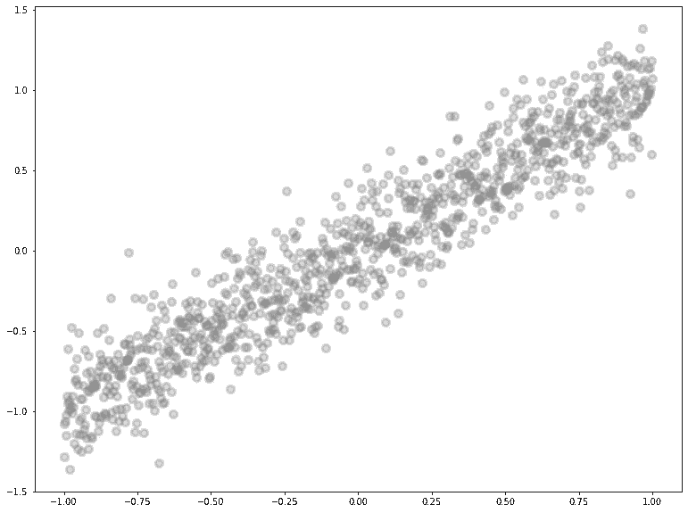****

****图片作者。****

****关系是相同的，但是这次我们有 1000 个数据点，而不是 100。型号配置也保持不变。我不会重复安装过程，因为它是相同的。当我们从新模型中取样时，我们会得到:****

****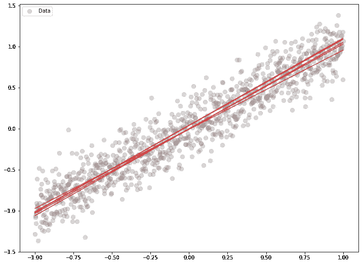****

****图片作者。****

****有一点要注意，现在这些线彼此更近了。我们可以用支线剧情来比较它们:****

****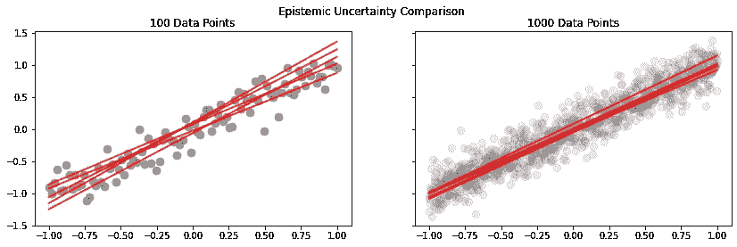****

****图片作者。****

## ****数据集大小的影响****

****我们得出结论，增加更多的数据会减少认知的不确定性，这可以从图表中看出。当认知的不确定性较小时，线彼此更接近。这是因为当有更多的数据时，我们就有更多的信息。****

## ****非线性回归中的权重不确定性****

****假设我们有这样的数据:****

********

****作者图片****

****让我们稍微改变一下我们的先验和变分后验。****

****现在，我们已经扩大了我们的先验，因为尺度是 2 的倍数。在我们的`VariableLayer`中，我们通过了`2 * n`,这意味着我们想要学习均值和标准差。这是以前由`params_size`完成的。****

****另一件事是在事后，我们已经缩小了我们的标准差。其他值可能比`0.003`更好。如果我们不缩小后验标准差，可能会有一些收敛问题。****

```
**Layer (type)                Output Shape              Param #   
=================================================================
 dense_variational (DenseVar  (None, 128)              512       
 iational)                                                       

 dense_variational_1 (DenseV  (None, 64)               16512     
 ariational)                                                     

 dense_variational_2 (DenseV  (None, 1)                130       
 ariational)                                                     

=================================================================
Total params: 17,154
Trainable params: 17,154
Non-trainable params: 0
_________________________________________________________________**
```

****现在，这一次层有非线性激活，其余的过程是相同的。我们指定我们的先验和后验函数，并重新加权 KL 项。****

****但是，我们需要训练这个模型更长的时间，因为它的工作更难。****

****为了绘制输出，我们从模型中提取前馈输出 5 次。****

****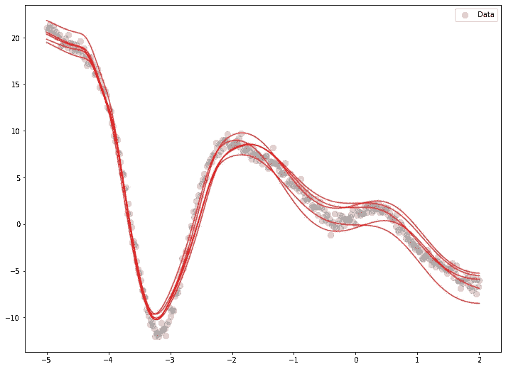****

****图片作者。****

****如我们所见，我们有合理的路线。通过调整变分后验概率可以改善结果。****

****在下结论之前，我想提一下变分后验概率的选择会影响模型的总参数。在这种情况下，如果我们将后验概率转换为多元高斯分布**,那么模型总结看起来就是这样:******

```
**Layer (type)                Output Shape              Param #   
=================================================================
 dense_variational_3 (DenseV  (None, 128)              33152     
 ariational)                                                     

 dense_variational_4 (DenseV  (None, 64)               34093152  
 ariational)                                                     

 dense_variational_5 (DenseV  (None, 1)                2210      
 ariational)                                                     

=================================================================
Total params: 34,128,514
Trainable params: 34,128,514
Non-trainable params: 0
_________________________________________________________________**
```

****这是因为现在我们知道了:****

*   ****平均****
*   ****标准偏差****
*   ****协方差****

****这在这个模型中计算量很大。****

# ****结论****

****在这篇文章中我们已经看到:****

*   ****普通神经网络的问题****
*   ****贝叶斯神经网络的核心思想****
*   ****变分贝叶斯方法****
*   ****迷你批次和重新加权 KL 散度****
*   ****致密变异层****

****你可以在这里找到完整的笔记本和代码。****

# ****后续步骤****

****在接下来的文章中，我们将只专注于编写包括卷积层的模型，以及捕捉认知和任意的不确定性。****

# ****参考****

****[1]:查尔斯·布伦德尔，朱利安·科尔内比斯，科雷·卡武克库奥卢，金奎大·威斯特拉，[神经网络中的权重不确定性](https://arxiv.org/pdf/1505.05424.pdf)，2015****