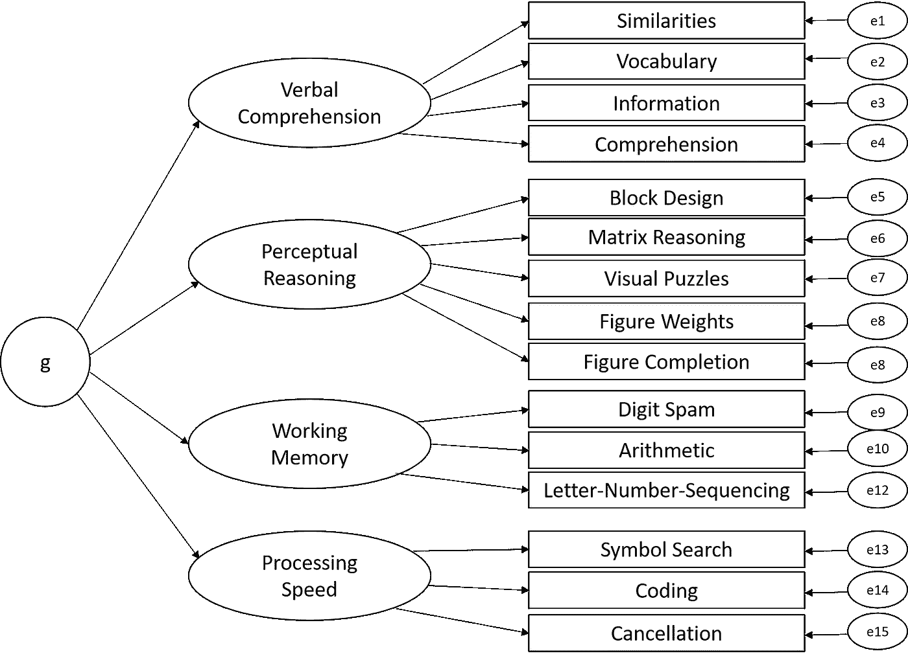
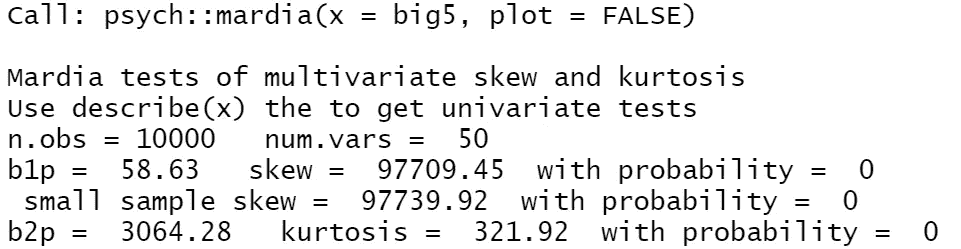
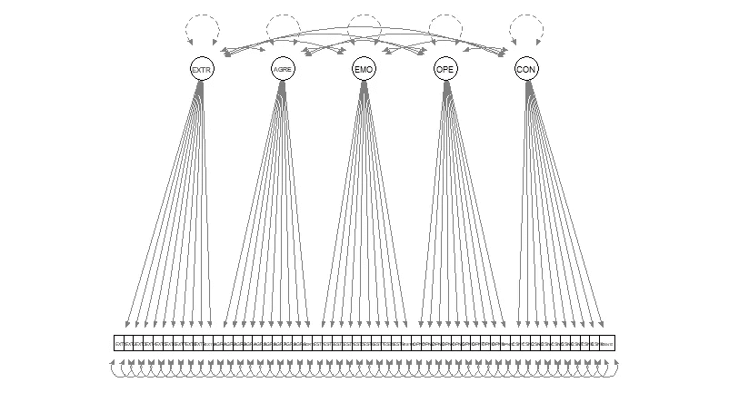

# 用《R》中的拉旺揭示人格的潜在结构

> 原文：<https://towardsdatascience.com/uncover-the-latent-structure-of-personality-with-lavaan-in-r-aaf66fc2cc81>

# 用《R》中的拉旺揭示人格的潜在结构

## 使用结构方程模型(SEM)揭示数据中隐藏的关系


图片来源: [Kévin 和 Laurianne Langlais](https://unsplash.com/@laukev?utm_source=unsplash&utm_medium=referral&utm_content=creditCopyText) on [Unsplash](https://unsplash.com/?utm_source=unsplash&utm_medium=referral&utm_content=creditCopyText)

对心理学家来说，最具挑战性的任务之一是预测人们的行为。因为我们是一个非常复杂的物种，这需要了解是什么让一个人滴答作响——一些实际上仍然隐藏的东西。从统计学上来说，我们可以通过结构方程模型(SEM)来推断潜在的关系，这是一套统计方法，如果你被迫间接地而不是直接地对多个因果关系*建模，这种方法尤其有用。例如，虽然直接测量身高和体重来表征生理形状(例如大象的大小)自然是可能的，但我们必须依靠指标(例如任务)来评估一个人的潜在智力。正如人们通常所说的那样，智力是分层结构的，可以分为多个维度:一般智力(g 因子)是该结构中最抽象的部分，因为它预测了更多的具体因素，如一个人的个人推理能力、处理速度、记忆广度等。反过来，这些子因素使用特定的任务来近似。因此，这些任务表现是其潜在结构的指标，并包括一个误差项(例如，个人的日常表现)。例如，这就是韦克斯勒成人智力量表第四版模型(WAIS-V)的建模方式(本森，胡拉克&克朗兹勒，2010 年) :*



> *免责声明:所有图片均由作者创作，除非另有说明。*

一旦我们的工作远远超出探索性分析，我们共享的知识就必须用于确认任何新开发的测试的有效性:例如，智力的共同结构在不同的智商测试中是否适用？这应该是因为我们用不同的测试来测量相同的概念，所以人们在智商测试 A 中的表现应该与他们在智商测试 b 中的表现相关联。我们事先形成的层次结构必须在数据中有所体现，或者可能发生了一些可疑的事情——要么是我们的测量设计——或者是理论模型因为与数据不一致而需要修改。如果你像我一样对数据科学充满热情，你可能已经听说过探索性因素分析(EFA ),它用于调查我们样本中的隐藏因素，在这种情况下，我们让数据自己说话。相比之下，结构方程模型，尤其是验证性因子分析(CFA)的特点是一种更具演绎性的方法:为了证实一个理论结构，你需要预先指定潜在因子的数量和加载模式，通常是在对试点样本进行 EFA 之后。通常，我们甚至可以运行关于所研究现象的潜在结构的多个模型，以找出哪些模型得到了数据的最有力支持。从技术上讲，这是通过协方差矩阵来证明变量之间的接近程度。您可以将协方差视为一种非标准化的相关性。它表示变量在其测量范围内彼此线性相关的程度。如果在数据集中使用不同的尺度(例如，年龄和智力)，为了使它们更容易解释，它们可以很容易地转换成相关性，这是一种标准化，将在以后为我们服务。但首先，假设的结构(例如，智能模型)将用于模拟我们理论上可以预期的协方差矩阵——这是我们估计的人口协方差矩阵。当将模型与从实际样本数据(例如，测量的测试分数)中提取的协方差矩阵进行比较时，我们可以了解模型的拟合情况。因此，我们在某个模型下可以预期的相互关系与在数据中观察到的相互关系进行比较——它们有多一致？它们越接近，拟合越好(Ullman，2006)。

# 人格五大要素

大多数人可能会松一口气，因为到目前为止，你不仅由你的智力来定义，还由描述你作为一个人的其他属性来定义:你的个性由你的行为、感觉和思考方式来表现。为了从数字上比较人们的个性，我们需要用量表上的项目来量化它。通过这种方式，我们可以尝试使用这种评估来为人们匹配合适的工作或指导个人发展。但是像“人格”这样的东西首先是如何构建的呢？鉴于一个人的典型模式中有如此多的细微差别和方面，我们如何将其分解为一个简短但精确的描述呢？

Art Woman GIF by Sterossetti via [GIPHY](https://giphy.com/gifs/face-sterossetti-double-face-mBqQdEeTakrKCRgypN)

幸运的是，我们不是第一个提出这些问题的人:在过去 20 年的心理学研究中，五个不同的维度已经成为人格的普遍模式——通常被称为**人格的五大**(John，Naumann & Soto，2008):

1.  **开放性**——也被称为智力或想象力；描述一个人对新的经历、体验和印象感兴趣的程度(以及参与的程度)。开放的人善于探索，有很多幻想，经常寻找智力灵感。
2.  责任心——描述一个人在追求目标的过程中控制自己行为的程度。有责任心的人往往组织良好，注重细节，可靠。
3.  **情绪稳定** —也叫神经质；描述了一个人对自己情绪的脆弱程度。情绪稳定的人是稳定的，很少紧张或焦虑，能够在紧张的情况下保持姿势。
4.  **宜人性** —描述一个人对和谐关系的关注程度。令人愉快的人是友好的，有同情心的，合作的，能够减少冲突。
5.  **外向性**——描述一个人的社交、友好、冒险和活跃程度。外向的人容易与人交往，喜欢刺激，而且相当健谈、精力充沛和乐观。

这是基于所谓的词汇法，即在每一种语言中，对人的描述都会自然地表现出来，例如害羞、多产、快乐、善于操纵等等。通过要求参与者使用这些形容词来评价一个已知的人，研究人员收集了数千个数据点，使用探索性因素分析将个性空间分成不同的维度。

即使这五个因素被普遍接受，关于普遍人格特质的确切性质和结构仍然存在争议。例如，人格维度是否有更高阶的因子，就像智力有 g 因子一样？真的只有五种性格因素或者更多吗(就像 HEXACO 模型的支持者争论的那样)？如果存在某些真实的人格维度，那么在多大程度上是由以特定方式回答问卷的倾向造成的？与此相关的是，调查问卷真的首先揭示了人格的真相吗？

正如你可能猜到的，关于人格的潜在结构，有很多问题仍然没有答案。最后一个问题给我的印象最深:我们真的可以依靠自我报告来评估人类性格的各个方面吗？设计用来测量在我们的社会中被积极评价的特征(例如，外向性)的问卷被批评为自然地唤起社会期望的答案。因此，由于这些设计上的缺陷，人们倾向于根据自己的实际行为给自己比预期更好的评价。即使有最好的意图，人们也会让自己在纸上看起来比实际上更好。在所谓的高风险情况下(例如，工作面试、关于约会应用的问题)，这甚至更极端，在这种情况下会有很多输赢。好吧，如果 a)所有人都在相同程度上“假装”他们的反应，并且 b)这不会影响对他们在不同条件下行为的预测，这就不是什么大问题了。例如，如果一个脸皮薄的求职者曾经假装情绪特别好，但却暴露在一个艰苦的工作环境中，这对求职者和雇主来说都是一个双输的局面。但不幸的是，这正是实践中发生的事情(Ziegler & Bühner，2009)，聪明人特别擅长这一点(Geiger，Olderbak & Wilhelm，2018)。但是，即使人们没有故意撒谎，测试的构造方式也很难准确客观地报告他们在现实生活中的行为。除了社会期望之外，人格问卷上的答案还会受到一系列其他偏见的干扰，比如短暂的情绪状态、陈述的模糊性以及关于人格的隐含理论(例如:*“聪明的人通常都很内向，所以如果我是一个思维敏捷的人，我也一定是一个更冷静的人。”*或*“静水流深。”*)。在这个案例研究中，我将向您展示如何测试涉及这些主题的假设，并演示如何用 r。

# 数据集

为了保持之前介绍的五因素模型，我们将使用在 [kaggle](https://www.kaggle.com/tunguz/big-five-personality-test) 上找到的五大数据集。它包含了由*开放心理测验* [在线](https://openpsychometrics.org/tests/IPIP-BFFM/)收集的超过一百万(1015342)个答案。这个开源[平台](https://openpsychometrics.org/about/)为发展目的提供免费的个性评估。据该网站称，用户事先同意为科学目的匿名收集和存储数据。

具体来说，我们将关注的测试被称为*大五因素标记*，它是由 [Goldberg](https://doi.apa.org/doiLanding?doi=10.1037%2F1040-3590.4.1.26) (1992)开发的。它包括 50 个问题(每个人格维度 10 个)，参与者用 5 分制的李克特量表给自己打分，1 分代表完全不同意，3 分代表中性回答，5 分代表完全同意。这些是问题:

**EXT =外向**

*   我是派对的灵魂。
*   EXT2 我话不多。
*   EXT3 我觉得和人在一起很舒服。
*   EXT4 我留在后台。
*   我开始对话。
*   EXT6 我没什么好说的。
*   我在聚会上和许多不同的人交谈。
*   我不喜欢引人注意。
*   我不介意成为关注的焦点。
*   我在陌生人面前很安静。

**EST =情绪稳定**

*   EST1 我很容易紧张。
*   EST2 我大部分时间都很放松。
*   我担心事情。
*   EST4 我很少感到忧郁。
*   我很容易被打扰。
*   EST6 我很容易心烦。
*   EST7 我的心情变化很大。
*   EST8 我经常情绪波动。
*   我很容易被激怒。
*   我经常感到忧郁。

**AGR =宜人性**

*   我很少关心别人。
*   AGR2 我对人感兴趣。
*   AGR3 我侮辱人。
*   AGR4 我同情别人的感受。
*   AGR5 我对别人的问题不感兴趣。
*   AGR6 我有一颗柔软的心。
*   我对其他人不感兴趣。
*   AGR8 我为别人抽出时间。
*   AGR9 我感受到别人的情绪。
*   AGR10 我让人安心。

CSN =责任心

*   我随时准备着。
*   我把我的东西到处乱放。
*   CSN3 我注重细节。
*   我把事情搞得一团糟。
*   我会马上做完家务。
*   我经常忘记把东西放回原处。
*   CSN7 我喜欢秩序。
*   我逃避我的职责。
*   我遵循时间表。
*   我对工作要求严格。

**OPN =对新体验持开放态度**

*   我有丰富的词汇。
*   我很难理解抽象的概念。
*   我有丰富的想象力。
*   我对抽象的想法不感兴趣。
*   我有极好的主意。
*   我没有好的想象力。
*   我理解事物很快。
*   OPN8 我用难词。
*   我花时间反思事情。
*   我满脑子都是想法。

作为第一步，让我们将数据读入我们的工作环境，并为随后的分析做准备:我们将删除不完整的案例，只选择人格变量。因为我们有如此庞大的数据集，以至于大多数机器无法真正通过计算来处理，所以我们必须将样本大小减少到 10，000 个观察值。这是一个任意的数字，我选择它在我自己的计算机上工作。此外，一些反应是消极的，例如。*“我很容易紧张”*并不代表一个情绪稳定的人，恰恰相反*。*因此，我们需要以这样一种方式反向记录它们，即根据测试的[评分键](https://ipip.ori.org/newBigFive5broadKey.htm)，强一致性理论上应该降低一个人的分数。所以，容易紧张的人更容易情绪不稳定。我们可以使用% > %运算符将所有这些预处理步骤包装在一个方便的 dplyr 结构中，如下所示:

现在的数据实际上是什么样的？让我们使用 skirr-package 来获得一些描述性的统计数据。

```
# get some descriptives
skimr::skim(big5)
```

右边的小直方图揭示了很多关于人格陈述的所谓第*项难度*的信息——每个陈述引发强烈一致的难易程度如何？例如，我们可以看到项目 EXT9 的分布非常平坦— *“我不介意成为关注的焦点。”*这意味着(稍微)同意的人与(稍微)不同意的人数量相当，从而在整个评定等级中有较大的分布。与此相关的是，回答者似乎不清楚这个问题是否有正确或错误的答案，从而使他们更难自发地做出反应。我们无法真正地对造成反应巨大差异的机制做出任何结论，因为我们无法通过实验来检验我们的假设，但我们可以假设，这可能归因于随机猜测或个体之间的真实差异。item est 3(*我担心的事情*))另一方面是强烈向右倾斜的——因为该项目是反向编码的，较低范围内的高密度响应意味着同意的人比不同意的人多，从而使担心事情成为人们通常涉及的属性。基于频繁的约定，这种自我描述似乎比较正常而不是例外。人们似乎总体上非常关心！

# 模型假设

在我们开始实际分析之前，让我们检查一下我们是否满足 SEM 分析所需的所有假设。首先，结构方程分析只能处理大量数据。以下是一般的经验法则:我们需要 200 个以上的观测值(但实际上不少于 400 个，尤其是当观测变量不是正态分布时)或 5-20 倍的待估计参数，以较大者为准(例如，Kline，2005，第 111、178 页)。为了根据模型的复杂性选择合适的样本量，我们也可以简单地计算模型估计的参数数量:为了找出答案，我们采用方差和协方差，其中 p 是测量变量的数量。因为我们总共有 5*10 = 50 个测量变量，所以有= 1275 个参数(50 个方差和 1225 个协方差)要估计。为了获得模型的可靠估计，必须有比要估计的参数更多的数据点，这在我们的例子中是真实的，因为 10.000 超过 1275。从统计学上讲，这是一个关键点，归结为*模型识别*，定义为模型中每个参数的唯一数值解。如果你的数据点少于模型中的参数，lavaan 会给你一个错误，因为你的模型是*欠识别*，参数无法估计。如果数据点的数量与模型中参数的数量相同，则您的模型是*刚刚确定的*，因此参数完美地再现了样本协方差矩阵，并且任何检验统计量为零。为什么？只有当您能够将样本的协方差矩阵与估计的总体协方差矩阵进行比较时，您才能测试您关于模型适当性的假设-但是，如果由于没有足够的数据进行模拟，它们首先完全相同，则测试统计将变为零，并且无法解释。这就是为什么你需要一个*超过确定的*模型，在这种情况下，你有比参数更多的数据点需要估计。除了模型识别，多元正态性是对 SEM 的另一个要求。我们可以通过运行 psych 包中的 mardia()来测试它:

```
# Mardia test of multivariate normality
psych::mardia(big5, plot = FALSE)
```



输出中有两个估计:多元偏斜的 mardia 估计的 b1p 和多元峰度的 mardia 估计的 b2p，其中的可以间接指示变量是否正态分布。对于多元正态性，偏度和峰度统计的 p 值都应大于 0.05。我们的数据不是这样的。我们可以看到两个 p 值(表示为概率)都为零，因此我们需要拒绝多元正态性。plot 参数通常会给出一个很好的图，允许您立即检查任何异常值，但是因为我们有如此多的数据点，R 无论如何都不能显示这个图。然而，多元正态性尤其与最大似然估计密切相关，你可以在此处阅读，因此，为了克服这个问题，我们可以使用更稳健的 ML 版本，它受违反正态性的影响较小。

# 模型设定

终于到了介绍[拉旺](https://lavaan.ugent.be/tutorial/index.html)的时候了！它是由 Yves Rosseel、Terrence D. Jorgensen 和 Nicholas Rockwood 在众多贡献者中开发的一个神话般的用于潜在变量分析的 [R-package](https://cran.r-project.org/web/packages/lavaan/lavaan.pdf) ，现在我们将使用它。

让我们测试一下，假设的经典结构是否适用于这个样本。我们假设允许五个不同的维度相互关联，并且具有仅加载到其各自维度上的指标，即之前已经介绍过的每个特征 10 个项目。这是模型的图形表示:



为了让你更容易地阅读这样的路径图，这里有一个关于 SEM 惯例的指南:我们实际上可以测量的一切，所以观察到的变量，指标，或显式变量用正方形或矩形表示，所以底部的小盒子。出于数学原因和减少测量误差，所有因素都必须有两个或更多指标。这些因素被称为潜在变量，结构，或未观察到的变量。它们通常用圆形或椭圆形表示。线表示变量之间的关系——所以如果没有这样的线连接变量，这意味着没有直接关系被假设。线条有一个或两个箭头:有一个箭头的线条表示两个变量之间的假定直接关系。两端带箭头的线表示两个变量之间的协方差，没有隐含的影响方向。外向性、宜人性、情绪稳定性、责任心和开放性是我们例子中的潜在变量，这些变量预计会相互协变。每个特定项目(例如，EXT1-EXT10)通过它们各自的因子(例如，外向性)直接预测。我们无法直接观察一个人在回答调查时内心在想什么，以及这与他们的个性有什么关系，但心理测量文献中有一些理论上的考虑，可以帮助我们理解其中的逻辑:根据项目反应理论(IRT)模型，我们可以从一个人对测试项目的反应来估计他的特质。所以从理论上来说，一个非常外向的人可能会相应地给项目 EXTi 很高的评价，因为这个人在潜在特质上的地位预测了他们的反应。这是因为强烈认同，比如说“*我在人们身边感觉很舒服*”的概率应该随着外向性水平的增加而线性增加(Brown，2017)。因此，我们能做的最好的事情就是把这些反应作为人格特征的指标，即使我们不能直接测量它们。很明显，我们不能在这里做一个完美的工作:请注意，在路径图中有一个指向每个指标的双箭头:这表示误差项，或剩余方差，它描述了未被相应因子考虑的方差的数量。从更普遍的角度来看，将测量变量与因素联系起来的模型部分被称为测量模型，即每个项目被分配到一个人格维度的方式。如果我们想简单地估计这个测量模型，并测试它与数据的兼容性，我们经常运行验证性因素分析，这是某种类型的结构方程模型。结构之间的理论关系，即人格维度之间的协方差，称为结构模型。为了告诉 lavaan 我们在模型中期望的结构，我们需要在运行验证性因子分析之前指定特定的语法。

因为我们的模型中有相当多的变量，我发现键入所有变量非常繁琐，所以我定义了一个智能函数来帮助我们完成这项工作:它采用某个缩写(例如 EXT 代表外向性)来从数据集中选择所有匹配的变量名，将它们折叠成一个字符串，并在中间添加空格和“+”号。这样，我们已经准备好了定义潜在变量的显式变量的部分，并可以简单地将其粘贴到语法中。

一般来说，lavaan 是这样理解模型的:

幸运的是，lavaan 已经假设所有的潜在变量都是相关的，所以除了度量模型之外，我们不需要在这里指定这一点。

现在我们需要做的就是在我们的模型语法上运行`cfa()`函数。我们将 st.lv 设置为 TRUE 以标准化我们的潜在变量——这样所有的潜在方差都固定为一，并且更容易解释，因为因子负荷将更容易解释。估计的目标是最小化非结构化协方差矩阵(实际数据)和结构化协方差矩阵(预测)之间的差异。我们使用“MLM”作为我们的估计量，这是一个具有稳健标准误差和萨托拉-本特勒标度测试统计的最大似然估计。想了解更多关于 lavaan 可用的估算器的信息，你可以点击链接[这里](https://lavaan.ugent.be/tutorial/est.html)。

实际上，最大似然估计不推荐用于有序数据(例如，从 1 到 5 的李克特量表)，因为它们违反了正态假设，正如马迪亚检验对我们的数据所建议的那样。因此，像对角加权最小二乘法(DWLS)这样没有分布假设的估计量会更合适。它与 ADF 估计器相关，但计算强度较低(Newsom，2018)。然而，有一些反对使用它的论点:首先，我们将无法将我们的结果与后来的文献进行比较，因为大多数关于五大潜在结构的研究传统上使用最大似然估计(例如，参见 Ashton，2009)。即使不同的大五人格测试和研究设计之间的比较也肯定不是完美的，测试统计数据之间可怕的巨大不匹配可能表明有问题。通过使用 DWLS 估计，我们就不会有这样的参考。虽然这不是最有力的论据，但一些作者认为，如果有大量的观测数据，李克特尺度的数据可以被解释为连续的。10.000 个病例确实可以被认为是一个大数据集，允许最大似然估计的稳健版本。第三，石和 Maydeu-Olivares (2019)已经表明，估计量本身对拟合度有巨大的影响，即使相同(！)使用的数据可能会让您对模型的性能产生有偏见的印象。作者建议对比较适合指数(CFI)或近似均方根误差(RMSEA)等常用指标使用不同或限制较少的临界值，或者直接使用标准化均方根残差(SRMR)，因为它对用于估计的方法最稳健。因此，我们使用稳健的最大似然估计，同时牢记我们关于拟合指数的知识。

# 模型评估

通过在我们的模型对象中运行`summary()`函数，我们得到了一个详细的模型输出。我们设置 standardized = TRUE 以获得对潜在变量更有意义的估计，并设置 rsquare = TRUE 以了解我们的模型实际上可以解释参与者反应的程度。我们设置 fit.measures = TRUE 来获得除卡方估计之外的更多 fit 统计数据。

Lavaan 正常结束，没有抛出任何错误信息。输出简洁地总结了我们有 10000 个观察值和 110 个模型参数，并使用了最大似然估计。现在我们可以比较“我们的”模型和基线模型之间的测试统计数据。你可能已经猜到了，这是一种假设检验。基线是一个零模型，这意味着所有的协方差都固定为零，因此在这种情况下，项目将相互独立，并随机协变。为什么我们会对这么差的模型感兴趣？因为这样我们就可以把我们的模型和一个协方差矩阵进行比较，当机遇单独运行时，可以预期这个协方差矩阵。它也是与您的拟合模型进行比较的基线，以便计算模型拟合的相对指数(例如，CFI 或 TLI)。为此，卡方统计用作模型拟合的指标，并且是表示结构化/模型特定和非结构化/观测协方差矩阵之间的差异的最小可能值的度量。输出中的 p 值表示预测模型是否与观察到的数据一致，换句话说，它测试模型与数据的协方差矩阵之间的差异是否可能只是偶然自然出现的(零假设)。与您可能熟悉的假设检验不同，这是我们真正想要的。因此，更大的概率值(p > .05)实际上支持我们的模型，因为你不必拒绝零假设。严格地解释，小的 p 值因此表明我们的模型不适合数据，因为估计的样本协方差矩阵和估计的总体协方差矩阵显著不同。然而，很难找到两个协方差矩阵完全一致的情况，因此这是一个不合理的基准。此外，卡方估计对样本大小非常敏感，因为大量的观察夸大了模型和样本协方差矩阵之间的估计偏差，因为该值乘以 N-1。随着样本大小(N)的增加，差值也增加。单独解释这个值没有多大意义，因此通常使用其他更具信息性的拟合指数，这些指数利用了卡方估计。让我们快速浏览一下其中的几个:我们将比较适合指数与绝对适合指数区分开来。比较拟合指数是模型拟合的相对指数-它们将您的模型与空模型(上面的基线模型)的拟合进行比较。例如，比较适合指数(CFI)或塔克-路易斯指数(TLI)表示您的模型与 0.95 以上的值传统上表示良好适合(Hu & Bentler，1999)的一致程度，然而这些适合指数可能无法跨学科进行比较。另一方面，绝对拟合指数将模型的拟合与完美拟合模型进行比较，因此在这种情况下，模型在预测协方差矩阵时不会出现任何错误。近似的均方根误差(RMSEA)是这样一个指标，其值低于 0.06 表示“良好拟合”。但是因为 RMSEA 倾向于过度惩罚小样本(N < 150) which is makes the SRMR a better candidate to indicate absolute model fit, among its robustness against model misspecifications (Shi & Maydeu-Olivares, 2019). In our example, the robust versions of the CFI and TLI amount to 0.75 and 0.74, respectively. The TLI estimate from our actually comes really close to an empirical average value of 0.73 — a result from a meta-analysis from Chang, Connelly & Geeza in which the authors aggregated different studies on the model structure of the big five (e.g., correlated traits, a single method). The RMSEA probably lies somewhere between 0.063 and 0.064 which indicates an acceptable but not very good fit. In the section on latent variables, we can see the extent to which the items load on their expected latent variable. We focus on the Std.all column — it is standardized because both latent and observed variables have a variance of one. For example, the standardized loading of AGR4 on agreeableness is 0.76, so if you take the response to “*我同情其他人的感受*。”，这很好地指出了一个人在社会交往中追求和谐的程度(这并不奇怪！).我们的潜在变量不应该是正交的，也就是说，它们可以协变。Std.all 列可以解释为给定我们的模型的潜在变量之间的估计相关性，这里我们有从 0.02(宜人性-情绪稳定性)到 0.35(外向性-宜人性)的小至中等值。请注意，在方差:部分中，输出是残差方差的估计值，因此剩余方差不是由预测器解释的。因此，较大的值可能表明这些项目可能与其他影响混淆，例如，以陈述“*我侮辱人*”为例。“(AGR4):这种反应的逆转可能不会直接转化为宜人性，但可能也衡量了对他人的厌恶程度。看看下面的 r 平方值，我们可以看到显式变量中的估计总方差由它们各自的潜在变量来解释。例如，潜在的情绪稳定性解释了对 EST1 *(“我很容易紧张*)的反应变化的大约 48%，所以不到一半。").

顺便说一下，如果您想快速访问对您最重要的适合指数，您可以键入以下内容:

但是请注意，这些指数与汇总函数的输出并非 100%相同，而是非常接近，即使我们采用标准(不稳健)版本的 CFI 和 RMSEA。老实说，我不知道这是从哪里来的。你知道吗？请写在下面的评论里。

# 模型修改

一些人建议寻找所谓的修改指数，以测试模型上的有益变化是否被忽略了。例如，如果您调用`modificationindices(big5_cfa, sort = TRUE)`，您将得到一个表格，其中包含如何修改语法的建议(例如，添加基于样本协方差矩阵的回归)以提高模型拟合度。通过将 sort 参数设置为 TRUE，首先获得对卡方估计影响最大的修改。尽管如此，如果你是机器学习的粉丝，这个过程应该敲响警钟:这听起来像是让你的模型过度适应你的数据！一旦你对你的模型做了大量事先没有计划的修改，你的验证性分析就变成了探索性分析。如果你意识到这种变化，报告你决策过程中的每一个细节，并确保只包括从理论角度看有意义的术语，这是很好的。在我们的例子中，输出建议用一个衡量责任心的单一指标来定义情绪稳定性，这完全是胡说八道。一个更安全的方法是，根据我们对问卷的一点怀疑，互相测试似乎合理的模型，这就是我们现在所做的。关注人格问卷的偏见并不新鲜，因为应用研究人员长期以来一直担心答案可能会被使用自我报告带来的共同差异所污染。想法如下:所有潜在的变量(例如，外向性、宜人性等。)是否*不仅*受到随机测量误差的干扰(这是我们根据数据的性质所预期的),还受到与问卷本身相关的系统偏差的干扰。我们的实质性变量可能被一个共同的不可测量的因素所污染，这个因素对所有变量的影响程度相似。为了对公共方法因素(CMV)进行建模，我们必须从经典测试理论中借用一些知识:因此，测试分数(例如，针对个性陈述的答案)可以被理解为一个人的真实分数和测量误差的总和。这种误差被认为是由于随机或非系统的影响。但也有一些情况下，测量误差可能是不同的:一个非随机的影响，可归因于环境(如填写在线调查)和人之间的结合。这种所谓的虚假测量误差(Schmidt，Lee and Ilies，2003)并不总是发生，而是在相同的情况下发生，因此可以被视为系统性的。该误差增加了项目之间的相关性，而不管它应该测量的特性，它不能与真实的分数方差相区分。因此，CMV 也增加了性状之间的相关性，因为这是所有项目共有的方差。这不是我们想要的，因为它看起来好像潜在变量以一种有意义的方式相关，但如果它们实际上不是呢？

我们可以将常用方法方差理解为虚假测量误差，可以使用 SEM 将其建模为潜在变量(Podsakoff，MacKenzie，Lee and Podsakoff，2003)。这种常见的方法差异归结于数据的测量方式，与试图测量的内容无关，因此我们将 CMV 定义为所有项目的基础因素，而不管它们应该测量的人格维度，而它与实际的人格维度无关。因此，CMV 包括所有的显式变量，我们需要通过将`EXTRA + AGREE + EMO + OPEN + CON ~~ 0*CMV`包含到我们的模型语法中来使它与我们的五大变量正交。

好的——也许包含 CMV 因素的模型对数据提供了更好的解释？在进行一对一的比较之前，我们先来看一下总结。

就像我们经典的 big five 模型一样，卡方统计表明我们的基线模型和用户模型都不符合数据，但正如前面所讨论的，由于其对样本大小的敏感性，这本身并不是模型拟合的良好指标。随着 CFI (0.79 比 0.75)和 TLI (0.77 比 0.74)的增加，我们的拟合优度指标提出了比原始模型更好的模型拟合。类似地，拟合差指标也指向类似的方向，因为 RMSEA (0.065 比 0.064)没有显示出相对于原始模型的改进。然而，SRMR (0.062 对 0.075)已经下降，我们应该特别重视这一指数，因为它已被证明是最稳健的模型错误设定(施和 Maydeu-Olivares，2019)。有趣的是，我们在项目和我们的个性变量之间的标准化因素负荷已经下降到一个中等程度，这表明共同方法的差异可能解释了一部分参与者的反应。因为我们对这种方法因素扭曲人格维度之间关系的程度感兴趣，所以我们对协方差部分特别感兴趣。似乎在包括 CMV 因素后，人格变量之间的相关性或多或少消失了，这说明了首先它们可能是由反应偏差(例如，在纸上使自己成为一个更好的人)导致的假设。有一个例外:情绪稳定性和责任心之间的相关性下降了一个可以忽略不计的量(0.23 比 0.25)，这表明一个人的神经质程度和他们的勤奋程度之间的关系没有受到常见方法因素的严重影响。基于我们的 r-square 输出，我们可以看到，我们的模型解释的项目响应的估计方差总体上对一些项目有所改善，但对其他项目保持不变。然而，在这种情况下，有一些限制因素会影响对常用方法方差因子的解释:实际上，多性状多方法(MTMM)因这类问题而臭名昭著(例如，Chang，Connelly & Geeza，2012)，因此更先进的研究设计利用不同的方法(例如，外部报告与自我报告)作为控制条件来提取真实的人格差异，这种差异应独立于它们的来源。例如，一个真正富有想象力的人应该被自己和他人同等地评价。我们没有这样的控制条件，因此我们不能明确地告诉我们的 CMV 因子的性质。例如，一些研究人员认为，我们可以将 CMV 因子捕捉到的差异归因于反应偏差，但也可以归因于更高阶人格因子的存在，类似于智力的 g 因子(这将使你成为一个“超级”人，有关评论，请参见 Ashton et al . 2009Chang 等人，2012 年或 McCrae 等人，2008 年)。因此，显式变量之间的相互关系是反应偏差的标志还是更大的元人格维度的问题仍然没有答案，并且有点超出了本文的范围。

好吧，这可能会让你觉得有点不满意，因为 a)存在理论上的限制，b)逐一查看模型输出并不能为哪个模型做得更好这个问题提供明确的答案。这就是为什么我有一个很好的额外的给你…

# 模型比较

如果您的模型是嵌套的(例如，一个原始的模型 A 只是一个新的更大的模型 B 的一个子集)，您可以使用卡方检验来找出性能的差异是否在统计上是显著的。但是如果我们尝试，我们 lavaan 会抛出一个错误，说“一些模型是基于一组不同的观察变量”，这表明我们的原始模型没有嵌套在我们的 cmv 模型中，这使得卡方检验无法解释。然而，我们可以使用赤池信息标准(AIC)进行模型比较。它是模型适合用于同一数据集的竞争模型的相对指标，其根源在于信息论:每当我们使用一个模型时，它只是外界发生的过程的粗略表示，这就是为什么模型永远不可能精确。AIC 估计由于建模本身而损失的相对信息量，损失越小，与竞争模型相比，我们的候选模型质量越高。特别是，AIC 有一个反对过度拟合的术语，因为更复杂的模型需要显示一些超出预测优势的额外能力，这些优势仅来自于有更多的参数来近似数据:从数学上讲，复杂模型的对数似然性必须比简单模型的对数似然性大至少 AIC 要减少的附加参数的数量。因此，更复杂的模型需要更努力地尝试更好的拟合。换句话说，对于模型中包含的每个额外参数，AIC 将增加 2-为了使拟合优度再次下降，模型需要对此进行补偿，并提供至少为 2 的对数可能性。我们可以在 fitmeasures()函数中插入所需的拟合指数，以直接比较我们的两个模型:与原始模型相比，包含通用方法方差因子的模型的 AIC 要小得多，这表明我们的 cmv 模型导致的信息损失更少，尽管它是更复杂的模型，因此更好地拟合了数据。

# 关于因果关系和局限性的一个注记

结构方程模型应该给你一些关于隐藏在数据中的协方差的提示，并且是证实一个强有力的理论的有用工具。SEM 允许对您的数据进行复杂、多维和细粒度的分析。但是，如果我们真的想知道反应偏差在多大程度上扰乱了人格测量，我们就需要采用上面简要讨论过的实验设计(这已经完成了，例如齐格勒&博纳，2009)。然而，在许多 SEM 分析中，我们没有实验控制条件来比较我们的 CFA 模型，事实上，我们依赖于我们自己理论的有效性。相关性(或协方差)既不是直观上令人满意的，也不是解释性的强有力的估计。正如不足以证明某个大脑区域负责某个类别的感知，如房屋或面孔在展示后在扫描仪下变亮，一个好的模型拟合本身并不能证明我们的理论是正确的。从哲学的角度来看(参见 Tarka，2018)，这与*模型等价性*密切相关:我们可以构建完全不同的模型，但对数据具有相同的拟合度，这意味着一旦我们有了“好的结果”，这并不能证明是否存在更好的模型。这就是为什么我们的分析可能还没有结束。可能还有更多东西有待发现！

**参考文献**

[1] N. Benson、D. M. Hulac 和 J. H. Kranzler，[韦克斯勒成人智力量表第四版(WAIS-IV)的独立检查:WAIS-IV 测量什么？](https://psycnet.apa.org/doiLanding?doi=10.1037%2Fa0017767) (2010)，*心理。评估。*，第 22 卷，第 1 期，第 121-130 页。

[2] J. B .乌尔曼，[结构方程建模:回顾基础并向前迈进](https://d1wqtxts1xzle7.cloudfront.net/78378393/Ullman_20_20Structural_20equation_20modeling.pdf?1641666732=&response-content-disposition=inline%3B+filename%3DStructural_equation_modeling_Reviewing_t.pdf&Expires=1642863277&Signature=Cbpth5sBkBG73qHEEf2bQsXaTvbEYNrtNsV~mnJo354owFO7H12nL3uxDMNUKRnjuJQtV3I072ahyAipLL~ZZfqxE9hlUXjPn33Rvqs9cXsQIcC6PyLei15kjob45KyXGtJ1Y1F1q6WvODLwgYDyJaKvktXm-UEYmh5Eb4t2J6IqfUD7V9MFCqWk21DDs2WdeMIktBc1FcnAOJBDcDw0XH5n7tRdirNbriIf3Nk9b2Zm-WQjkLPAV-JEBzxor4bg3DoPKMFBoIBxiE5hHmtioXYdmI5VycT2smBT2OHKfHTS6iVyjpC-VnH0sQl9NHpB-HHr38aQ5bjJn65WoZGnCg__&Key-Pair-Id=APKAJLOHF5GGSLRBV4ZA) (2006)，*Pers。评估。*，第 87 卷，第 1 期，第 35-50 页。

[3] O. P. John，L. P. Naumann 和 C. J. Soto，[范式转换到整合的五大特质分类法:历史、测量和概念问题](https://www.researchgate.net/publication/289963274_Paradigm_shift_to_the_integrative_big_five_trait_taxonomy_History_measurement_and_conceptual_issues) (2008)， *Handb。私人的。理论研究*，2008 年 1 月号，第 114-158 页。

[4] M. Ziegler 和 M. Buehner，[《社会期望反应及其效应建模》](https://journals.sagepub.com/doi/abs/10.1177/0013164408324469) (2009)，*。心理学。Meas。*，第 69 卷，第 4 期，第 548-565 页。

[5] M. Geiger，S. Olderbak，R. Sauter，O. Wilhelm，[《作伪中的‘g’:双重思考申请人选择的人格自我报告测量的有效性》](https://www.frontiersin.org/articles/10.3389/fpsyg.2018.02153/full) (2018)，*前面。心理学。*，第 9 卷，第 11 期，第 1-15 页。

[6] [开源心理测量项目](https://openpsychometrics.org/) (2019)

[7] L. R. Goldberg，用于管理 50 项 IPIP 大五因素标记集的可能问卷格式(1992 年)，*心理学家。评估*、 *4* ，26–42。

[8] R. B. Kline,《结构方程建模的原理和实践》( 2005 年),第二版。纽约州:吉尔福德， *3* 。

[9] A. Brown，[项目反应理论对测验评分和评估评分准确性的方法](https://core.ac.uk/reader/30705580) (2017)，*Wiley hand。精神病学。测试。多磁盘。参考文献。Surv。规模测试开发。*，第 2–2 卷，第 607–638 页。

[10]纽瑟姆，[结构方程建模](http://web.pdx.edu/~newsomj/semclass/ho_estimate.pdf) (2018)，Psy 523/623。

[11] M. C. Ashton 和 K. Lee，[人格的高阶因素:它们存在吗？](https://journals.sagepub.com/doi/abs/10.1177/1088868309338467) (2009)，《T30》社，第 13 卷第 2 期，第 79-91 页。

[12] D. Shi 和 A. Maydeu-Olivares，[估计方法对 SEM 拟合指数的影响](https://journals.sagepub.com/doi/full/10.1177/0013164419885164) (2020)， *Educ。心理学。Meas。*，第 80 卷，第 3 期，第 421-445 页。

[13] L. T. Hu 和 P. M. Bentler，[协方差结构分析中拟合指数的截止准则:传统准则与新准则的比较](https://www.tandfonline.com/doi/abs/10.1080/10705519909540118) (1999)， *Struct。Equ。模型。*，第 6 卷，第 1 期，第 1–55 页。

[14] L. Chang、B. S. Connelly 和 A. A. Geeza，[分离五大人格的方法因素和高阶特征:一种元分析多轨多方法方法](https://psycnet.apa.org/doiLanding?doi=10.1037%2Fa0025559) (2012 年)，*Pers。社会主义者心理学。*，第 102 卷，第 2 期，第 408-426 页。

[15] F. L. Schmidt，H. Le & R. Ilies，r .，[超越阿尔法:对不同测量误差源对个体差异结构测量信度估计的影响的实证检验](https://psycnet.apa.org/record/2003-06499-010) (2003)，*心理学方法*， *8* (2)，206。

[16] P. M. Podsakoff、S. B. MacKenzie、J. Y. Lee 和 N. P. Podsakoff，[行为研究中的常见方法偏差:对文献的评论和建议的补救措施](http://www.personal.psu.edu/jxb14/IPSS/materials/Podsakoffetal2003.pdf) (2003 年)，*j . appl . psycholl。*，第 88 卷，第 5 期，第 879-903 页。

[17] R. R. McCrae *等人*，[五大因素中的高阶因素中的物质和人为因素](https://psycnet.apa.org/fulltext/2008-09787-013.html) (2008)， *J. Pers。社会主义者心理学。*，第 95 卷，第 2 期，第 442-455 页。

[18] P. Tarka，[结构方程建模概述:其开端、历史发展、在社会科学中的用途和争议](https://link.springer.com/article/10.1007/s11135-017-0469-8) (2018) *，Qual。Quant。*，第 52 卷，第 1 期，第 313-354 页。