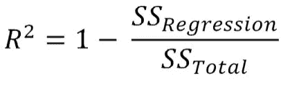

# 揭开所有问我的数据科学面试问题—第 1 部分

> 原文：<https://towardsdatascience.com/uncovering-all-data-science-questions-asked-to-me-part-1-8143a72cd247>

# 揭开所有问我的数据科学面试问题—第 1 部分

塞巴斯蒂安·赫尔曼在 [Unsplash](https://unsplash.com?utm_source=medium&utm_medium=referral) 上的照片

距离我在《走向数据科学》中发表上一篇文章已经过去了大约 15 个月。在这期间发生了很多事情，包括兼职工作，转为全职数据科学家的工作，最后在新的州跳槽到新的公司，让我远离了为社会做贡献。然而，我带回了一篇新文章，其中包含了我采访的所有公司向我提出的所有数据科学问题的综合概述。这些公司包括甲骨文、C3.ai、益百利、Zest AI、瑞士瑞信银行、Visa 和 CVS Health 等。

在本文中，您可以找到以下几类问题:

-洗钱案例研究—第 1 部分

- ML 理论问题—第 1 部分

-统计—第二部分

-编程— Python 和 SQL —第 2 部分

我希望这篇文章能帮助你准备未来的面试。让我们从有趣的部分开始吧！

# a)洗钱案例研究

在这样的案例研究中，问正确的问题是非常重要的，因为它向面试官展示了你能够以正确的方向思考，并且你已经获得了解决任何问题的批判性思维技能。

在甲骨文(公用事业部门)和 C3，有人问了我几个案例研究问题。艾:

**1)您如何从每小时的用电量数据中确定拥有电动汽车的房屋？**

这个问题的答案是主观的。然而，根据我的说法，我们可以应用各种无监督的最大似然技术，即 PCA、自动编码器或聚类来确定耗电量高于其邻居房屋的离群值。包含您将创建的所有功能也可能会有所帮助。仅举几个例子，您可以创建总耗电量要素来跟踪过去 1 天、3 天、7 天、15 天的最小、最大和平均耗电量，以及相对于同一邮政编码内邻近房屋的平均耗电量等。

**2)你会如何预测缺货的库存清单？**

1.询问库存所在的市场位置很重要，因为这将有助于了解市场的规模，以及市场的人口统计如何影响库存。

2.询问过去一年的需求数据也很有帮助，因为这将向我们展示各种季节性、模式、假日需求等。建模必备。

3.对于特征工程，你可以引入滞后，一次性编码变量来解释任何季节性。

# B) ML 理论问题

**1)列出不同类型的回归&分类指标。**

Ans。回归指标—均方误差、均方根误差、平均绝对误差。

分类指标—准确度、精确度、召回率、F1 分数、AUC、ROC。

**2)均方误差有哪些利弊？**

Ans。**缺点:**

1.受异常值影响

2.如果值很高，则失去可解释性

3.不会告诉你误差的方向，因为它总是正的

**优点:**

1.非常容易实现

2.易于数值优化

**3)你能用平均绝对误差(MAE)作为你的损失函数吗？**

Ans。由于 MAE 不可微，所以它不能用作损失函数。

**4)R 平方可以是负数吗？如果是，为什么。写出它的公式。**

Ans。是的，R 的平方可以是负数。这意味着你的预测没有一段时间内数据的平均值准确。

公式:

**5)如何在时间序列数据中进行交叉验证？**

Ans。以下链接对时间序列 CV 提供了很好的解释

[https://otexts.com/fpp3/tscv.html](https://otexts.com/fpp3/tscv.html)

**6)区分装袋和助推？(几乎在所有面试中都被问到)**

Ans。Bagging 是 Bootstrap Aggregation 的缩写。这是一种元算法，其中选择训练集中的随机数据样本进行替换，以建立“m”模型。最后，来自“m”模型的结果在回归的情况下被平均，或者在分类中被投票。

Boosting 是另一种元算法，有助于提高单个学习者的准确性。这是通过训练一系列弱学习者成长为强学习者，同时从每个后续弱学习者的错误中学习来实现的。

**7)什么是消失渐变？**

Ans。消失梯度是人工神经网络中的一个普遍问题，其中某些激活函数(如 sigmoid)的输入的大变化会导致输出的非常小的变化。随着越来越多的层被添加到网络中，损失函数的梯度趋近于零，使得网络更难训练。

**8)支持向量机是如何工作的？**

Ans。在 SVM 中，目标是找到一个最优超平面，使该平面和最近的数据点之间的最小距离最大化。这确保了所选择的超平面能够成功地将所有数据点分离到各自的类别中。

更多信息请访问:[https://www . analyticsvidhya . com/blog/2021/03/初学者指南-支持向量机-svm/](https://www.analyticsvidhya.com/blog/2021/03/beginners-guide-to-support-vector-machine-svm/)

**9)线性回归的假设有哪些？**

Ans。线性回归主要有四个假设:

1.**线性关系** —自变量和因变量之间存在线性关系

2.**正态性** —假设所有变量遵循多元正态性

3.**多重共线性** —自变量之间没有相关性

4.**同方差** —假设误差项在所有自变量的值上具有恒定的方差

**10)你会如何解决随机森林中的过度适应问题？**

Ans。随机森林在一系列不相关的深度生长的树上训练，这对于理解它如何过度适应很重要。您可以使用一些主要的超参数:

**N_estimators** —由于每棵树都很深，你需要确保树的数量不是很大。就我个人而言，我喜欢保持这个数字在 100-200 左右。

**Max_depth** —深度在所有决策树中都很重要，即使在随机森林中也不应该保持很高。使用网格搜索来处理 max_depth 会有所帮助。

**Max_features** —由于通过使用一组随机特征，每棵树都是不相关的，因此不应该使用所有的特征来训练每棵树，因为这违背了随机森林的目的，并且可能会开始过度拟合。教科书中定义的最佳数量是 sqrt(特征数量)。

除了上面的，你还可以玩其他的超参数比如 min_samples_split，min_samples_leaf 等等。

**11)你将如何解决神经网络中的过度拟合问题？**

Ans。有许多方法可以解决神经网络中的过拟合问题:

1.**简化模型** —减少节点、隐藏层的数量并使其不那么复杂应该是你的第一直觉

2.**正则化** —脊线、套索和弹性网是一些常用的正则化技术，用于惩罚变量的较大系数

3.**提前停止** —在训练神经网络时，当您的测试误差在多次迭代后开始增加时，我们可以停止训练模型。因为该点基本上表示过度拟合的开始

**12)定义梯度推进中的学习率。**

Ans。梯度增强树对一系列弱学习者进行训练，这意味着每棵树都可以控制整体结果。学习率在这里成为一个关键的组成部分，因为它控制着每棵树对结果的改变量。学习率越高，训练速度就越快，反之亦然。

**13)学习率与估计量的数量有什么关系&？**

Ans。它们彼此成反比，就好像学习率非常低，那么我们需要更多的估计量来达到最终结果，反之亦然。

有哪些不同的特征选择技巧？

Ans。**过滤方法**-过滤方法使用统计测量来评估两个分布的关系(相关性)，并测量每个要素的每个类的分布与因变量之间的相关性。所选择的特征是与因变量相关性最高的特征。用于例如 Kolmogorov-Smirnov 试验。

**包装器方法** —包装器方法利用统计模型根据性能指标(准确性、AUC、f1 分数等)评估每个特性(或特性子集)的性能。).常见的包装方法是递归特征消除，其中模型递归地使用越来越小的特征集，直到达到期望的特征数量。

**嵌入式方法** —嵌入式方法在构建模型时执行特征消除。一种用于特征选择的常见嵌入式方法是正则化，其中在统计模型的损失函数中包括范数，以惩罚所使用的特征的数量。

**15)如何确定你的模型是否过拟合？**

Ans。您可以通过绘制学习曲线来确定过度拟合，学习曲线是训练和测试数据上的模型性能之间的图。如果训练曲线和测试曲线之间的差距随着模型中更高的复杂性而增加，那么它将指示过度拟合。

**16)多重共线性对 XGBoost 的特征重要性有什么影响？**

Ans。多重共线性对要素重要性有巨大的影响，就好像两个变量彼此高度相关，那么一个变量会弥补另一个变量在要素重要性分数中的缺失。因此，对于一个可能非常重要的特性，特性重要性分数会降低，您可能会放弃它。

**17)多重共线性对模型性能和模型解释有什么影响？**

Ans。多重共线性使解释系数变得更加困难，因为它们对模型中的微小变化非常敏感。

**18)特征数量比行数多会有什么影响？**

Ans。为了回答这个问题，你可以举一个例子，如果你只有两列和一个数据点，那么可以有无限多条线来解决这个问题。换句话说，这个问题不会有唯一的解决方案。因此，行数比列数多是很重要的。然而，人们可以使用脊和套索等技术来处理这种情况。

**19)岭回归和套索回归有什么区别？**

Ans。在 Ridge 中，罚项是系数的平方和，而在 Lasso 中，罚项是系数的绝对值之和。

向非专业观众解释过度合身。

Ans。让我们假设你明天有一个数学考试，你已经练习了所有书本上的问题，并且不知何故记住了大多数问题的答案。但是考试的时候，问的问题和背的有点不一样，考不好。这是在过拟合中本质上发生的事情，其中模型学习训练数据如此之好，以至于它不能在它从未见过的测试数据上表现良好。

如果你已经到了这一步，那么非常感谢你阅读我的文章。我将在本文的第 2 部分回答统计问题和编程问题。敬请期待！

# 谢谢大家！

如果你喜欢我的作品，请在不久的将来跟随我在媒体上阅读更多的文章。

*   阅读我的其他关于[十大 SQL 问题](/10-problems-to-practice-almost-all-sql-concepts-37545e7c5219)、[特性工程](/the-art-of-engineering-features-for-a-strong-machine-learning-model-a47a876e654c)、&、[自动化基础数据分析](/learn-how-to-automate-the-basic-steps-of-data-analysis-45e118048172)的文章。
*   很乐意通过 LinkedIn 与您联系。