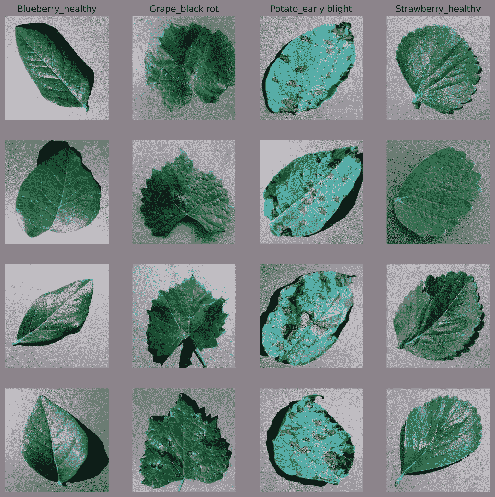
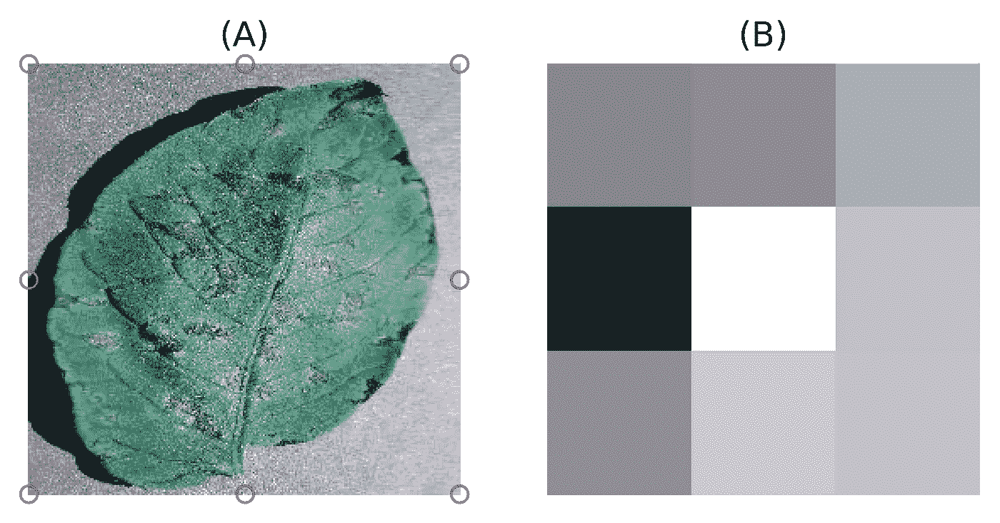
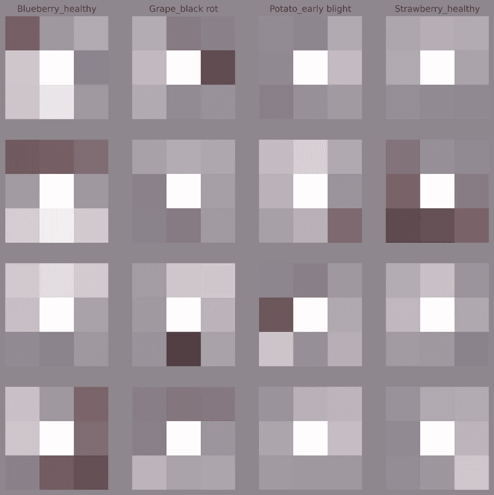

# 发现 PlantVillage 数据集中的偏差

> 原文：<https://towardsdatascience.com/uncovering-bias-in-the-plantvillage-dataset-7ac564334526>

图 1:来自 PlantVillage 数据集的示例图像。[图片由作者提供]

## 对用于开发深度学习模型的最著名植物病害检测数据集的批判性评估

植物疾病每年造成全球 20%到 40%的作物损失。疾病检测和识别在疾病管理中发挥着至关重要的作用，以最大限度地减少作物损失，由于视觉检查对于疾病检测至关重要，深度学习是解决这一问题的天然选择。

人工智能革命始于 2010 年代初，当时卷积神经网络主导了计算机视觉竞赛。然而，当人工智能开始应对医学和物理学等其他领域的挑战时，它的真正价值才被理解。如今，机器学习已经成为植物科学中不可或缺的工具。它已经发现了广泛的应用，如对植物细胞器进行分类的[、](https://academic.oup.com/plphys/article/186/4/1786/6275758)[高通量根系表型分析的](https://plantmethods.biomedcentral.com/articles/10.1186/s13007-022-00864-4)和[使用无人机图像估计作物生长的](https://plantmethods.biomedcentral.com/articles/10.1186/s13007-019-0394-z)。尽管机器学习早在 2007 年就被用于植物病害识别[1]，但缺乏大型公共数据集阻碍了进一步的研究。当 2015 年第一个广泛和公开的植物疾病数据集 PlantVillage 发表时，这种情况发生了变化[2]。

PlantVillage 数据集是规模最大、研究最多的植物疾病数据集。它包含 54，000 多张同质背景上的树叶图像。有 38 类对应于植物-病害对。这引发了大量使用深度学习进行植物疾病分类的研究。大多数论文报道的分类准确率在 98%以上[3]。

然而，训练好的模型在 PlantVillage 数据集的子集上进行测试。因此，如果数据集有偏差问题，它将不会被检测到。在查看来自这个数据集的图像时，我觉得不同类别的捕获条件是不同的。为了检查我是否产生了幻觉，我做了一个简单的实验。

PlantVillage 数据集包含来自 14 种作物的 54，305 幅单叶图像(图 1)。有 38 个类别被命名为*物种 _ 疾病*或*物种 _ 健康*。将叶子从植物上取下，放在灰色或黑色的背景下，在晴天或阴天用单个数码相机在户外拍摄。

我把这个数据集缩减为 8 个像素；四个来自角落，四个来自侧面中心——纯噪声(图 2)。图 3 显示了图 1 中减少到 8 个背景像素的示例图像。这个数据集叫做 PlantVillage_8px。

图 2:A)8 个像素的位置。B) 8 像素近距离视图[图片由作者提供]

图 3:来自 PlantVillage_8px 数据集的示例图片[图片由作者提供]。

为了量化 PlantVillage 数据集中的偏差量，我在 PlantVillage_8px 数据集上训练和测试了一个机器学习模型。如果没有偏差，模型应该不会超过随机猜测的准确性，对于平衡数据集，随机猜测的准确性定义为 100/number_of_classes %。对于这个数据集，随机猜测的准确性大约为 2–3%。

> 如果没有偏差，该模型应该不能超过 2–3%的随机猜测精度。

我使用 scikit-learn 的随机森林分类器实现和默认的超参数来训练模型。为了与在 PlantVillage 上开发模型的工作相比较，数据集被随机分为训练集(80%)和测试集(20%)。分类精度用于评估模型性能。

该模型使用纯噪声达到了 49%的准确率！这表明 PlantVillage 数据集中存在明显的数据集偏差。因为前景和背景在上下文中没有关联，所以期望最小的背景偏差。因此，捕获偏差肯定是数据集偏差的主要原因。

> 该模型使用纯噪声达到了 49%的准确率！

这意味着，即使在类似条件下收集的新数据集上，基于该数据集开发的模型也会经历显著的性能下降，更不用说现场数据了。请注意，这低估了数据集偏差，因为捕获偏差影响背景和前景，而模型只使用了背景的一部分。此外，随机森林模型使用默认的超参数进行训练，没有进行任何调整来提高其性能。

说到底，处理有偏见的数据集的最好方法是首先避免收集它。实验设计，统计学的一个分支，提出了有效和适当的数据收集的原则。突出的想法是在数据收集之前确定噪声因子，并确保它们被控制或随机化。如果必须处理有偏差的数据集，第一步是理解偏差来源并量化它们。一旦做到这一点，就可以通过消除偏差或用额外的数据收集来消除偏差。最关键的步骤是收集一个与用例相匹配的单独的数据集，并报告这个数据集上的模型性能。这将提供模型性能的可靠估计。

该实验确定并量化了 PlantVillage 数据集中的数据集偏差。作为数据科学家，我们负责创建可靠的模型，而不仅仅是在有偏差的测试集上报告看似很高的准确性。当使用这个和类似的数据集来开发机器学习模型时，我们应该勤奋。

详情和代码可以在这里找到:[https://arxiv.org/abs/2206.04374](https://arxiv.org/abs/2206.04374)

## 参考

[1]黄国光，[人工神经网络在利用颜色和纹理特征检测蝴蝶兰幼苗病害中的应用](https://www.sciencedirect.com/science/article/pii/S0168169907000385) (2007)，计算机与电子在农业中的应用

[2] D. P. Hughes 和 M. Salathe，[一个关于植物健康的开放存取图像库，用于开发移动疾病诊断](https://arxiv.org/abs/1511.08060) (2015)，arXiv

[3] K.P. Ferentinos，[植物病害检测和诊断的深度学习模型](https://www.sciencedirect.com/science/article/pii/S0168169917311742) (2018)，农业中的计算机和电子